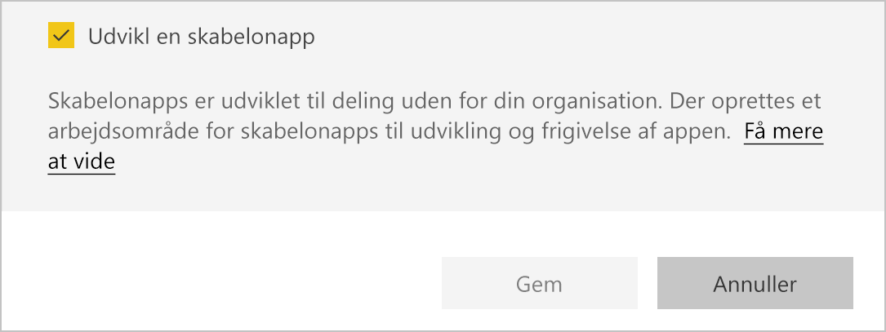
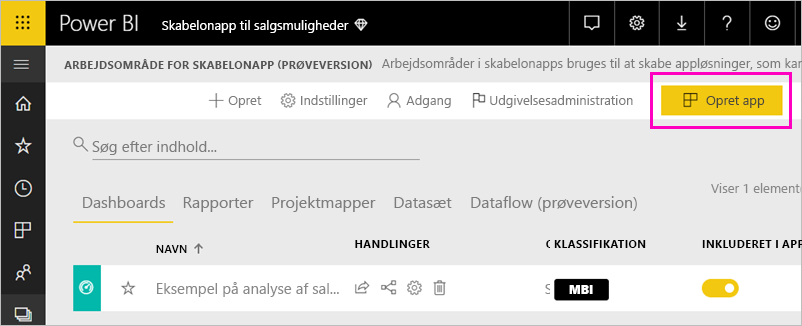
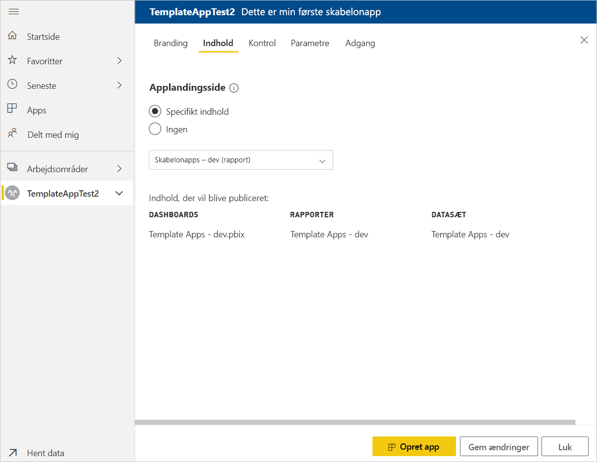
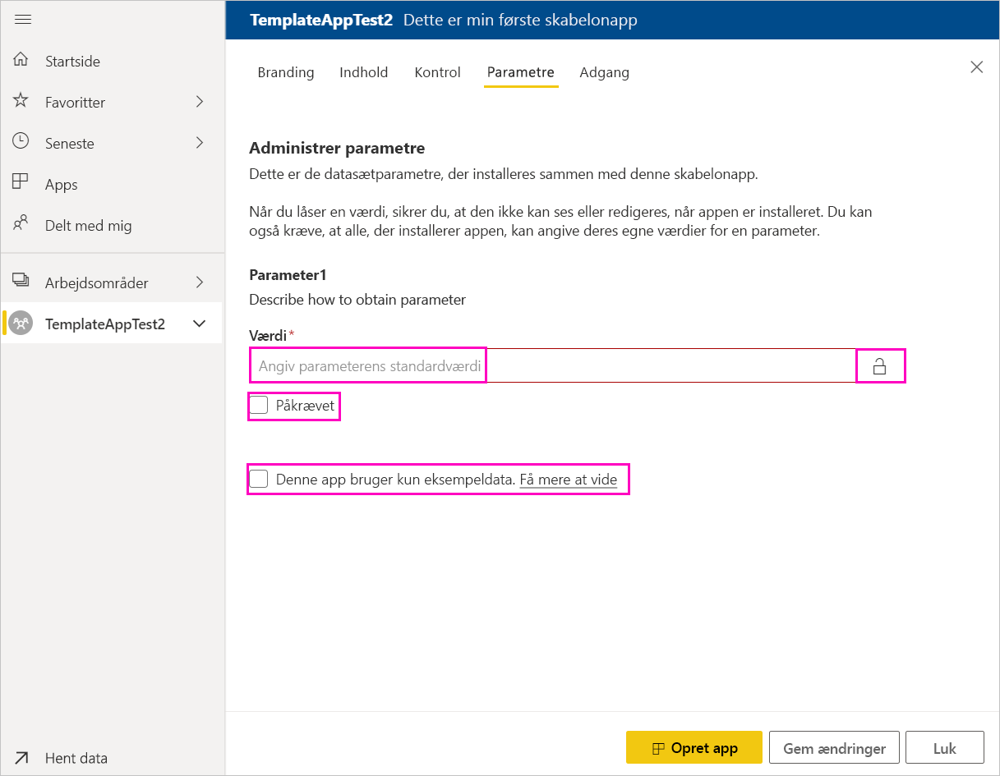
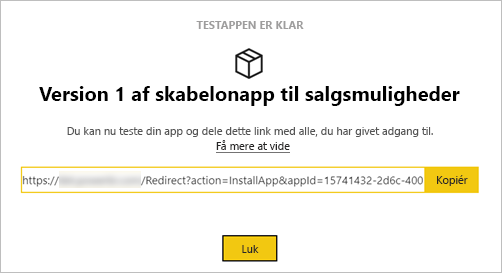
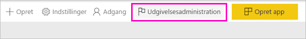
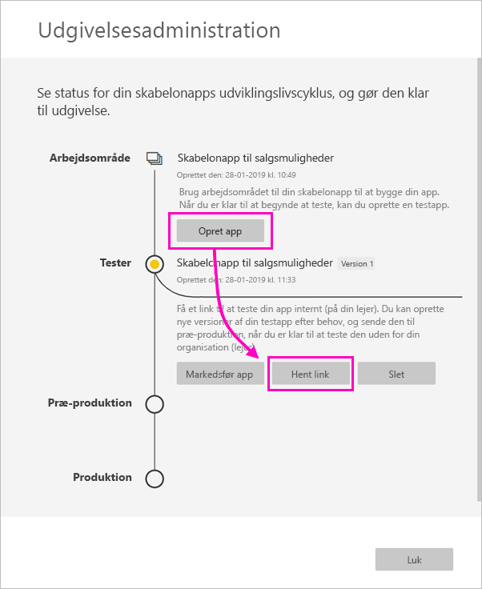
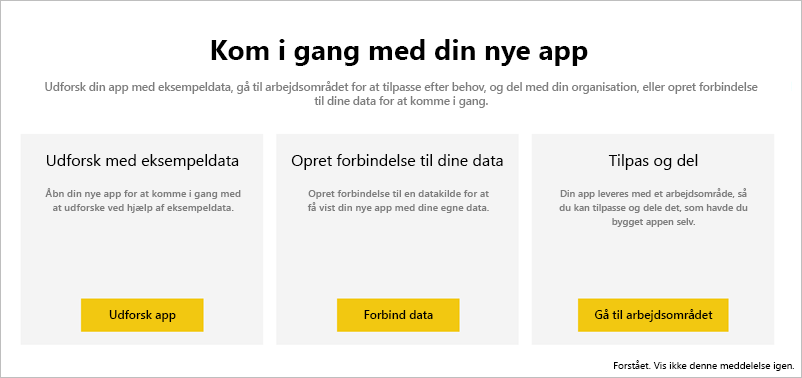
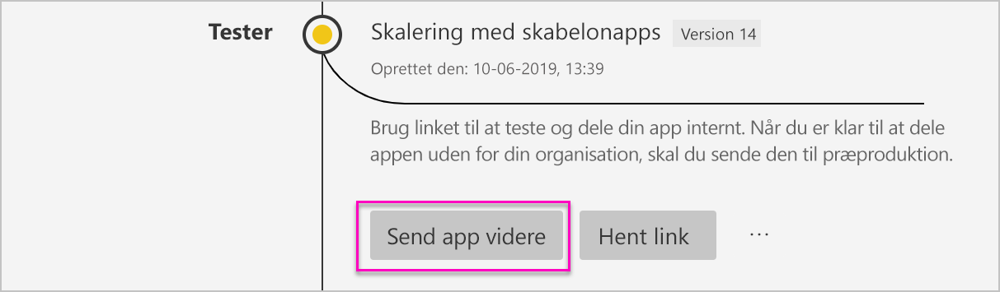
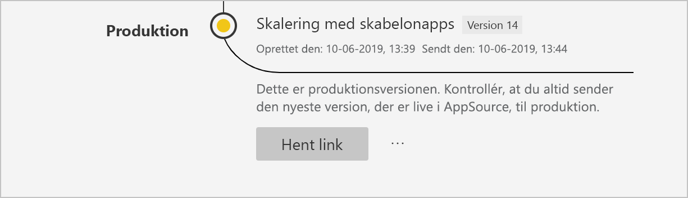

# Opret en skabelonapp i Power BI

Med de nye Power BI-*skabelonprogrammer* kan Power BI-partnere udarbejde programmer i Power BI med kun lidt eller ingen kode og udrulle dem til Power BI-kunder.  Denne artikel indeholder en trinvis vejledning til at oprette et Power BI-skabelonprogram.

Hvis du kan oprette Power BI-rapporter og -dashboards, kan du blive *udvikler af skabelonprogrammer* og udarbejde og pakke analytisk indhold i et *program*. Du kan udrulle dit program til andre Power BI-lejere via alle tilgængelige platforme, f.eks. AppSource, eller ved at bruge den i din egen webtjeneste. Som udvikler har du mulighed for at oprette en beskyttet analysepakke, som du kan distribuere.

Administratorer af Power BI-lejere styrer, hvem der kan oprette skabelonprogrammer i organisationen, og hvem der kan installere dem. Godkendte brugere kan installere dit skabelonprogram og derefter redigere det og distribuere det til Power BI-brugerne i deres organisation.

## Forudsætninger

Her er kravene til at udarbejde et skabelonprogram:  

- En [Power BI Pro-licens](service-self-service-signup-for-power-bi.md)
- En [installation af Power BI Desktop](desktop-get-the-desktop.md) (valgfrit)
- Kendskab til de [grundlæggende begreber i Power BI](service-basic-concepts.md)
- Tilladelser til at dele en skabelonapp offentligt. Du kan finde flere oplysninger på Power BI[-administrationsportal, indstillingen Skabelonprogram](service-admin-portal.md#template-apps-settings).

## Opret arbejdsområdet for skabelonprogrammet

Hvis du vil oprette et skabelonprogram, som du kan distribuere til andre Power BI-lejere, skal du oprette det i et af de nye programarbejdsområder.

1. Vælg **Arbejdsområder** > **Opret programarbejdsområde** i Power BI-tjenesten.

    

2. Vælg **Opgrader til nyt** i **Opret et apparbejdsområde**.

    

3. Angiv et navn, en beskrivelse (valgfrit) og et logobillede (valgfrit) for dit programarbejdsområde.

4. Vælg **Udvikl et skabelonprogram**.

    

5. Vælg **Gem**.
>[!NOTE]
>Du skal have tilladelse fra din Power BI-administrator til at hæve skabelonprogrammer.

## Opret indhold i dit skabelonprogram

Som med et almindeligt Power BI-programarbejdsområde er dit næste skridt at oprette indholdet i arbejdsområdet.  

- [Opret dit Power BI-indhold](power-bi-creator-landing.md) i dit programarbejdsområde.

Hvis du bruger parametre i Power-forespørgsel, skal du kontrollere, at de har veldefinerede typer (f.eks. Text). Typerne Any og Binary understøttes ikke.

[Tip til udarbejdelse af skabelonprogrammer i Power BI](service-template-apps-tips.md) indeholder forslag, der er værd at overveje, når du opretter rapporter og dashboards til dit skabelonprogram.

## Opret testskabelonprogrammet

Nu, hvor du har indhold i dit arbejdsområde, er du klar til at pakke det i et skabelonprogram. Det første trin er at oprette et testskabelonprogram, som kun er tilgængeligt i din organisation på din lejer.

1. Vælg **Opret program** i arbejdsområdet for skabelonprogrammet.

    

    Her udfylder du yderligere indstillinger i fem kategorier for oprettelse for dit skabelonprogram:

    **Branding**

    
    - Appnavn
    - Beskrivelse
    - Supportwebsted (link præsenteres under programoplysningerne, efter skabelonprogrammet er blevet distribueret igen som organisationsprogram)
    - Programlogo (begrænsning på filstørrelsen på 45 K, 1:1 højde-bredde-forhold, formaterne .png .jpg og .jpeg)
    - Programmets temafarve

    **Indhold**

    **Programmets landingside:** Angiv en rapport eller et dashboard som landingsside for dit program, og brug en landingsside, der giver det rigtige indtryk:

    

    **Kontrolelement**

    Angiv begrænsninger og restriktioner for programindhold for brugerne af dit program. Du kan bruge dette kontrolelement til at beskytte immaterielle rettigheder i programmet.

    

    >[!NOTE]
    >Eksport til .pbix-format blokeres altid for brugere, der installerer programmet.

    **Parametre**

    Brug denne kategori til at administrere funktionsmåden af parameteren, når der oprettes forbindelse til datakilder. Få mere at vide om [oprettelse af forespørgselsparametre](https://powerbi.microsoft.com/blog/deep-dive-into-query-parameters-and-power-bi-templates/).

    
    - **Værdien**: Standardparameterværdi.
    - **Påkrævet**: Brug dette til at kræve, at installationsprogrammet angiver en brugerspecifik parameter.
    - **Lås**: Låsning forhindrer, at installationsprogrammet opdaterer en parameter.
    - **Statisk**: Aktivér, hvis programmet *kun* indeholder eksempeldata. Når du vælger **statisk**, bliver brugerne ikke bedt om at oprette forbindelse til en datakilde af installationsguiden.

    **Adgang** I testfasen kan du bestemme, hvem i din organisation der kan installere og teste dit program. Bare rolig, du kan altid vende tilbage og ændre disse indstillinger senere. Indstillingen påvirker ikke adgangen til det distribuerede skabelonprogram.

2. Vælg **Opret program**.

    Du får vist en meddelelse om, at testprogrammet er klar med et link til at kopiere og dele med testerne af dit program.

    

    Du har også udført det første trin i processen for udgivelsesadministration, der er som følger.

## Administrer udgivelsen af skabelonprogrammet

Før du udgiver dette skabelonprogram offentligt, skal du sikre, at det er klar. Power BI indeholder ruden Udgivelsesadministration, hvor du kan følge og undersøge den fulde sti til udgivelse af programmet. Du kan også udløse overgangen fra fase til fase. De almindelige faser er:

- Opret et testprogram: kun til test i organisationen.
- Hæv testpakken til præproduktionsfasen: test uden for organisationen.
- Hæv præproduktionspakken til produktion: produktionsversion.
- Slet en pakke, eller start forfra fra den forrige fase.

URL-adressen ændres ikke, når du flytter mellem udgivelsesfaser. Opprioritering påvirker ikke selve URL-adressen.

Lad os gennemgå faserne:

1. Vælg **Udgivelsesadministration** i arbejdsområdet for skabelonprogrammet.

    

2. Vælg **Opret program**.

    Hvis du oprettede testprogrammet under trinnet **Opret testskabelonprogrammet** ovenfor, er den gule prik ud for **Test** allerede udfyldt, og du behøver ikke at vælge **Opret program** her. Hvis du vælger den, vender du tilbage til processen til oprettelse af skabelonprogrammer.

3. Vælg **Få link**.

    

4. Du tester oplevelsen af programinstallationen ved at kopiere linket i meddelelsesvinduet og indsætte det i et nyt browservindue.

    Herfra følger du den samme fremgangsmåde som dine kunder. Se [Installér og distribuer skabelonprogrammer i din organisation](service-template-apps-install-distribute.md) for at se deres version.

5. Vælg **Installér** i dialogboksen.

    Når installationen er fuldført, får du vist en meddelelse om, at det nye program er klar.

6. Vælg **Gå til program**.
7. Under **Kom i gang med dit nye program** kan du se programmet, som dine kunder vil se det.

    
8. Vælg **Udforsk program** for at bekræfte testprogrammet sammen med eksempeldataene.
9. Hvis du vil foretage ændringer, skal du vende tilbage til programmet i det oprindelige arbejdsområde. Opdater testprogrammet, indtil du er tilfreds.
10. Når du er klar til at hæve dit program til præproduktion med henblik på yderligere test uden for din lejer, skal du gå tilbage til ruden **Udgivelsesadministration** og vælge **Hæv program**. 

    
    >[!NOTE]
    > Når programmet er hævet, bliver det offentligt tilgængelige uden for organisationen.

    Hvis du ikke kan se denne indstilling, skal du kontakte din Power BI-administrator, som skal give dig [tilladelse til at udvikle skabelonprogrammer](service-admin-portal.md#template-apps-settings) på administrationsportalen.
11. Vælg **Hæv** for at bekræfte dit valg.
12. Kopiér denne nye URL-adresse for at dele den uden for din lejer med henblik på test. Dette link er også det, du sender for at begynde processen med at distribuere dit program på AppSource ved at oprette et [nyt tilbud på Cloud-partnerportalen](https://docs.microsoft.com/azure/marketplace/cloud-partner-portal/power-bi/cpp-publish-offer). Send kun links til præproduktion til Cloud-partnerportalen. Du kan først hæve denne pakke til produktion i Power BI, når programmet er blevet godkendt, og du har fået en meddelelse om, at det er udgivet i AppSource.
13. Når programmet er klar til produktion eller deling via AppSource, skal du gå tilbage til ruden **Udgivelsesadministration** og vælge **Hæv program** ud for **Præproduktion**.
14. Vælg **Hæv** for at bekræfte dit valg.

    Programmet er nu i produktion og klar til distribution.

    

Hvis du vil gøre dit program tilgængeligt for tusindvis af Power BI-brugere i hele verden, opfordrer vi dig til at sende det til AppSource. Du kan se yderligere oplysninger under [Power BI-programtilbud](https://docs.microsoft.com/azure/marketplace/cloud-partner-portal/power-bi/cpp-power-bi-offer).

## Næste trin

Se, hvordan dine kunder kan interagere med dit skabelonprogram under [Installér, tilpas og distribuer skabelonprogrammer i din organisation](service-template-apps-install-distribute.md).

Du kan se yderligere oplysninger om, hvordan du distribuerer dit program under [Power BI-programtilbud](https://docs.microsoft.com/azure/marketplace/cloud-partner-portal/power-bi/cpp-power-bi-offer).
