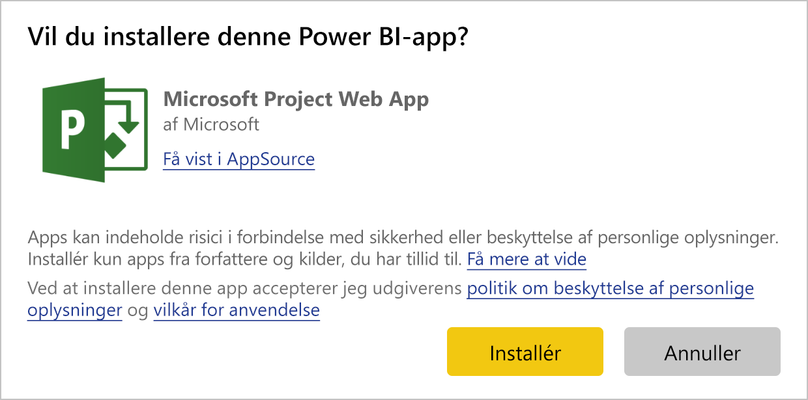
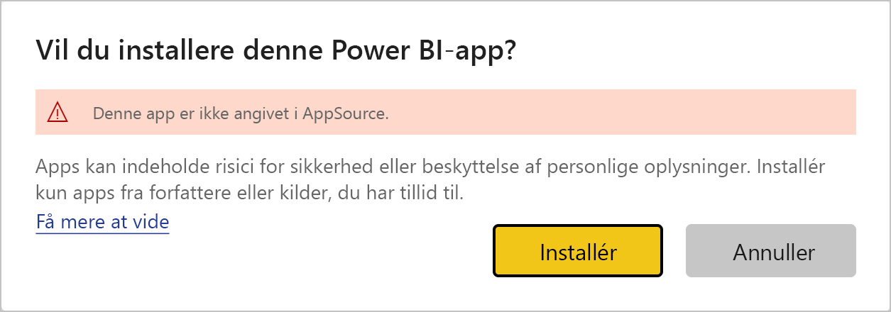
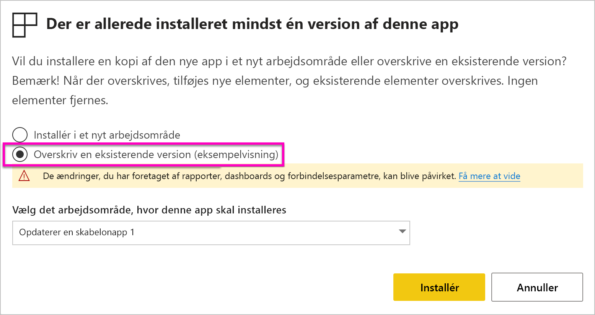

# Installér og distribuer skabelonprogrammer i din organisation – Power BI

Er du Power BI-analytiker? Hvis du er det, så kan du i denne artikel se en forklaring på, hvordan du installerer *skabelonprogrammer* for at oprette forbindelse til mange af de tjenester, du bruger til at drive din forretning, f.eks. Salesforce, Microsoft Dynamics og Google Analytics. Du kan redigere dashboardet og rapporterne, så de opfylder din organisations behov, og derefter distribuere dem til dine kolleger som et *program*. 

Hvis du er interesseret i at oprette skabelonprogrammer, som du selv distribuerer, skal du se [Opret et skabelonprogram i Power BI](service-template-apps-create.md). Power BI-partnere kan udarbejde Power BI-programmer med kun lidt eller ingen kode og udrulle dem til Power BI-kunder. 

## Forudsætninger  

Her er kravene til installation, tilpasning og distribution af et skabelonprogram: 

- En [Power BI Pro-licens](service-self-service-signup-for-power-bi.md)
- Kendskab til de [grundlæggende begreber i Power BI](service-basic-concepts.md)
- Gyldigt installationslink fra udvikleren af skabelonprogrammet eller AppSource. 
- Tilladelse til at installere skabelonprogrammer. 

## Installér et skabelonprogram

Du modtager måske et link til et skabelonprogram. Ellers kan du søge i AppSource efter et, der interesserer dig. I begge tilfælde kan du redigere det og selv distribuere det i din egen organisation, efter du har installeret det.

### Søg i AppSource fra en browser

Vælg dette link for at åbne AppSource, der er filtreret efter Power BI-programmer, i en browser:

- https://appsource.microsoft.com/marketplace/apps?product=power-bi

### Søg i AppSource fra Power BI-tjenesten

1. Vælg **Programmer** > **Hent programmer** i navigationsruden i Power BI-tjenesten.

    

2. Vælg **Programmer** i AppSource.

    

3. Gennemse, eller søg efter programmet, og vælg derefter **Hent det nu**.

4. Vælg **Installér** i dialogboksen.

     Hvis du har en Power BI Pro-licens, installeres appen med dets tilknyttede arbejdsområde. Du kan tilpasse programmet i det tilknyttede arbejdsområde.

    Når installationen er fuldført, får du vist en meddelelse om, at dit nye program er klar.
4. Vælg **Gå til program**.
5. Vælg en af tre indstillinger under **Kom i gang med dit nye program**:

    

    - **Udforsk programmet**: Grundlæggende udforskning af eksempeldata. Start her for at se nærmere på programmets layout. 
    - **Forbind data**: Skift datakilden fra eksempeldataene til din egen datakilde. Du kan omdefinere parametre for datasæt og legitimationsoplysninger for datakilden. Se [Kendte begrænsninger](service-template-apps-tips.md#known-limitations) i artiklen om tip til skabelonprogrammer. 
    - **Gå til arbejdsområde** (mest avancerede indstilling): Du kan foretage alle de ændringer, der er tilladt af programudvikleren.

    Eller du kan springe denne dialogboks over og få adgang til det tilknyttede arbejdsområde direkte via **Arbejdsområder** i navigationsruden.
    >[!NOTE]
    >Når du installerer en skabelonapp, installeres der både en *organisationsapp* og et *arbejdsområde*. Læs mere om [distribution af apps i Power BI](service-create-distribute-apps.md).
 
6. Før du deler den med dine kolleger, er det en god idé at oprette forbindelse til dine egne data. Det kan også være en god idé at redigere rapporten eller dashboardet, så de fungerer for din organisation. På dette tidspunkt kan du også tilføje andre rapporter eller dashboards.

   Hvis du vælger et installationslink for en app, der ikke er angivet på AppSource, får du vist valideringsdialogboksen, hvor du skal bekræfte dit valg.

   

   >[!NOTE]
   >Du skal anmode om tilladelse fra administratoren for at installere skabelonapps, der ikke er vist på AppSource. Du kan finde flere oplysninger på Power BI[-administrationsportal, indstillingen Skabelonprogram](service-admin-portal.md#template-apps-settings).

## Tilpas og publicer appen

Når du har opdateret programmet til din organisation, er du klar til at udgive det. Fremgangsmåden er den samme som udgivelse af et hvilket som helst andet program.

1. Når du er færdig med tilpasningen, skal du vælge **Opdater program** i øverste højre hjørne af listevisningen af arbejdsområdet.  

    

2. Under **Detaljer** kan du redigere beskrivelsen og baggrundsfarven.

   

3. I **Navigation** kan du bruge den nye navigationsgenerator til din app eller enten vælge dashboardet eller rapporten som landingsside. Du kan få flere oplysninger ved at se [Design navigationsoplevelsen](service-create-distribute-apps.md#design-the-navigation-experience).

   

4. Under **Adgang** giver du adgang til de valgte brugere eller til hele organisationen.  

   

5. Vælg **Opdater program**. 

6. Når det er udgivet, kan du kopiere linket og dele det med alle, du har givet adgang til. Når du har delt det med dem, kan de også se det på fanen **Min organisation** i AppSource.

## Opdater en skabelonapp

Forfattere af skabelonapps kan udgive nye versioner af deres skabelonapps via AppSource eller et direkte link. Når de gør det, kan du opdatere skabelonappen, når du installerer appen igen med den samme eller nyere version.

  >[!NOTE]
  >Hvis du installerer en ny version, overskrives alle de ændringer, du har foretaget af rapporterne og dashboardene. Hvis du vil beholde dine opdaterede rapporter og dashboards, kan du gemme dem med et andet navn eller en anden placering, før du installerer dem.

- **Overskriv en eksisterende version:** Det eksisterende arbejdsområde overskrives med den opdaterede version af skabelonappen.

   

- **Installér i et nyt arbejdsområde:** En ny version af arbejdsområdet og appen installeres, som du skal konfigurere igen

### Funktionsmåden for overskrivning

* I forbindelse med overskrivning opdateres rapporter, dashboards og datasæt i *arbejdsområdet* og ikke i appen. Navigation i, konfiguration af og tilladelser for appen ændres ikke i forbindelse med overskrivning.
* Når du har opdateret arbejdsområdet, skal du *opdatere appen* for at anvende ændringer fra arbejdsområdet i organisationsappen.
* Konfigurerede parametre og godkendelse bevares i forbindelse med overskrivning. Efter opdateringen startes en automatisk opdatering af datasættet. I løbet af denne periode vises oplevelsen med *eksempeldata* i organisationsappen, i rapporter og på dashboards.
  
* I forbindelse med overskrivning vises eksempeldata altid, indtil opdateringen er fuldført. Hvis forfatteren af skabelonappen har foretaget ændringer af datasættet eller parametrene, kan brugerne af arbejdsområdet og appen fortsat se oplevelsen med *eksempeldata*.
* *Nye* rapporter eller dashboards, du har føjet til arbejdsområdet, slettes aldrig i forbindelse med overskrivning. De oprindelige rapporter og dashboards overskrives med ændringer fra den oprindelige forfatter.

>[!IMPORTANT]
>Husk, at [opdatere appen](#customize-and-publish-the-app) efter overskrivning for at anvende ændringerne af rapporten og dashboardet for brugerne af din organisationsapp.

## Næste trin

[Opret arbejdsområder med dine kolleger i Power BI](service-create-workspaces.md)
