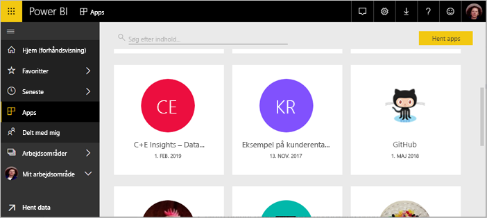
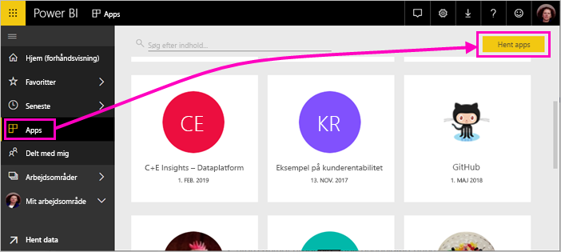
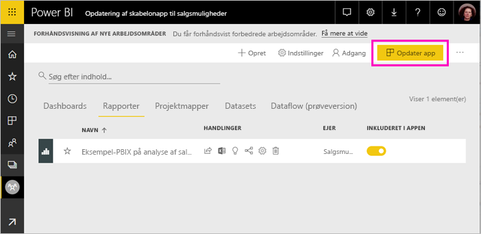
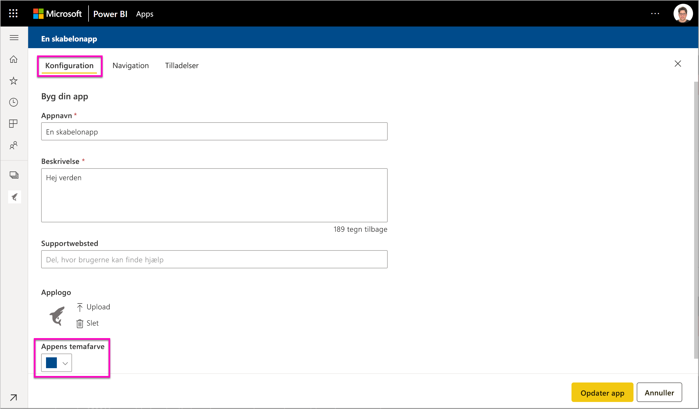
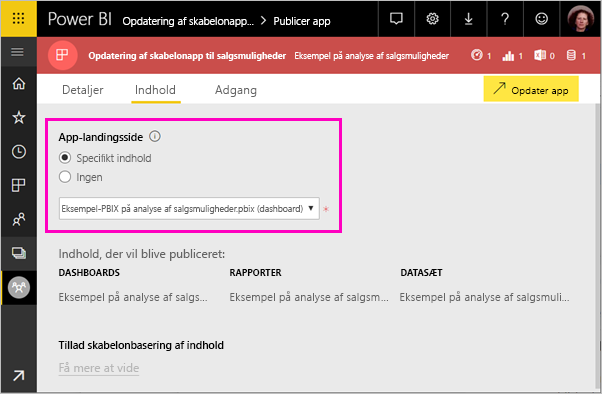
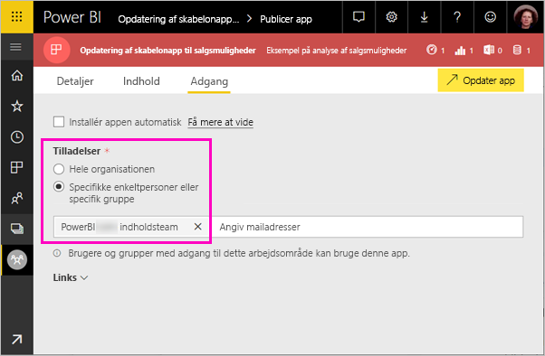

# Installér og distribuer skabelonprogrammer i din organisation – Power BI (prøveversion)

Med de nye Power BI-*skabelonprogrammer* kan Power BI-partnere udarbejde programmer i Power BI med kun lidt eller ingen kode og udrulle dem til Power BI-kunder. Denne artikel er til Power BI-analytikere. Heri forklares det, hvordan du installerer, tilpasser og distribuerer et skabelonprogram, som en Power BI-partner har oprettet. Hvis du er interesseret i at oprette skabelonprogrammer, som du selv distribuerer, skal du se [Opret et skabelonprogram i Power BI](service-template-apps-create.md).

Når du installerer et skabelonprogram, som en Power BI-partner har oprettet, kan du redigere det, så det opfylder behovene i din organisation, og derefter distribuere det til dine kolleger som et program.  

## Forudsætninger  

Her er kravene til installation, tilpasning og distribution af et skabelonprogram:  

- En [Power BI Pro-licens](service-self-service-signup-for-power-bi.md)
- Kendskab til de [grundlæggende begreber i Power BI](service-basic-concepts.md)
- Gyldigt installationslink fra udvikleren af skabelonprogrammet eller AppSource. 
- Tilladelse til at installere skabelonprogrammer. 

## Installér et skabelonprogram

Du modtager måske et link til et skabelonprogram. Ellers kan du søge i AppSource efter et, der interesserer dig. I begge tilfælde kan du redigere det og selv distribuere det i din egen organisation, efter du har installeret det.

### Søg i AppSource fra en browser

Vælg dette link for at åbne AppSource, der er filtreret efter Power BI-programmer, i en browser:

- https://appsource.microsoft.com/marketplace/apps?product=power-bi

### Søg i AppSource fra Power BI-tjenesten

1. Vælg **Programmer** > **Hent programmer** i navigationsruden til venstre i Power BI-tjenesten.

    

2. Vælg **Programmer** i AppSource.

    

3. Gennemse, eller søg efter programmet, og vælg derefter **Hent det nu**.

2. Vælg **Installér** i dialogboksen.

    Hvis du har en Power BI Pro-licens, er programmet installeret med dets tilknyttede programarbejdsområde. Du kan tilpasse programmet i det tilknyttede arbejdsområde.

    Når installationen er fuldført, får du vist en meddelelse om, at dit nye program er klar. 

3. Vælg **Gå til program**.
4. Vælg en af tre indstillinger under **Kom i gang med dit nye program**:

    

    - **Udforsk programmet**: Grundlæggende udforskning af eksempeldata. Start her for at se nærmere på programmets layout. 
    - **Forbind data**: Skift datakilden fra eksempeldataene til din egen datakilde. Du kan omdefinere parametre for datasæt og legitimationsoplysninger for datakilden. Se [Kendte begrænsninger](service-template-apps-tips.md#known-limitations) i artiklen om tip til skabelonprogrammer. 
    - **Gå til arbejdsområde** (mest avancerede indstilling): Du kan foretage alle de ændringer, der er tilladt af programudvikleren.

    Eller du kan springe denne dialogboks over og få adgang til det tilknyttede arbejdsområde direkte via **Arbejdsområder** i navigationsruden til venstre.   
 
5. Før du deler den med dine kolleger, er det en god idé at oprette forbindelse til dine egne data. Det kan også være en god idé at redigere rapporten eller dashboardet, så de fungerer for din organisation. På dette tidspunkt kan du også tilføje andre rapporter eller dashboards.

## Opdater og distribuer programmet

Når du har opdateret programmet til din organisation, er du klar til at udgive det. Fremgangsmåden er den samme som udgivelse af et hvilket som helst andet program. 

1. Når du er færdig med tilpasningen, skal du vælge **Opdater program** i øverste højre hjørne af listevisningen af arbejdsområdet.  

    

2. Under **Detaljer** kan du redigere beskrivelsen og baggrundsfarven.

   

3. Under **Indhold** kan du vælge en landingsside enten på dashboardet eller i rapporten.

   

4. Under **Adgang** giver du adgang til de valgte brugere eller til hele organisationen.  

   

5. Vælg **Opdater program**. 

6. Når det er udgivet, kan du kopiere linket og dele det med alle, du har givet adgang til. Når du har delt det med dem, kan de også se det på fanen **Min organisation** i AppSource.

## Næste trin 

[Opret arbejdsområder med dine kolleger i Power BI](service-create-workspaces.md)

 

 
