# Navigation i Power BI-tjenesten
## Den venstre navigationsrude

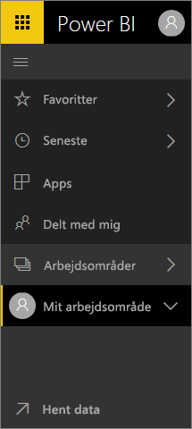

**Oversigtsvejledning**

| Handling | Ny (aktuel) sti |
| --- | --- | --- |
| Vælg et dashboard eller en rapport som favorit |Arbejdsområde > Dashboards eller arbejdsområde > Rapport, og vælg stjerneikonet for at gøre det gult |
| Vælg en app som favorit | Vælg **Apps** i venstre navigationsrude, og markér stjernen ud for app-navnet
| Få vist en liste over dine favoritter |Vælg **Favoritter** fra venstre navigationsrude |
| Få vist en liste over senest besøgte dashboards og rapporter |Vælg **Seneste** fra venstre navigationsrude |
| Få vist en liste over dashboards, der er blevet delt med dig |Vælg **Delt med mig** fra venstre navigationsrude |
| Del et dashboard |Åbn et dashboard, og vælg **Del**, eller opret og publicer en app |
| Slet et dashboard |Mit arbejdsområde > Dashboards > papirkurvsikonet |
| Slet en rapport |Mit arbejdsområde > Rapporter > papirkurvsikonet |
| Slet et datasæt |Min arbejdsområde > Datasæt >... > Slet |
| Åbn et dashboard |Arbejdsområde > Dashboards >, og vælg navnet på dashboardet |
| Åbn en rapport |Arbejdsområde > Rapporter >, og vælg navnet på rapporten |
| Åbn et datasæt |Arbejdsområde > Datasæt >, og vælg navnet på datasættet |
| Opret et dashboard |I den øverste navigationslinje: Vælg Opret > Dashboard |
| Opret en rapport |I den øverste navigationslinje: Vælg Opret > Rapport |
| Opret et datasæt |I den øverste navigationslinje: Vælg Opret > Datasæt |
| Opret en app |Arbejdsområde > Opret apparbejdsområde |
| Få vist en liste over alle dashboards, rapporter og datasæt, som du ejer |Arbejdsområder > Mit arbejdsområde |

## Almindelige opgaver

Se Amanda give dig en rundvisning i den nye navigationsoplevelse i Power BI-tjenesten.  Følg derefter den trinvise vejledning under videoen for selv at udforske det.

<iframe width="560" height="315" src="https://www.youtube.com/embed/G26dr2PsEpk" frameborder="0" allowfullscreen></iframe>

## Vis indhold (dashboards, rapporter, projektmapper, datasæt, arbejdsområder, apps)
Lad os starte med at se på, hvordan det grundlæggende indhold (dashboards, rapporter, datasæt, projektmapper) er organiseret. Før dette var alt dit indhold angivet i venstre navigationsrude. Nu har du stadig denne mulighed, men standarden er at vise efter indholdstype i konteksten af et arbejdsområde. Vælg et arbejdsområde i venstre navigationsrude, og fanerne for det tilknyttede indhold (dashboards, rapporter, projektmapper, datasæt) udfylder Power BI-lærredet til højre.

Hvis du har Power BI (gratis), kan du kun se ét arbejdsområde-- **Mit arbejdsområde**.

### Foretrukne dashboards, rapporter og apps
Med **Favoritter** kan du hurtigt få adgang til det indhold, der er vigtigst for dig.  

1. Med dashboardet eller rapporten åben skal du vælge **Favorit** i det øverste højre hjørne.
   
   
   
   **Favoritter** ændres til **Fjern fra Favoritter**, og stjerneikonet bliver gult.
   
   

2. Til en app skal du vælge **Apps** i venstre navigationsrude, holde musen over appen, og vælg stjernen for at angive den som en favorit.

2. Du kan få vist en liste over alt det indhold, du har tilføjet som favoritter, ved i den venstre navigationsrude at vælge pilen til højre for **Favoritter**. Da den venstre navigationsrude er en permanent funktion i Power BI-tjenesten, har du adgang til denne liste overalt i Power BI-tjenesten.
   
    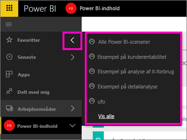
   
    Herfra kan du vælge et dashboard, en rapport eller en app, du vil åbne.

3. For at åbne ruden **Favoritter** i den venstre navigationsrude skal du vælge **Favoritter** eller vælge ikonet Favoritter .
   
   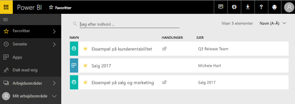
   
   Her kan du åbne, finde indholdet, fjerne fra favoritter eller dele indhold med kollegaer.

1. En anden måde at markere et dashboard eller en rapport som en favorit er fra fanen **Dashboards** eller **Rapporter** i arbejdsområdet.  Du skal blot åbne arbejdsområdet for at få vist indholdsvisningen og markere stjerneikonet til venstre for navnet.
   
   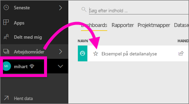

Du kan få flere oplysninger i [Favoritter](service-dashboard-favorite.md)

### Seneste
Få hurtigt vist det indhold, du har fået adgang til for nylig, ved at gå til ruden **Seneste**. Dette omfatter indhold fra alle dine arbejdsområder.

  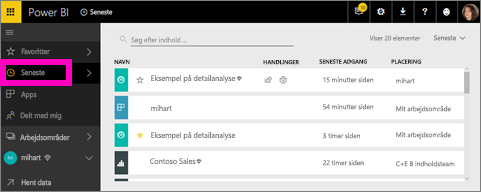

På samme måde som med Favoritter kan du hurtigt få adgang til dine seneste opslag overalt i Power BI-tjenesten ved at vælge pilen ud for **Seneste** i venstre navigationsrude.

  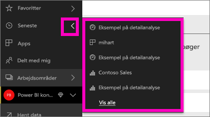

Hvis du vil vide mere, kan du se [Seneste i Power BI](service-recent.md)

### Apps
En app er en samling af dashboards og rapporter, der er bygget til at levere vigtige målepunkter samlet på ét sted. Du kan få apps, der er interne i din virksomhed, og også [apps til eksterne tjenester](service-connect-to-services.md), f.eks. Google Analytics og Microsoft Dynamics CRM. 

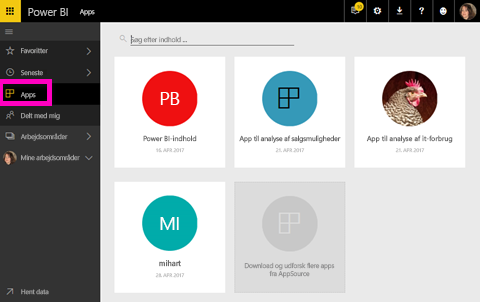

Du kan få mere at vide i **Apparbejdsområder** (nedenfor) og [Hvad er Power BI-apps](service-install-use-apps.md).

### Delt med mig
**Delt med mig** er placeringen for alt indhold, som kollegaer har delt med dig.  Filtrer efter dashboardets ejer, brug søgefeltet til at finde ud af, hvad der er relevant, og sortér elementerne efter dato.  Og for delt indhold, som du ofte besøger, er det endnu nemmere at angive dem som favoritter direkte fra visningen **Delt med mig**.

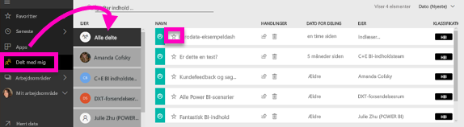

Hvis du vil vide mere, kan du se [Delt med mig](service-shared-with-me.md)

### Arbejd med arbejdsområder
Det næste i venstre navigation er *arbejdsområder*. Arbejdsområder kan opfattes som *objektbeholdere* til Power BI-indhold. Der er to typer arbejdsområder: **Mit arbejdsområde** og Apparbejdsområder.

Hvis du ikke er medlem af et apparbejdsområde eller er en administrator, kan du ikke se nogen apparbejdsområder i din venstre navigationsrude. Og hvis du er en Power BI (gratis)-kunde, vises der ikke nogen apparbejdsområder.

#### Mit arbejdsområde
**Mit arbejdsområde** gemmer alt det indhold, som du ejer. Tænk på det som din personlige sandkasse eller arbejdsområde til dit eget indhold. Du kan dele indhold fra Mit arbejdsområde med kolleger. I Mit arbejdsområde er dit indhold organiseret i fire faner: dashboards, rapporter, projektmapper og datasæt.

#### Apparbejdsområder
Apps og apparbejdsområder er en funktion i Power BI Pro. Hvis du forfatter dashboards og rapporter for andre, skal du bruge apparbejdsområder til dette. Et apparbejdsområde er der, hvor du opretter appen, så hvis du vil oprette en app, skal du først oprette apparbejdsområdet. De er udviklingen i gruppearbejdsområder – midlertidige områder og objektbeholdere til indhold i appen.  Du og dine kollegaer kan samarbejde på dashboards, rapporter og andre typer indhold, som du planlægger at distribuere til et bredere publikum eller endda til hele organisationen.

Du kan få mere at vide i [Opret og distribuer en app i Power BI](service-create-distribute-apps.md#app-workspaces).

Som med **Mit arbejdsområde** er dit indhold organiseret i fire faner: dashboards, rapporter, projektmapper og datasæt.

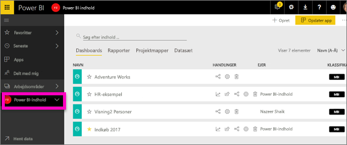

Skift arbejdsområder ved at vælge **Arbejdsområder** i venstre navigationsrude.

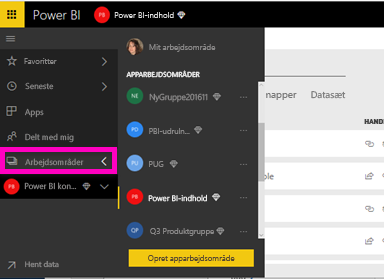

### Søg og sortér indholdet
Indholdsvisningen gør det lettere at søge efter, filtrere og sortere dit indhold. Hvis du vil søge efter et dashboard, en rapport eller en projektmappe, skal du skrive i søgeområdet. Power BI filtrerer kun det indhold, der har søgestrengen som en del af navnet.

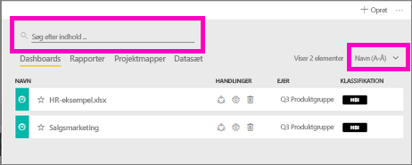

Du kan også sortere indholdet efter navn eller ejer.  

Hvis du vil vide mere, kan du se [Power BI-navigation: søg, sortér, filtrer](service-navigation-search-filter-sort.md)

## Næste trin
[Grundlæggende begreber](service-basic-concepts.md) i Power BI-tjenesten    

Har du spørgsmål eller feedback? [Besøg Power BI-communityforummet](http://community.powerbi.com/t5/Navigation-Preview-Forum/bd-p/NavigationPreview)

