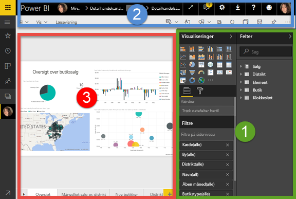
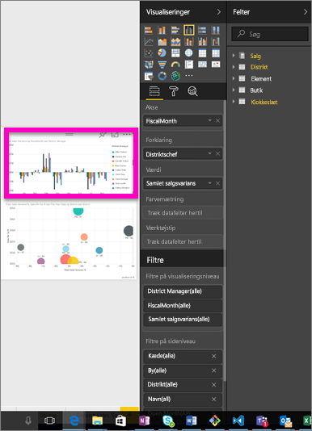
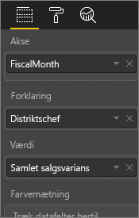
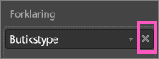
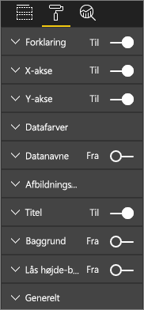
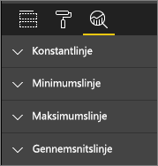
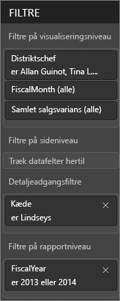
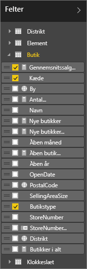

# Præsentation af rapporteditor i Power BI

*Rapporteditoren* i Power BI-tjenesten og rapporteditoren i Power BI Desktop ligner hinanden. Videoen viser rapporteditoren i Power BI Desktop, og denne artikel viser rapporteditoren i Power BI-tjenesten. 

Som forfatter af en rapport opretter og redigerer du dashboards og rapporter. Derefter distribuerer du dem til dine rapportforbrugere. De kan interagere med dine dashboards og rapporter i læsevisning i Power BI-tjenesten, men ikke redigere dem. Læs mere om, [hvad brugere af rapporter kan gøre i Power BI-tjenesten](consumer/end-user-reading-view.md) 

<iframe width="560" height="315" src="https://www.youtube.com/embed/IkJda4O7oGs" frameborder="0" allowfullscreen></iframe>

I Power BI-tjenesten er rapporteditoren kun tilgængelig i redigeringsvisning. Hvis du vil åbne en rapport i redigeringsvisning, skal du være rapportejer eller rapportopretter eller være bidragydere til det apparbejdsområde, der indeholder rapporten.

Power BI-rapporteditoren består af tre afsnit:  

1. Ruderne **Felter**, **Visualiseringer** og **Filtre**
2. øverste navigationslinjer    
3. rapportcanvas     

## 1. Rapporteditorens ruder

Tre ruder er synlige, når du åbner en rapport: Visualiseringer, Filtre og Felter. Ruderne til venstre, Visualiseringer og Filtre, styrer, hvordan dine visualiseringer ser ud – type, farver, filtrering, formatering.  Og ruden til højre, Felter, administrerer de underliggende data, der bruges i visualiseringerne. 

Det indhold, der vises i rapporteditoren, varierer i forhold til valg, du foretager på rapportcanvasset.  Når du for eksempel vælger en individuel visualisering:

|  |  |
| --- | --- |
|  |<ul><li>Øverst i ruden Visualisering identificeres den type visuelle element, der bruges. I dette eksempel et grupperet søjlediagram.  </li> <li>Nederst i ruden Visualisering (du skal muligvis rulle ned) vises de felter, der bruges i det visuelle element. Dette diagram bruger FiscalMonth, DistrictManager og Total Sales Variance.   </li><li>Ruden Filtre (du skal muligvis rulle ned) viser alle de filtre, der er anvendt.   </li><li>Ruden Felter indeholder de tilgængelige tabeller, og hvis du udvider en tabels navn, de felter, der udgør tabellen. Med gul skrifttype ved du, at mindst ét felt fra denne tabel bruges i visualiseringen.  </li><li> Vælg malerrulleikonet for at vise formateringsruden for den valgte visualisering.  </li><li> Vælg ikonet med forstørrelsesglasset for at få vist ruden Analyse.</ul> |

## Ruden Visualiseringer

Her er stedet, hvor du vælger en visualiseringstype. De små billeder kaldes *skabeloner*. I billedet herover er det grupperede søjlediagram valgt. Hvis du ikke vælger en visualiseringstype først, men i stedet begynder at opbygge en visualisering ved at vælge felter, vælger Power BI visualiseringstypen for dig. Du kan bevare Power BI's valg eller ændre typen ved at vælge en anden skabelon. Skift så mange gange, det er nødvendigt for at finde den visualiseringstype, der bedst repræsenterer dine data.

### Administrer de felter, der bruges i visualiseringen

De buckets (også kaldet *wells*), der er vist i denne rude, varierer afhængigt af, hvilken type visualisering du har valgt.  Hvis du for eksempel har valgt et søjlediagram, kan du se buckets for: værdier, akse og forklaring. Når du vælger et felt eller trækker det over på canvasset, føjer Power BI dette felt til en af disse buckets.  Du kan også trække felter fra listen Felter direkte til buckets.  Nogle buckets er begrænset til visse datatyper.  For eksempel accepterer **Værdier** ikke felter, der ikke er numeriske. Så hvis du trækker et felt for **medarbejdernavn** til bucket'en **Værdier**, ændrer Power BI det til **antal medarbejdernavn**.

### Fjern et felt
Vælg **X** til højre for feltnavnet for at fjerne et felt fra visualiseringen.

Du kan finde flere oplysninger i [Føj visualiseringer til en Power BI-rapport](visuals/power-bi-report-add-visualizations-i.md)

### Formatér dine visuelle elementer
Vælg ikonet med malerullen for at åbne ruden Formatér. De tilgængelige indstillinger afhænger af den valgte type visualisering.

Formateringsmulighederne er næsten uendelige.  Udforsk selv for at få mere for at vide, eller gå til disse artikler:

* [Tilpas visualiseringstitel, -baggrund og -forklaring](visuals/power-bi-visualization-customize-title-background-and-legend.md)
* [Farveformatering](visuals/service-getting-started-with-color-formatting-and-axis-properties.md)
* [Tilpas egenskaber for x- og y-akse](visuals/power-bi-visualization-customize-x-axis-and-y-axis.md)

### Føj analyser til din visualiseringer
Vælg forstørrelsesglasikonet for at få vist ruden Analystics. De tilgængelige indstillinger afhænger af den valgte type visualisering.

    
Med ruden Analytics i Power BI-tjenesten kan du føje dynamiske referencelinjer til visuelle elementer og give fokus på vigtige tendenser eller indsigt. Du kan finde flere oplysninger i [Ruden Analytics i Power BI-tjenesten](service-analytics-pane.md) eller [Ruden Analytics i Power BI Desktop](desktop-analytics-pane.md).

- - -
## Ruden Filtre
Brug ruden Filtre til at få vist, angive og redigere faste filtre til dine rapporter på side-, rapport-, detaljeadgangs- og visualiseringsniveau. Ja, du kan udføre ad hoc-filtrering på rapportsider og visualiseringer ved at vælge elementer i visualiseringerne eller ved at anvende værktøjer, f.eks. udsnitsværktøjer, men når du bruger ruden Filtre, gemmes filtertilstanden i rapporten. 

Ruden Filtre indeholder en anden effektiv funktion – muligheden for at filtrere ved hjælp af et felt, ***der ikke allerede bruges i en af visualiseringerne i din rapport***. Lad mig forklare. Når du opretter en rapportside, føjer Power BI automatisk alle de felter, du bruger i dine visualiseringer, til filterområdet i ruden Filtre på visualiseringsniveau.  Men hvis du vil angive en visualisering, en side, en detaljeadgang eller et rapportfilter vha. et felt, der ikke bruges i en visualisering i øjeblikket, skal du bare trække det til en filterbucket.   

Du kan finde flere oplysninger under [Føj et filter til en rapport](power-bi-report-add-filter.md).

- - -
## Ruden Felter
Ruden Felter indeholder de tabeller og felter, der findes i dine data og er tilgængelige for dig, så du kan bruge dem til at oprette visualiseringer.

|  |  |
| --- | --- |
|  |<ul><li>Træk et felt til siden for at starte en ny visualisering.  Du kan også trække et felt til en eksisterende visualisering for at føje feltet til den pågældende visualisering.  </li> <li>Når du markerer afkrydsningsfeltet ud for et felt, føjer Power BI dette felt til den aktive (eller nye) visualisering. Og den beslutter også, hvilken bucket dette felt skal placeres i.  Skal feltet f.eks. bruges som en forklaring, akse eller værdi? Power BI gætter på bedste vis, og du kan om nødvendigt flytte det fra denne bucket til en anden.   </li><li>Uanset hvad, føjes hvert enkelt felt til ruden Visualiseringer i rapporteditoren.</li></ul> |

**BEMÆRK**! Hvis du bruger Power BI Desktop, har du også mulighed for at få vist/skjule felter, tilføje beregninger osv.

### Hvad betyder feltikonerne?
**∑-aggregeringer** En aggregering er en numerisk værdi, der for eksempel skal lægges sammen eller gennemsnitsberegnes. Aggregeringer importeres med dataene (der er defineret i den datamodel, som din rapport er baseret på).
Du kan finde flere oplysninger i [Aggregeringer i Power BI-rapporter](service-aggregates.md).

 **Beregnede målinger (også kaldet beregnede felter)**  
Hvert beregnet felt har sin egen hard-coded formel. Du kan ikke ændre beregningen – hvis det f.eks. er en sum, kan det kun være en sum. Yderligere oplysninger finder du ved at læse [Om målinger](desktop-measures.md)

 **Entydige felter**  
Felter med dette ikon blev importeret fra Excel og er indstillet til at vise alle værdier, selvom de har dublerede værdier. Dine data kan f.eks. have to poster for personer med navnet "John Smith", og hver enkelt behandles som entydig – de lægges ikke sammen.  

** Geografifelter**  
Placeringsfelter kan bruges til at oprette kortvisualiseringer. 

** Hierarki**  
Vælg pilen for at få vist de felter, der udgør hierarkiet. 

## 2. Den øverste navigationslinje
De handlinger, der er tilgængelige fra øverste navigationslinje, er mange, og der tilføjes hele tiden nye handlinger. Brug indholdsfortegnelsen eller søgefeltet i dokumentationen til Power BI for at få oplysninger om en bestemt handling.

## 3. Rapportcanvasset
Rapportcanvasset er det sted, dit arbejde vises. Når du bruger ruderne Felter, Filtre og Visualiseringer til at oprette visuelle elementer, bygges og vises de på dit rapportcanvas. Hver fane nederst på canvasset repræsenterer en side i rapporten. Vælg en fane for at åbne siden. 

## Næste trin
[Opret en rapport](service-report-create-new.md)

Læs mere om rapporter i programmerne [Power BI-tjenesten](service-report-create-new.md), [Power BI Desktop](desktop-report-view.md) og [Power BI – Mobil](consumer/mobile/mobile-apps-view-phone-report.md).

[Grundlæggende begreber for Power BI-designere](service-basic-concepts.md)

Har du flere spørgsmål? [Prøv at spørge Power BI-community'et](http://community.powerbi.com/)

