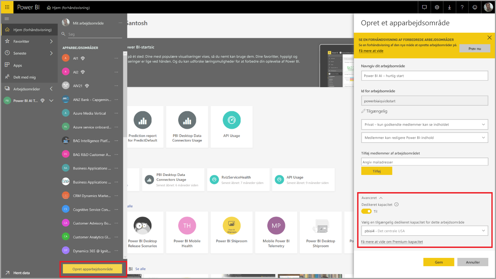
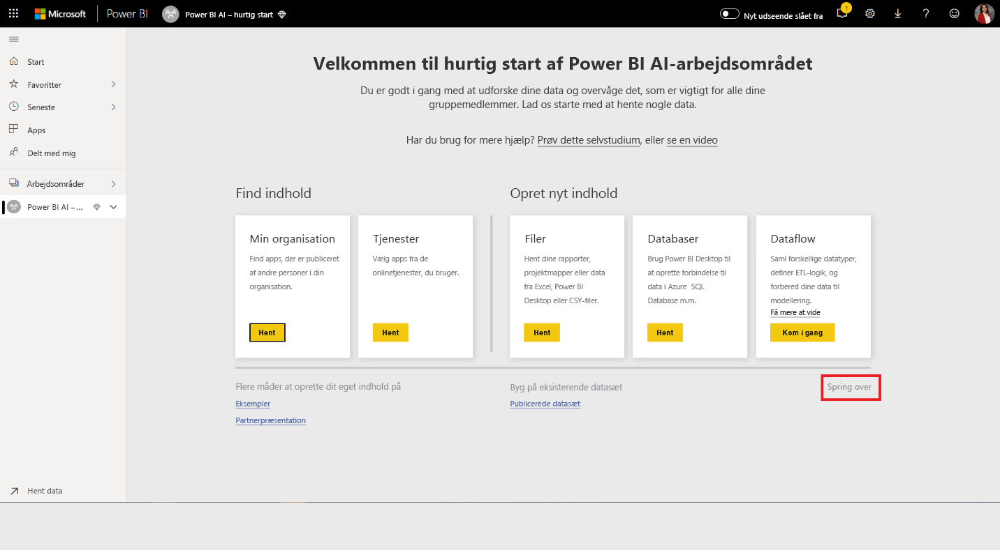
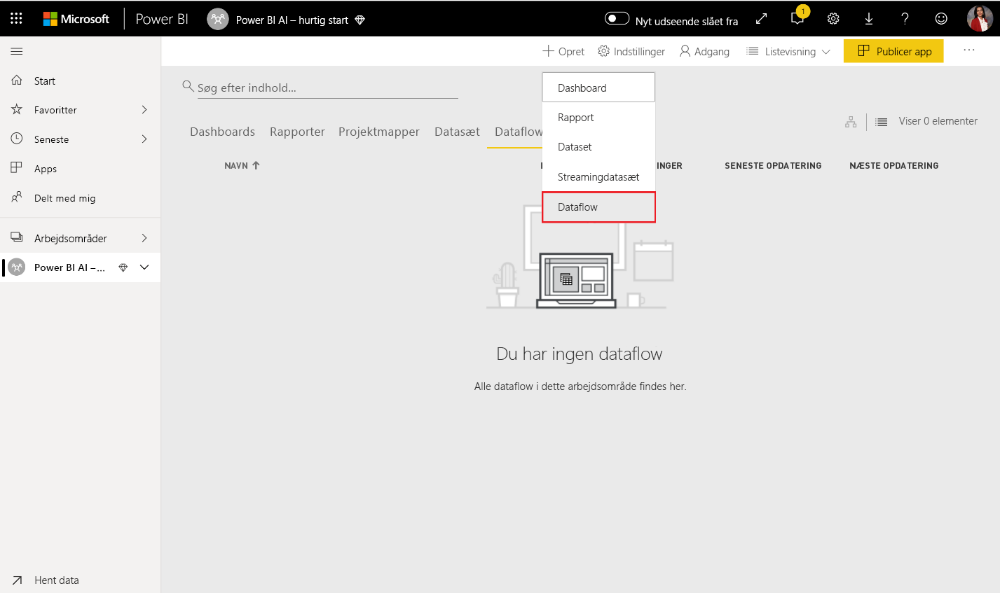
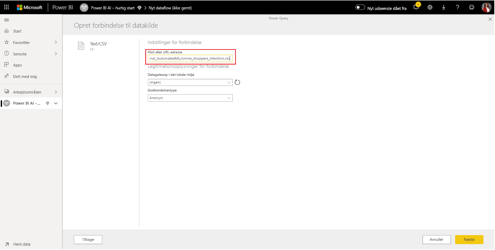
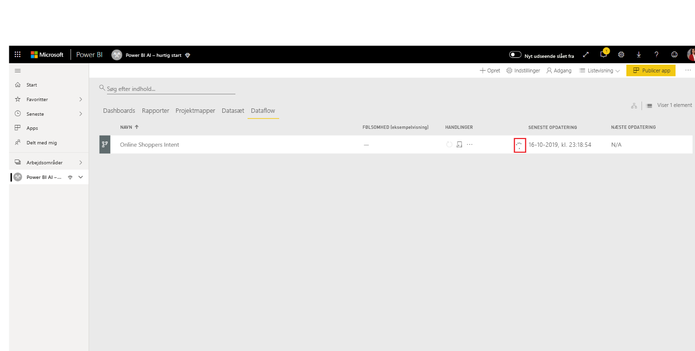
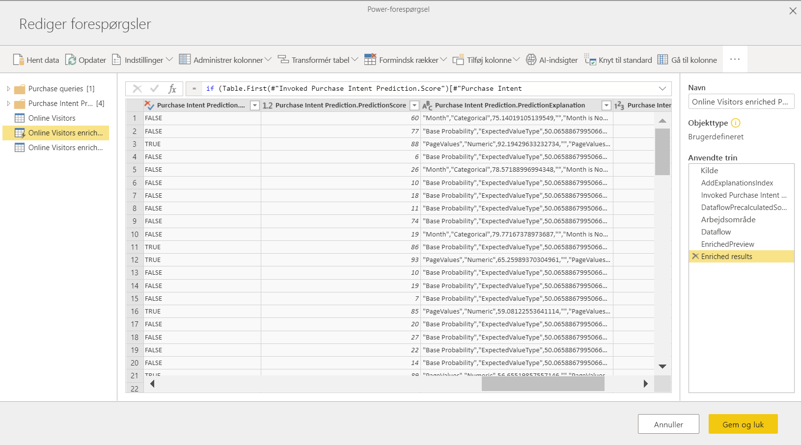

# Selvstudium: Skab en model til maskinel indlæring i Power BI

I denne artikel i dette selvstudium skal du bruge **automatiseret maskinel indlæring** til at oprette og anvende en binær forudsigelsesmodel i Power BI. Selvstudiet indeholder en vejledning i, hvordan du opretter et dataflow i Power BI og bruger de enheder, der er defineret i dataflowet, til at oplære og validere en model til maskinel indlæring direkte i Power BI. Derefter bruger vi denne model til at tildele scorer for nye data og generere forudsigelser.

Først skal du oprette en binær forudsigelsesmodel til maskinel indlæring for at forudsige købshensigten hos onlineshoppere på baggrund af attributterne for deres onlinesession. Vi benytter et benchmarkdatasæt til maskinel indlæring til denne øvelse. Når en model er oplært, opretter Power BI automatisk en valideringsrapport, der forklarer resultaterne af modellen. Du kan derefter gennemgå valideringsrapporten og anvende modellen på dine data for at tildele point.

Dette selvstudium består af følgende trin:
> [!div class="checklist"]

> * Opret et dataflow med inputdataene
> * Opret og oplær en model til maskinel indlæring
> * Gennemse modelvalideringsrapporten
> * Anvend modellen på en dataflowenhed
> * Brug af resultatet fra modellen i en Power BI-rapport

## Opret et dataflow med inputdataene

Den første del af dette selvstudium består i at oprette et dataflow med inputdata. Denne proces involverer nogle få trin, som vist i følgende afsnit, og begynder med hentning af data.

### Hent data

Det første trin i oprettelsen af et dataflow er at gøre dine datakilder klar. I vores tilfælde bruger vi et datasæt til maskinel indlæring fra et sæt onlinesessioner, hvoraf nogle af dem resulterede i et køb. Datasættet indeholder et sæt attributter om disse sessioner, som vi bruger til oplæring af vores model.

Du kan downloade datasættet fra UC Irvine-webstedet. Til dette selvstudium har vi også adgang til denne fil fra følgende link: [online_shoppers_intention.csv](https://raw.githubusercontent.com/santoshc1/PowerBI-AI-samples/master/Tutorial_AutomatedML/online_shoppers_intention.csv).

### Opret enhederne

Log på Power BI-tjenesten for at oprette enhederne i dit dataflow, og naviger til et arbejdsområde i den dedikerede kapacitet, hvor kunstig intelligens er aktiveret.

Hvis du ikke allerede har et arbejdsområde, kan du oprette et ved at vælge **Arbejdsområder** i navigationsrudens menu i Power BI-tjenesten og vælge **Opret arbejdsområde** nederst i det viste panel. Herefter åbnes et panel til højre, hvor du kan angive oplysninger om arbejdsområdet. Skriv et navn til arbejdsområdet, og vælg derefter **Avanceret**. Bekræft, at arbejdsområdet bruger dedikeret kapacitet, ved hjælp af alternativknappen, og at det er tildelt til en forekomst af dedikeret kapacitet, hvor AI Preview er slået til. Vælg derefter **Gem**.

Når arbejdsområdet er blevet oprettet, kan du vælge **Spring over** nederst til højre på velkomstskærmen, som vist på følgende billede.

 Vælg knappen **Opret** øverst til højre i arbejdsområdet, og vælg derefter **Dataflow**.

Vælg **Tilføj nye enheder**. Dette starter en **Power-forespørgselseditor** i browseren.

Vælg **Tekst/CSV-fil** som en datakilde, som vist på følgende billede.

På siden **Opret forbindelse til en datakilde**, der vises herefter, skal du indsætte følgende link til _online_shoppers_intention.csv_ i feltet **Filsti eller URL-adresse** og derefter vælge  **Næste**.

`https://raw.githubusercontent.com/santoshc1/PowerBI-AI-samples/master/Tutorial_AutomatedML/online_shoppers_intention.csv`

I Power-forespørgselseditor vises et eksempel på dataene fra CSV-filen. Du kan omdøbe forespørgslen til et mere brugervenligt navn ved at ændre værdien i feltet Navn i ruden til højre. Du kan f.eks. ændre navnet på forespørgslen til _Online Visitors_.

Power Query udleder automatisk kolonnetypen. Du kan ændre kolonnetypen ved at klikke på ikonet for attributtype øverst i kolonneoverskriften. I dette eksempel ændrer vi typen af kolonnen Omsætning til Sand/Falsk.

Vælg knappen **Gem og luk** for at lukke Power Query-editor. Angiv et navn på dataflowet, og vælg derefter **Gem** i dialogboksen, som vist på følgende billede.

## Opret og oplær en model til maskinel indlæring

Hvis du vil tilføje en model til maskinel indlæring, skal du bruge knappen **Anvend ML-model** på listen **Handlinger** for den basisenhed, der indeholder dine oplæringsdata og mærkatoplysninger, og derefter vælge **Tilføj en model til maskinel indlæring**.

Det første trin til oprettelse af vores model til maskinel indlæring er at identificere de historiske data, herunder det resultatfelt, som du vil forudsige. Modellen vil blive oprettet ved at lære fra disse data.

I forbindelse med det datasæt, som vi benytter, er dette felt **Revenue**. Vælg **Omsætning** som værdien for "Resultatfelt", og vælg derefter **Næste**.

Derefter skal du vælge den type model til maskinel indlæring, der skal oprettes. Power BI analyserer værdierne i resultatfeltet, som du har identificeret, og foreslår de typer af modeller til maskinel indlæring, der kan oprettes for at forudsige dette felt.

Da vi i dette tilfælde forudsiger et binært resultat af, om en bruger vil foretage et køb eller ej, anbefales det, at du vælger Binær forudsigelse. Da vi er interesseret i at forudsige de brugere, der vil foretage et køb, skal du vælge Sand som det resultat for Omsætning, du er mest interesseret i. Du kan desuden angive brugervenlige mærkater for de resultater, der skal bruges i den rapport, der genereres automatisk, og som opsummerer resultaterne af modelvalideringen. Vælg derefter Næste.

Derefter udfører Power BI en foreløbig scanning af en prøve af dine data og foreslår de input, der kan resultere i mere nøjagtige forudsigelser. Hvis der ikke anbefales et felt i Power BI, bliver der angivet en forklaring ved siden af det. Du har mulighed for at ændre markeringerne til kun at omfatte de felter, du vil have, at modellen skal undersøge, eller du kan vælge alle felter ved at markere afkrydsningsfeltet ud for navnet på enheden. Vælg **Næste** for at acceptere inputtene.

I det sidste trin skal vi angive navnet på vores model. Navngiv modellen _Purchase Intent Prediction_. Du kan vælge at reducere oplæringstiden for at få vist resultater hurtigt eller øge den tid, der bruges på oplæringen, så du får den bedste model. Vælg derefter **Gem og oplær** for at begynde at oplære modellen.

Oplæringsprocessen starter med at indsamle og normalisere dine historiske data og opdele dit datasæt i to nye enheder _Purchase Intent Prediction Training Data_ og _Purchase Intent Prediction Testing Data_.

Afhængigt af datasættets størrelse kan oplæringsprocessen tage alt fra nogle få minutter til den oplæringstid, der er valgt på forrige skærm. På dette tidspunkt kan du se modellen på fanen **Modeller til maskinel indlæring** i dataflowet. Statussen Klar angiver, at modellen er sat i kø til oplæring eller er under oplæring.

Du kan få bekræftet, at modellen oplæres og valideres, gennem dataflowets status. Dette vises som en igangværende dataopdatering på fanen **Dataflows** i arbejdsområdet.

Når oplæringen af modellen er fuldført, viser dataflowet et opdateret opdateringstidspunkt. Du kan få bekræftet, at modellen er oplært, ved at gå til fanen **Modeller til maskinel indlæring** i dataflowet. Den model, du har oprettet, bør have status som **Oplært** og tidspunktet for **Senest oplært** bør nu være opdateret.

## Gennemse modelvalideringsrapporten
Hvis du vil gennemse modelvalideringsrapporten, skal du under fanen Modeller til maskinel indlæring vælge knappen Vis oplæringsrapport i kolonnen Handlinger for modellen. I denne rapport beskrives det, hvordan ydeevnen for din model til maskinel indlæring sandsynligvis vil være.

På siden **Ydeevne af modellen** i rapporten skal du vælge **de bedste forudsigelser** for at få vist de bedste forudsigelser for din model. Du kan vælge en af forudsigelserne for at få vist fordelingen af det resultat, der er knyttet til den pågældende forudsigelse.

Du kan bruge udsnitsværktøjet **Tærskel for sandsynlighed** på siden Ydeevne af modellen til at undersøge dens indflydelse på præcision og genkaldelse for modellen.

De øvrige sider i rapporten beskriver de statistiske ydeevnemålepunkter for modellen.

Rapporten indeholder også siden Oplæringsoplysninger, der beskriver de forskellige gentagelser, der er blevet kørt, hvordan funktionerne blev trukket ud fra inputtet, samt hyperparametrene for den endelige model, der blev anvendt.

## Anvend modellen på en dataflowenhed

Vælg knappen **Anvend model** øverst i rapporten for at aktivere denne model. I dialogboksen **Anvend** skal du angive den destinationsenhed, der har de kildedata, som modellen skal anvendes for.

Du skal **opdatere** dataflowet for at få vist et eksempel på resultatet af din model, når du bliver bedt om det.

Anvendelse af modellen vil oprette to nye enheder med suffikset **enriched <model_name>** og **enriched <model_name> explanations**. Anvendelse af modellen i enheden **Online Visitors** vil i vores tilfælde oprette **Online Visitors enriched Purchase Intent Prediction**, som omfatter det forudsagte output fra modellen, og **Online Visitors enriched Purchase Intent Prediction explanations**, som indeholder de vigtigste postspecifikke influencere for forudsigelsen. 

Hvis du anvender en model til binær forudsigelse, tilføjes der fire kolonner med et forudsagt resultat, en sandsynlighedsscore, de vigtigste postspecifikke influencere for forudsigelsen og et forklaringsindeks, der hver især har det angivne kolonnenavn som præfiks.  

Når dataflowet er blevet opdateret, kan du vælge enheden **Online Visitors enriched Purchase Intent Prediction** for at få vist resultaterne.

## Brug af resultatet fra modellen i en Power BI-rapport

Hvis du vil bruge outputtet med tildelt score fra din model til maskinel indlæring, kan du oprette forbindelse til dataflowet fra Power BI Desktop ved hjælp af Dataflow-connectoren. Enheden **Online Visitors enriched Purchase Intent Prediction** kan nu bruges til at inkorporere forudsigelserne fra din model i Power BI-rapporter.

## Næste trin

I dette selvstudium har du oprettet og anvendt en binær forudsigelsesmodel i Power BI ved hjælp af disse trin:

* Opret et dataflow med inputdataene
* Opret og oplær en model til maskinel indlæring
* Gennemse modelvalideringsrapporten
* Anvend modellen på en dataflowenhed
* Brug af resultatet fra modellen i en Power BI-rapport

Du kan finde flere oplysninger om automatiseret maskinel indlæring i Power BI i [Automatiseret maskinel indlæring i Power BI](service-machine-learning-automated.md).
