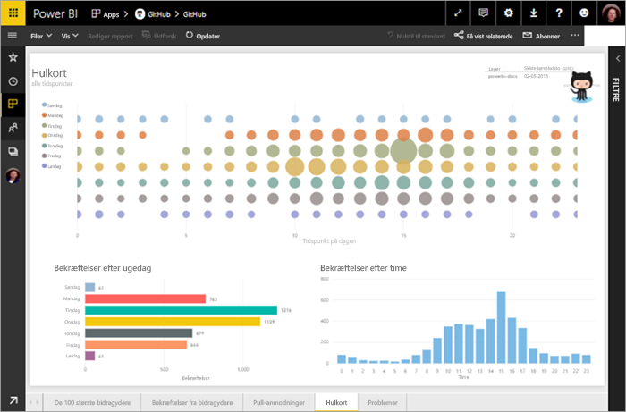
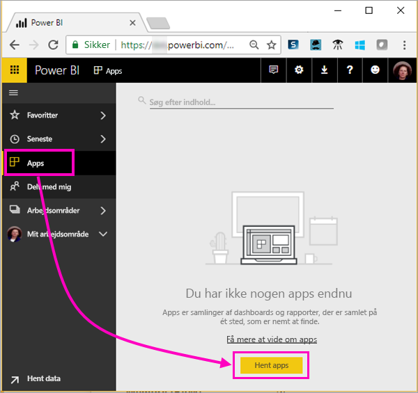
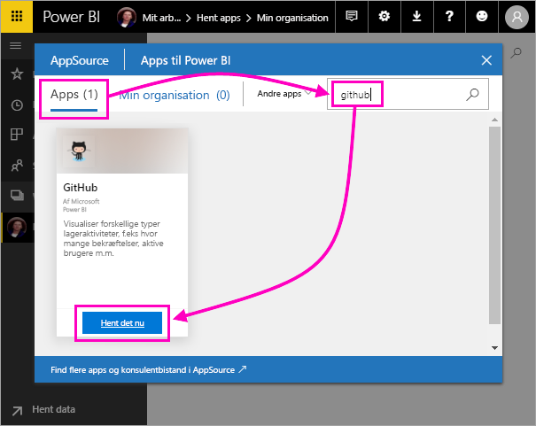
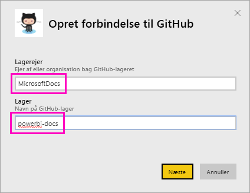
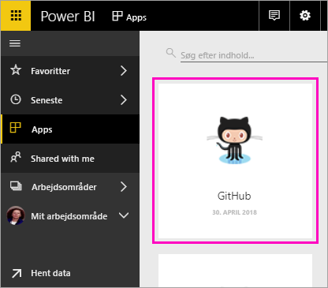
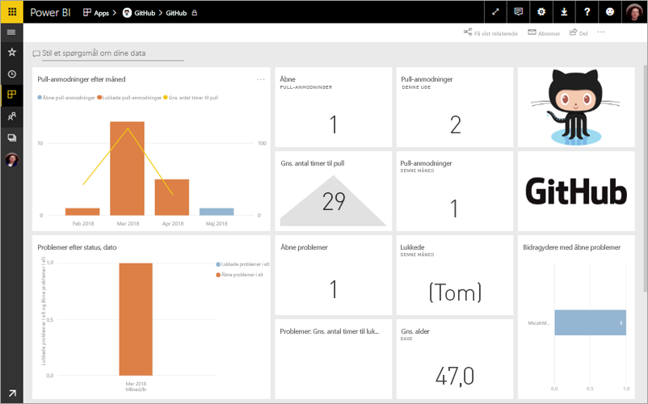
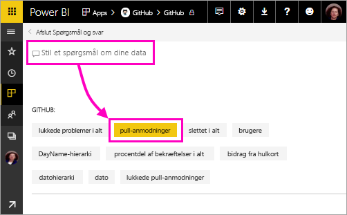
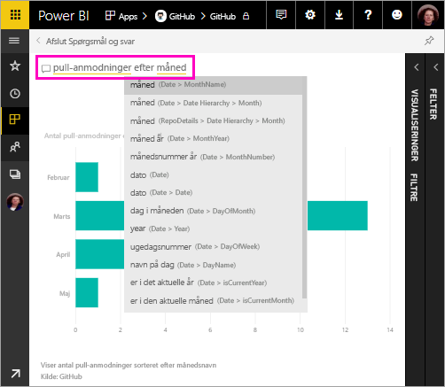
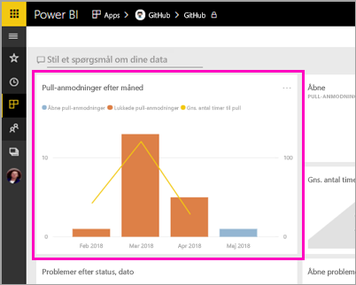
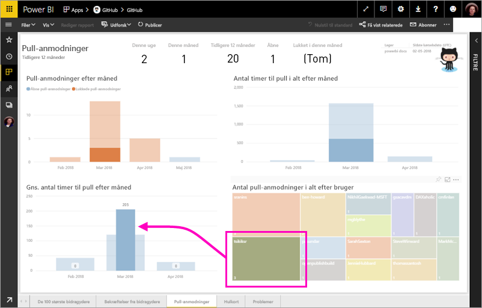

# Selvstudium: Opret forbindelse til et GitHub-eksempel med Power BI
I dette selvstudium opretter du forbindelse til virkelige data i GitHub-tjenesten med Power BI, og Power BI opretter automatisk dashboards og rapporter. Du opretter forbindelse til det offentlige Power BI-lagerindhold (også kaldet *lager*) og får vist oplysninger: Hvor mange bidrager til det offentlige Power BI-indhold? Hvem der bidrager mest? På hvilken ugedag er der flest bidrag? Og svar på andre spørgsmål. 

I dette selvstudium kan du udføre følgende trin:

> [!div class="checklist"]
> * Opret en GitHub-konto, hvis du ikke allerede har en 
> * Log på din Power BI-konto, eller opret én, hvis du ikke allerede har en
> * Åbn Power BI-tjenesten
> * Find GitHub-appen
> * Angiv oplysningerne for det offentlige GitHub-lager i Power BI
> * Få vist dashboardet og rapporten med GitHub-data
> * Ryd op i ressourcer ved at slette appen

Hvis du ikke er tilmeldt Power BI, kan du [tilmelde dig en gratis prøveversion](https://app.powerbi.com/signupredirect?pbi_source=web), før du begynder.

## Forudsætninger

Hvis du vil gennemføre dette selvstudium, skal du oprette en GitHub-konto, hvis du ikke allerede har en. 

- Opret en [GitHub-konto](https://docs.microsoft.com/contribute/get-started-setup-github)

## Sådan opretter du forbindelse
1. Log på Power BI-tjenesten (http://powerbi.com). 
2. Vælg **Apps** og derefter **Hent apps** i navigationsruden til venstre.
   
    

3. Vælg **Apps**, og skriv **github** i søgefeltet > **Hent det nu**.
   
    

4. Angiv lagernavnet og lagerejeren. URL-adressen til dette lager er https://github.com/MicrosoftDocs/powerbi-docs, så **Lagerejer** er **MicrosoftDocs**, og **Lager** er **powerbi-docs**. 
   
    

5. Angiv de GitHub-legitimationsoplysninger, du har oprettet. Power BI springer måske dette trin over, hvis du allerede er logget på GitHub i din browser. 

6. Som **Godkendelsesmetode** skal du vælge **oAuth2** \> **Log på**.

7. Følg skærmbillederne for Github-godkendelse. Giv Power BI-tilladelse til GitHub-dataene.
   
   Nu kan Power BI oprette forbindelse til GitHub og oprette forbindelse til dataene.  Dataene opdateres én gang om dagen.

8. Når Power BI har importeret dataene, kan du se det nye GitHub-felt. 
 
    

8. Vælg det globale navigationsikon for at minimere venstre navigationsrude, så du har mere plads.

    

10. Vælg GitHub-feltet fra trin 8. 
    
    GitHub-dashboardet åbnes. Dette er dynamiske data, så de værdier, du ser, er måske nogle andre.

    

    

## Stil et spørgsmål

11. Anbring din markør på **Stil et spørgsmål om dine data**, og vælg derefter **pull-anmodninger**. 

    

12. Skriv **pr. måned**.
 
    

     Power BI opretter et liggende søjlediagram, der viser antallet af pull-anmodninger pr. måned.

13. Vælg **Afslut Spørgsmål og svar**.

## Få vist GitHub-rapporten 

1. I GitHub-dashboardet skal du vælge kombinationen af søjle- og kurvediagrammet **Pull-anmodninger pr. måned** for at åbne den relaterede rapport.

    

2. Vælg et brugernavn i diagrammet **Pull-anmodninger i alt pr. bruger**, og se i dette eksempel, at de har haft flere gennemsnitlige timer end det samlede gennemsnit for marts.

    

3. Vælg fanen **Hulkort** for at få vist den næste side i rapporten. 
 
    

    Det ser ud til, at tirsdag kl. 15 er det mest almindelige tidspunkt og den mest almindelige dag i ugen til *bekræftelser*, når medarbejdere tjekker deres arbejde ind.

## Fjern ressourcer

Nu, hvor du har gennemført selvstudiet, kan du slette GitHub-appen. 

1. Vælg **Apps** på navigationslinjen til venstre.
2. Peg på GitHub-feltet, og vælg **Slet** ud for skraldespanden.

    

## Næste trin

I dette selvstudie har du oprettet forbindelse til et offentligt GitHub-lager og hentet data, som Power BI har formateret på et dashboard og i en rapport. Du har besvaret nogle spørgsmål om dataene ved at udforske dashboardet og rapporten. Nu kan du få mere at vide om at oprette forbindelse til andre tjenester, f.eks. Salesforce, Microsoft Dynamics og Google Analytics. 
 
> [!div class="nextstepaction"]
> [Opret forbindelse til de onlinetjenester, du bruger](service-connect-to-services.md)

