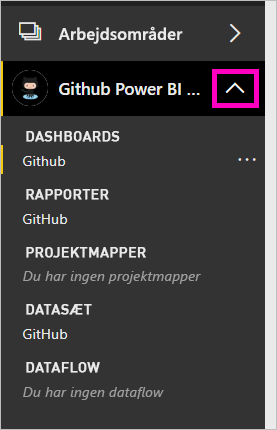

# Selvstudium: Opret forbindelse til et GitHub-lager med Power BI
I dette selvstudium opretter du forbindelse til virkelige data i GitHub-tjenesten med Power BI, og Power BI opretter automatisk dashboards og rapporter. Du opretter forbindelse til det offentlige Power BI-lagerindhold (også kaldet *lager*) og ser svar på spørgsmål såsom: Hvor mange bidrager til det offentlige Power BI-indhold? Hvem der bidrager mest? På hvilken ugedag er der flest bidrag? Og andre spørgsmål. 

I dette selvstudium kan du udføre følgende trin:

> [!div class="checklist"]
> * Opret en GitHub-konto, hvis du ikke allerede har en 
> * Log på din Power BI-konto, eller opret én, hvis du ikke allerede har en
> * Åbn Power BI-tjenesten
> * Find GitHub-appen
> * Angiv oplysningerne for det offentlige GitHub-lager i Power BI
> * Få vist dashboardet og rapporten med GitHub-data
> * Ryd op i ressourcer ved at slette appen

Hvis du ikke er tilmeldt Power BI, kan du [tilmelde dig en gratis prøveversion](https://app.powerbi.com/signupredirect?pbi_source=web), før du begynder.

## Forudsætninger

Hvis du vil gennemføre dette selvstudium, skal du oprette en GitHub-konto, hvis du ikke allerede har en. 

- Tilmeld dig en [GitHub-konto](https://docs.microsoft.com/contribute/get-started-setup-github).

## Sådan opretter du forbindelse
1. Log på Power BI-tjenesten (https://app.powerbi.com). 
2. Vælg **Apps** og derefter **Hent apps** i navigationsruden.
   
    

3. Vælg **Apps**, og skriv **GitHub** i søgefeltet > **Hent det nu**.
   
    

4. Vælg **Installér** under **Installér denne Power BI-app?** .
5. Under **Din nye app er klar** skal du vælge **Gå til app**.
6. Under **Kom i gang med din nye app** skal du vælge **Opret forbindelse**.

    

7. Angiv lagernavnet og lagerejeren. URL-adressen til dette lager er https://github.com/MicrosoftDocs/powerbi-docs, så **Lagerejer** er **MicrosoftDocs**, og **Lager** er **powerbi-docs**. 
   
    

5. Angiv de GitHub-legitimationsoplysninger, du har oprettet. Power BI springer måske dette trin over, hvis du allerede er logget på GitHub i din browser. 

6. Som **Godkendelsesmetode** skal du bevare **oAuth2** valgt \> **Log på**.

7. Følg skærmbillederne for GitHub-godkendelse. Giv Power BI-tilladelse til GitHub-dataene.
   
   Nu kan Power BI oprette forbindelse til GitHub og oprette forbindelse til dataene.  Dataene opdateres én gang om dagen.

8. Når Power BI importerer dataene, får du vist indholdet af dit nye GitHub-arbejdsområde. 
9. Vælg pilen ud for navnet på arbejdsområdet i navigationsruden. Du kan se, at arbejdsområdet indeholder et dashboard og en rapport. 

    

10. Vælg **Flere indstillinger** (...) ud for dashboardnavnet > **Omdøb** > skriv **GitHub-dashboard**.
 
     

8. Vælg ikonet for global navigation for at minimere navigationsruden, så du har mere plads.

    

10. Vælg dit nye GitHub-dashboard.
    
    GitHub-dashboardet indeholder dynamiske data, så de værdier, du ser, kan være anderledes.

    

    

## Stil et spørgsmål

1. Anbring din markør på **Stil et spørgsmål om dine data**. Power BI indeholder **spørgsmål om, hvordan du kan komme i gang**. 

1. Vælg, **hvor mange brugere der er**.
 
    

13. Mellem **hvor mange** og **brugere er der** skal du skrive **pull-anmodninger pr.** . 

     Power BI opretter et liggende søjlediagram, der viser antallet af pull-anmodninger pr. person.

    

13. Vælg nålen for at fastgøre det til dit dashboard, og **afslut derefter Spørgsmål og svar**.

## Få vist GitHub-rapporten 

1. På GitHub-dashboardet skal du vælge søjlediagrammet **Pull-anmodninger pr. måned** for at åbne den relaterede rapport.

    

2. Vælg et brugernavn i diagrammet **Samlede pull-anmodninger pr. bruger**. I dette eksempel kan vi se, at de fleste af deres timer var i februar.

    

3. Vælg fanen **Hulkort** for at få vist den næste side i rapporten. 
 
    

    Det ser ud til, at tirsdag kl. 15 er det mest almindelige tidspunkt og den mest almindelige dag i ugen til *bekræftelser*, når medarbejdere tjekker deres arbejde ind.

## Fjern ressourcer

Nu, hvor du har gennemført selvstudiet, kan du slette GitHub-appen. 

1. Vælg **Apps** i navigationsruden.
2. Peg på GitHub-feltet, og vælg **Slet** ud for skraldespanden.

    

## Næste trin

I dette selvstudie har du oprettet forbindelse til et offentligt GitHub-lager og hentet data, som Power BI har formateret på et dashboard og i en rapport. Du har besvaret nogle spørgsmål om dataene ved at udforske dashboardet og rapporten. Nu kan du få mere at vide om at oprette forbindelse til andre tjenester, f.eks. Salesforce, Microsoft Dynamics og Google Analytics. 
 
> [!div class="nextstepaction"]
> [Opret forbindelse til de onlinetjenester, du bruger](service-connect-to-services.md)

