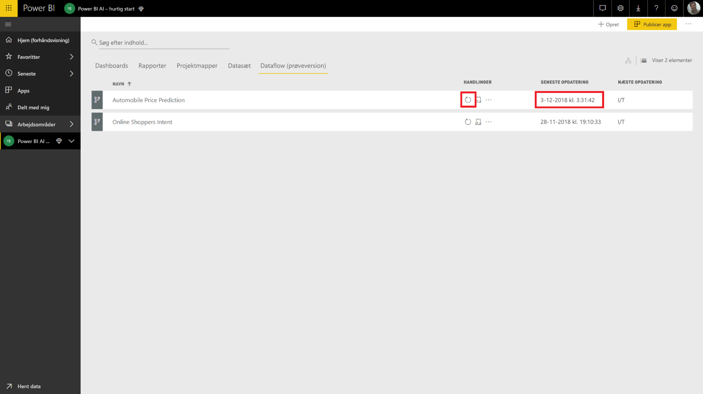
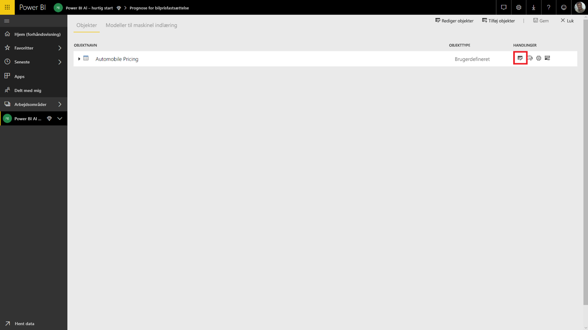
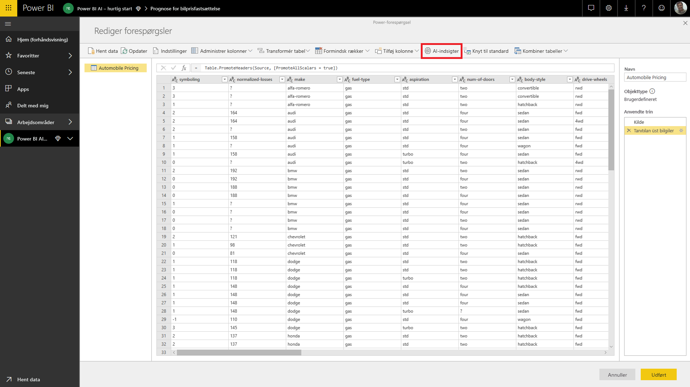

# Selvstudium: Aktivér en Machine Learning Studio-model i Power BI (prøveversion)

I dette selvstudium gennemgår vi, hvordan du inkorporerer indsigt fra en **Azure Machine Learning Studio-model** i Power BI. Dette selvstudium indeholder en vejledning i tildeling af Power BI-brugeradgang til en Azure ML-model, oprettelse af et dataflow og anvendelsen af indsigt fra Azure ML-modellen i dit dataflow. Det indeholder også en henvisning til startvejledningen til oprettelse af en Azure ML-model, hvis du ikke allerede har en model.

I selvstudiet kommer du gennem følgende trin:

> [!div class="checklist"]
> * Opret og publicer en Azure Machine Learning-model
> * Giv en Power BI-bruger adgang til at bruge modellen
> * Opret et dataflow
> * Anvend indsigt fra Azure ML-modellen i dataflowet

## Opret og publicer en Azure ML-model

Følg instruktionerne i [trin 1 i gennemgangen: Opret et arbejdsområde i Machine Learning Studio](https://docs.microsoft.com/azure/machine-learning/studio/walkthrough-1-create-ml-workspace) for at oprette et **Machine Learning-arbejdsområde**.

Du kan bruge disse trin, hvis du allerede har en Azure ML-model eller et datasæt. Hvis du ikke har en model, der er publiceret, kan du oprette en model på få minutter ved at referere til [Opret dit første datavidenskabseksperiment i Azure Machine Learning Studio](https://docs.microsoft.com/azure/machine-learning/studio/create-experiment), hvor en Azure ML-model til forudsigelse af bilpriser konfigureres.

Følg trinnene under [Udrul en Azure Machine Learning Studio-webtjeneste](https://docs.microsoft.com/azure/machine-learning/studio/publish-a-machine-learning-web-service) for at publicere Azure ML-modellen som en webtjeneste.

## Tildel adgang til en Power BI-bruger

Hvis du vil have adgang til en Azure ML-model fra Power BI, skal du have **læseadgang** til Azure-abonnementet og ressourcegruppen og **læseadgang** til webtjenesten Azure Machine Learning Studio til Machine Learning Studio-modeller.  I forbindelse med Azure Machine Learning-tjenestemodellen skal du have **læseadgang** til arbejdsområdet i Machine Learning-tjenesten.

Følgende trin forudsætter, at du er medadministrator af Azure-abonnementet og den ressourcegruppe, som modellen blev publiceret i.

Log på [Azure Portal](https://portal.azure.com), og gå til siden **Abonnementer**, som du finder ved hjælp af listen **Alle tjenester** i navigationsmenuen til venstre.

Vælg det Azure-abonnement, som du brugte til publicering af modellen, og vælg **Access Control (IAM)** . Vælg derefter **Tilføj rolletildeling**, rollen **Læser**, og vælg Power BI-brugeren. Vælg **Gem**, når du er færdig. På følgende billede vises disse valg.

Gentag derefter trinnene ovenfor for at tildele rolleadgangen **Bidragyder** til Power BI-brugeren for den specifikke Machine Learning-webtjeneste, som Azure ML-modellen er blevet udrullet i.

## Opret et dataflow

### Hent data til oprettelse af dataflowet

Log på Power BI-tjenesten med legitimationsoplysningerne for den bruger, som du har givet adgang til Azure ML-modellen i det forrige trin.

I dette trin forudsættes det, at du har de data, du vil tildele point med din Azure ML-model i CSV-format.  Hvis du har brugt **eksperimentet med bilpriser** til at oprette modellen i Machine Learning Studio, deles datasættet for eksperimentet via følgende link:

* [Eksempel på Azure Learning Studio-model](https://raw.githubusercontent.com/santoshc1/PowerBI‑AI‑samples/master/Tutorial\_MLStudio\_model\_integration/Automobile%20price%20data%20\_Raw\_.csv)

### Opret et dataflow

Log på Power BI-tjenesten for at oprette enhederne i dit dataflow, og gå til et arbejdsområde i den dedikerede kapacitet, som AI-prøveversionen er aktiveret for.

Hvis du ikke allerede har et arbejdsområde, kan du oprette et ved at vælge **Arbejdsområder** i menuen til venstre og derefter vælge **Opret apparbejdsområde** i det nederste panel.  Dette åbner et panel, hvor du kan angive oplysninger om arbejdsområdet. Skriv et navn til arbejdsområdet, og vælg derefter **Gem**.

Når arbejdsområdet er blevet oprettet, kan du vælge **Spring over** nederst til højre på velkomstskærmen.

Vælg fanen **Dataflow (prøveversion)** , vælg knappen **Opret** øverst til højre i arbejdsområdet, og vælg derefter **Dataflow**.

Vælg **Tilføj nye enheder**, hvilket starter **Power-forespørgselseditor** i browseren.

Vælg **Tekst/CSV-fil** som en datakilde.

Du bliver bedt om at oprette forbindelse til en datakilde på det næste skærmbillede. Indsæt linket til de data, du brugte til at oprette din Azure ML-model. Hvis du har brugt dataene om _bilpriser_, kan du indsætte følgende link i feltet **Filsti eller URL-adresse** og derefter vælge **Næste**.

`https://raw.githubusercontent.com/MicrosoftLearning/Principles-of-Machine-Learning-Python/master/Module7/Automobile%20price%20data%20_Raw_.csv`

I Power-Forespørgselseditor vises et eksempel på dataene fra CSV-filen. Vælg **Transformér tabel** på kommandobåndet, og vælg derefter **Brug den første række som overskrifter**.  Herefter føjes forespørgselstrinnet _Hævede overskrifter_ til ruden **Anvendte trin** til højre. Du kan også omdøbe forespørgslen til et mere brugervenligt navn, f.eks _Bilpriser_, ved hjælp af ruden til højre.

Vores kildedatasæt har ukendte værdier, der er angivet til "?".  Hvis du vil rydde disse værdier, kan du for nemheds skyld erstatte "?" med "0" for at undgå fejl på et senere tidspunkt.  Det gør du ved at vælge kolonnerne *normalized-losses*, *bore*, *stroke*, *compression-ratio*, *horsepower*, *peak-rpm* og *price* ved at klikke på kolonnernes navn i kolonneoverskrifterne, og derefter klikke på "Transformér kolonner" og vælge "Erstat værdier".  Erstat "?" med "0".

Alle kolonnerne i tabellen fra en tekst-/CSV-kilde behandles som tekstkolonner.  Vi skal nu ændre de numeriske kolonner til deres korrekte datatyper.  Du kan gøre dette i Power-forespørgslen ved at klikke på datatypesymbolet i kolonneoverskriften.  Sørg for, at kolonnerne får typerne nedenfor:

- **Heltal**: symboling, normalized-losses, curb-weight, engine-size, horsepower, peak-rpm, city-mpg, highway-mpg, price
- **Decimaltal**:  wheel-base, length, width, height, bore, stroke, compression-ratio

Vælg **Udført** for at lukke Power-forespørgselseditor. Du får nu vist listen over enheder med de _bilprisdata_, som vi har tilføjet. Vælg **Gem** i øverste højre hjørne, angiv et navn til dataflowet, og vælg derefter **Gem**.

### Opdater dataflowet

Når du gemmer dataflowet, vises en meddelelse om, at dataflowet er blevet gemt. Vælg **Opdater nu** for at overføre data fra kilden til dataflowet.

Vælg **Luk** i øverste højre hjørne, og vent, indtil opdateringen af dataflowet er blevet fuldført.

Du kan også opdatere dataflowet ved hjælp af kommandoen **Handlinger**. I dataflowet vises et tidsstempel for, hvornår opdateringen blev fuldført.

## Anvend indsigt fra din Azure ML-model

Hvis du vil have adgang til Azure ML-modellen for _Forudsigelse af bilpriser_, kan du redigere enheden _Bilpriser_, som den estimerede pris skal føjes til.

Når du vælger ikonet **Rediger**, åbnes Power-forespørgselseditoren for enhederne i dit dataflow.

Vælg knappen **AI Insights** på båndet, og vælg derefter mappen _Azure Machine Learning-modeller_ i navigationsmenuen til venstre.

De Azure ML-modeller, som du har fået adgang til, er angivet som Power-forespørgselsfunktioner med præfikset *AzureML*.  Når du klikker på den funktion, der svarer til modellen _AutomobilePricePrediction_, vises parametrene for modellens webtjeneste som funktionsparametre.

Du aktiverer en Azure ML-model ved at angive en af den valgte enheds kolonner som input på rullelisten. Du kan også angive en konstant værdi, der skal bruges som input, ved at slå kolonneikonet til venstre for inputdialogboksen til og fra. Når et kolonnenavn svarer til et af navnene på funktionsparametrene, foreslås den pågældende kolonne automatisk som input.  Hvis navnet på en kolonne ikke har noget match, kan du vælge det på rullelisten.

I forbindelse med modellen _Forudsigelse af bilpriser_ er inputparametrene som følger:

- make
- body-style
- wheel-base
- engine-size
- horsepower
- peak-rpm
- highway-mpg

Da vores tabel stemmer overens med det oprindelige datasæt, der blev brugt til at oplære modellen, er de korrekte kolonner allerede blevet valgt for alle parametrene i dette tilfælde.

Vælg **Aktivér** for at få vist Azure ML-modellens output som en ny kolonne i enhedstabellen. Du får også vist modelaktiveringen som et anvendt trin for forespørgslen.

Outputtet fra modellen vises som en post i outputkolonnen. Du kan udvide kolonnen for at oprette individuelle outputparametre i separate kolonner. I dette tilfælde er vi kun interesseret i _Scored Labels_, der indeholder den estimerede pris på bilen.  Så vi fjerner markeringen af resten og vælger **OK**.

Den resulterende kolonne *Scored Labels* har prisforudsigelsen fra Azure ML-modellen.

Når du gemmer dit dataflow, aktiveres Azure ML-modellen automatisk, når dataflowet opdateres for alle nye eller opdaterede rækker i enhedstabellen.

## Fjern ressourcer

Hvis du ikke længere har brug for de Azure-ressourcer, du har oprettet ved hjælp af denne artikel, kan du slette dem for at undgå eventuelle gebyrer.  Du kan også slette de dataflow, du har oprettet, hvis du ikke længere har brug for dem.

## Næste trin

I dette selvstudium har du oprettet et simpelt eksperiment ved hjælp af Azure Machine Learning Studio og et simpelt datasæt ved hjælp af disse trin:

- Opret og publicer en Azure Machine Learning-model
- Giv en Power BI-bruger adgang til at bruge modellen
- Opret et dataflow
- Anvend indsigt fra Azure ML-modellen i dataflowet

Du kan finde flere oplysninger om Azure Machine Learning-integration i Power BI i [Azure Machine Learning-integration i Power BI (prøveversion)](service-machine-learning-integration.md).
