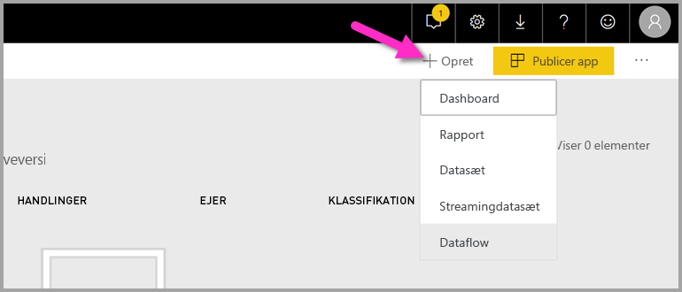
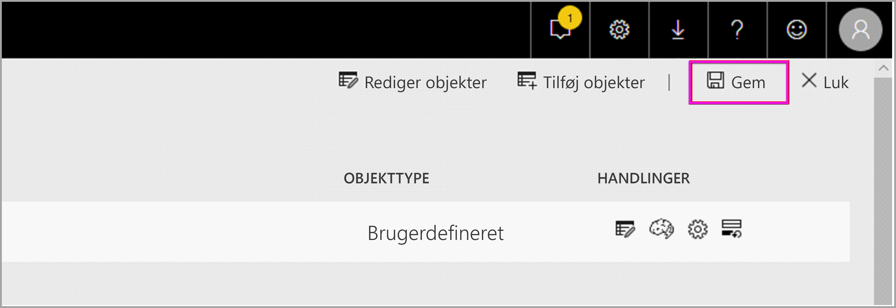
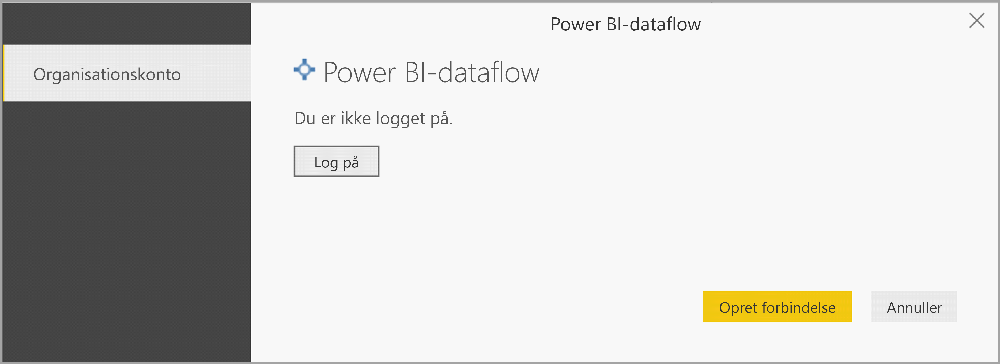
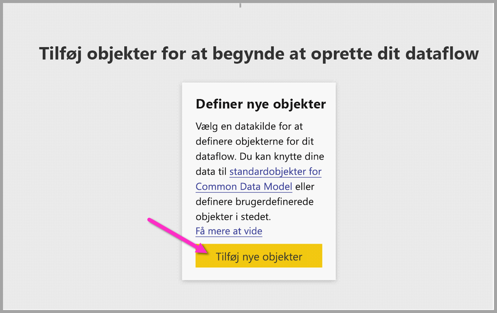
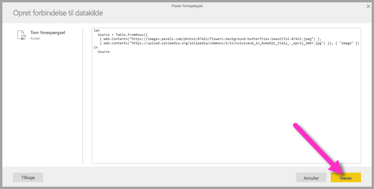
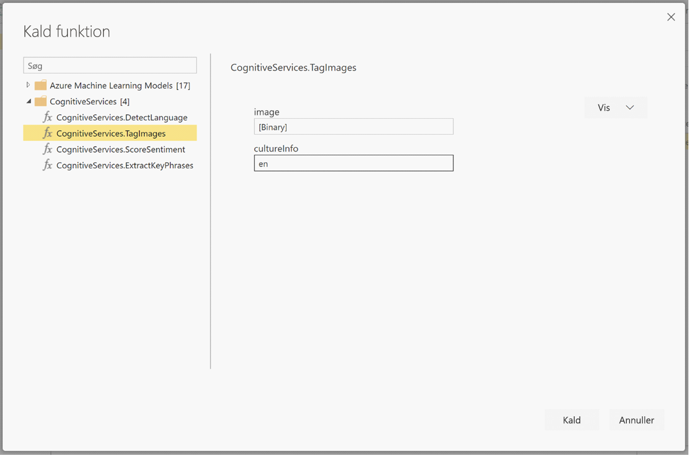

# <a name="tutorial-use-cognitive-services-in-power-bi"></a>Selvstudium: Brug Cognitive Services i Power BI

Power BI giver adgang til et sæt funktioner fra Azure Cognitive Services, så du kan forbedre dine data via selvbetjent dataforberedelse til dataflow. De tjenester, der understøttes i dag, er [Synspunktsanalyse](https://docs.microsoft.com/azure/cognitive-services/text-analytics/how-tos/text-analytics-how-to-sentiment-analysis), [Udtrækning af nøglesætninger](https://docs.microsoft.com/azure/cognitive-services/text-analytics/how-tos/text-analytics-how-to-keyword-extraction), [Registrering af sprog](https://docs.microsoft.com/azure/cognitive-services/text-analytics/how-tos/text-analytics-how-to-language-detection) og [Billedmarkering](https://docs.microsoft.com/azure/cognitive-services/computer-vision/concept-tagging-images). Transformationerne udføres i Power BI-tjenesten og kræver ikke et Azure Cognitive Services-abonnement. Denne funktion kræver Power BI Premium.

Cognitive Services-transformationer understøttes i [Selvbetjent dataforberedelse til dataflow](https://powerbi.microsoft.com/blog/introducing-power-bi-data-prep-wtih-dataflows/). Brug de trinvise eksempler til tekstanalyse og billedmarkering nedenfor for at komme i gang.

I dette selvstudium lærer du, hvordan du kan:

> [!div class="checklist"]
> * Importere data til et dataflow
> * Tildele synspunkter point og udtrække nøglesætninger fra en tekstkolonne i et dataflow
> * Oprette forbindelse til resultaterne fra Power BI Desktop


## <a name="prerequisites"></a>Forudsætninger

Følgende elementer er nødvendige for at fuldføre dette selvstudium: 

- En Power BI-konto. Hvis du ikke er tilmeldt Power BI, kan du [tilmelde dig en gratis prøveversion](https://app.powerbi.com/signupredirect?pbi_source=web), før du begynder.
- Adgang til en Power BI Premium-kapacitet med AI-arbejdsbelastningen aktiveret. Denne arbejdsbelastning er som standard deaktiveret i prøveperioden. Hvis du er i en Premium-kapacitet, og AI Insights ikke vises, skal du kontakte administratoren af Premium-kapaciteten for at aktivere AI-arbejdsbelastningen i administrationsportalen.

## <a name="text-analytics"></a>Tekstanalyse

Følg trinnene i dette afsnit for at færdiggøre tekstanalysedelen af selvstudiet.

### <a name="step-1-apply-sentiment-scoring-in-power-bi-service"></a>Trin 1: Anvend pointtildeling i Power BI-tjenesten

Kom i gang ved at gå til et Power BI-arbejdsområde med Premium-kapacitet, og opret et nyt dataflow ved hjælp af knappen **Opret** i øverste højre hjørne af skærmen.



Dialogboksen Dataflow viser indstillingerne til oprettelse af et nyt dataflow. Vælg **Tilføj nye enheder**. Vælg derefter **Tekst/CSV** i menuen med datakilder.


Indsæt denne URL-adresse i feltet URL-adresse: [https://pbiaitutorials.blob.core.windows.net/textanalytics/FabrikamComments.csv](https://pbiaitutorials.blob.core.windows.net/textanalytics/FabrikamComments.csv), og klik på **Næste**.


På det øverste bånd skal du vælge **Transformér tabel** og derefter vælge **Brug den første række som overskrifter**. Dataene er nu klar til at blive brugt til tekstanalyse, og vi kan give synspunkter point og udtrække nøglesætninger fra kundens kolonne med kommentarer.

Vælg **AI Insights** i Power-forespørgselseditor


Udvid mappen **Cognitive Services**, og vælg den funktion, du vil bruge. I dette eksempel får synspunkterne i kolonnen med kommentarer point, men du kan følge de samme trin for at prøve registrering af sprog og udtrækning af nøglesætninger.


Når en funktion er markeret, vises de obligatoriske og valgfri felter. Vælg kolonnen med anmeldelser som tekstinput for at give eksemplerne på synspunkter i anmeldelserne point. Kulturoplysninger er valgfrit input og kræver et ISO-format. Du kan f.eks. angive "en", hvis teksten skal behandles som engelsk. Når feltet er tomt, registrerer Power BI først sproget for inputværdien, før synspunkterne får tildelt point.


Nu skal du vælge **Kald** for at køre funktionen. En ny kolonne med synspunktsscoren for hver række føjes til tabellen. Du kan gå tilbage til **AI Insights** for at udtrække nøglesætninger i anmeldelsesteksten på samme måde.

Når du er færdig med transformationerne, kan du ændre forespørgselsnavnet til "Kundernes kommentarer" og vælge **Udført**.


**Gem** derefter dataflowet, og giv det navnet Fabrikam. Vælg knappen **Opdater nu**, der vises som pop op, når du har gemt dataflowet.



Når dataflowet er blevet gemt og opdateret, kan du bruge det i en Power BI-rapport.

### <a name="step-2-connect-from-power-bi-desktop"></a>Trin 2: Opret forbindelse fra Power BI Desktop

Åbn Power BI Desktop. Vælg **Hent data** på båndet Hjem.

Gå til **Power BI-dataflow (Beta**) i Power BI-afsnittet, og vælg **Opret forbindelse**.


Eftersom der er tale om en prøveversion, bliver du bedt om at acceptere betingelserne for prøveversionen. Når du har accepteret disse betingelser, kan du logge på med din organisationskonto.



Vælg det dataflow, du lige har oprettet. Gå til tabellen med kundekommentarer, og klik på **Indlæs**.


Nu, hvor dataene er indlæst, kan du begynde at oprette en rapport.

## <a name="image-tagging"></a>Billedmarkering

Gå til et Power BI-arbejdsområde med Premium-kapacitet. Opret et nyt dataflow ved hjælp af knappen **Opret** i øverste højre hjørne af skærmen.


Vælg **Tilføj nye enheder**.



Når du bliver bedt om at vælge en datakilde, skal du vælge **Tom forespørgsel**.


Kopiér forespørgslen nedenfor i forespørgselseditoren, og klik på Næste. Du kan erstatte URL-stierne nedenfor med andre billeder eller tilføje flere rækker. Funktionen *Web.Contents* importerer billedets URL-adresse som binær. Hvis du har en datakilde med billeder, der er gemt som binære, kan du også bruge dem direkte.


```python
let
  Source = Table.FromRows({
  { Web.Contents("https://images.pexels.com/photos/87452/flowers-background-butterflies-beautiful-87452.jpeg") },
  { Web.Contents("https://upload.wikimedia.org/wikipedia/commons/5/53/Colosseum_in_Rome%2C_Italy_-_April_2007.jpg") }}, { "Image" })
in
  Source
```



Når du bliver spurgt om legitimationsoplysninger, skal du vælge *Anonym*.


Du får vist følgende billede.


Du bliver bedt om legitimationsoplysninger for hver enkelt webside.

Vælg **AI Insights** i forespørgselseditoren.


Log på med din **organisationskonto**.


Vælg funktionen Markér billeder, indtast _[Binary]_ i kolonnefeltet og _en_ i feltet med kulturoplysninger. 

> [!NOTE]
> I øjeblikket kan du ikke vælge en kolonne ved hjælp af en rulleliste, hvilket vil blive løst hurtigst muligt under den private prøveperiode.



Fjern anførselstegnene rundt om kolonnenavnet i funktionseditoren. 

> [!NOTE]
> At fjerne anførselstegnene er en midlertidig løsning, og problemet vil blive løst så hurtigt som muligt under prøveperioden.


Funktionen returnerer en post med koderne i CSV-format og som en json-post. Vælg udvidelsesknappen for at tilføje den ene eller begge to som kolonner i tabellen.


Vælg **Udført**, og gem dataflowet. Når du har opdateret dataflowet én gang, kan du oprette forbindelse til det fra Power BI Desktop ved hjælp af dataflowforbindelserne. (Se trinnene på side 5 i dette dokument).

## <a name="clean-up-resources"></a>Fjern ressourcer

Når forespørgslen ikke længere er nødvendig, kan du slette den ved at højreklikke på navnet på forespørgslen i Power-forespørgselseditor og vælge **Slet**.

## <a name="next-steps"></a>Næste trin

I dette selvstudium anvendte du tildeling af point til synspunkter og funktioner til markering af billeder i et Power BI-dataflow. Du kan få mere at vide om Cognitive Services i Power BI ved at læse følgende artikler.

* [Cognitive Services i Azure](https://docs.microsoft.com/azure/cognitive-services/)
* Kom i gang [med selvbetjent dataforberedelse i dataflow](service-dataflows-overview.md)
* Få mere at vide om [Power BI Premium](https://powerbi.microsoft.com/power-bi-premium/)

Du vil måske også være interesseret i følgende artikler.

* [Selvstudium: Aktivér en Machine Learning Studio-model i Power BI (prøveversion)](service-tutorial-invoke-machine-learning-model.md)
* [Azure Machine Learning-integration i Power BI (prøveversion)](service-machine-learning-integration.md)
* [Cognitive Services i Power BI (prøveversion)](service-cognitive-services.md)