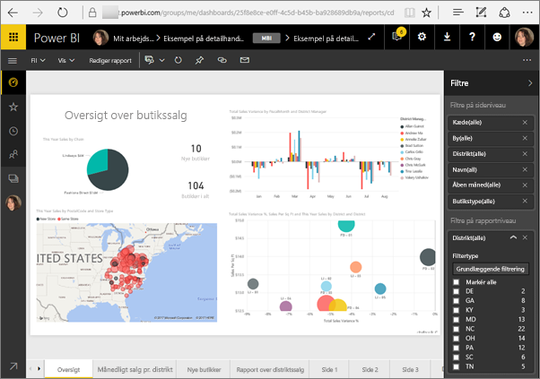
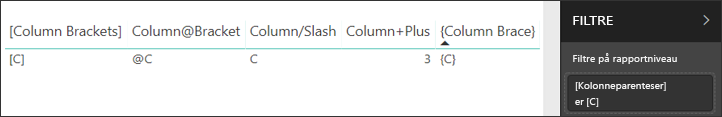

# <a name="filter-a-report-using-query-string-parameters-in-the-url"></a>Filtrer en rapport ved hjælp af parametre for forespørgselsstrengen i URL-adressen

Når du åbner en rapport i Power BI-tjenesten, har hver side i rapporten sin egen entydige URL-adresse. Hvis du vil filtrere denne rapportside, kan du bruge ruden Filtre på rapportcanvasset.  Eller du kan føje forespørgselsstrengparametre til URL-adressen for at filtrere rapporten. Du har måske en rapport, du vil vise til kollegaer, og du vil filtrere den på forhånd for dem. Det kan du f.eks. gøre ved at starte med URL-standardadressen til rapporten, føje filterparametrene til URL-adressen og derefter sende dem hele den nye URL-adresse via mail.



## <a name="uses-for-query-string-parameters"></a>Anvendelsesområder for forespørgselsstrengparametre

Du kan f.eks. bruge parametre i forespørgselsstrengen, hvis du arbejder i Power BI Desktop og vil oprette en rapport, der indeholder links til andre Power BI-rapporter, men kun vil vise nogle af oplysningerne i de andre rapporter. Start med at filtrere rapporterne ved hjælp af forespørgselsstrengparametre, og gem URL-adresserne. Derefter skal du oprette en tabel i Desktop med de nye URL-adresser til rapporterne.  Derefter skal du publicere og dele rapporten.

Et andet anvendelsesområde for forespørgselsstrengparametre er ved oprettelse af en avanceret Power BI-løsning.  Ved hjælp af DAX kan der oprettes en rapport, der dynamisk genererer en URL-adresse til en filtreret rapport baseret på de valg, som kunden udfører i den aktuelle rapport. Når kunderne vælger URL-adressen, får de kun vist de relevante oplysninger. 

## <a name="query-string-parameter-syntax-for-filtering"></a>Syntaks til parametre for forespørgselsstreng til filtrering

Med parametre kan du filtrere rapporten efter en eller flere værdier. Værdierne kan indeholde mellemrum eller specialtegn. Den grundlæggende syntaks er forholdsvis enkel. Start med URL-adressen til rapporten, tilføj et spørgsmålstegn, og tilføj derefter din filtersyntaks.

URL?filter=***Tabel***/***Felt*** eq '***værdi***'


* I navnene for **Tabel** og **Felt** skelnes der mellem store og små bogstaver, men ikke i **værdi**.
* Felter, der er skjult i rapportvisningen, kan stadig filtreres.

### <a name="field-types"></a>Felttyper

Felttypen kan være et tal, dato og klokkeslæt eller streng, og typen skal stemme overens med den type, der er angivet i datasættet.  Du kan f.eks. ikke angive en tabelkolonne af typen "streng", hvis du skal finde dato og klokkeslæt eller en numerisk værdi i et datasæt, der er indstillet som en dato (f.eks. tabel/strengkolonne er 1).

* **Strenge** skal omgives af enkelte anførselstegn: 'leders navn'.
* **Tal** kræver ingen særlig formatering
* **Datoer og klokkeslæt** skal være omsluttet med enkelt anførselstegn og have ordet **DateTime** foranstillet.

Hvis det stadig er forvirrende, kan du fortsætte med at læse og vi undersøger det nærmere.  

## <a name="filter-on-a-field"></a>Filtrer på et felt

Lad os antage, at URL-adressen til rapporten er følgende.


Og vi kan se i vores kortvisualisering (ovenfor), at vi har butikker i North Carolina.

>[!NOTE]
>Dette eksempel er baseret på [eksemplet på detailhandelsanalyse](sample-datasets.md).
> 

Hvis du vil filtrere rapporten, så der kun vises data for butikker i "NC" (North Carolina), skal du tilføje følgende i URL-adressen:

?filter=Store/Territory eq 'NC'


>[!NOTE]
>*NC* er en værdi, som er lagret i feltet **Territory** i tabellen **Store**.
> 

Nu er rapporten filtreret for North Carolina, så alle visualiseringer på rapportsiden viser kun data for North Carolina.


## <a name="filter-on-multiple-fields"></a>Filtrer på flere felter

Du kan også filtrere på flere felter ved at føje yderligere parametre til din URL-adresse. Lad os gå tilbage til vores oprindelige filterparameter.

```
?filter=Store/Territory eq 'NC'
```

Hvis du vil filtrere på flere felter, skal du tilføje et **and** og et andet felt i samme format som ovenfor. Her er et eksempel.

```
?filter=Store/Territory eq 'NC' and Store/Chain eq 'Fashions Direct'
```

<iframe width="640" height="360" src="https://www.youtube.com/embed/0sDGKxOaC8w?showinfo=0" frameborder="0" allowfullscreen></iframe>

## <a name="operators"></a>Operatorer

Power BI understøtter mange operatorer ud over **og**. I nedenstående tabel vises disse operatorer sammen med den indholdstype, de understøtter.

|operator  | definition | streng  | tal | Dato |  Eksempel|
|---------|---------|---------|---------|---------|---------|
|**and**     | og |  ja      | ja |  ja|  produkt/pris le 200 and pris gt 3,5 |
|**eq**     | lig med |  ja      | ja   |  ja       | Adresse/By eq 'Redmond' |
|**ne**     | ikke lig med |   ja      | ja  | ja        |  Adresse/By ne 'London' |
|**ge**     |  større end eller lig med       | nej | ja |ja |  produkt/pris ge 10
|**gt**     | større end        |nej | ja | ja  | produkt/pris gt 20
|**le**     |   mindre end eller lig med      | nej | ja | ja  | produkt/pris le 100
|**lt**     |  mindre end       | nej | ja | ja |  produkt/pris lt 20
|**in****     |  inklusive       | ja | ja |  ja | Studerende/alder in (27, 29)


\** Når du bruger **in**, kan værdierne til højre for **in** være en kommasepareret liste angivet i parenteser, eller det kan være et udtryk, der returnerer en samling.

### <a name="numeric-data-types"></a>Numeriske datatyper

Et URL-filter i Power BI kan inkludere tal i følgende formater.

|Taltype  |Eksempel  |
|---------|---------|
|**integer**     |   5      |
|**long**     |   5L eller 5l      |
|**double**     |   5,5 eller 55e-1 eller 0,55e+1 eller 5D eller 5d eller 0,5e1D eller 0,5e1d eller 5,5D eller 5,5d eller 55e-1D eller 55e-1d     |
|**decimal**     |   5M eller 5m eller 5,5M eller 5,5m      |
|**float**     | 5F eller 5f eller 0,5e1F eller 0,5e-1d        |

### <a name="date-data-types"></a>Datodatatyper

Power BI understøtter både OData V3 og V4 for datatyperne **Date** og **DateTimeOffset**.  Datoer repræsenteres vha. EDM-formatet (2019-02-12T00:00:00). Det betyder, at når du angiver en dato som ÅÅÅÅ-MM-DD, vil Power BI fortolke den som ÅÅÅÅ-MM-DDT00:00:00.

Hvorfor er den forskel vigtig? Lad os sige, at du oprette en forespørgselsstrengparameter **Tabel/Dato gt 2018-08-03**.  Vil resultaterne omfatter 3. august 2018 eller starte 4. august 2018? Da Power BI oversætter din forespørgsel til **Tabel/Dato gt 2018-08-03T00:00:00**, inkluderer dine resultater alle de datoer, som ikke har et klokkeslæt, der kun består af nuller, da disse datoer vil være større end **2018-08-03T00:00:00**.

## <a name="special-characters-in-url-filters"></a>Specialtegn i URL-filtre

Specialtegn og mellemrum kræver yderligere formatering. Når din forespørgsel indeholder mellemrum, tankestreger eller andre ikke-ASCII-tegn, skal du foranstille en *escape-kode*, der starter med et understregningstegn og et X (**_x**) og derefter angive den 4-cifrede **Unicode** efterfulgt af endnu et understregningstegn. Hvis Unicode-værdien er på mindre end 4 tegn, skal du foranstille nuller. Her vises nogle eksempler.

|Identifikator  |Unicode-værdi  | Kode til Power BI  |
|---------|---------|---------|
|**Tabelnavn**     | Området er 0x20        |  Navn_x0020_på_x0020_tabel       |
|**Kolonne**@**tal**     |   @ er 0x40     |  Kolonne_x0040_tal       |
|**[Kolonne]**     |  [ er 0x0058 ] er 0x0050       |  _x0058_Kolonne_x0050       |
|**Kolonne+Plus**     | + er 0x2B        |  Kolonne_x002B_Plus       |

Navn_x0020_på_x0020_tabel/Kolonne_x002B_Plus eq 3 


Tabel_x0020_specialtegn/_x005B_Kolonne_x0020_Kantparenteser_x005D_ eq '[C]' 

### <a name="use-dax-to-filter-on-multiple-values"></a>Brug DAX til at filtrere efter flere værdier

En anden metode til at filtrere på flere felter er at oprette en beregnet kolonne, som sammenkæder to felter til en enkelt værdi. Derefter kan du filtrere på denne værdi.

Vi har f.eks. to felter: Territory og Chain. [Opret en ny beregnet kolonne](desktop-tutorial-create-calculated-columns.md) (felt) med navnet TerritoryChain i Power BI Desktop. Husk, at navnet på **Felt** ikke må indeholde mellemrum. Her er DAX-formlen for den pågældende kolonne.

TerritoryChain = [Territory] & " - " & [Chain]

Publicer rapporten på Power BI-tjenesten, og brug derefter URL-forespørgselsstrengen til at filtrere og kun vise data for Lindseys-butikker i NC.

    https://app.powerbi.com/groups/me/reports/8d6e300b-696f-498e-b611-41ae03366851/ReportSection3?filter=Store/TerritoryChain eq 'NC–Lindseys'

## <a name="pin-a-tile-from-a-filtered-report"></a>Fastgør et felt fra en filtreret rapport

Når du har filtreret rapporten ved hjælp af parametre for forespørgselsstrengen, kan du kan fastgøre visualiseringer fra denne rapport til dit dashboard.  Feltet på dashboardet viser de filtrerede data, og når dette dashboardfelt vælges, åbnes den rapport, der blev brugt til at oprette det.  Men filtreringen, du foretog ved hjælp af URL-adressen, gemmes ikke med rapporten, og når dashboardfeltet vælges, åbnes rapporten i ufiltreret tilstand.  Det betyder, at de data, der vises i dashboardfeltet, ikke svarer til de data, der vises i rapportvisualiseringen.

Dette er nyttigt, når du vil se forskellige resultater: filtreret på dashboardet og ufiltreret i rapporten.

## <a name="considerations-and-troubleshooting"></a>Overvejelser og fejlfinding

Der er et par ting, du skal være opmærksom på, når du bruger parametre for forespørgselsstrengen.

* Når du bruger operatoren *in*, skal værdierne til højre for *in* være en kommasepareret liste angivet i parenteser.    
* På Power BI-rapportserveren kan du [sende rapportparametre](https://docs.microsoft.com/sql/reporting-services/pass-a-report-parameter-within-a-url?view=sql-server-2017.md) ved at inkludere dem i en URL-adresse til rapporten. Disse parametre i URL-adressen har ikke noget præfiks, da de sendes direkte til det program, der behandler rapporten.
* Filtrering af forespørgselsstrengen kan ikke bruges sammen med [Publicer på internettet](service-publish-to-web.md).
* [Integrer med rapportwebdelen i SharePoint Online](service-embed-report-spo.md) understøtter ikke URL-filtre.
* Datatypen long er (2^53-1) på grund af begrænsninger i Javascript.
* URL-adresse-filtre for rapporter har en grænse på 10-udtryk (10 filtre, der er forbundet med OG).

## <a name="next-steps"></a>Næste trin

[Fastgør en visualisering til et dashboard](service-dashboard-pin-tile-from-report.md)  
[Tilmeld dig en gratis prøveversion](https://powerbi.microsoft.com/get-started/)

Har du flere spørgsmål? [Prøv at spørge Power BI-community'et](http://community.powerbi.com/)
