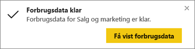
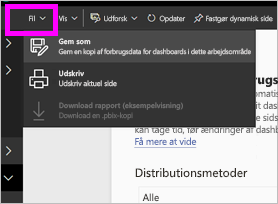
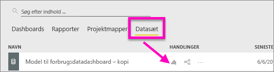
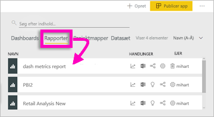
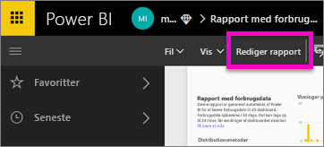
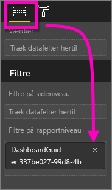
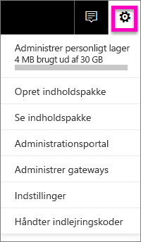
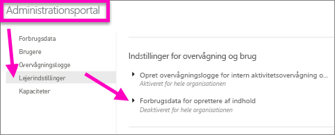

# Forbrugsdata for dashboards og rapporter
Hvis du opretter dashboards og rapporter, kan forbrugsdata hjælpe dig med at forestå deres indvirkning. Når du kører enten forbrugsdata for dashboards eller rapporter, opdager du, hvordan disse dashboards og rapporter anvendes i hele organisationen: Hvad bruges, af hvem og til hvilke formål.  

> [!NOTE]
> Forbrugsdata vil spore brugen af rapporter, som er integreret i SharePoint Online. De vil også spore integreringen af dashboards og rapporter via både flowet "bruger ejer legitimationsoplysninger" og "app ejer legitimationsoplysninger". Forbrugsdata sporer ikke brugen af rapporter, der er integreret via [publicer på internettet](service-publish-to-web.md).

Disse rapporter med forbrugsdata er skrivebeskyttet. Men du kan tilpasse en rapport med forbrugsdata ved hjælp af "Gem som". Det opretter et helt nyt datasæt og konverterer den skrivebeskyttede rapport til en Power BI-rapport med alle funktioner, som du kan redigere. Den tilpassede rapport indeholder ikke blot data for det valgte dashboard eller den valgte rapport, men ved at fjerne standardfilteret har du nu adgang til forbrugsdata for alle dashboards eller alle rapporter i det valgte arbejdsområde.

## Hvorfor er forbrugsdata vigtige for mig?
At vide, hvordan dit indhold bruges, hjælper dig med at demonstrere din indvirkning og prioritere din indsats. Dine forbrugsdata kan vise, at en af dine rapporter bruges dagligt af en meget stor del af organisationen, og de kan vise, at et dashboard, du oprettede, slet ikke bruges. Denne type feedback er uvurderlig til styring af din arbejdsindsats.

Du kan kun køre rapporter med forbrugsdata i Power BI-tjenesten.  Men hvis du gemmer en rapport med forbrugsdata eller fastgør den til et dashboard, vil du kunne åbne og interagere med denne rapport på mobile enheder.

### Forudsætninger
- Forbrugsdatafunktionen henter forbrugsoplysninger fra alle brugere, både af den gratis version og Pro. Der kræves dog en Pro-licens for at køre og få adgang til forbrugsdata.
- Forbrugsdata er angivet på dashboards eller i rapporter i det valgte arbejdsområde. Hvis du vil have adgang til forbrugsdata for et bestemt dashboard eller en rapport, skal du:    
    • have redigeringsadgang til dashboardet eller rapporten   
    • have en Pro-licens

## Om rapporten med forbrugsdata

Når du vælger **Forbrugsdata** eller ikonet , opretter Power BI en rapport, der allerede indeholder forbrugsdata for dette indhold for de seneste 90 dage.  Rapporten ligner de Power BI-rapporter, du allerede kender, men den er designet til at være informativ – ikke interaktiv. Du vil kunne oprette udsnit baseret på, hvordan dine slutbrugere modtog adgang, om de fik adgang via internettet eller mobilapp osv. I takt med at dine dashboards og rapporter udvikler sig, gælder det også rapporten med forbrugsdata, som opdateres hver dag med nye data.  

Rapporter med forbrugsdata vises ikke i **Seneste**, **Arbejdsområder**, **Favoritter** eller andre indholdslister. De kan ikke føjes til en app. Hvis du fastgør et felt fra en rapport med forbrugsdata til et dashboard, kan dette dashboard ikke føjes til en app eller indholdspakke.

Hvis du vil grave ned i rapportdataene eller oprette dine egne rapporter i forhold til datasættet, kan du bruge **Gem som** (se [Gem rapporten med forbrugsdata som en Power BI-rapport med alle funktioner](#Save-the-Usage-Metrics-report-as-a-full-featured-Power-BI-report-(personalize)).

## Åbn en rapport med forbrugsdata for et dashboard eller en rapport
1. Start i arbejdsområdet, der indeholder dashboardet eller rapporten.
2. Vælg ikonet for **Forbrugsdata**  på indholdslisten til arbejdsområdet eller fra selve dashboardet eller rapporten.
   
    
   
    
3. Den første gang, du gør dette, opretter Power BI rapporten med forbrugsdata og giver dig besked, når den er klar.
   
        
4. Vælg **Få vist forbrugsdata** for at åbne resultaterne.
   
    Forbrugsdata vil være en stærk partner, når du arbejder på at udrulle og vedligeholde Power BI-dashboards og -rapporter. Har du overvejet, hvilke sider af din rapport der er mest nyttige, og hvilke du bør udfase? Opret udsnit efter **Rapportside** for at finde ud af det. Har du overvejet, om du skal oprette et mobilt layout til dashboardet? Opret udsnit efter **Platforme** for at finde ud af, hvor mange brugere der tilgår dit indhold via mobilapps vs. via en webbrowser.

5. Du kan også holde markøren over en visualisering og vælge ikonet med tegnestiften for at føje visualiseringen til et dashboard. Eller du kan vælge **Fastgør en dynamisk side** øverst på menulinjen for at føje hele siden til et dashboard. Fra dashboardet kan du lettere overvåge forbrugsdata eller dele dem med andre.
   
   > **BEMÆRK**! Hvis du fastgør et felt fra en rapport med forbrugsdata til et dashboard, kan dette dashboard ikke føjes til en app eller indholdspakke.
   > 
   > 

  

## Hvilke data rapporteres der?
| Data | Dashboard | Rapport | Beskrivelse |
| --- | --- | --- | --- |
| Udsnit for distributionsmetode |ja |ja |Hvordan brugerne fik adgang til indholdet. Der er 3 mulige metoder: Brugere kan få adgang til dashboardet eller rapporten ved at være medlem af et [apparbejdsområde](service-the-new-power-bi-experience.md), ved at få indholdet [delt med dem](service-share-dashboards.md) eller ved at installere en indholdspakke/app.  Bemærk, at visninger via en app tælles som "indholdspakke". |
| Platformsudsnit |ja |ja |Blev dashboardet eller rapporten tilgået via Power BI-tjenesten (powerbi.com) eller en mobilenhed? Mobil omfatter alle vores iOS-, Android- og Windows-apps. |
| Udsnit for rapportside |nej |ja |Hvis rapporten indeholder mere end 1 side, skal du opdele rapporten efter de sider, der blev vist. Hvis du får vist en listeindstilling for "Tom", betyder det, at en rapportside blev tilføjet for nylig (inden for 24 timer vises det faktiske navn på den nye side på listen over udsnit), og/eller at rapportsider er blevet slettet. "Tom" henter disse typer situationer. |
| Visninger pr. dag |ja |ja |Det samlede antal visninger pr. dag – en visning er defineret som en bruger, der indlæser en rapportside eller et dashboard. |
| Entydige seere pr. dag |ja |ja |Antallet af *forskellige* brugere, som så dashboardet eller rapporten (baseret på AAD-brugerkontoen). |
| Visninger pr. bruger |ja |ja |Antallet af visninger i de seneste 90 dage opdelt efter individuelle brugere. |
| Delinger pr. dag |ja |nej |Antallet af gange, dashboardet blev delt med en anden bruger eller gruppe. |
| Samlet antal visninger |ja |ja |Antallet af visninger i løbet af de sidste 90 dage. |
| Samlet antal seere |ja |ja |Antallet af entydige seere i løbet af de sidste 90 dage. |
| Samlet antal delinger |ja |nej |Antallet af gange, dashboardet eller rapporten blev delt i løbet af de sidste 90 dage. |
| Samlet antal i organisation |ja |ja |Antallet af alle dashboards og rapporter i hele organisationen, som havde mindst én visning i løbet af de sidste 90 dage.  Bruges til at beregne rangering. |
| Rangering: Samlet antal visninger |ja |ja |Hvor rangeres dette dashboard eller denne rapport for samlet antal visninger af alle dashboards eller rapporter i organisationen i løbet af de seneste 90 dage. |
| Rangering: Samlet antal delinger |ja |nej |Hvor rangeres dette dashboard eller denne rapport for samlet antal delinger af alle dashboards i organisationen i løbet af de seneste 90 dage. |

### Rapporten Dashboard Usage Metrics

### Rapporten Dashboard Usage Metrics

## Gem rapporten med forbrugsdata som en Power BI-rapport med alle funktioner (tilpasset)

Brug **Gem som** til at konvertere rapporten med forbrugsdata til en Power BI-rapport med alle funktioner, der kan tilpasses og deles. Når du har oprettet en personlig kopi, får du fuld adgang til det underliggende datasæt, så du kan tilpasse rapporten med forbrugsdata til dine behov. Du kan endda bruge Power BI Desktop til at oprette brugerdefinerede rapporter med forbrugsdata ved hjælp af [funktionen til direkte forbindelse til Power BI-tjenesten](https://powerbi.microsoft.com/blog/connecting-to-datasets-in-the-power-bi-service-from-desktop).

Men endnu bedre, så indeholder det underliggende datasæt forbrugsoplysninger for alle dashboards og rapporter i arbejdsområdet. Dette åbner op for en ny verden af muligheder. Du kan f.eks. oprette en rapport, der sammenligner alle dashboards i arbejdsområdet baseret på forbrug. Eller du kan oprette et dashboard med forbrugsdata til din Power BI-app ved at sammenlægge forbrug på tværs af alt det indhold, der er distribueret i denne app.  Se [fjern sideniveaufilteret](#remove-the-filter-to-see-all-the-usage-metrics-data-in-the-workspace) nedenfor.

### Hvad oprettes der, når "Gem som" bruges?
Når Power BI opretter den komplette rapport, oprettes der også et nyt datasæt, som **består af alle de dashboards eller alle de rapporter i det aktuelle arbejdsområde**, der har været tilgået i de sidste 90 dage. Antag, at du f.eks. har et arbejdsområde med navnet "Salg", og det indeholder tre dashboards og to rapporter, og du opretter en rapport med forbrugsdata på dashboardet "Nordøst". Og du derefter bruger **Gem som** for at tilpasse og konvertere det til en komplet rapport. Datasættet til den nye rapport indeholder forbrugsdataene *ikke kun til dette ene dashboard med navnet "Nordøst"*, men til alle tre dashboards i arbejdsområdet "Salg". Som standard indeholder rapporten data for dashboardet "Nordøst", og du skal [fjerne et filter](#remove-the-filter-to-see-all-the-usage-metrics-data-in-the-workspace) (enkelt klik) for at få vist data om alle tre dashboards.

### Opret en kopi af forbrugsrapporten ved hjælp af "Gem som"
Når du opretter en kopi ved hjælp af "Gem som" (tilpasset), konverterer Power BI den skrivebeskyttede og allerede oprettede rapport til en komplet rapport.  Umiddelbart ser den ud på præcis samme måde. Men du kan nu åbne rapporten i redigeringsvisning, tilføje nye visualiseringer, filtre og sider, redigere eller slette eksisterende visualiseringer og meget mere. Power BI gemmer den helt nye rapport og datasættet i det aktuelle arbejdsområde. I eksemplet nedenfor er det aktuelle arbejdsområde **mihart**.

1. Vælg **Filer > Gem som** fra den allerede opbyggede rapport med forbrugsdata. Power BI konverterer rapporten med forbrugsdata til en Power BI-rapport med alle funktioner. Det kaldes en *tilpasset* rapport med forbrugsdata. Den tilpassede anvendelsesrapport og datasættet gemmes i det aktuelle arbejdsområde, der er navngivet **mihart*.
   
    
2. Åbn rapporten i redigeringsvisning, og [arbejd med den som med enhver anden Power BI-rapport](service-interact-with-a-report-in-editing-view.md). Du kan for eksempel tilføje nye sider og oprette nye visualiseringer, tilføje filtre, formatere skrifttyper og farver osv.
   
    
3. Alternativt kan du starte med det nye datasæt og oprette en rapport fra bunden.
   
    
4. Den nye rapport gemmes i det aktuelle arbejdsområde (mihart) og føjes også til indholdslisten **Seneste**.
   
    

### Fjern filteret for at få vist ***alle*** forbrugsdataene i arbejdsområdet
Du skal fjerne et filter for at se dataene for alle dashboards eller for alle rapporter i arbejdsområdet. Som standard filtreres den tilpassede rapport for at få vist data for kun det dashboard eller den rapport, der blev brugt til at oprette dem.

Hvis du f.eks. har brugt dashboardet med navnet "Europæisk salg" til at oprette denne nye tilpassede rapport, vises kun forbrugsdata fra dashboardet "Europæisk salg". Sådan fjerner du filteret og aktiverer data fra alle dashboards i dette arbejdsområde:

1. Åbn den tilpassede rapport i redigeringsvisning.
   
    
2. Find bucket'en **Filtre på rapporteringsniveau** i ruden Filtre, og fjern filteret ved at vælge "x".
   
    
   
    Nu viser din tilpassede rapport data for hele arbejdsområdet.

## Kontrolelementer til forbrugsdata – til administratorer af Power BI
Rapporter med forbrugsdata er en funktion, som Power BI- eller Office 365-administratoren kan slå til eller fra. Administratorer har detaljeret kontrol over, hvilke brugere der har adgang til forbrugsdata. De er slået til som standard for alle brugere i organisationen.

1. Åbn administrationsportalen ved at vælge tandhjulsikonet øverst til højre i Power BI-tjenesten, og vælg **Administrationsportal**.
   
    
2. Vælg **Lejerindstillinger** på administrationsportalen, og vælg **Forbrugsdata for oprettere af indhold**.
   
    
3. Aktivér (eller deaktiver) forbrugsdata, og vælg **Anvend**.
   
    

Når administratorer deaktiverer forbrugsdata for hele organisationen, kan de bruge indstillingen til **sletning af alt eksisterende indhold i forbrugsdata** for at slette alle eksisterende rapporter og dashboardfelter, der blev oprettet ved hjælp af rapporter og datasæt med forbrugsdata. Denne indstilling fjerner al adgang til forbrugsdata for alle brugere i organisationen, som muligvis allerede anvender dem. Vær forsigtig, fordi sletning af eksisterende indhold i forbrugsdata ikke kan fortrydes.

## Overvejelser og begrænsninger
Spørgsmål: Jeg kan ikke køre forbrugsdata på et dashboard eller en rapport    
Svar: Du kan kun se forbrugsdata for indhold, som du ejer eller har tilladelser til at redigere.

Spørgsmål: Kan forbrugsdata hente visninger fra integrerede dashboards og rapporter?     
Svar: Forbrugsdata understøtter i øjeblikket ikke hentning af forbrug for integrerede dashboards og rapporter, herunder [brugerens eget dataflow](developer/integrate-report.md), [appejerens dataflow](developer/embed-sample-for-customers.md) og flowet [Publicer på internettet](service-publish-to-web.md). I de tilfælde anbefales det at bruge eksisterende webanalyseplatforme til at spore brugen for hostingappen eller -portalen.

Spørgsmål: Jeg kan slet ikke køre forbrugsdata på noget indhold.    
Svar 1: Administratorer kan deaktivere denne funktion for deres organisation.  Kontakt administratoren for at se, om det er tilfældet.    
Svar 2: Forbrugsdata er en Power BI Pro-funktion.

Spørgsmål: Dataene ser ikke ud til at være opdateret. For eksempel vises distributionsmetoder ikke, rapportsider mangler osv.   
Svar: Det kan tage op til 24 timer, før dataene er opdateret.

Spørgsmål: Der er fire rapporter i arbejdsområdet, men rapporten med forbrugsdata viser kun 3.    
Svar: Rapporten med forbrugsdata indeholder kun rapporter (eller dashboards), der har været åbnet i løbet af de sidste 90 dage.  Hvis en rapport (eller et dashboard) ikke vises, har den sandsynligvis ikke været brugt i mere end 90 dage.

## Næste trin
[Gør et dashboard til favorit](service-dashboard-favorite.md)

Har du flere spørgsmål? [Prøv at spørge Power BI-community'et](http://community.powerbi.com/)

