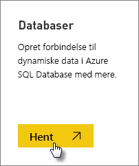
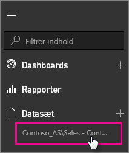

# Dynamiske SQL Server Analysis Services-data i Power BI
I Power BI er der to måder du kan oprette forbindelse til en live SQL Server Analysis Services-server på. I **Hent data** kan du oprette forbindelse til en SQL Server Analysis Services-server, eller du kan oprette forbindelse til en [Power BI Desktop-fil](service-desktop-files.md) eller [Excel-projektmappe](service-excel-workbook-files.md), der allerede har forbindelse til en Analysis Services-server.

 >[!IMPORTANT]
 >* For at oprette forbindelse til en live Analysis Services-server skal en lokal datagateway være installeret og konfigureret af administratoren. Du kan finde flere oplysninger i [Datagateway i det lokale miljø](service-gateway-onprem.md).
 >* Når du bruger gatewayen, forbliver dine data i det lokale miljø.  De rapporter, du opretter baseret på disse data, gemmes i Power BI-tjenesten. 
 >* [Forespørsel i Spørgsmål og svar på naturligt sprog](service-q-and-a-direct-query.md) er i forhåndsvisning for live Analysis Services-forbindelser.

## Sådan opretter du forbindelse til en model fra Hent data
1. Vælg **Hent data** i **Mit arbejdsområde**. Du kan også skifte til et gruppearbejdsområde, hvis der findes et.
   
   
2. Vælg **Databaser og mere**.
   
   
3. Vælg **SQL Server Analysis Services** > **Opret forbindelse**. 
   
   
4. Vælg en server. Hvis du ikke kan se nogen servere angivet her, betyder det enten, at en gateway og datakilde ikke er konfigureret, eller din konto ikke er angivet under fanen **Brugere** i datakilden, i gatewayen. Kontakt din administrator.
5. Vælg den model, du vil oprette forbindelse til. Det kan være enten tabelformat eller flerdimensionel.

Når du har oprettet forbindelse til modellen, vises den på dit Power BI-websted i **Mit arbejdsområde/Datasæt**. Hvis du har skiftet til et gruppearbejdsområde, vises datasættet i gruppen.

## Dashboardfelter
Hvis du fastgør visuelle elementer fra en rapport til dashboardet, opdateres de fastgjorte felter automatisk hvert 10. minut. Hvis dataene på din lokale Analysis Services-server opdateres, bliver felterne automatisk opdateret efter 10 minutter.

## Næste trin
[Datagateway i det lokale miljø](service-gateway-onprem.md)  
[Administrer Analysis Services-datakilder](service-gateway-enterprise-manage-ssas.md)  
[Fejlfinding af datagateway i det lokale miljø](service-gateway-onprem-tshoot.md)  
Har du flere spørgsmål? [Prøv at spørge Power BI-community'et](http://community.powerbi.com/)

