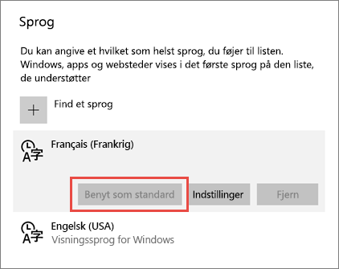

# Understøttede sprog og lande/områder til Power BI

Denne artikel indeholder en liste over understøttede sprog og lande/områder til Power BI-tjenesten, Power BI Desktop og Power BI-dokumentationen.

## Lande og områder, hvor Power BI er tilgængelig
Se [listen over international tilgængelighed](https://products.office.com/business/international-availability) for at få vist en liste over lande og områder, hvor Power BI er tilgængelig. 

## Sprog til Power BI-tjenesten
Power BI-tjenesten (i browseren) er tilgængelig på følgende 44 sprog:

* Arabisk
* Baskisk – Basque
* Bulgarsk - Български
* Catalansk – català
* Kinesisk (forenklet) – 中文(简体)
* Kinesisk (traditionelt) – 中文(繁體)
* Kroatisk – hrvatski
* Tjekkisk – čeština
* Dansk – dansk
* Nederlandsk – Nederlands
* Engelsk – English
* Estisk – eesti
* Finsk – suomi
* Fransk – français
* Galicisk – galego
* Tysk – Deutsch
* Græsk – Ελληνικά
* Hebraisk
* Hindi – हिंदी
* Ungarsk – magyar
* Indonesisk – Bahasa Indonesia
* Italiensk – italiano
* Japansk – 日本語
* Kasakhisk – Қазақ
* Koreansk – 한국어
* Lettisk – latviešu
* Litauisk – lietuvių
* Malaysisk – Bahasa Melayu
* Norsk (bokmål) – norsk (bokmål)
* Polsk – Polski
* Portugisisk (Brasilien) – Português
* Portugisisk (Portugal) – português
* Rumænsk – română
* Russisk – Русский
* Serbisk (kyrillisk) – српски
* Serbisk (latin) – srpski
* Slovakisk – slovenčina
* Slovensk – slovenski
* Spansk – español
* Svensk – svenska
* Thai – ไทย
* Tyrkisk – Türkçe
* Ukrainsk – українська
* Vietnamesisk – Tiếng Việt

### Hvad er oversat
Menuer, knapper, meddelelser og andre elementer i oplevelsen oversættes til dit sprog og gør det lettere at navigere i og interagere med Power BI.

I øjeblikket er nogle få funktioner kun tilgængelige på engelsk:

* Dashboards og rapporter, som Power BI opretter for dig, når du opretter forbindelse til tjenester som f.eks. Microsoft Dynamics CRM, Google Analytics, Salesforce osv. (Du kan stadig oprette dine egen dashboards og rapporter på dit eget sprog).
* Udforsk dine data med spørgsmål og svar.

Hold dig informeret, mens vi arbejder på at gøre yderligere funktioner tilgængelige på sprog. 

### Vælg dit sprog i Power BI-tjenesten
1. Vælg ikonet **Indstillinger**  > **Indstillinger** i Power BI-tjenesten.
2. På fanen **Generelt** > **Sprog**.
3. Vælg dit sprog > **Anvend**.

### Vælg dit sprog i browseren
Power BI registrerer dit sprog baseret på den sprogindstilling, der er angivet på din computer. Den måde, du har adgang til og ændrer disse indstillinger på, kan variere afhængigt af operativsystemet og browseren. Her får du oplysninger om, hvordan du får adgang til disse indstillinger fra Internet Explorer og Google Chrome.

#### Internet Explorer (version 11)
1. Klik på knappen **Funktioner** i øverste højre hjørne af browservinduet:
   
   
2. Klik på **Internetindstillinger**.
3. Klik på knappen **Sprog** i dialogboksen Internetindstillinger under Udseende på fanen Generelt.

#### Google Chrome (version 42)
1. Klik på menuknappen i øverste højre hjørne af browservinduet:
   
   
2. Klik på **Indstillinger**.
3. Klik på **Vis avancerede indstillinger**.
4. Klik på knappen **Indstillinger for sprog og input** under Sprog.
5. Klik på **Tilføj**, vælg et sprog, og klik på **OK**.
   
   
   
   Det nye sprog er i slutningen af listen. 
6. Træk det nye sprog til toppen af listen, og klik på **Vis Google Chrome på dette sprog**.
   
   
   
   Du skal muligvis lukke og genåbne browseren for at se ændringen.

## Vælg sprog eller landestandard for Power BI Desktop
Du kan få Power BI Desktop på to måder: Du kan downloade den, eller du kan installere den fra Windows Store.

* Når du [installerer Power BI Desktop fra Windows Store](#choose-a-language-for-power-bi-desktop-installed-from-the-windows-store), installerer den alle sprog og viser det sprog, der svarer til Windows-standardsproget.
* Når du [downloader Power BI Desktop](#choose-a-language-when-you-download-power-bi-desktop), vælger du sproget, når du downloader den. 
* Du kan også [vælge en landestandard, der skal bruges, når du importerer data](#choose-the-locale-to-be-used-when-importing-data-into-power-bi-desktop) til en bestemt rapport. 

### Vælg et sprog til Power BI Desktop installeret fra Windows Store
1. [Installer Power BI Desktop](http://aka.ms/pbidesktopstore) fra Windows Store.
2. Søg efter **Windows-indstillinger** på din computer for at ændre sproget. 
3. Vælg **Tid og sprog**.
   
     
4. Vælg **Område og sprog**, vælg et sprog, og vælg derefter **Benyt som standard**.
   
     
   
     Næste gang du starter Power BI Desktop, bruges det sprog, du har angivet som standard. 

### Vælg et sprog, når du downloader Power BI Desktop
Det sprog, du vælger til Power BI Desktop, påvirker visningsformatet for tal og datoer i rapporter. 

* Vælg et sprog, når du [downloader Power BI Desktop](https://powerbi.microsoft.com/desktop). 

Hvis du vil ændre sproget i Power BI Desktop, skal du gå tilbage til downloadsiden og downloade den på et andet sprog.

### Vælg landestandarden til import af data til Power BI Desktop
Uanset om du downloader Power BI Desktop eller installerer den fra Windows Store, kan du vælge en landestandard for en bestemt rapport, der skal være en anden end landestandarden i din version af Power BI Desktop. Det ændrer den måde, data fortolkes på, når de importeres fra datakilden, for eksempel om "3/4/2017" fortolkes som 3. april eller 4. marts. 

1. Gå til **Filer** > **Indstillinger** > **Indstillinger** i Power BI Desktop.
2. Vælg **Internationale indstillinger** under **Aktuel fil**.
3. Vælg en anden landestandard i feltet **Landestandarden for import**. 
   
   
4. Vælg **OK**.

### Vælg sproget for modellen i Power BI Desktop

Du kan ud over angivelse af sproget for Power BI Desktop-programmet også angive modelsproget. Modelsproget påvirker hovedsageligt to ting:

- Hvordan vi sammenligner og sorterer strenge. Eftersom tyrkisk indeholder to i'er, kan de to ende i forskellige rækkefølger ved sortering, afhængigt af sorteringen i databasen. 
- Det sprog, der bruges i Power BI Desktop, ved oprettelse af skjulte datotabeller fra datofelter. Felter kaldes f.eks. Monat/Måned/Mois, osv.

> [!NOTE]
> Power BI-modellen bruger i øjeblikket en landestandard, hvor der ikke skelnes mellem store og små bogstaver (og som ikke er kana-følsom), så "ABC" og "abc" behandles på samme måde. Hvis "ABC" indlæses i databasen først, indlæses andre strenge, der kun afviger i forbindelse med brugen af store og små bogstaver, f.eks. "Abc", ikke som en separat værdi.
> 
>

Sådan angives modelsproget.

1. Gå til **Filer** > **Indstillinger** > **Indstillinger** i Power BI Desktop.
2. Under **Global** skal du vælge **Internationale indstillinger**.
3. Vælg et andet sprog i feltet **Modelsprog**. 

    

> [!NOTE]
> Når du har oprettet en Power BI-model, kan sproget i den ikke ændres.
> 
>

## Sprog til hjælpedokumentationen
Hjælp er lokaliseret på disse 10 sprog: 

* Kinesisk (forenklet) – 中文(简体)
* Kinesisk (traditionelt) – 中文(繁體)
* Fransk – français
* Tysk – Deutsch
* Italiensk – italiano
* Japansk – 日本語
* Koreansk – 한국어
* Portugisisk (Brasilien) – Português
* Russisk – Русский
* Spansk – español

## Næste trin
* Bruger du en af Power BI-mobilapperne? Se [Understøttede sprog i Power BI-mobilapperne](consumer/mobile/mobile-apps-supported-languages.md) for at få flere oplysninger.
* Har du spørgsmål? Prøv at spørge [Power BI-community'et](http://community.powerbi.com/).
* Har du stadig problemer? Besøg [supportsiden for Power BI](https://powerbi.microsoft.com/support/).

