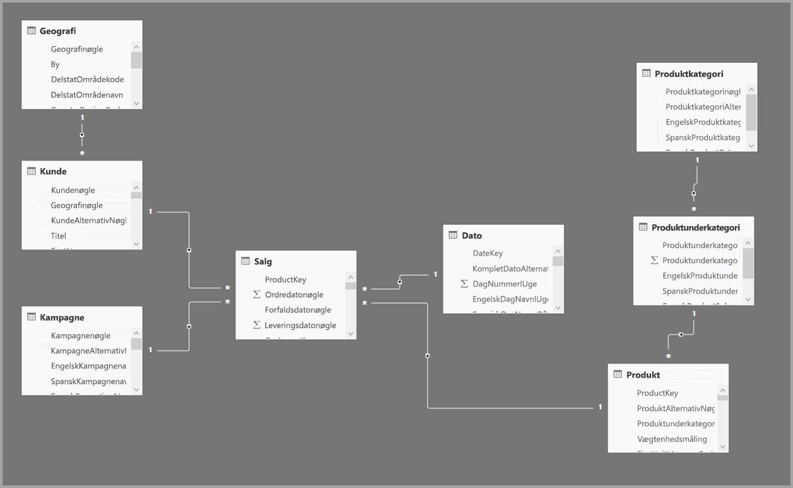
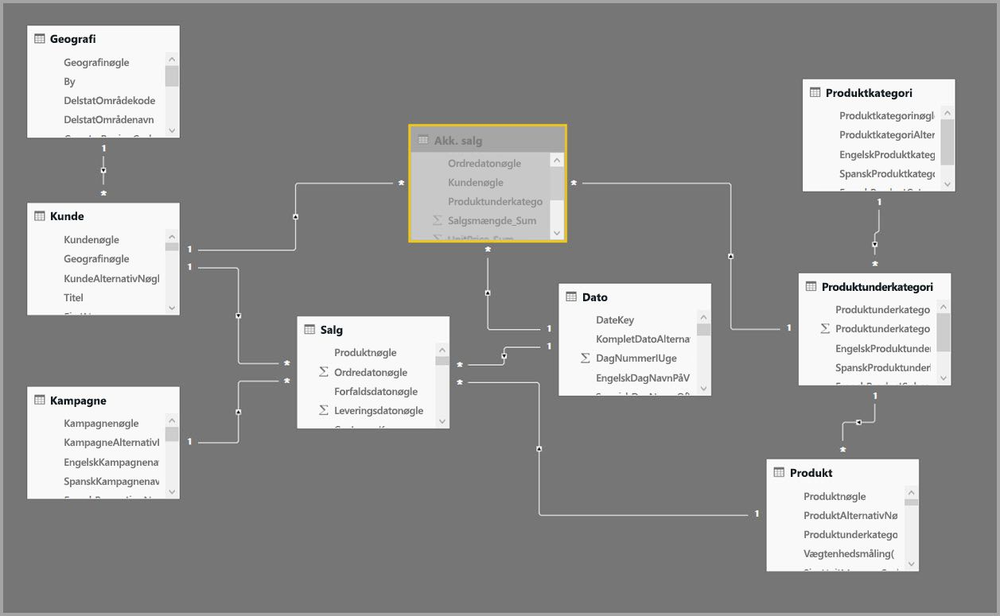
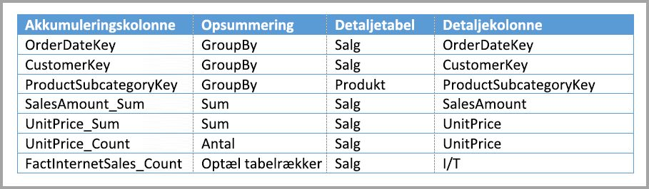
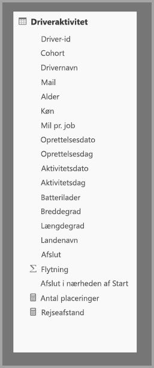
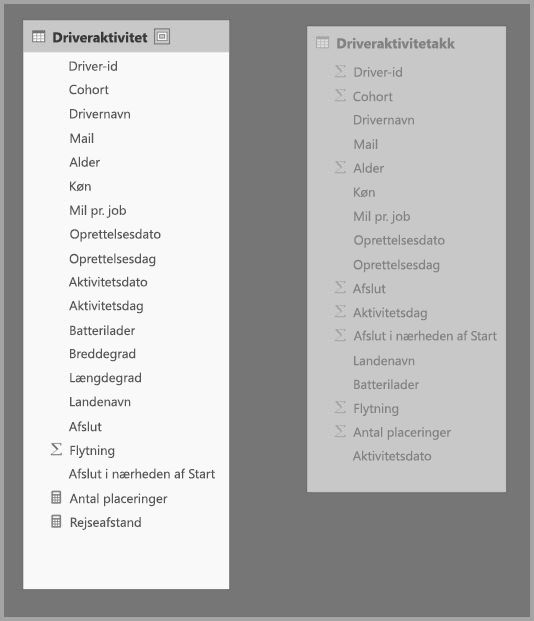
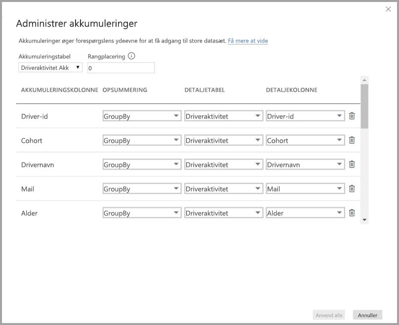
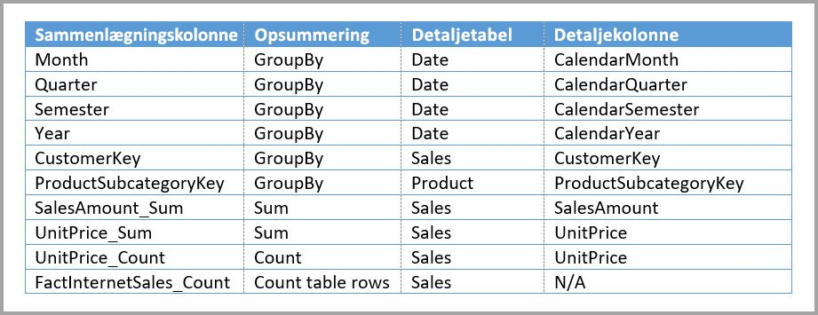
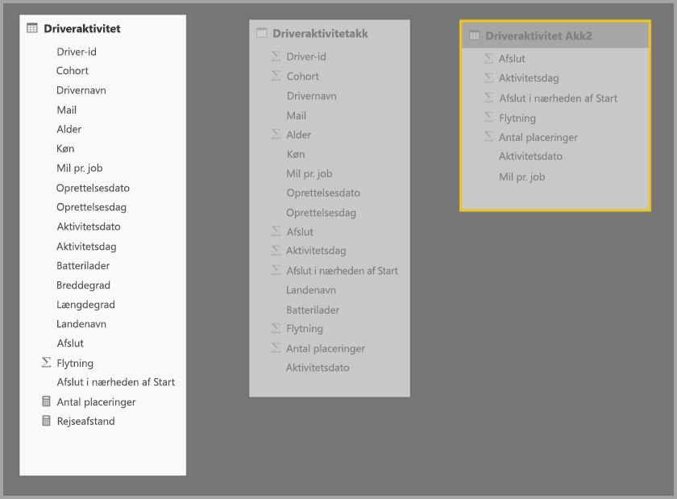
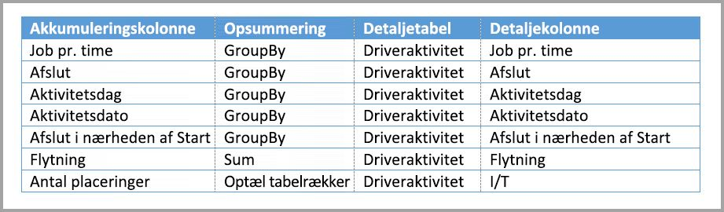
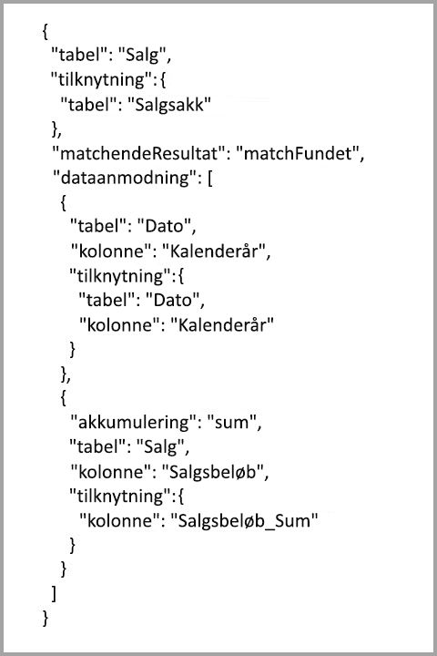

# Brug sammenlægninger i Power BI Desktop

Hvis du bruger *sammenlægninger* i Power BI, kan du reducere tabelstørrelser, så du kan fokusere på vigtige data og forbedre forespørgslens ydeevne. Med sammenlægninger kan du udføre interaktiv analyse af big data på en måde, der ellers ikke er mulig, og det kan medføre en drastisk reduktion af omkostningerne, idet der låses op for store datasæt, så du bedre kan træffe beslutninger.

Nogle af fordelene ved at bruge sammenlægninger omfatter:

- **Bedre ydeevne af forespørgsler i forhold til big data**. Alle interaktioner med Power BI-visualiseringer sender DAX-forespørgsler til datasættet. Cachelagrede sammenlagte data bruger en brøkdel af de ressourcer, der er nødvendige for detaljerede data, så du kan låse op for big data, der ellers ville være utilgængelige.
- **Optimeret dataopdatering**. Mindre cachestørrelser reducerer opdateringstider, så data hurtigere vises for brugerne.
- **Balanceret arkitektur**. Power BI-cachen i hukommelsen kan håndtere sammenlagte forespørgsler og derved begrænse forespørgsler, der sendes i DirectQuery-tilstand, og hjælpe dig med at overholde grænser for samtidighed. De resterende forespørgsler på detaljeniveau er ofte filtrerede forespørgsler på transaktionsniveau, som normalt håndteres godt af data warehouses og big data-systemer.

Dimensionelle datakilder, f.eks. data warehouses og datacentre, kan bruge [relationsbaserede sammenlægninger](#aggregation-based-on-relationships). Hadoop-baserede big data-kilder [baserer ofte sammenlægninger på GroupBy-kolonner](#aggregation-based-on-groupby-columns). I denne artikel beskrives de typiske modelleringsforskelle i Power BI for hver type datakilde.

## Opret en sammenlagt tabel

Sådan opretter du en sammenlagt tabel:
1. Opret en ny tabel med de ønskede felter afhængigt af datakilden og modellen. 
1. Definer sammenlægningerne i dialogboksen **Administrer sammenlægninger**.
1. Hvis det er relevant, skal du ændre [lagringstilstand](#storage-modes) for den sammenlagte tabel. 

### Administrer akkumuleringer

Når du har oprettet den nye tabel, der indeholder de ønskede felter, skal du gå til ruden **Felter** i en Power BI Desktop-visning, højreklikke på tabellen og vælge **Administrer sammenlægninger**.

I dialogboksen **Administrer sammenlægninger** vises der en række for hver kolonne i tabellen, hvor du kan angive funktionsmåden for sammenlægning. I det følgende eksempel omdirigeres forespørgsler til detaljetabellen **Sales** internt til sammenlægningstabellen **Sales Agg**. 

Rullelisten **Opsummering** i dialogboksen **Administrer sammenlægninger** indeholder følgende værdier:
- Antal
- GroupBy
- MAKS
- Min
- Sum
- Optæl tabelrækker

I dette relationsbaserede eksempel på sammenlægning er GroupBy-elementerne valgfrie. Med undtagelse af DISTINCTCOUNT påvirker de ikke funktionsmåden for sammenlægning, og de skal primært øge læsevenligheden. Uden GroupBy-posterne ville sammenlægninger stadig få forekomster på baggrund af relationerne. Dette afviger fra [eksemplet på big data](#aggregation-based-on-groupby-columns) senere i denne artikel, hvor GroupBy-posterne er påkrævet.

Når du har defineret de ønskede sammenlægninger, skal du vælge **Anvend alle**. 

### Valideringer

Dialogboksen **Administrer sammenlægninger** gennemtvinger følgende nævneværdige valideringer:

- **Detaljekolonnen** skal have samme datatype som **sammenlægningskolonnen** med undtagelse af **opsummering**sfunktionerne Optæl og Optæl tabelrækker. Optæl og Optæl tabelrækker er kun tilgængelige for kolonner til sammenlægning af heltal og kræver ikke en tilsvarende datatype.
- Sammenkædede sammenlægninger, der dækker tre eller flere tabeller, er ikke tilladt. Sammenlægninger i **Tabel A** kan f.eks. ikke referere til en **Tabel B**, som har sammenlægninger, der refererer til en **Tabel C**.
- Duplikerede sammenlægninger, hvor to poster bruger samme **opsummering**sfunktion og refererer til den samme **detaljetabel** og **detaljekolonne**, er ikke tilladt.
- **Detaljetabellen** skal bruge DirectQuery-lagringstilstanden, ikke Import.
- Gruppering efter en fremmed nøglekolonne, der bruges af en inaktiv relation, og som er afhængig af funktionen USERELATIONSHIP til sammenlægning af hits, understøttes ikke.

De fleste valideringer gennemtvinges ved at deaktivere værdier på rullelisten og vise forklarende tekst i værktøjstippet som vist på følgende billede.

### Sammenlægningstabeller er skjulte

Brugere med skrivebeskyttet adgang til datasættet kan ikke forespørge sammenlægningstabeller. Dette forhindrer sikkerhedsproblemer, når de bruges sammen med *sikkerhed på rækkeniveau (RLS)* . Brugere og forespørgsler refererer til detaljetabellen, ikke sammenlægningstabellen, og de behøver ikke at kende til sammenlægningstabellen.

Derfor er sammenlægningstabeller skjulte i visningen **Rapport**. Hvis tabellen ikke allerede er skjult, angiver dialogboksen **Administrer sammenlægninger** den som skjult, når du vælger **Anvend alle**.

### Lagringstilstande
Sammenlægningsfunktionen interagerer med lagringstilstande på tabelniveau. Power BI-tabeller kan bruge *DirectQuery*-, *Import*- eller *Dual*-lagringstilstande. DirectQuery sender en direkte forespørgsel til backend, mens Import cachelagrer data i hukommelsen og sender forespørgsler til de cachelagrede data. Alle Power BI Import- og DirectQuery-datakilder (ikke-flerdimensionelle) kan fungere sammen med sammenlægninger. 

Hvis du vil angive lagringstilstanden for en sammenlagt tabel, der skal importeres for at gøre forespørgsler hurtigere, skal du vælge den sammenlagte tabel i visningen **Model** i Power BI Desktop. I ruden **Egenskaber** skal du udvide **Avanceret**, rulle ned til **Lagringstilstand** og vælge **Importér**. Bemærk, at denne handling ikke kan fortrydes. 

Du kan finde flere oplysninger om tabellagringstilstande i [Administrer lagringstilstand i Power BI Desktop](desktop-storage-mode.md).

### RLS til sammenlægninger

For at fungere korrekt skal RLS-udtryk filtrere både sammenlægningstabellen og detaljetabellen. 

I følgende eksempel fungerer RLS-udtrykket for tabellen **Geography** for sammenlægninger, fordi Geography er på filtreringssiden af relationen for både tabellen **Sales** og tabellen **Sales Agg**. Sikkerhed på rækkeniveau er anvendt for forespørgsler, der når sammenlægningsstabellen, og dem, der ikke gør.

Et RLS-udtryk for tabellen **Product** filtrerer kun tabellen **Sales** og ikke den sammenlagte tabel **Sales Agg**. Da sammenlægningstabellen er en anden repræsentation af dataene i detaljetabellen, ville det være usikkert at svare på forespørgsler fra sammenlægningstabellen, hvis RLS-filteret ikke kan anvendes. Det anbefales ikke kun at filtrere detaljetabellen, da brugerforespørgsler fra denne rolle ikke er omfattet af sammenlægningsforekomster. 

Et RLS-udtryk, der kun filtrerer sammenlægningstabellen **Sales Agg** og ikke detaljetabellen **Sales**, er ikke tilladt.

For [sammenlægninger baseret på GroupBy-kolonner](#aggregation-based-on-groupby-columns) kan et RLS-udtryk, der anvendes på detaljetabellen, bruges til at filtrere sammenlægningstabellen, fordi alle GroupBy-kolonner i sammenlægningstabellen er dækket af detaljetabellen. På den anden side kan et RLS-filter i sammenlægningstabellen ikke anvendes på detaljetabellen, så det er ikke tilladt.

## Sammenlægning baseret på relationer

Dimensionelle modeller bruger typisk *sammenlægninger baseret på relationer*. Power BI-datasæt fra data warehouses og datacentre ligner star/snowflake-skemaer med relationer mellem dimensionstabeller og faktatabeller.

I følgende model fra en enkelt datakilde bruger tabellerne DirectQuery-lagringstilstanden. Faktatabellen **Sales** indeholder milliarder af rækker. Det ville kræve betydelig hukommelse og administration at indstille lagertilstanden i **Sales** til Import for cachelagring.

I stedet skal du oprette sammenlægningstabellen **Sales Agg**. I tabellen **Sales Agg** svarer antallet af rækker til summen af **SalesAmount** grupperet efter **CustomerKey**, **DateKey** og **ProductSubcategoryKey**. Tabellen **Sales Agg** har en højere kornethed end **Sales**, så i stedet for milliarder kan den indeholde millioner af rækker, hvilket er meget nemmere at administrere.

Hvis følgende dimensionstabeller er dem, der bruges mest til forespørgsler med høje forretningsværdier, kan de filtrere **Sales Agg** ved hjælp af *en til mange*- eller *mange til en*-relationer.

- Geografi
- Kunde
- Date (dato)
- Produktunderkategori
- Produktkategori

Denne model er vist på det følgende billede.

I følgende tabel vises sammenlægningerne for tabellen **Sales Agg**.

> [!NOTE]
> Tabellen **Sales Agg** er som andre tabeller fleksibel nok til at kunne blive indlæst på flere forskellige måder. Sammenlægning kan udføres i kildedatabasen ved hjælp af ETL/ELT-processer eller ved hjælp af [M-udtrykket](/powerquery-m/power-query-m-function-reference) for tabellen. Den sammenlagte tabel kan bruge lagringstilstanden Import med eller uden [trinvis opdatering i Power BI Premium](../admin/service-premium-incremental-refresh.md), eller den kan bruge DirectQuery og optimeres til hurtige forespørgsler ved hjælp af [columnstore-indekser](/sql/relational-databases/indexes/columnstore-indexes-overview). Denne fleksibilitet muliggør balancerede arkitekturer, der kan fordele mængden af forespørgsler for at undgå flaskehalse.

Hvis du ændrer lagringstilstanden for den sammenlagte tabel **Sales Agg** til **Import**, åbnes der en dialogboks, hvor de relaterede dimensionstabeller kan indstilles til lagringstilstanden *Dual*. 

Hvis du indstiller de relaterede dimensionstabeller til Dual, kan de fungere som enten Import eller DirectQuery, afhængigt af underforespørgslen. I eksemplet:

- Forespørgsler, der samler målepunkter fra tabellen **Sales Agg** i Import-tilstand og grupperer efter attribut/attributter fra de relaterede Dual-tabeller, kan returneres fra cachen i hukommelsen.
- Forespørgsler, der samler målepunkter fra DirectQuery-tabellen **Sales** og grupperer efter attribut/attributter fra de relaterede Dual-tabeller, kan returneres i DirectQuery-tilstand. Forespørgselslogikken, herunder GroupBy-handlingen, overføres til kildedatabasen.

Du kan finde flere oplysninger om Dual-lagringstilstanden i [Administrer lagringstilstand i Power BI Desktop](desktop-storage-mode.md).

### Stærke versus svage relationer

Sammenlægningsforekomster baseret på relationer kræver stærke relationer.

Stærke relationer omfatter følgende kombinationer af lagringstilstande, hvor begge tabeller er fra en enkelt kilde:

| Tabel på *mange*-siden | Tabel på *én*-siden |
| ------------- |----------------------| 
| Dual          | Dual                 | 
| Importér        | Import eller Dual       | 
| DirectQuery   | DirectQuery eller Dual  | 

Det eneste tilfælde, hvor en relation *på tværs af kilder* anses for at være stærk, er, hvis begge tabeller er angivet til Import. Mange til mange-relationer anses altid for at være svage.

Se *Sammenlægninger baseret på GroupBy-kolonner* for at få mere at vide om sammenlægningsforekomster [på tværs af kilder](#aggregation-based-on-groupby-columns), der ikke er afhængige af relationer. 

### Eksempler på relationsbaserede sammenlægningsforespørgsler

Følgende forespørgsel giver forekomster ved sammenlægningen, fordi kolonner i tabellen **Date** har den granularitet, der kan give forekomster. Kolonnen **SalesAmount** bruger sammenlægningen **Sum**.

Følgende forespørgsel giver ikke forekomster ved sammenlægningen. På trods af at den anmoder om summen af **SalesAmount**, foretager forespørgslen en GroupBy-handling på en kolonne i tabellen **Product**, som ikke har en kornethed, der kan give forekomster ved sammenlægningen. Hvis du overvåger relationerne i modellen, kan underkategorien for et produkt have flere rækker af typen **Produkt**. Forespørgslen kan ikke afgøre, hvilket produkt der skal sammenlægges med. I dette tilfælde vender forespørgslen tilbage til DirectQuery og sender en SQL-forespørgsel til datakilden.

Sammenlægninger er ikke kun til simple beregninger, der giver en ukompliceret sum. De kan også være en fordel for komplekse beregninger. En kompleks beregning opdeles i underforespørgsler for hver SUM, MIN, MAX og COUNT, og hver underforespørgsel evalueres for at bestemme, om sammenlægningen kan give forekomster. Denne logik gælder ikke i alle tilfælde på grund af optimeringen af forespørgselsplaner, men den bør være gældende generelt set. I følgende eksempel giver sammenlægningen forekomster:

Funktionen COUNTROWS kan drage fordel af sammenlægninger. Følgende forespørgsel giver forekomster ved sammenlægningen, fordi der er defineret en sammenlægning af **Count-tabelrækker** for tabellen **Sales**.

Funktionen AVERAGE kan drage fordel af sammenlægninger. Følgende forespørgsel giver forekomster ved sammenlægningen, fordi AVERAGE foldes internt til SUM divideret med COUNT. Da kolonnen **UnitPrice** indeholder sammenlægninger, der er defineret for både SUM og COUNT, giver sammenlægningen forekomster.

I visse tilfælde kan funktionen DISTINCTCOUNT drage fordel af sammenlægninger. Følgende forespørgsel giver sammenlægningen forekomster, fordi der er en GroupBy-post for **CustomerKey**, som bevarer særpræget for **CustomerKey** i sammenlægningstabellen. Denne metode kan stadig være underlagt ydelsesgrænsen, hvor mere end to til fem millioner forskellige værdier kan påvirke resultaterne af forespørgslen. Den kan dog være nyttig i situationer, hvor der er milliarder af rækker i detaljetabellen men to til fem millioner forskellige værdier i kolonnen. I dette tilfælde er det hurtigere at anvende DISTINCTCOUNT end at scanne tabellen med milliarder af rækker, selvom den er cachelagret i hukommelsen.

DAX-funktioner til time-intelligence er sammenlægningsfølsomme. Følgende forespørgsel finder sammenlægningen, fordi funktionen DATESYTD genererer en tabel med **CalendarDay**-værdier, og sammenlægningstabellen har en granularitet, der er dækket for gruppér efter-kolonner i tabellen **Dato**. Dette er et eksempel på et tabelspecifikt filter til funktionen CALCULATE, som kan bruges sammen med sammenlægninger.

## Sammenlægning baseret på GroupBy-kolonner 

Hadoop-baserede big data-modeller har andre egenskaber end dimensionelle modeller. For at undgå joinforbindelser mellem store tabeller anvender big data-modeller ofte ikke relationer, men denormalisering af dimensionsattributter på faktatabeller. Du kan låse op for sådanne big data-modeller til interaktiv analyse ved hjælp af *sammenlægninger baseret på GroupBy-kolonner*.

Følgende tabel indeholder den numeriske kolonne **Movement**, der skal sammenlægges. Alle de andre kolonner er attributter, der skal grupperes efter. Tabellen indeholder IoT-data og et enormt antal rækker. Lagringstilstanden er DirectQuery. Forespørgsler på datakilden, der er samlet på tværs af hele datasættet, er langsomme på grund af størrelsen. 

For at aktivere interaktive analyser af dette datasæt kan du tilføje en sammenlægningstabel, der grupperer efter de fleste af attributterne, men udelukker attributter med høj kardinalitet såsom længdegrad og breddegrad. Denne reducerer antallet af rækker markant, og den er så lille, at den nemt kan ligge i et cachelager i hukommelsen. 

Du kan definere sammenlægningstilknytningerne for tabellen **Driver Activity Agg** i dialogboksen **Administrer sammenlægninger**. 

I sammenlægninger, der er baseret på GroupBy-kolonner, er **GroupBy**-poster ikke valgfrie. Uden dem får sammenlægninger ingen forekomster. Dette adskiller sig fra brugen af sammenlægninger baseret på relationer, hvor GroupBy-posterne er valgfrie.

I følgende tabel vises sammenlægningerne for tabellen **Driver Activity Agg**.

Du kan angive lagringstilstanden for den sammenlagte tabel **Driver Activity Agg** til Import.

### Eksempel på GroupBy-sammenlægningsforespørgsel

Følgende forespørgsel giver sammenlægningen forekomster, fordi kolonnen **Activity Date** er dækket af sammenlægningstabellen. Funktionen COUNTROWS bruger sammenlægningen **Optæl tabelrækker**.

Især til modeller, der indeholder filterattributter i faktatabeller, er det en god idé at bruge **Optæl tabelrækker**-sammenlægninger. Power BI kan sende forespørgsler til datasættet ved hjælp af COUNTROWS i tilfælde, hvor brugeren ikke udtrykkeligt anmoder om dette. Dialogboksen filtre viser f.eks. antallet af rækker for hver værdi.

## Kombinerede sammenlægningsteknikker

Du kan kombinere metoderne for relationer og GroupBy-kolonner for sammenlægninger. Sammenlægninger baseret på relationer kan kræve, at denormaliserede dimensionstabeller opdeles i flere tabeller. Hvis dette er dyrt eller upraktisk for visse dimensionstabeller, kan du replikere de nødvendige attributter i sammenlægningstabellen for disse dimensioner og bruge relationer til andre.

Følgende model replikerer f.eks. **Måned**, **Kvartal**, **Semester** og **År** i tabellen**Sales Agg**. Der er ingen relation mellem tabellen **Sales Agg** og **Date**, men der er relationer til **Customer** og **Product Subcategory**. Lagringstilstanden for **Sales Agg** er Import.

I følgende tabel vises de poster, der er angivet i dialogboksen **Administrer sammenlægninger** for tabellen **Sales Agg**. GroupBy-posterne, hvor **Date** er detaljetabellen, er obligatoriske, hvis sammenlægninger skal give forekomster ved forespørgsler, der grupperes efter **Dato**-attributter. Som i det forrige eksempel påvirker **GroupBy**-poster til **CustomerKey** og **ProductSubcategoryKey** ikke forekomster fra sammenlægningen med undtagelse af DISTINCTCOUNT på grund af tilstedeværelsen af relationer.

### Eksempler på kombinerede sammenlægningsforespørgsler

Følgende forespørgsel giver forekomster ved sammenlægningen, fordi sammenlægningstabellen dækker **CalendarMonth**, og **CategoryName** er tilgængelig via en til mange-relationer. **SalesAmount** bruger sammenlægningen **SUM**.

Følgende forespørgsel giver ikke forekomster ved sammenlægningen, fordi sammenlægningstabellen ikke dækker **CalendarDay**.

Følgende tidsintelligensforespørgsel giver ikke forekomster ved sammenlægningen, fordi funktionen DATESYTD genererer en tabel over **CalendarDay**-værdier, og sammenlægningstabellen dækker ikke **CalendarDay**.

## Rangplacering af sammenlægninger

Rangplacering af sammenlægninger gør det muligt for en enkelt underforespørgsel at tage flere sammenlægningstabeller i betragtning.

Følgende eksempel er en [sammensat model](desktop-composite-models.md), som indeholder flere kilder:

- DirectQuery-tabellen **Driver Activity** indeholder mere end en billion rækker med IoT-data, der leveres af et big data-system. Det behandler forespørgsler med detaljeadgang for at se individuelle IoT-aflæsninger i forbindelse med styrede filtre.
- Tabellen **Driver Activity Agg** er en mellemliggende sammenlægningstabel i DirectQuery-tilstand. Den indeholder over en milliard rækker i Azure SQL Data Warehouse og er optimeret ved kilden ved hjælp af columnstore-indekser.
- Importtabellen **Driver Activity Agg2** har høj kornethed, fordi der er få gruppér efter-attributter, og disse har lav kardinalitet. Antallet af rækker kan være så lavt som nogle tusinde, så den kan nemt cachelagres i hukommelsen. Disse attributter anvendes af et executive dashboard med høj profil, så forespørgsler, der henviser til disse, skal være så hurtige som muligt.

> [!NOTE]
> DirectQuery-sammenlægningstabeller, der bruger en anden datakilde fra detaljetabellen, understøttes kun, hvis sammenlægningstabellen er fra en kilde af typen SQL Server, Azure SQL eller Azure SQL Data Warehouse.

Denne model bruger forholdsvis lidt hukommelse, men giver adgang til et stort datasæt. Den repræsenterer en balanceret arkitektur, fordi den fordeler forespørgselsbelastningen på flere komponenter i arkitekturen og udnytter dem ud fra deres styrker.

Dialogboksen **Administrer sammenlægninger** for **Driver Activity Agg2** angiver feltet **Rangplacering** til *10*, hvilket er højere end for **Driver Activity Agg**. Indstillingen med højere rangplacering betyder, at forespørgsler, der bruger sammenlægninger, først overvejer **Driver Activity Agg2**. Underforespørgsler, ikke der har en kornethed, som kan besvares af **Driver Activity Agg2**, anvender **Driver Activity Agg** i stedet. Detaljerede forespørgsler, der ikke kan besvares af nogen af sammenlægningstabellerne, sendes til **Driver Activity**.

Den tabel, der er angivet i kolonnen **Detail Table**, er **Driver Activity**, ikke **Driver Activity Agg**, fordi sammenkædede sammenlægninger ikke er tilladt.

I følgende tabel vises sammenlægningerne for tabellen **Driver Activity Agg2**.

## Registrer, om sammenlægninger giver eller ikke giver forekomster ved forespørgsler

SQL Profiler kan registrere, om forespørgsler returneres fra cachelagringsprogrammet i hukommelsen eller skubbes til datakilden ved hjælp af DirectQuery. Du kan bruge den samme proces til at registrere, om sammenlægninger giver forekomster. Du kan finde flere oplysninger under [Forespørgsler, der findes eller ikke findes i cachen](desktop-storage-mode.md#queries-that-hit-or-miss-the-cache). 

SQL Profiler indeholder også den udvidede `Query Processing\Aggregate Table Rewrite Query`-hændelse.

Det følgende JSON-kodestykke viser et eksempel på outputtet fra hændelsen, når der anvendes en sammenlægning.

- **matchingResult** viser, at underforespørgslen brugte en sammenlægning.
- **dataRequest** viser den eller de GroupBy-kolonner og den eller de aggregerede kolonner, underforespørgslen brugte.
- **mapping** viser kolonnerne i den tilknyttede sammenlægningstabel.

## Hold cachelagre synkroniseret

Sammenlægninger, der kombinerer DirectQuery-, Import- og/eller Dual-lagringstilstande, kan returnere forskellige data, medmindre cachehukommelsen holdes synkroniseret med kildedataene. Udførelse af forespørgsler vil f.eks. ikke forsøge at maskere dataproblemer ved at filtrere DirectQuery-resultater for at matche cachelagrede værdier. Der er fastlagt teknikker til at håndtere sådanne problemer ved kilden, hvis det er nødvendigt. Optimeringer af ydeevnen må kun anvendes på måder, der ikke kompromitterer din mulighed for at imødekomme forretningskrav. Det er dit ansvar at kende dine dataflow og at designe i henhold hertil. 

## De næste trin

Du kan finde flere oplysninger om sammensatte modeller under:

- [Brug sammensatte modeller i Power BI Desktop](desktop-composite-models.md)
- [Anvend mange til mange-relationer i Power BI Desktop](desktop-many-to-many-relationships.md)
- [Administrer lagringstilstand i Power BI Desktop](desktop-storage-mode.md)

Du kan finde flere oplysninger om DirectQuery under:

- [Om brug af DirectQuery i Power BI](../connect-data/desktop-directquery-about.md)
- [Power BI-datakilder](../connect-data/power-bi-data-sources.md)
