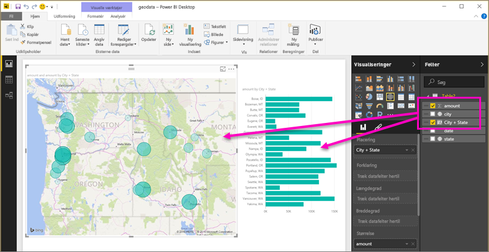

# Angiv geografiske filtre i Power BI Desktop til brug i mobilappen
I Power BI Desktop kan du [kategorisere geografiske data](desktop-data-categorization.md) i en kolonne, så Power BI Desktop ved, hvordan værdier skal behandles i visualiseringer i en rapport. En yderligere fordel er, at når du eller dine kollegaer får vist den pågældende rapport i Power BI-mobilappsene, leverer Power BI automatisk de geografiske filtre, der stemmer overens med jeres placering. 

Lad os f.eks. sige, at du er en salgschef, der rejser for at møde kunder, og du vil gerne hurtigt filtrere samlet salg og omsætning for den specifikke kunde, du planlægger at besøge. Du vil gerne have vist dataene for din aktuelle placering enten efter delstat, by eller en faktiske adresse. Hvis du senere har mere tid, vil du gerne besøge andre kunder i nærheden. Du kan [filtrere rapporten efter din placering for at finde disse kunder](../consumer/mobile/mobile-apps-geographic-filtering.md).

> [!NOTE]
> Du kan kun filtrere efter placering i mobilappen, hvis de geografiske navne i rapporten er på engelsk &#150; f.eks. "New York City" eller "Germany".
> 
> 

## Identificer geografiske data i din rapport
1. Skift til Datavisning i Power BI Desktop .
2. Vælg en kolonne med geografiske data &#150; f.eks. kolonnen By.
   
    
3. På fanen **Udformning** skal du vælge **Datakategori** og derefter den korrekte kategori &#150; i dette eksempel **By**.
   
    
4. Du kan fortsætte med at angive geografisk datakategorier for alle andre felter i modellen. 
   
   > [!NOTE]
   > Du kan angive flere kolonner for hver datakategori i en model, men hvis du gør det, kan modellen ikke filtrere efter geografi i Power BI-mobilappen. Hvis du vil bruge geografisk filtrering i mobilappsene, skal du kun angive én kolonne for hver datakategori &#150; f.eks. kun én kolonne med **By**, en kolonne med **Delstat eller provins** og én kolonne med **Land**. 
   > 
   > 

## Opret visualiseringer med din geografiske data
1. Skift til Rapportvisning , og opret visualiseringer, der bruger de geografiske felter i dine data. 
   
    
   
    I dette eksempel indeholder modellen også en beregnet kolonne, hvor by og delstat sammenlægges i en kolonne. Læs om, hvordan du [opretter beregnede kolonner i Power BI Desktop](desktop-calculated-columns.md).
   
    
2. Udgiv rapporten i Power BI-tjenesten.

## Få vist rapporten i Power BI-mobilappen
1. Åbn rapporten i en hvilken som helst af [Power BI-mobilappsene](../consumer/mobile/mobile-apps-for-mobile-devices.md).
2. Hvis du befinder dig på en geografisk placering med data i rapporten, kan du filtrere den automatisk efter din placering.
   
    

Læs mere om, hvordan du [filtrerer en rapport efter placering i Power BI-mobilapps](../consumer/mobile/mobile-apps-geographic-filtering.md).

## De næste trin
* [Datakategorisering i Power BI Desktop](desktop-data-categorization.md)  
* Har du nogen spørgsmål? [Prøv at spørge Power BI-community'et](https://community.powerbi.com/)
