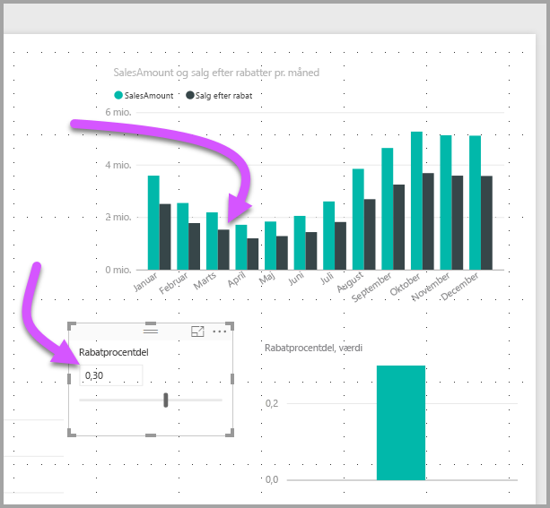

# Opret og brug What if-parametre til at visualisere variabler i Power BI Desktop

Fra og med august 2018-versionen af *Power BI Desktop* kan du oprette *what if*-variabler for dine rapporter, interagere med variablerne som udsnit og visualisere og kvantificere forskellige nøgleværdier i dine rapporter.

Opret *what if*-parameteren under fanen **Modellering** i Power BI Desktop. Når du vælger den, vises der en dialogboks, hvor du kan konfigurere parameteren.

## Opret en what if-parameter

Hvis du vil oprette en what if-parameter, skal du vælge **Ny parameter** under fanen **Modellering** i Power BI Desktop. På følgende billede har vi oprettet en parameter, der kaldes *Discount percentage* og angivet datatypen til **decimaltal**. **Minimum**værdien er nul. **Maksimum**værdien er 0,50 (50 procent). Vi har også angivet **Forøgelse** til 0,05 eller fem procent. Det angiver, hvor meget parameteren justeres, når der arbejdes med den i en rapport.

> [!NOTE]
> I forbindelse med decimaltal skal du sørge for at skrive et nul foran værdien, dvs. 0,50 og ikke bare ,50. Ellers valideres tallet ikke, og knappen **OK** kan ikke vælges.
> 
> 

For at gøre det nemmere for dig anbringer afkrydsningsfeltet **Føj udsnitsværktøj til denne side** automatisk et udsnit sammen med din what if-parameter på den aktuelle rapportside.

Ud over at oprette parameteren medfører oprettelsen af en what if-parameter også, at der oprettes en måling, som du kan bruge til at visualisere den aktuelle værdi i what if-parameteren.

Det er vigtigt at bemærke, at når du har oprettet en what if-parameter, bliver både parameteren og målingen en del af modellen. D er altså tilgængelige i hele rapporten og kan bruges på andre rapportsider. Og da de er en del af modellen, kan du slette udsnittet fra rapportsiden. Hvis du vil have den tilbage, skal du bare trække what if-parameteren fra listen **Felter**, trække den over på lærredet og derefter ændre det visuelle element til et udsnit.

## Brug en what if-parameter

Lad os oprette et simpelt eksempel på, hvordan du kan bruge en what if-parameter. Vi har oprettet what if-parameteren i det forrige afsnit. Nu tager vi den i brug ved at oprette en ny måling, hvis værdi tilpasses med skyderen.

Den nye måling skal bare være det samlede salgsbeløb, hvor der anvendes en rabatsats. Du kan oprette komplekse og interessante målinger, så brugerne af dine rapporter kan visualisere variablen i din what if-parameter. Du kan f.eks. oprette en rapport, hvor sælgere kan se deres løn, hvis de opfylder visse salgsmål eller -procenter, eller se effekten af øget salg i forhold til større rabatter.

Angiv formlen for målingen i formellinjen, og giv formlen navnet *Sales after Discount*.

Vi opretter derefter en kolonnevisual med **OrderDate** på aksen og både **SalesAmount** og målingen **Sales after Discount**, der netop er oprettet, som værdier.

Efterhånden som vi flytter skyderen, kan vi derefter se, at kolonnen **Sales after Discount** afspejler salgsbeløbet med rabatten.

Så nemt er det. Du kan bruge what if-parametre i alle slags situationer. Disse parametre giver brugerne af rapporter mulighed for at interagere med forskellige scenarier, som du opretter i dine rapporter.
