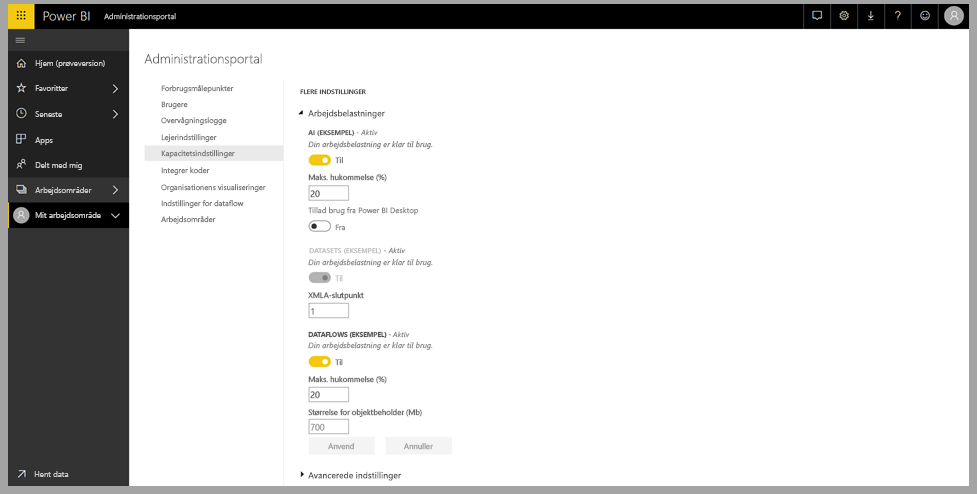
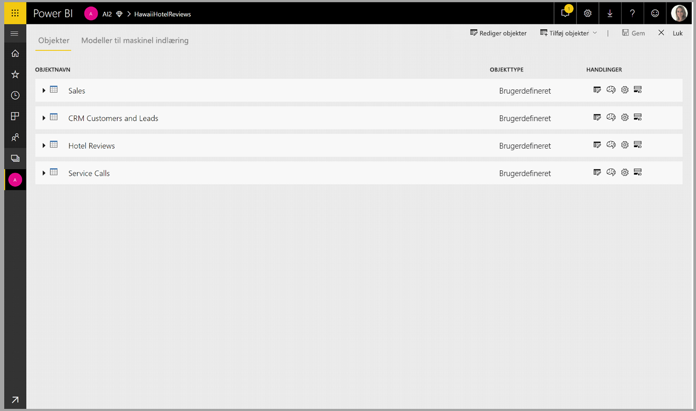
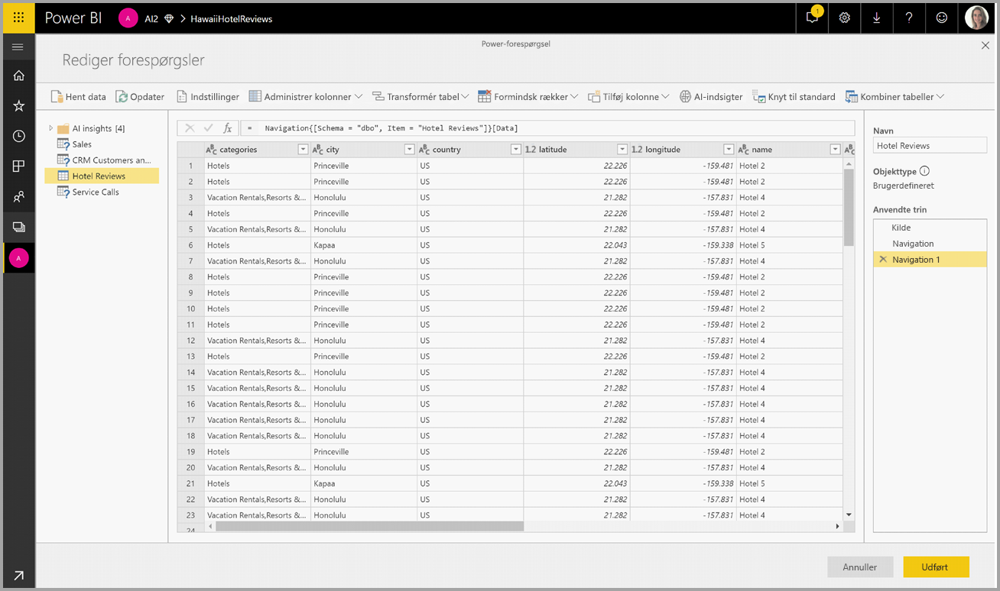
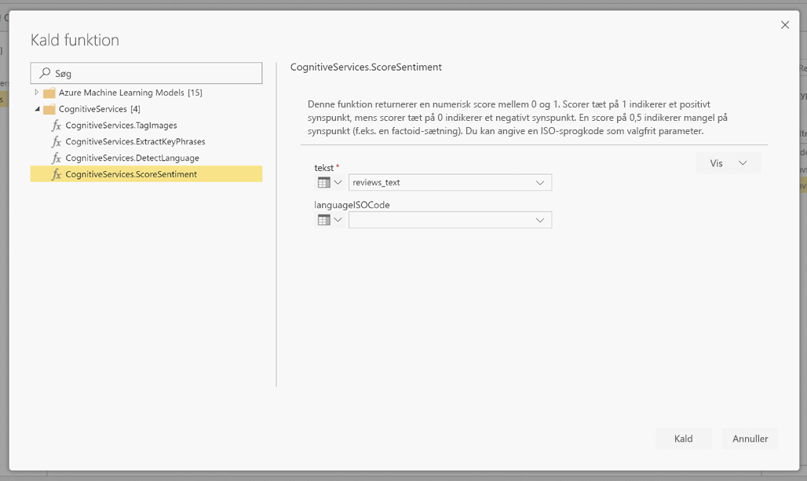
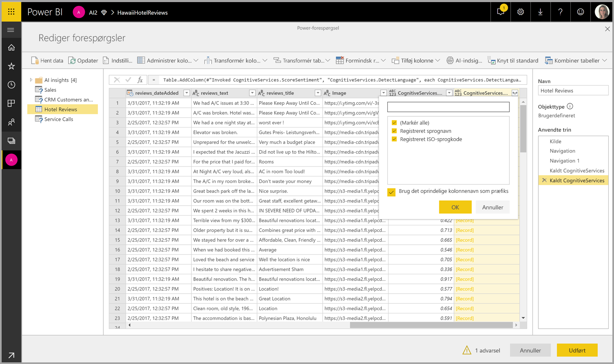

# Cognitive Services i Power BI 

Med Cognitive Services i Power BI kan du anvende forskellige algoritmer fra [Azure Cognitive Services](https://azure.microsoft.com/services/cognitive-services/) til forbedre dine data i den selvbetjente dataforberedelse til dataflow.

De tjenester, der understøttes i dag, er [Synspunktsanalyse](https://docs.microsoft.com/azure/cognitive-services/text-analytics/how-tos/text-analytics-how-to-sentiment-analysis), [Udtrækning af nøglesætninger](https://docs.microsoft.com/azure/cognitive-services/text-analytics/how-tos/text-analytics-how-to-keyword-extraction), [Registrering af sprog](https://docs.microsoft.com/azure/cognitive-services/text-analytics/how-tos/text-analytics-how-to-language-detection) og [Billedmarkering](https://docs.microsoft.com/azure/cognitive-services/computer-vision/concept-tagging-images). Transformationerne udføres i Power BI-tjenesten og kræver ikke et Azure Cognitive Services-abonnement. Denne funktion kræver Power BI Premium.

## **Aktivering af AI-funktioner**

Cognitive Services understøttes i forbindelse med Premium-kapacitetsnoder EM2, A2 eller P1 og højere. En separat AI-arbejdsbelastning i kapaciteten bruges til at køre Cognitive Services. Denne arbejdsbelastning er som standard deaktiveret i den offentlige prøveversion (før juni 2019). Før du bruger Cognitive Services i Power BI, skal AI-arbejdsbelastningen være aktiveret i indstillingerne for kapaciteten på administrationsportalen. Du kan slå AI-arbejdsbyrden til i afsnittet for arbejdsbelastninger og definere den maksimale hukommelsesmængde, denne opgave må forbruge. Den anbefalede hukommelsesgrænse er 20 %. En overskridelse af denne grænse medfører, at forespørgslen bliver langsommere.

## **Introduktion til Cognitive Services i Power BI**

Cognitive Services-transformationer er en del af den [selvbetjente dataforberedelse til dataflow](https://powerbi.microsoft.com/blog/introducing-power-bi-data-prep-wtih-dataflows/). Hvis du vil forbedre dine data vha. Cognitive Services, kan du begynde med at redigere et dataflow.

Tryk på knappen **AI Insights** på båndet øverst i Power-forespørgselseditor.

I pop op-vinduet skal du vælge den funktion, du vil bruge, og de data du vil transformere. I dette eksempel scorer jeg synspunktet for en kolonne, der indeholder tekst til gennemsyn.

**Kulturinfo** er et valgfrit input til at angive sproget i teksten. Dette felt forventer en ISO-kode. Du kan bruge en kolonne som input til Kulturinfo eller et statisk felt. I dette eksempel er sproget angivet som engelsk (en) for hele kolonnen. Hvis du ikke udfylder dette felt, registrerer Power BI automatisk sproget, inden funktionen anvendes. Derefter skal du vælge **Aktivér.**

Når funktionen er aktiveret, tilføjes resultatet som en ny kolonne i tabellen. Transformationen tilføjes også som et anvendt trin i forespørgslen.

Hvis funktionen returnerer felter med flere output, vil en aktivering af funktionen tilføje en ny kolonne med en post for felterne med flere output.

Brug indstillingen Udvid til at tilføje en eller begge værdier som kolonner til dine data.

## **Tilgængelige funktioner**

I dette afsnit beskrives de tilgængelige funktioner i Cognitive Services i Power BI.

### **Registrer sprog**

Funktionen til sprogregistrering evaluerer tekstinput og returnerer sprognavn og ISO-id for hvert felt. Denne funktion er nyttig for datakolonner, der indsamler vilkårlig tekst, hvor sproget er ukendt. Funktionen forventer data i tekstformat som input.

Tekstanalyse genkender op til 120 sprog. Du kan finde flere oplysninger under [understøttede sprog](https://docs.microsoft.com/azure/cognitive-services/text-analytics/text-analytics-supported-languages).

### **Udtræk af nøgleudtryk**

Funktionen til **udtræk af nøgleudtryk** evaluerer ustruktureret tekst og returnerer en liste over nøgleudtryk for hvert enkelt tekstfelt. Funktionen kræver et tekstfelt som input og accepterer et valgfrit input for **Kulturinfo**. (Se afsnittet **Introduktion** tidligere i denne artikel).

Udtræk af nøgleudtryk fungerer bedst, når du giver større tekstdele at arbejde med. Dette er det modsatte fra analyse af synspunkter, som fungerer bedre med mindre tekstdele. Hvis du vil have de bedste resultater fra begge handlinger, bør du derfor overveje at omstrukturere input.

### **Scor synspunkt**

Funktionen til **scoring af synspunkt** evaluerer tekstinput og returnerer en synspunktsscore for hvert dokument, der spænder fra 0 (negativ) til 1 (positiv). Denne funktion er nyttig i forbindelse med registrering af positive og negative synspunkter på sociale medier, i kundeanmeldelser og debatforummer.

Tekstanalyse bruger en maskinel indlæringsklassificeringsalgoritme til at generere en synspunktscore mellem 0 og 1. Scorer tæt på 1 indikerer et positivt synspunkt, mens scorer tæt på 0 indikerer et negativt synspunkt. Modellen er oplært ved hjælp af en omfattende tekstmængde med tilknyttede synspunkter. Det er i øjeblikket ikke muligt at få dine egne træningsdata. Modellen bruger en kombination af teknikker under tekstanalyse, herunder tekstbehandling, ordklasseanalyse, ordplacering og ordassociationer. Du kan få flere oplysninger om algoritmen under [Introduktion til Tekstanalyse](https://blogs.technet.microsoft.com/machinelearning/2015/04/08/introducing-text-analytics-in-the-azure-ml-marketplace/).

Analyser af synspunkter udføres på hele inputfeltet i modsætning til udtræk af synspunkter for et bestemt objekt i teksten. I praksis er der en tendens til, at scoringsnøjagtigheden forbedres, når dokumenter indeholder en eller to sætninger i stedet for en stor tekstmængde. Under objektivitetsvurderingen bestemmer modellen, om et inputfelt som helhed er objektivt eller indeholder et synspunkt. Et inputfelt, der primært er objektivt fortsætter ikke til synspunktsregistreringsfasen, hvilket resulterer i en score på 0,50 uden yderligere behandling. I forbindelse med inputfelter, der fortsætter i pipelinen, genererer den næste fase en score over eller under 0,50, afhængigt af, hvordan synspunktet registreres i inputfeltet.

I øjeblikket understøtter synspunktsanalysen engelsk, tysk, spansk og fransk. Andre sprog er tilgængelig som prøveversion. Du kan få flere oplysninger under [Understøttede sprog](https://docs.microsoft.com/azure/cognitive-services/text-analytics/text-analytics-supported-languages).

### **Tag billeder**

Funktionen **Tag billeder** returnerer tags baseret på mere end 2.000 genkendelige objekter, levende væsener, landskaber og handlinger. Når tags er tvetydige eller ikke er almen viden, giver outputtet "tip", der tydeliggør betydningen af tagget i forbindelse med en kendt kontekst. Tags ikke er organiseret som en taksonomi, og der findes ingen nedarvningshierarkier. En samling af indholdstags udgør fundamentet for en "billedbeskrivelse", der vises som sprog i hele sætninger, der kan læses af mennesker.

Når et billede er uploadet, eller en URL-adresse til et billede er angivet, genereres tags af Computer Vision-algoritmer baseret på de objekter, levende væsener og handlinger, der er identificeret på billedet. Tagging er ikke begrænset til det primære emne, f.eks. en person i forgrunden, men det indeholder også omgivelserne (indendørs eller udendørs), møbler, værktøjer, planter, dyr, tilbehør, gadgets og osv.

Denne funktion kræver en URL-adresse til billedet eller et abase 64-felt som input. I øjeblikket understøtter billedtagging engelsk, spansk, japansk, portugisisk og kinesisk (forenklet). Du kan få flere oplysninger under [Understøttede sprog](https://docs.microsoft.com/rest/api/cognitiveservices/computervision/tagimage/tagimage#uri-parameters).

## Næste trin

Der er angivet en oversigt over brugen af Cognitive Services vha. Power BI-tjenesten i denne artikel. Følgende artikler kan også være interessante eller nyttige. 

* [Selvstudium: Aktivér en model af typen Machine Learning Studio (klassisk) i Power BI](../connect-data/service-tutorial-invoke-machine-learning-model.md)
* [Integration af Azure Machine Learning i Power BI](service-machine-learning-integration.md)
* [Selvstudium: Brug af Cognitive Services i Power BI](../connect-data/service-tutorial-use-cognitive-services.md)

Du kan få flere oplysninger om dataflow i disse artikler:
* [Opret og brug dataflow i Power BI](service-dataflows-create-use.md)
* [Brug af beregnede objekter i Power BI Premium](service-dataflows-computed-entities-premium.md)
* [Brug af dataflow med datakilder i det lokale miljø](service-dataflows-on-premises-gateways.md)
* [Udviklerressourcer til Power BI-dataflow](service-dataflows-developer-resources.md)
* [Integration af dataflow og Azure Data Lake (prøveversion)](service-dataflows-azure-data-lake-integration.md)