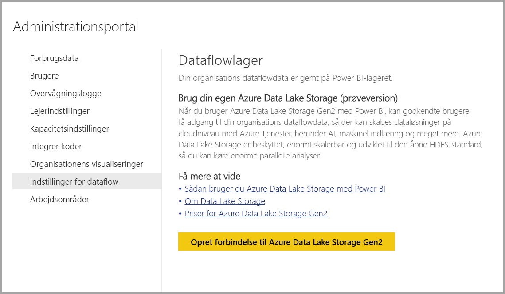
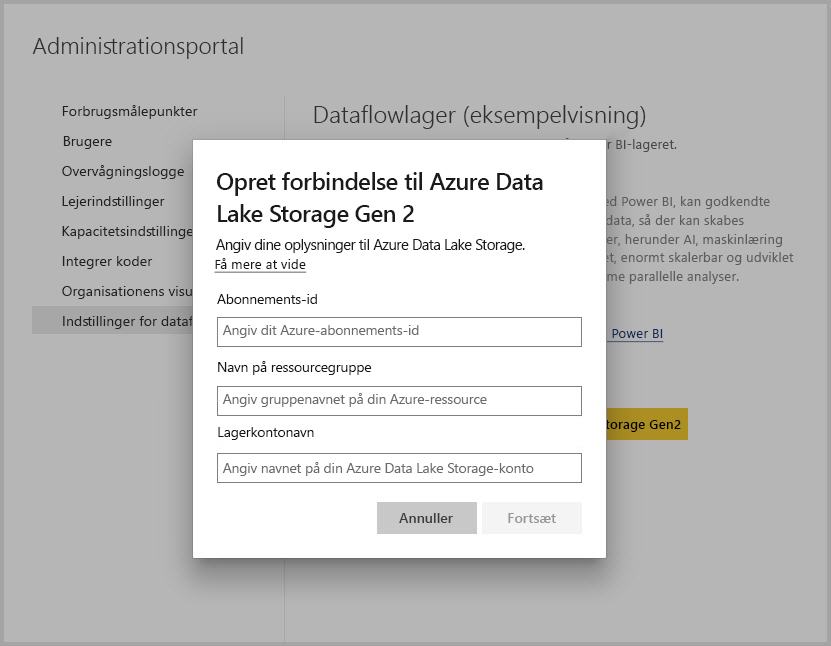
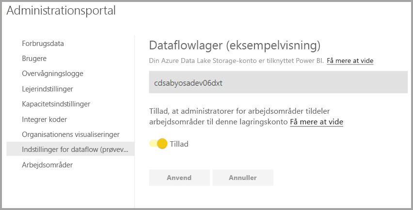

# Opret forbindelse til Azure Data Lake Storage Gen2 for dataflowlager

Du kan konfigurere Power BI-arbejdsområder til at gemme dataflow på din organisations Azure Data Lake Storage Gen2-konto. I denne artikel beskrives de generelle trin, der er nødvendige for at gøre det, og du får samtidigt en vejledning og bedste praksis. Der er nogle fordele ved at konfigurere arbejdsområder til at gemme definitioner og datafiler for dataflow i din data lake, herunder følgende:

* Azure Data Lake Storage Gen2 giver enormt skalerbare lagringsmuligheder for data
* Din it-afdelings udviklere kan gøre brug af data- og definitionsfiler for dataflowet for at udnytte tjenester til Azure Data og kunstig intelligens som vist i [GitHub-eksempler fra Azure Data Services](https://aka.ms/cdmadstutorial)
* Gør det muligt for udviklere i din organisation at integrere data for dataflowet i interne programmer og line of business-løsninger ved hjælp af udviklerressourcer til dataflow og Azure

Hvis du vil bruge Azure Data Lake Storage Gen2 til dataflow, skal du bruge følgende:

* **Power BI-lejer** – Mindst én konto i din AAD-lejer (Azure Active Directory) skal være tilmeldt Power BI
* **En global administratorkonto** – Denne konto kræves for at tilslutte og konfigurere Power BI for at gemme definition og data for dataflowet på din Azure Data Lake Storage Gen2-konto
* **Et Azure-abonnement** – Du skal have et Azure-abonnement for at bruge Azure Data Lake Storage Gen2
* **Ressourcegruppe** – Brug en eksisterende ressourcegruppe, eller opret en ny
* **En Azure Storage-konto, hvor funktionen Data Lake Storage Gen2 er aktiveret** 

> [!TIP]
> Hvis du ikke har et Azure-abonnement, skal du oprette en [gratis konto](https://azure.microsoft.com/free/), før du begynder.

> [!WARNING]
> Når lagringsplaceringen for et dataflow er konfigureret, kan den ikke ændres. Se afsnittet [overvejelser og begrænsninger](#considerations-and-limitations) i slutningen af denne artikel for at se andre vigtige elementer, der skal overvejes.

## Forbered din Azure Data Lake Storage Gen2 til Power BI

Før du kan konfigurere Power BI med en Azure Data Lake Storage Gen2-konto, skal du oprette og konfigurere en lagerkonto. Lad os se nærmere på kravene til Power BI:

1. Du skal være ejer af ADLS-lagerkontoen. Dette skal tildeles på ressourceniveau og ikke arves fra abonnementsniveau.
2. Lagerkontoen skal oprettes i den samme AAD-lejer som din Power BI-lejer.
3. Lagerkontoen skal oprettes i det samme område som din Power BI-lejer. Du kan få hjælp til at se, hvor din Power BI-lejer er placeret, under [Hvor findes min Power BI-lejer?](../admin/service-admin-where-is-my-tenant-located.md)
4. Funktionen *Hierarkisk navneområde* skal være aktiveret for lagerkontoen.
5. Hvis lagerkontoen ikke er oprettet af den aktuelle bruger, skal du sørge for, at den aktuelle bruger har fået tildelt tilladelsen [Storage BLOB -dataejer](https://docs.microsoft.com/azure/role-based-access-control/built-in-roles#storage-blob-data-owner) og [Ejer](https://docs.microsoft.com/azure/role-based-access-control/built-in-roles#owner). Eftersom Ejer ikke indeholder tilladelsen på dataniveau, er BLOB-dataejer påkrævet.

I følgende afsnit finder du en detaljeret gennemgang af de trin, der er nødvendige for at konfigurere din Azure Data Lake Storage Gen2-konto.

### Opret lagerkontoen

Følg trinnene i artiklen [Opret en Azure Data Lake Storage Gen2-lagerkonto](https://docs.microsoft.com/azure/storage/blobs/data-lake-storage-quickstart-create-account).

1. Sørg for, at du vælger den samme placering som din Power BI-lejer, og angiv dit lager som **StorageV2 (Generel v2)**
2. Sørg for, at du aktiverer funktionen Hierarkisk navneområde
3. Det anbefales, at du angiver replikeringsindstillingen til **Geografisk redundant lager med læseadgang (RA-GRS)**

### Tildel tilladelser til Power BI-tjenester

Derefter skal du give Power BI-tjenesten rollerne Læser og Dataadgang på din oprettede lagerkonto. De er begge indbyggede roller, så trinnene er ligetil. 

Følg trinnene under [Tildel en indbygget RBAC-rolle](https://docs.microsoft.com/azure/storage/common/storage-auth-aad-rbac#assign-a-built-in-rbac-role).

I vinduet **Tilføj rolletildeling** skal du vælge rollen **Læser og dataadgang**. Brug derefter Søg til at finde **Power BI-tjenesten**.
Gentag de samme trin for rollen **Ejer af lager-BLOB-data**, og tildel rollen til både **Power BI-tjenesten** og **Power BI Premium**.

> [!NOTE]
> Der går mindst 30 minutter, før tilladelsen er overført til Power BI fra portalen. Hver gang du ændrer tilladelser på portalen, går der 30 minutter, før disse tilladelser afspejles i Power BI. 

## Slut Azure Data Lake Storage Gen2 til Power BI

Når du har konfigureret din Azure Data Lake Storage Gen2-konto på Azure Portal, skal du knytte den til Power BI på **Power BI-administrationsportalen**. Du kan også administrere Power BI-dataflowlageret under afsnittet med indstillinger for **Dataflowlager** på Power BI-administrationsportalen. Du kan finde detaljerede oplysninger med hjælp til start og grundlæggende brug under [Sådan kommer du til administrationsportalen](../admin/service-admin-portal.md).

Du tilslutter din **Azure Data Lake Storage Gen2**-konto ved hjælp af følgende trin:

1. Naviger til fanen **Indstillinger for Dataflow** på **Power BI-administrationsportalen**

     

2. Vælg knappen **Tilslut Azure Data Lake Storage Gen2**. Følgende vindue vises.

     

3. Angiv **abonnements-id'et** for lagerkontoen.
4. Angiv **navnet på den ressourcegruppe**, som lagerkontoen blev oprettet i.
5. Angiv **navnet på lagerkontoen**.
6. Vælg **Opret forbindelse**.

Når disse trin er fuldført, er din Azure Data Lake Storage Gen2-konto sluttet til Power BI. 

> [!NOTE]
> Hvis du vil konfigurere en forbindelse til Azure Data Lake Storage Gen2 på Power BI-administrationsportalen, skal du have tilladelser som Global administrator. Globale administratorer kan dog ikke oprette forbindelse til et eksternt lager på administrationsportalen.  

Derefter skal du gøre det muligt for personer i din organisation at konfigurere deres arbejdsområder, hvilket giver dem mulighed for at bruge denne lagerkonto til definition og datalager for dataflow. Lad os gøre det i det næste afsnit. 

## Giv administratorer tilladelse til at tildele arbejdsområder

Som standard gemmes definitions- og datafiler for dataflowet i det lager, der leveres af Power BI. For at få adgang til dataflowfiler på din egen lagerkonto skal administratorer af arbejdsområdet først konfigurere arbejdsområdet for at tillade tildeling og lagring af dataflow på den nye lagerkonto. Før en administrator af et arbejdsområde kan konfigurere indstillingerne for dataflowlageret, skal administratoren have tilladelser til tildeling af lager på **Power BI-administrationsportalen**.

Hvis du vil give tilladelse til tildeling af lager, skal du gå til fanen **Indstillinger for Dataflow** på **Power BI-administrationsportalen**. Der er en alternativknap for *Giv administratorer af arbejdsområdet tilladelse til at tildele arbejdsområder til denne lagerkonto*, som skal være angivet til **Tillad**. Når du aktiverer skyderen, skal du vælge knappen **Anvend**, før ændringerne træder i kraft. 

 

Det var det. Administratorer af Power BI-arbejdsområdet kan nu tildele workflow til det filsystem, du oprettede.

## Overvejelser og begrænsninger

Denne funktion er en prøveversionsfunktion, og funktionsmåden kan ændres, når den frigives. Der er nogle få overvejelser og begrænsninger, du skal huske på, når du arbejder med dataflowlageret:

* Når der er konfigureret en placering for dataflowlageret, kan den ikke ændres.
* Det er som standard kun ejere af et dataflow, der er gemt i Azure Data Lake Storage Gen2, der kan få adgang til dataene. Hvis du vil give andre personer adgang til de dataflow, der er gemt i Azure, skal du føje dem til dataflowets CDM-mappe 
* Oprettelse af dataflow med linkede objekter er kun muligt, når de gemmes på den samme lagerkonto
* Datakilder i det lokale miljø i delte Power BI-kapaciteter understøttes ikke i dataflow, der er gemt i din organisations data lake
* Snapshots slettes ikke automatisk i ADLS gen. 2. Hvis du vil frigøre plads, kan du oprette en Azure-funktion, så du jævnligt rydder op i gamle snapshots.

Der er også nogle få kendte problemer, som beskrevet i dette afsnit.

Power BI Desktop-kunder kan ikke få adgang til dataflow, der er gemt på en **Azure Data Lake Storage-konto**, medmindre de er ejer af dataflowet, eller de er godkendt til CDM-mappen i den pågældende lake. Scenariet er som følger:

1. Anna har oprettet et nyt arbejdsområde og konfigureret det til at gemme dataflow i organisationens datasø. 
2. Ben, der også er medlem af det arbejdsområde, Anna har oprettet, vil gerne bruge Power BI Desktop og dataflowconnectoren til at hente data fra det dataflow, Anna har oprettet.
3. Ben får vist en lignende fejl, fordi han ikke er godkendt til dataflowets CDM-mappe i søen.

Ofte stillede spørgsmål og svar omfatter følgende:

**Spørgsmål:** Hvad hvis jeg tidligere har oprettet dataflow i et arbejdsområde og gerne vil ændre deres lagringsplacering?

**Svar:** Du kan ikke ændre lagringsplaceringen af et dataflow, efter den er oprettet. 

**Spørgsmål:** Hvornår kan jeg ændre lagringsplaceringen af dataflowet i et arbejdsområde?

**Svar:** Ændring af dataflowets lagringsplaceringen i et arbejdsområde er kun tilladt, hvis arbejdsområdet ikke indeholder nogen dataflow.

## Næste trin

Denne artikel indeholdt en vejledning i, hvordan du slutter Azure Data Lake Gen2 til et dataflowlager. Du kan finde flere oplysninger i følgende artikler:

Du kan finde flere oplysninger om dataflow, CDM og Azure Data Lake Storage Gen2 i følgende artikler:

* [Integration af dataflow og Azure Data Lake (prøveversion)](service-dataflows-azure-data-lake-integration.md)
* [Konfigurer indstillinger for dataflow for et arbejdsområde (prøveversion)](service-dataflows-configure-workspace-storage-settings.md)
* [Føj en CDM-mappe til Power BI som et dataflow (prøveversion)](service-dataflows-add-cdm-folder.md)

Du kan finde generelle oplysninger om dataflow i disse artikler:

* [Opret og brug dataflow i Power BI](service-dataflows-create-use.md)
* [Brug af beregnede objekter i Power BI Premium](service-dataflows-computed-entities-premium.md)
* [Brug af dataflow med datakilder i det lokale miljø](service-dataflows-on-premises-gateways.md)
* [Udviklerressourcer til Power BI-dataflow](service-dataflows-developer-resources.md)

Du kan finde flere oplysninger om Azure-lager i disse artikler:
* [Sikkerhedsvejledning til Azure Storage](https://docs.microsoft.com/azure/storage/common/storage-security-guide)

Du kan finde flere oplysninger om Common Data Model i denne oversigtsartikel:
* [Common Data Model – oversigt](https://docs.microsoft.com/powerapps/common-data-model/overview)
* [CDM-mapper](https://go.microsoft.com/fwlink/?linkid=2045304)
* [Fildefinition af CDM-model](https://go.microsoft.com/fwlink/?linkid=2045521)

Du kan altid prøve [at stille spørgsmål i Power BI-community'et](https://community.powerbi.com/).
