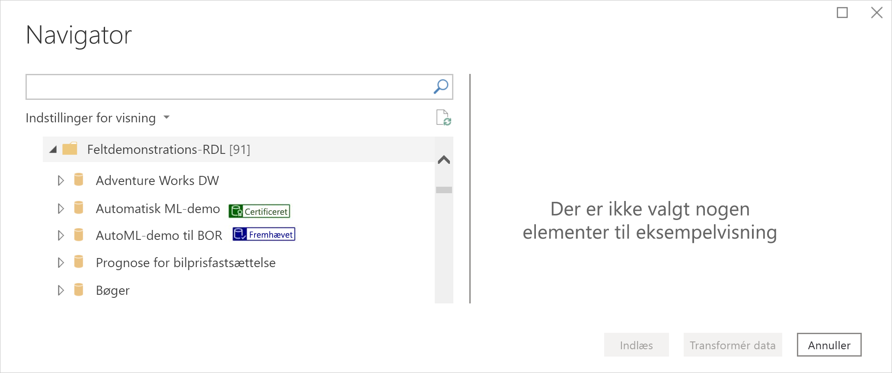
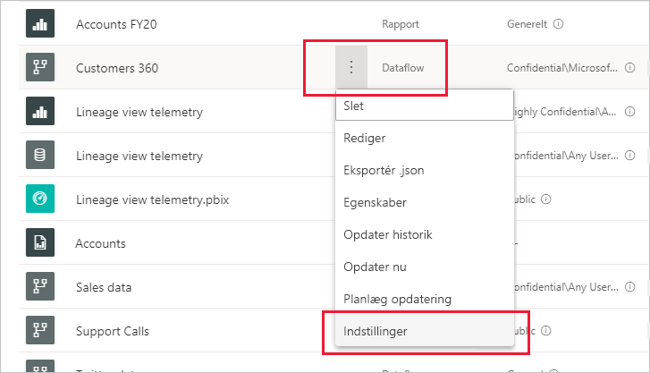
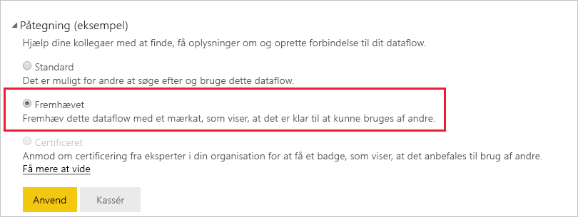
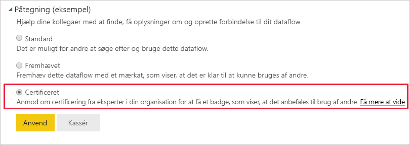

# Fremhæv eller certificer dataflows (prøveversion)

Power BI giver dig to måder, du kan bruge til at øge synligheden af dine værdifulde dataflows i høj kvalitet: **fremhævning** og **certificering**.

* **Fremhævning**: Fremhævning giver brugerne mulighed for at fremhæve dataflows, som de mener er værdifulde og kan betale sig at bruge for andre. På denne måde tilskyndes medarbejderne til at dele dataflows i en organisation. Enhver ejer af et dataflow eller et vilkårligt medlem med skriverettigheder til det arbejdsområde, hvor et dataflow er placeret, kan blot fremhæve dataflowet, når de mener, at det er godt nok til deling.

* **Certificering**: Certificering betyder, at et dataflow er blevet kontrolleret af en godkendt validator og virkelig er en pålidelig datakilde, der er klar til brug på tværs af organisationen. En udvalgt gruppe af validatorer, der er defineret af Power BI-lejeradministratoren, bestemmer, hvilke dataflows der skal certificeres. En bruger, der mener, at et bestemt dataflow skal certificeres, men som ikke har tilladelse til at certificere det, skal kontakte den pågældende lejeradministrator.

  Certificering af dataflow er kun muligt, hvis det er [aktiveret af Power BI-lejeradministratoren](../admin/service-admin-setup-certification.md).

Fremhævning eller certificering af et dataflow kaldes *godkendelse*. Rapportforfattere i Power BI har ofte mange forskellige dataflows at vælge imellem, og godkendelserne hjælper dem med at finde de dataflows, der er pålidelige, troværdige og autoritative.

Godkendte dataflows er tydeligt mærket mange steder i Power BI, så det er nemt for oprettere af rapporter at finde dem, når de leder efter pålidelige data, og så administratorer og rapportoprettere kan spore, hvordan de bruges i hele organisationen.

På billedet nedenfor kan du se, hvordan fremhævede og certificerede dataflows nemt kan identificeres i Power-forespørgsel.

I denne artikel beskrives
* Fremhævning af et dataflow (dataflowejer eller enhver bruger med medlemstilladelser til arbejdsområdet, hvor dataflowet er placeret)
* Certificering af et dataflow (autoriseret person, der udfører certificeringen, bestemt af lejeradministratoren)

Du kan finde oplysninger om, hvordan du konfigurerer certificering af dataflow (lejeradministrator) under [Konfigurer certificering for datasæt og dataflow](../admin/service-admin-setup-certification.md)

## Fremhæv et dataflow

Hvis du vil fremhæve et dataflow, skal du have skriverettigheder til det arbejdsområde, hvor det dataflow, du vil fremhæve, er placeret.

1. Gå til listen over datasæt i arbejdsområdet.
 
1. Vælg **Flere indstillinger** (...) for det dataflow, du vil fremhæve, og vælg derefter **Indstillinger**.

    

1. Udvid afsnittet Godkendelse, og vælg **Fremhævet**.

    

1. Vælg **Anvend**.

## Certificer et dataflow

Dette afsnit er beregnet til brugere, der er blevet godkendt af deres lejeradministrator til at certificere dataflows. Certificering af dataflows er et stort ansvar. I dette afsnit forklares den certificeringsproces, du gennemgår.

1. Du skal have skriverettigheder til det arbejdsområde, hvor det dataflow, du vil certificere, findes. Det kan være fra ejeren af dataflowet eller fra nogen med administratorrettigheder til arbejdsområdet. 

1. Gennemse dataflowet omhyggeligt, og find ud af, om det egner sig til certificering.

1. Hvis du beslutter dig for at certificere dataflowet, skal du gå til det arbejdsområde, hvor det befinder sig.
 
1. Find det dataflow, du leder efter, klik på **Flere indstillinger** (...), og vælg derefter **Indstillinger**.

    

1. Udvid afsnittet Godkendelse, og klik på **Certificeret**. 

    

2. Klik på **Anvend**.

## Næste trin

* [Konfigurer certificering af datasæt og dataflow](../admin/service-admin-setup-certification.md)
* Har du spørgsmål? [Prøv at spørge Power BI-community'et](https://community.powerbi.com/)