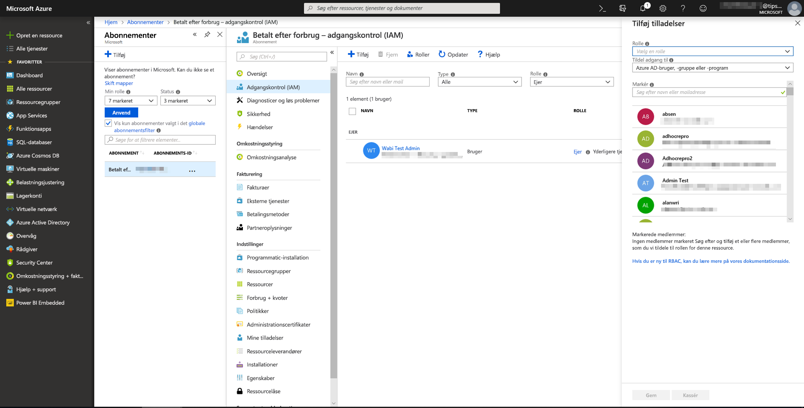
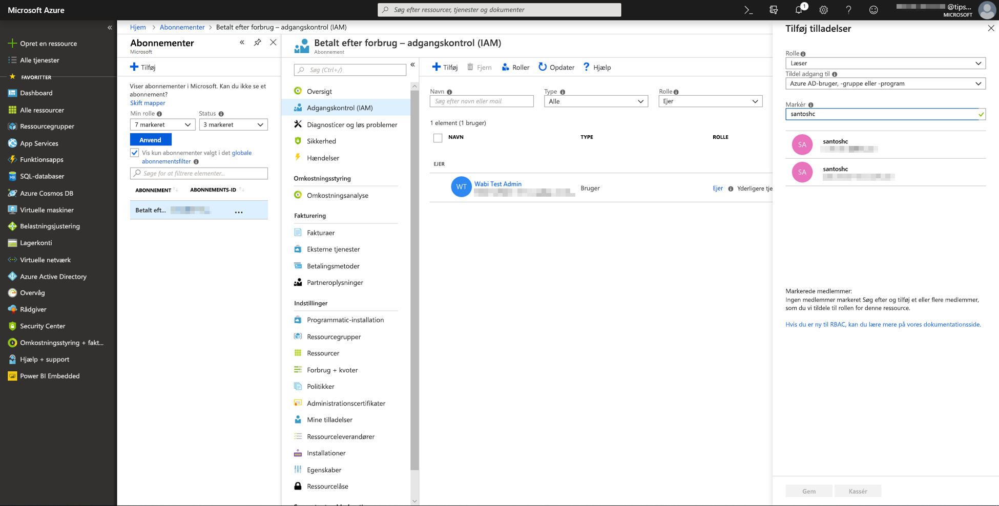
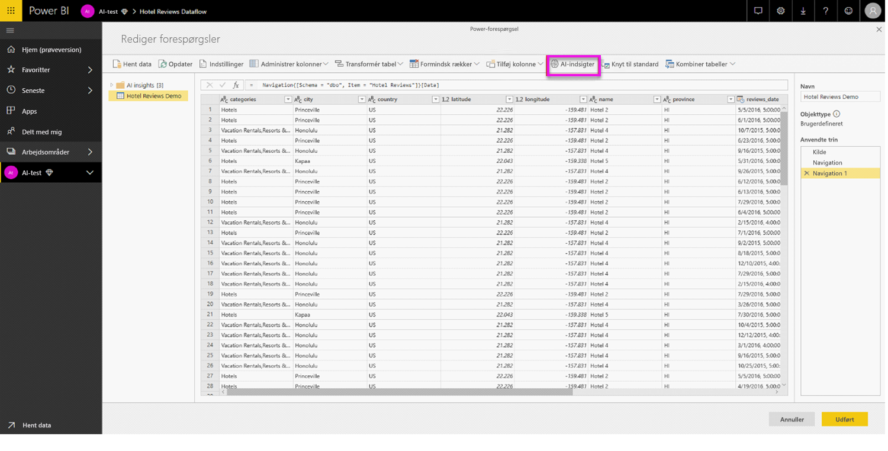
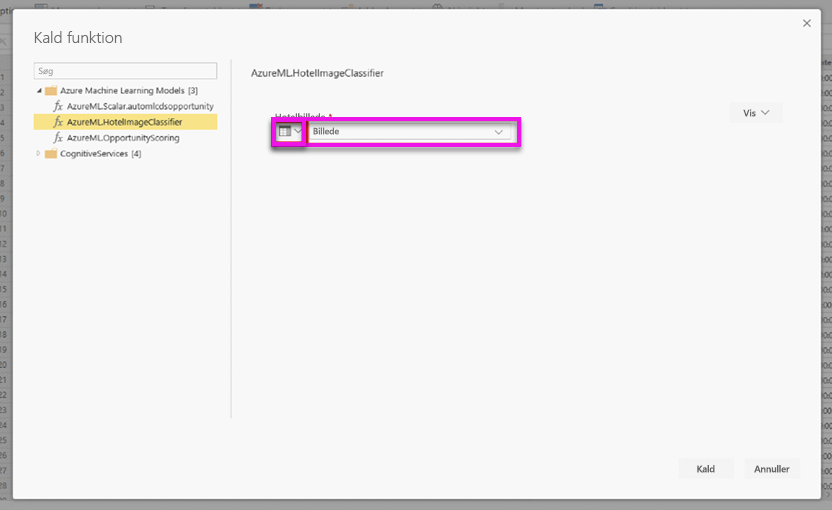
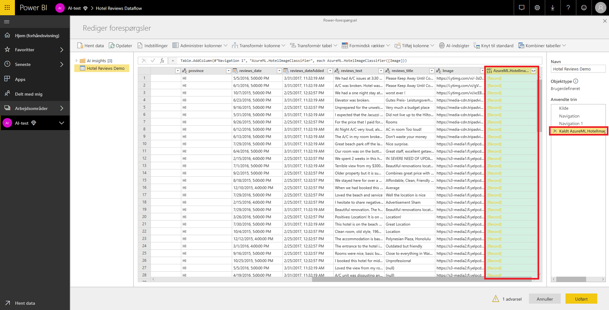
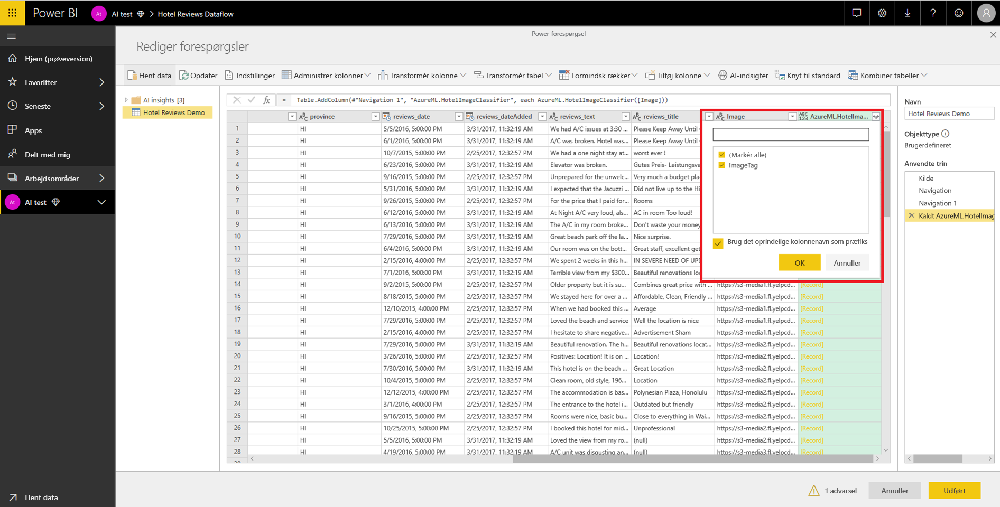

# Integrering af Azure Machine Learning i Power BI

Mange organisationer bruger **Machine Learning**-modeller for at få større indsigt i deres virksomhed og dens fremtidige udvikling. Muligheden for at visualisere og aktivere indsigt fra disse modeller i dine rapporter og dashboards og andre analyser kan hjælpe med at udbrede denne indsigt til de forretningsbrugere, der har størst behov for den.  Power BI gør det nu nemt at integrere indsigt fra modeller, der hostes i Azure Machine Learning, ved hjælp af enkle peg og klik-håndbevægelser.

For at gøre det muligt at bruge denne funktion kan en dataspecialist ganske enkelt give BI analytikeren adgang til Azure Machine Learning-modellen ved hjælp af Microsoft Azure-portal.  I starten af hver session finder Power-forespørgsel derefter alle de Azure Machine Learning-modeller, brugeren har adgang til, og viser dem som dynamiske funktioner i Power-forespørgsel.  Brugeren kan derefter aktivere disse funktioner ved at oprette adgang til dem på båndet i editoren i Power-forespørgsel, eller ved at aktivere funktionen M direkte. For at opnå en bedre ydeevne samler Power BI også automatisk anmodninger om adgang i bundter, når Azure Machine Learning-modellen aktiveres for et sæt af rækker.

Denne funktionalitet understøttes i øjeblikket kun for Power BI dataflows, og for Power-forespørgsel online i Power BI-tjenesten.

Du kan få mere at vide om dataflow i [Selvbetjent dataforberedelse i Power BI](service-dataflows-overview.md).

Du kan få mere at vide om Azure Machine Learning i:

- Oversigt:  [Hvad er Azure Machine Learning?](https://docs.microsoft.com/azure/machine-learning/service/overview-what-is-azure-ml)
- Hurtig start- og selvstudier til Azure Machine Learning:  [Azure Machine Learning-dokumentation](https://docs.microsoft.com/azure/machine-learning/)

## Tildeling af adgang til Azure Machine Learning-modellen til en Power BI-bruger

For at få adgang til en Azure Machine Learning-model fra Power BI, skal brugeren have adgangen **Læs** til Azure-abonnementet.  Derudover gælder følgende:

- For modeller af typen Machine Learning Studio (klassisk): adgangen **Læs** til webtjenesten Machine Learning Studio (klassisk)
- For modeller af typen Machine Learning Studio: adgangen **Læs** til Machine Learning Studio-arbejdsområdet

Trinnene i denne artikel beskriver, hvordan du tildeler en Power BI-bruger adgang til en model, der er hostet i Azure Machine Learning-tjenesten, så brugeren kan få adgang til denne model som en funktion i Power-forespørgsel.  Du kan få flere oplysninger i [Administrer adgang ved hjælp af RBAC og Microsoft Azure-portal](https://docs.microsoft.com/azure/role-based-access-control/role-assignments-portal).

1. Log på [Azure Portal](https://portal.azure.com).

2. Gå til siden **Abonnementer**. Du finder siden **Abonnementer** via listen **Alle tjenester** i navigationsmenuen i Microsoft Azure-portal.

    

3. Vælg dit abonnement.

    

4. Vælg **Adgangskontrol (IAM)** , og vælg derefter knappen **Tilføj**.

    

5. Vælg **Læser** som rollen. Vælg den Power BI-bruger, du vil give adgang til Azure Machine Learning-modellen.

    

6. Vælg **Gem**.

7. Gentag trin tre til seks for at tildele brugeren adgangen **Læser** for den specifikke webtjeneste af typen Machine Learning Studio (klassisk) *eller* det Machine Learning-arbejdsområde, der hoster modellen.

## Skemasøgning for modeller til maskinel indlæring

Dataspecialister bruger primært Python til at udvikle og endda udrulle deres modeller til maskinel indlæring til Machine Learning.  I modsætning til Machine Learning Studio (klassisk), som hjælper med at automatisere oprettelse af en skemafil til modellen, skal dataspecialisterne eksplicit generere skemafilen ved hjælp af Python, når det drejer sig om Machine Learning.

Denne skemafil skal inkluderes i den udrullede webtjeneste for modeller til maskinel indlæring. Hvis du vil generere skemaet for webtjenesten automatisk, skal du angive et eksempel på inputtet/outputtet i postscriptet for den udrullede model. Se underafsnittet om [(Valgfri) Automatisk generering af Swagger-skema i dokumentationen Udrul modeller med Azure Machine Learning](https://docs.microsoft.com/azure/machine-learning/how-to-deploy-and-where#optional-define-model-web-service-schema) Service. Linket inkluderer eksemplet på postscriptet med sætninger for generering af skemaet. 

Funktionerne *\@input_schema* og *\@output_schema* i postscriptet refererer specifikt til eksempelformaterne for input og output i variablerne *input_sample* og *output_sample* og bruger disse eksempler til at generere en OpenAPI-specifikation (Swagger) for webtjenesten under udrulningen.

Disse instruktioner til generering af skemaet ved opdatering af postscriptet skal også anvendes for modeller, der er oprettet via automatiserede eksperimenter for maskinel indlæring veds hjælp af SDK'et til Azure Machine Learning.

> [!NOTE]
> Modeller, der er oprettet ved hjælp af den visuelle brugergrænseflade i Azure Machine Learning, understøtter i øjeblikket ikke generering af skemaer, men det vil de i efterfølgende udgaver. 

## Aktivering af Azure Machine Learning-modellen i Power BI

Du kan kalde en hvilken som helst Azure Machine Learning-model, som du har fået adgang til, direkte fra editoren i Power-forespørgsel i dit dataflow. For at få adgang til Azure Machine Learning-modeller, skal du vælge knappen **Rediger** for den enhed, du vil forbedre med indsigt fra din Azure ML-model, som vist på følgende billede.

Når knappen **Rediger** vælges, åbnes Power-forespørgselseditoren for enhederne i dit dataflow.

Vælg knappen **AI-indsigt** på båndet, og vælg derefter mappen _Azure Machine Learning-modeller_ i navigationsruden. Alle de Azure Machine Learning-modeller, du har adgang til, er angivet her som funktioner i Power-forespørgsel. Inputparametrene for Azure Machine Learning-modellen er også automatisk tilknyttet som parametre for den tilsvarende funktion i Power-forespørgsel.

For at aktivere en Azure Machine Learning-model kan du angive en af den valgte enheds kolonner som input på rullelisten. Du kan også angive en konstant værdi, der skal bruges som input ved at slå kolonneikonet til venstre for inputdialogboksen til og fra.

Vælg **Aktivér** for at få vist Azure Machine Learning-modellens output som en ny kolonne i enhedstabellen. Du får også modelaktiveringen som et anvendt trin for forespørgslen.

Hvis modellen returnerer flere outputparametre, er de grupperet som en post i outputkolonnen. Du kan udvide kolonnen for at oprette individuelle outputparametre i separate kolonner.

Når du gemmer dit dataflow, aktiveres modellen automatisk, når dataflowet opfriskes, for alle nye eller opdaterede rækker i enhedstabellen.

## Næste trin

Denne artiken omfatter en oversigt over integration af Machine Learning i Power BI-tjenesten. Følgende artikler kan også være interessante eller nyttige. 

* [Selvstudium: Aktivér en model af typen Machine Learning Studio (klassisk) i Power BI](../connect-data/service-tutorial-invoke-machine-learning-model.md)
* [Selvstudium: Brug af Cognitive Services i Power BI](../connect-data/service-tutorial-use-cognitive-services.md)
* [Cognitive Services i Power BI](service-cognitive-services.md)

Du kan få flere oplysninger om dataflow i disse artikler:
* [Opret og brug dataflow i Power BI](service-dataflows-create-use.md)
* [Brug af beregnede objekter i Power BI Premium](service-dataflows-computed-entities-premium.md)
* [Brug af dataflow med datakilder i det lokale miljø](service-dataflows-on-premises-gateways.md)
* [Udviklerressourcer til Power BI-dataflow](service-dataflows-developer-resources.md)
* [Integration af dataflow og Azure Data Lake (prøveversion)](service-dataflows-azure-data-lake-integration.md)
