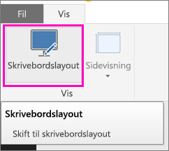
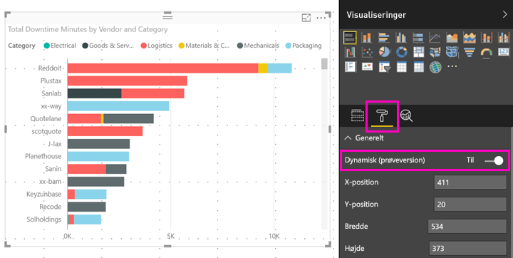

# Optimer en Power BI-visualisering til enhver størrelse
Når du opretter en ny rapport, er de visuelle elementer *dynamiske* som standard: De ændres dynamisk, så den maksimale mængde data og indsigt vises uanset skærmstørrelse. Du kan angive, at visuals i ældre rapporter også skal ændre størrelse dynamisk.

Når visualiseringen ændrer størrelse, prioriterer Power BI datavisningen ved f.eks. at fjerne udfyldning og flytte forklaringen til øverst i visualiseringen automatisk, således at visualiseringen fortsat er informativ, selvom den bliver mindre. Dynamisk funktionalitet er især nyttigt i forbindelse med visualiseringer i Power BI-mobilappen på telefoner.

Alle visuals med X- og Y-akser og udsnit kan ændre størrelse dynamisk.

## Slå dynamisk funktionalitet til i Power BI Desktop
1. I en ældre rapport i Power BI Desktop skal du på fanen **Vis** sikre, at du har åbnet **Skrivebordslayout**.
   
    
2. Vælg en visualisering, og i ruden **Visualiseringer** skal du vælge sektionen **Format**.
3. Udvid **Generelt** > skub **Dynamisk** til **Til**.
   
    
   
     Når du nu [opretter en rapport, der er optimeret til telefonen](../desktop-create-phone-report.md) og tilføjer denne visualisering, tilpasses den på fornem vis.

## Slå dynamisk funktionalitet til i Power BI-tjenesten
Du kan slå dynamisk funktionalitet til for en visual i en rapport i Power BI-tjenesten. Du skal have mulighed for at redigere rapporten.

1. I en rapport i Power BI-tjenesten ([https://powerbi.com](https://powerbi.com)) skal du vælge **Rediger rapport**.
2. Vælg en visualisering, og i ruden **Visualiseringer** skal du vælge sektionen **Format**.
3. Udvid **Generelt** > skub **Dynamisk** til **Til**.
   
    
   
     Når du nu [opretter en telefonvisning af denne rapport](../desktop-create-phone-report.md) og tilføjer denne visual, tilpasses den på fornem vis.

## Næste trin
* [Opret rapporter, der er optimeret til Power BI-telefonapps](../desktop-create-phone-report.md)
* [Få vist Power BI-rapporter, der er optimeret til din telefon](../consumer/mobile/mobile-apps-view-phone-report.md)
* Har du flere spørgsmål? [Prøv at spørge Power BI-community'et](http://community.powerbi.com/)

