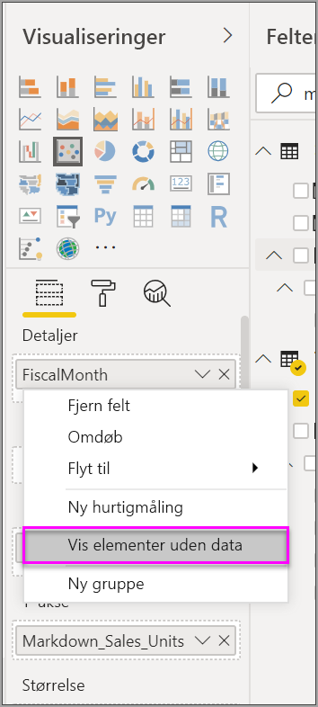
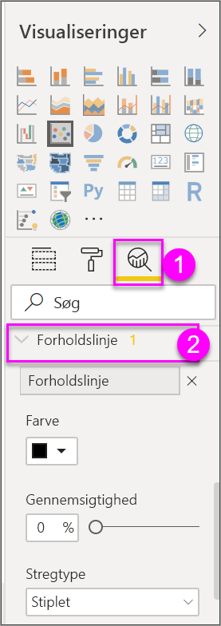
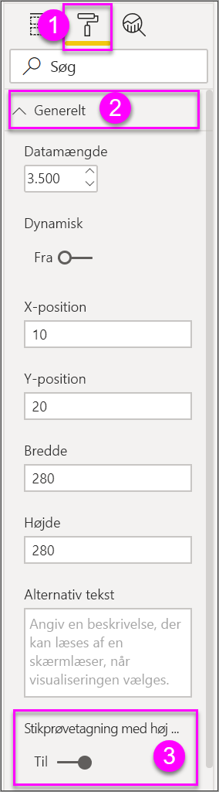

# Stikprøvetagning med høj tæthed i Power BI-punktdiagrammer

[!INCLUDE [power-bi-visuals-desktop-banner](../includes/power-bi-visuals-desktop-banner.md)]

Fra og med udgivelsen af **Power BI Desktop** fra september 2017 findes der en ny udsnitsalgoritme, som forbedrer den måde, punktdiagrammer viser data med høj tæthed på.

Du kan f.eks. oprette et punktdiagram på baggrund af organisationens salgsaktiviteter, hvor hver butik har titusinde datapunkter hvert år. I et sådant punktdiagram tages der et dataudsnit (en relevant repræsentation af dataene til at illustrere, hvordan salget er sket i tidsperioden) ud fra de tilgængelige data, og der oprettes et punktdiagram, der repræsenterer de underliggende data. Dette er almindelig praksis i punktdiagrammer med høj tæthed. Udsnitsfunktionen til data med høj tæthed er blevet forbedret i Power BI. Der er flere oplysninger om dette i denne artikel.

## Sådan fungerer punktdiagrammer med høj tæthed
Tidligere valgte **Power BI** et udsnit af eksempeldatapunkter i alle de underliggende data på en deterministisk måde for at oprette et punktdiagram. Power BI ville specifikt vælge de første og sidste rækker med data i serien af punktdiagrammer, og derefter ville de resterende rækker blive jævnt fordelt, så 3.500 datapunkter i alt ville blive afbilledet i punktdiagrammet. Hvis udsnittet f.eks. havde 35.000 rækker, ville de første og sidste rækker blive valgt til afbildning, og derefter ville hver 10. række også blive afbildet (35.000/10 = hver 10 række = 3.500 datapunkter). Tidligere blev null-værdier eller punkter, der ikke kunne afbildes (f.eks. tekstværdier) i dataserierne, ikke vist, og derfor blev de ikke taget i betragtning, når visualiseringen skulle genereres. Med denne type udsnit var den viste tæthed i punktdiagrammet også baseret på de repræsentative datapunkter. Den visuelle tæthed, der blev antydet, gjaldt dermed for udsnittet af punkter, ikke for de fuldstændige underliggende data.

Når du aktiverer **Udsnit med høj tæthed**, implementeres en algoritme i Power BI, der fjerner overlappende punkter og sikrer, at punkterne i visualiseringen kan nås, når der interageres med visualiseringen. Algoritmen sikrer også, at alle punkter i datasættet er repræsenteret i visualiseringen Det giver en kontekst for betydningen af de udvalgte punkter i stedet for bare at afbilde et repræsentativt udsnit.

Stikprøver af data med høj tæthed tages pr. definition for at kunne oprette visualiseringer forholdsvist hurtigt og bruge disse visualiseringer interaktivt. For mange datapunkter i et visuelt element kan gøre det for tungt og gøre tendenserne mindre synlige. Udsnitsalgoritmen er derfor udviklet for at udvælge data, så man opnår den bedste visualisering og sikrer, at alle data er repræsenteret. I Power BI er algoritmen nu blevet forbedret for at opnå den bedste kombination af svartid, repræsentation og tydelig bevarelse af vigtige punkter i det samlede datasæt.

> [!NOTE]
> Punktdiagrammer, der bruger algoritmen **Udsnit med høj tæthed**, afbildes bedst i firkantede visualiseringer, som det er tilfældet med alle punktdiagrammer.
> 
> 

## Sådan fungerer den nye algoritme for udsnit i punktdiagrammer
Den nye algoritme **Udsnit med høj tæthed** for punktdiagrammer anvender metoder, der registrerer og repræsenterer de underliggende data mere effektivt og samtidig fjerner overlappende punkter. Det gøres ved at starte med en lille radius for hvert datapunkt (den synlige cirkelstørrelse for et givet punkt i visualiseringen). Derefter øges radius for alle datapunkterne. Når to (eller flere) datapunkter overlapper hinanden, repræsenterer en enkelt cirkel (med den øgede radiusstørrelse) disse overlappede datapunkter. Algoritmen fortsætter med at øge radius for datapunkterne, indtil radiusværdien resulterer i et rimeligt antal datapunkter – 3.500 – der vises i punktdiagrammet.

Metoderne i denne algoritme sikrer, at udenforliggende værdier repræsenteres i den visualisering, der genereres. Algoritmen respekterer også skaleringen, når overlappet bestemmes, så der visualiseres eksponentielle skaleringer med nøjagtige gengivelser af de underliggende visualiserede punkter.

Algoritmen bevarer også den overordnede form af punktdiagrammet.

> [!NOTE]
> Når du bruger algoritmen for **Udsnit med høj tæthed** for punktdiagrammer, er målet *korrekt distribution* af dataene, og underforstået visuel tæthed er *ikke* målet. Du kan f.eks. få vist et punktdiagram med mange overlappende cirkler (tæthed) i et bestemt område og forestille dig, hvor mange datapunkter der er samlet der i klynger. Da algoritmen **Udsnit med høj tæthed** kan bruge én cirkel til at repræsentere mange datapunkter, vises en sådan underforstået visuel tæthed (eller "klyngedannelse") ikke. Hvis du vil have flere detaljer i et bestemt område, kan du bruge udsnitsværktøjerne til at zoome ind.
> 
> 

Desuden kan nogle datapunkter ikke afbildes (f.eks. null-værdier og tekstværdier) og ignoreres derfor, så en anden værdi, der kan afbildes, vælges. Dette sikrer, at punktdiagrammets sande form bevares.

### Når standardalgoritmen for punktdiagrammer anvendes
Der er omstændigheder, som gør, at **Udsnit med høj tæthed** ikke kan anvendes på et punktdiagram, og den oprindelige algoritme anvendes i stedet. Det drejer sig om følgende tilfælde:

* Hvis du højreklikker på en værdi under **Oplysninger** og vælger **Vis elementer uden data** i menuen, returneres punktdiagrammet til den oprindelige algoritme.
  
  
* Alle værdier på aksen **Afspil** vil medføre, at punktdiagrammet returneres til den oprindelige algoritme.
* Hvis både X og Y-akserne mangler i et punktdiagram, returneres diagrammet til den oprindelige algoritme.
* Brugen af en **Forholdslinje** i ruden **Analyse** rude medfører, at punktdiagrammet returneres til den oprindelige algoritme.
  
  

## Sådan aktiveres udsnit med høj tæthed for et punktdiagram
Du kan slå **Udsnit med høj tæthed** til ved at vælge et punktdiagram, gå til ruden **Formatering**, udvide kortet **Generelt** og flytte skyderen **Udsnit med høj tæthed** i bunden af kortet til indstillingen **Til**.

> [!NOTE]
> Når skyderen er slået til, forsøger Power BI at bruge algoritmen **Udsnit med høj tæthed**, når det er muligt. Når algoritmen ikke kan bruges (hvis du f.eks. anbringer en værdi på aksen *Afspil*), forbliver skyderen i placeringen **Til**, selvom diagrammet er returneret til standardalgoritmen. Hvis du senere fjerner en værdi fra aksen *Afspil* (eller betingelserne ændres, så det er muligt at bruge algoritmen Udsnit med høj tæthed), bruges udsnit med høj tæthed automatisk til diagrammet, fordi funktionen er aktiveret.
> 

> 
> [!NOTE]
> Datapunkter grupperes eller vælges af indekset. Hvis der er en forklaring, påvirker den ikke udsnittet for algoritmen. Den påvirker kun rækkefølgen i visualiseringen.
> 
> 

## Overvejelser og begrænsninger
Algoritmen Udsnit med høj tæthed er en vigtig forbedring af Power BI, men der er et par ting, du bør være klar over, når du arbejder med værdier med høj tæthed og punktdiagrammer.

* Algoritmen **Udsnit med høj tæthed** fungerer kun med liveforbindelser til modeller, der er baseret på Power BI-tjenesten, importerede modeller eller DirectQuery.

## De næste trin
Du kan finde flere oplysninger om udsnit med høj tæthed i andre diagrammer i følgende artikel.

* [Stikprøvetagning af linjer med høj tæthed i Power BI](../desktop-high-density-sampling.md)

