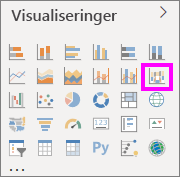
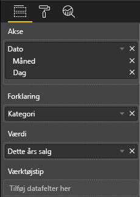
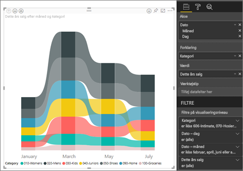
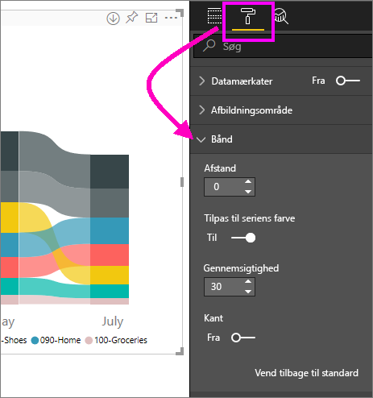
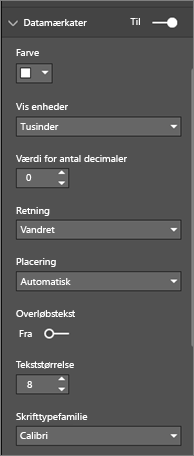
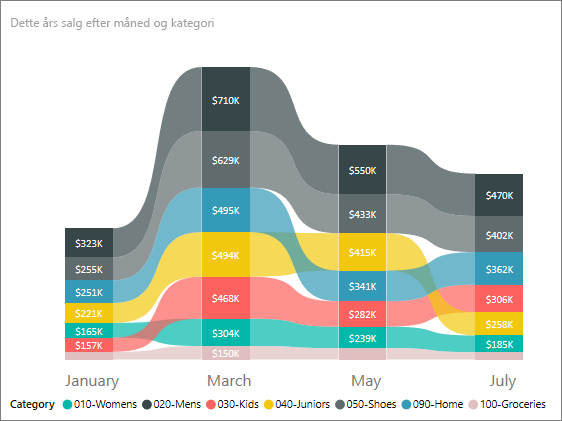

# Opret bånddiagrammer i Power BI

[!INCLUDE[consumer-appliesto-nyyn](../includes/consumer-appliesto-nyyn.md)]    

[!INCLUDE [power-bi-visuals-desktop-banner](../includes/power-bi-visuals-desktop-banner.md)]

Du kan oprette bånddiagrammer for at visualisere data og hurtigt finde ud af, hvilken datakategori der har den højeste placering (største værdi). Bånddiagrammer er effektive til at vise ændringer af placeringer, hvor den højeste placering (værdi) altid vises øverst for hver tidsperiode. 

> [!NOTE]
> Når du deler din rapport med en Power BI-kollega, kræves det, at I begge har individuelle Power BI Pro-licenser, eller at rapporten er gemt i en Premium-kapacitet. Se [deling af rapporter](../collaborate-share/service-share-reports.md).

## Forudsætninger

I dette selvstudium bruges [PBIX-filen med eksemplet Detailhandelsanalyse](https://download.microsoft.com/download/9/6/D/96DDC2FF-2568-491D-AAFA-AFDD6F763AE3/Retail%20Analysis%20Sample%20PBIX.pbix).

1. Vælg **Fil** > **Åbn** i øverste venstre afsnit af menulinjen
   
2. Find din kopi af **PBIX-filen med eksemplet Detailhandelsanalyse**

1. Åbn **PBIX-filen med eksemplet Detailhandelsanalyse** i rapportvisning .

1. Markér  for at tilføje en ny side.

## Opret et bånddiagram

1. Du opretter et bånddiagram ved at vælge **bånddiagram** på panelet **Visualiseringer**.

    

    Med bånddiagrammer tilknyttes en kategori af data for den visualiserede tidsperiode ved hjælp af bånd, hvilket gør det muligt at se, hvordan en bestemt kategori placeres over hele diagrammets x-akse (normalt tidslinjen).

2. Vælg felter for **Akse**, **Forklaring** og **Værdi**.  I dette eksempel har vi valgt: **Butik** > **OpenDate**, **Vare** > **Kategori** og **Salg** > **Dette års salg** > **Værdi**.  

    

    Eftersom datasættet kun indeholder data for ét år, har vi også fjernet feltet **År** og **Kvartal** fra kategorien **Akse**.

3. I bånddiagrammet kan du se placeringen for hver måned. Bemærk, hvordan placering ændres over tid. Kategorien Hjem rykker for eksempel fra anden til femte fra februar til marts.

    

## Formatér et bånddiagram
Når du opretter et bånddiagram, er der formateringsindstillinger tilgængelige under afsnittet **Format** i ruden **Visualiseringer**. Formateringsindstillingerne for bånddiagrammer ligner indstillingerne for et stablet søjlediagram, men byder på yderligere formateringsindstillinger, som er specifikke for båndene.

Ved hjælp af disse formateringsindstillinger for bånddiagrammer kan du foretage følgende justeringer.

* **Afstand** gør det muligt at justere, hvor meget plads der vises mellem båndene. Tallet er procentdelen af kolonnens maksimumhøjde.
* **Match seriens farve** gør det muligt at matche farven på båndene med seriens farve. Når den er slået **fra**, er båndene grå.
* **Gennemsigtighed** angiver, hvor gennemsigtige båndene er. Standardværdien er angivet til 30.
* **Kant** gør det muligt at placere en mørk kant øverst og nederst på båndene. Kanter er som standard slået fra.

Da bånddiagrammet ikke har mærkater for y-aksen, kan det være en god idé at tilføje datamærkater. I ruden Formatering skal du vælge **Datamærkater**. 

Angiv formateringsindstillingerne for dine datamærkater. I dette eksempel har vi sat tekstfarven til hvid og visningsenheder til tusinde.

## Næste trin

[Punktdiagrammer og boblediagrammer i Power BI](power-bi-visualization-scatter.md)

[Visualiseringstyper i Power BI](power-bi-visualization-types-for-reports-and-q-and-a.md)
