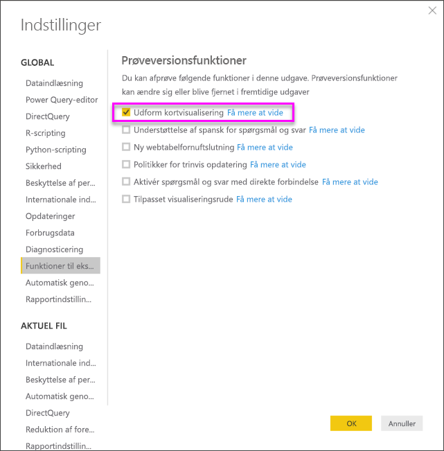
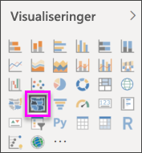
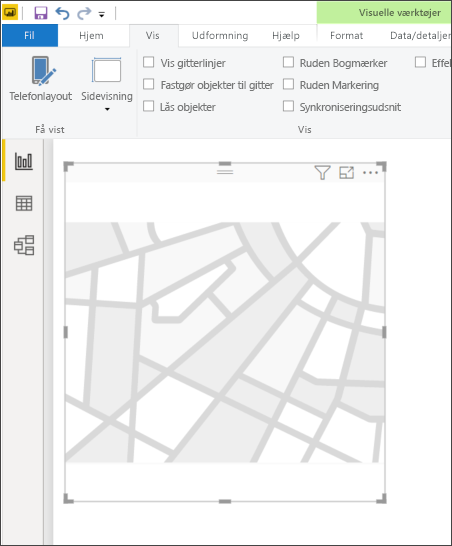
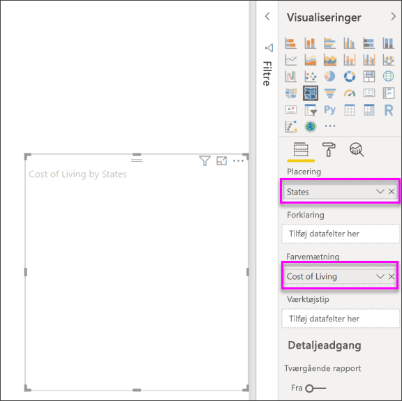
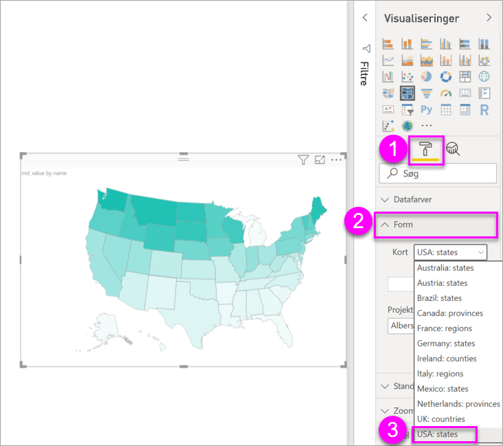
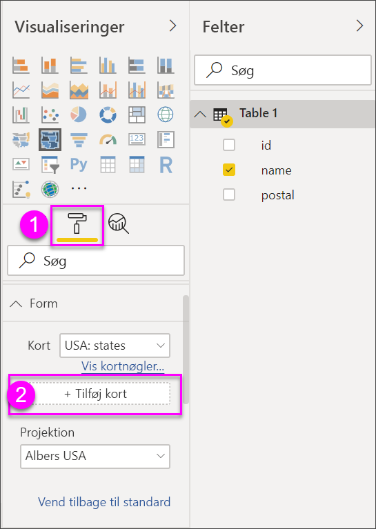
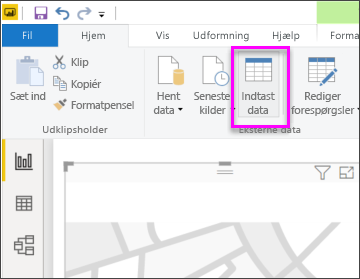

# Figurkort i Power BI Desktop (prøveversion)
Opret en visualisering af typen **Figurkort** til at sammenligne områder på et kort ved hjælp af farver. I modsætning til visualiseringen **Kort** kan **Figurkort** ikke vise den nøjagtige geografiske placering af datapunkter på et kort. I stedet er dens primære formål at vise relative sammenligninger mellem områder på et kort ved at give dem forskellige farver.

Visualiseringen **Figurkort** er baseret på ESRI/TopoJSON-kort, der kan anvendes med brugerdefinerede kort, som du opretter. Eksempler på brugerdefinerede kort er: geografiske kort, kort over siddepladser, kort over etager med mere. Muligheden for at bruge brugerdefinerede kort er ikke tilgængelig i denne evalueringsversion af **Figurkort**.

## Opret figurkort
Du kan afprøve kontrolelementet **Figurkort** med de kort, som medfølger i denne prøveversion, eller du kan bruge dine egne brugerdefinerede kort, så længe de opfylder de krav, der er angivet i afsnittet **Brug brugerdefinerede kort** nedenfor.

Visualiseringen **Figurkort** er en prøveversion og skal aktiveres i Power BI Desktop. Du aktiverer **Figurkort** ved at vælge **Filer > Indstillinger > Indstillinger > Prøveversionsfunktioner** og derefter markere afkrydsningsfeltet **Visualiseringen Figurkort**. Du skal genstarte Power BI Desktop, når du har markeret indstillingen.

Når du har aktiveret **Figurkort**, skal du vælge ikonet **Figurkort** i ruden **Visualiseringer**.

Power BI Desktop opretter et tomt designlærred for **figurkortet**.

Gør følgende for at oprette et **figurkort**:

1. I ruden **Felter** skal du trække et datafelt med navne på områder (eller forkortelser) til feltet **Placering** og et datamålingsfelt til feltet **Farvemætning** (der vises ikke et kort endnu).

   > [!NOTE]
   > Se afsnittet **Hent kortdata** herunder for at få oplysninger om, hvordan du hurtigt kan hente kortdata til test af **Figurkort**.
   > 
   > 

   
2. I ruden **Format** skal du udvide **Figur** og vælge på rullemenuen **Standardkort** for at få vist dine data. På nuværende tidspunkt vises gengivelsen af kortet som vist på følgende billede.

   

   > [!NOTE]
   > I afsnittet **Områdenøgler** sidst i denne artikel kan du se en samling af tabeller, som indeholder kortområdenøgler, du kan bruge til at teste visualiseringen **Figurkort**.
   > 
   > 
3. Du kan derefter redigere kortet ved hjælp af indstillingerne for formatering, f.eks. **Standardfarve**, **Zoom** m.m. Du kan også tilføje en kolonne med kategoridata i bucket'en **Forklaring** og klassificere kortområderne baseret på kategorier.

## Brug brugerdefinerede kort
Du kan bruge brugerdefinerede kort med **Figurkort**, hvis de er i formatet **TopoJSON**. Hvis dit kort er i et andet format, kan du bruge onlineværktøjer som [**Map Shaper**](http://mapshaper.org/) til at konvertere dine *figurfiler* eller dine *GeoJSON*-kort til **TopoJSON**-format.

Hvis du vil bruge kortfilen **TopoJSON**, skal du tilføje visualiseringen Figurkort i din rapport og tilføje nogle data i felterne *Placering* og *Farvemætning*. Derefter skal du i ruden **Visualiseringer** kontrollere, at sektionen **Format** er markeret (som vist på følgende billede som (1)). Udvid dernæst sektionen **Figur**, og vælg **+ Tilføj kort**.

## Eksempel på et brugerdefineret kort
Den *offentlige anklagemyndighed i USA* udgiver en årlig finansiel rapport over dens processer og sager.  Alle rapporter kan findes via nedenstående link.

https://www.justice.gov/usao/resources/annual-statistical-reports

Eftersom amerikanske delstater kan være inddelt i forskellige retskredse, er vi nødt til at bruge et brugerdefineret figurkort.  Ved at importere kortet **TopoJSON** over USA's retskredse i **Power BI Desktop** kan vi efterfølgende visualisere årlige finansielle data for den offentlige anklagemyndigheds forskellige retskredse.  På billedet nedenfor er vist et eksempel på dette kort.

Du kan bruge kortene over de forskellige delstater til mange forskellige ting, og du kan få vist flere oplysninger om de enkelte distrikter. 

Hvis du ønsker at eksperimentere med dette datasæt og visualiseringen, kan du downloade den oprindelige PBIX-fil, der blev brugt til at generere rapporten, ved hjælp af følgende link.

* [Demo af .PBIX-filen til et brugerdefineret figurkort](http://download.microsoft.com/download/1/2/8/128943FB-9231-42BD-8A5D-5E2362C9D589/DistrictAttorneyFiscalReport.pbix)

## Hent kortdata
Hvis du hurtigt vil hente data ind i en model, så du kan teste **Figurkort**, kan du kopiere en af tabellerne sidst i denne artikel og derefter vælge **Angiv data** under fanen **Hjem**.

Hvis der er flere kolonner til dine data, skal du bruge en editor, f.eks. Excel, til at indsætte dataene og derefter kopiere hver datakolonne separat. Du kan derefter indsætte dataene i Power BI Desktop. Den øverste række bliver automatisk identificeret som overskrift.

Du kan angive en ny kolonne ved at skrive et nyt kolonnenavn (i den tomme kolonne til højre) og derefter angive værdier i hver celle på samme måde som i Excel. Når du er færdig, skal du vælge **Indlæs**, hvorefter tabellen tilføjes i datamodellen for Power BI Desktop.

> [!NOTE]
> Når du arbejder med lande eller områder, kan du bruge forkortelsen på tre bogstaver til at sikre, at geokodning fungerer korrekt i kortvisualiseringer. Benyt *ikke* forkortelser på to bogstaver, da nogle lande eller områder muligvis ikke genkendes korrekt.
> 
> Hvis du kun har forkortelser på to bogstaver, kan du tjekke [dette eksterne blogindlæg](https://blog.ailon.org/how-to-display-2-letter-country-data-on-a-power-bi-map-85fc738497d6#.yudauacxp) for at få fremgangsmåden til, hvordan forkortelser på to bogstaver for land/område knyttes til forkortelser på tre bogstaver for land/område.
> 
> 

## Funktionsmåder og krav i prøveversionen
Du skal være opmærksom på nogle få ting i forbindelse med denne prøveversion af **Figurkort**:

* Visualiseringen **Figurkort** er en prøveversion og skal aktiveres i Power BI Desktop. Du aktiverer **Figurkort** ved at vælge **Filer > Indstillinger > Indstillinger > Prøveversionsfunktioner** og derefter markere afkrydsningsfeltet **Visualiseringen Figurkort**.
* I øjeblikket skal du også angive værdier i feltet **Farvemætning**, for at klassificeringen **Forklaring** fungerer korrekt.
* Den sidste udgivne version af **Figurkort** vil have en brugergrænseflade, der viser kortnøgler over det aktuelt valgte kort (der er ikke fastsat nogen dato for den sidste udgivelse, og **Figurkort** er stadig en prøveversion). I denne udgivne prøveversion kan du referere til kortets områdenøgler i tabellerne, som findes i sektionen **Områdenøgler** i denne artikel.
* Den visuelle fremstilling i **Figurkort** kan maksimal vise op til 1.000 datapunkter.

## Områdenøgler
Brug følgende **Områdenøgler** i denne prøveversion for at afprøve **Figurkort**.

### Australien: Stater

| `id` | `abbr` | `iso` | `name` | `postal` |
| --- | --- | --- | --- | --- |
| au-wa |WA |AU-WA |Western Australia |WA |
| au-vic |Vic |AU-VIC |Victoria |VIC |
| au-tas |Tas |AU-TAS |Tasmania |TAS |
| au-sa |SA |AU-SA |South Australia |SA |
| au-qld |Qld |AU-QLD |Queensland |QLD |
| au-nt |NT |AU-NT |Northern Territory |NT |
| au-nsw |NSW |AU-NSW |New South Wales |NSW |
| au-act |ACT |AU-ACT |Australian Capital Territory |ACT |

### Østrig: Stater

| `id` | `iso` | `name` | `name-en` | `postal` |
| --- | --- | --- | --- | --- |
| at-wi |AT-9 |Wien |Vienna |WI |
| at-vo |AT-8 |Vorarlberg |Vorarlberg |VO |
| at-tr |AT-7 |Tirol |Tyrol |TR |
| at-st |AT-6 |Steiermark |Styria |ST |
| at-sz |AT-5 |Salzburg |Salzburg |SZ |
| at-oo |AT-4 |Oberösterreich |Upper Austria |OO |
| at-no |AT-3 |Niederösterreich |Lower Austria |NO |
| at-ka |AT-2 |Kärnten |Carinthia |KA |
| at-bu |AT-1 |Burgenland |Burgenland |BU |

### Brasilien: Stater

| `id` |
| --- |
| Tocantins |
| Pernambuco |
| Goias |
| Sergipe |
| Sao Paulo |
| Santa Catarina |
| Roraima |
| Rondonia |
| Rio Grande do Sul |
| Rio Grande do Norte |
| Rio de Janeiro |
| Piaui |
| Parana |
| Paraiba |
| Para |
| Minas Gerais |
| Mato Grosso |
| Maranhao |
| Mato Grosso do Sul |
| Distrito Federal |
| Ceara |
| Espirito Santo |
| Bahia |
| Amazonas |
| Amapa |
| Alagoas |
| Acre |
| Litigated Zone 1 |
| Litigated Zone 2 |
| Litigated Zone 3 |
| Litigated Zone 4 |

### Canada: Provinser

| `id` | `iso` | `name` | `postal` |
| --- | --- | --- | --- |
| ca-nu |CA-NU |Nunavut |NU |
| ca-nt |CA-NT |Northwest Territories |NT |
| ca-yt |CA-YT |Yukon |YT |
| ca-sk |CA-SK |Saskatchewan |SK |
| ca-qc |CA-QC |Quebec |QC |
| ca-pe |CA-PE |Prince Edward Island |PE |
| ca-on |CA-ON |Ontario |ON |
| ca-ns |CA-NS |Nova Scotia |NS |
| ca-nl |CA-NL |Newfoundland and Labrador |NL |
| ca-nb |CA-NB |New Brunswick |NB |
| ca-mb |CA-MB |Manitoba |MB |
| ca-bc |CA-BC |British Columbia |BC |
| ca-ab |CA-AB |Alberta |AB |

### Frankrig: Regioner

| `id` | `name` | `name-en` |
| --- | --- | --- |
| Alsace |Alsace |Alsace |
| Rhone-Alpes |Rhône-Alpes |Rhone-Alpes |
| Provence-Alpes-Cote d'Azur |Provence-Alpes-Côte d'Azur |Provence-Alpes-Cote d'Azur |
| Poitou-Charentes |Poitou-Charentes |Poitou-Charentes |
| Picardie |Picardie |Picardy |
| Pays de la Loire |Pays de la Loire |Pays de la Loire |
| Nord-Pas-de-Calais |Nord-Pas-de-Calais |Nord-Pas-de-Calais |
| Midi-Pyrenees |Midi-Pyrénées |Midi-Pyrenees |
| Lorraine |Lorraine |Lorraine |
| Limousin |Limousin |Limousin |
| Languedoc-Roussillon |Languedoc-Roussillon |Languedoc-Roussillon |
| Ile-del-France |Île-de-France |Ile-de-France |
| Haute-Normandie |Haute-Normandie |Upper Normandy |
| Franche-Comte |Franche-Comté |Franche-Comte |
| Corse |Corse |Corsica |
| Champagne-Ardenne |Champagne-Ardenne |Champagne-Ardenne |
| Centre-Val de Loire |Centre-Val de Loire |Centre-Val de Loire |
| Bretagne |Bretagne |Brittany |
| Bourgogne |Bourgogne |Burgundy |
| Basse-Normandie |Basse-Normandie |Lower Normandy |
| Auvergne |Auvergne |Auvergne |
| Aquitaine |Aquitaine |Aquitaine |

### Tyskland: Stater

| `id` | `iso` | `name` | `name-en` | `postal` |
| --- | --- | --- | --- | --- |
| de-be |DE-BE |Berlin |Berlin |BE |
| de-th |DE-TH |Thüringen |Thuringia |TH |
| de-st |DE-ST |Sachsen-Anhalt |Saxony-Anhalt |ST |
| de-sn |DE-SN |Sachsen |Saxony |SN |
| de-mv |DE-MV |Mecklenburg-Vorpommern |Mecklenburg-Vorpommern |MV |
| de-bb |DE-BB |Brandenburg |Brandenburg |BB |
| de-sh |DE-SH |Schleswig-Holstein |Schleswig-Holstein |SH |
| de-sl |DE-SL |Saarland |Saarland |SL |
| de-rp |DE-RP |Rheinland-Pfalz |Rhineland-Palatinate |RP |
| de-nw |DE-NW |Nordrhein-Westfalen |North Rhine-Westphalia |NW |
| de-ni |DE-NI |Niedersachsen |Lower Saxony |NI |
| de-he |DE-HE |Hessen |Hesse |HE |
| de-hh |DE-HH |Hamborg |Hamburg |HH |
| de-hb |DE-HB |Bremen |Bremen |HB |
| de-by |DE-BY |Bayern |Bavaria |BY |
| de-bw |DE-BW |Baden-Württemberg |Baden-Wurttemberg |BW |

### Irland: Amter

| `id` |
| --- |
| Wicklow |
| Wexford |
| Westmeath |
| Waterford |
| Sligo |
| Tipperary |
| Roscommon |
| Offaly |
| Monaghan |
| Meath |
| Mayo |
| Louth |
| Longford |
| Limerick |
| Leitrim |
| Laoighis |
| Kilkenny |
| Kildare |
| Kerry |
| Galway |
| Dublin |
| Donegal |
| Cork |
| Clare |
| Cavan |
| Carlow |

### Italien: Regioner

| `id` | `iso` | `name` | `name-en` | `postal` |
| --- | --- | --- | --- | --- |
| it-vn |IT-34 |Veneto |Veneto |VN |
| it-vd |IT-23 |Valle d'Aosta |Aosta Valley |VD |
| it-um |IT-55 |Umbrien |Umbria |UM |
| it-tt |IT-32 |Trentino-Alto Adige |Trentino-South Tyrol |TT |
| it-tc |IT-52 |Toscana |Tuscany |TC |
| it-sc |IT-82 |Sicilien |Sicily |SC |
| it-sd |IT-88 |Sardinien |Sardinia |SD |
| it-pm |IT-21 |Piemonte |Piedmont |PM |
| it-ml |IT-67 |Molise |Molise |ML |
| it-mh |IT-57 |Marche |Marche |MH |
| it-lm |IT-25 |Lombardiet |Lombardy |LM |
| it-lg |IT-42 |Ligurien |Liguria |LG |
| it-lz |IT-62 |Lazio |Lazio |LZ |
| it-fv |IT-36 |Friuli-Venezia Giulia |Friuli-Venezia Giulia |FV |
| it-er |IT-45 |Emilia-Romagna |Emilia-Romagna |ER |
| it-cm |IT-72 |Campania |Campania |CM |
| it-lb |IT-78 |Calabrien |Calabria |LB |
| it-bc |IT-77 |Basilicata |Basilicata |BC |
| it-pu |IT-75 |Apulien |Puglia |PU |
| it-ab |IT-65 |Abruzzo |Abruzzo |AB |

### Mexico: Stater

| `id` | `abreviatura` | `iso` | `name` | `name-en` | `postal` |
| --- | --- | --- | --- | --- | --- |
| mx-zac |Zac. |MX-ZAC |Zacatecas |Zacatecas |ZA |
| mx-yuc |Yuc. |MX-YUC |Yucatán |Yucatan |YU |
| mx-ver |Ver. |MX-VER |Veracruz |Veracruz |VE |
| mx-tla |Tlax. |MX-TLA |Tlaxcala |Tlaxcala |TL |
| mx-tam |Tamps. |MX-TAM |Tamaulipas |Tamaulipas |TM |
| mx-tab |Tab. |MX-TAB |Tabasco |Tabasco |TB |
| mx-son |Son. |MX-SON |Sonora |Sonora |SO |
| mx-sin |Sin. |MX-SIN |Sinaloa |Sinaloa |SI |
| mx-slp |S.L.P. |MX-SLP |San Luis Potosí |San Luis Potosi |SL |
| mx-roo |Q.R. |MX-ROO |Quintana Roo |Quintana Roo |QR |
| mx-que |Qro. |MX-QUE |Querétaro |Queretaro |QE |
| mx-pue |Pue. |MX-PUE |Puebla |Puebla |PU |
| mx-oax |Oax. |MX-OAX |Oaxaca |Oaxaca |OA |
| mx-nle |N.L. |MX-NLE |Nuevo León |Nuevo Leon |NL |
| mx-nay |Nay. |MX-NAY |Nayarit |Nayarit |NA |
| mx-mor |Mor. |MX-MOR |Morelos |Morelos |MR |
| mx-mic |Mich. |MX-MIC |Michoacán |Michoacan |MC |
| mx-mex |Méx. |MX-MEX |Mexico |Mexico State |MX |
| mx-jal |Jal. |MX-JAL |Jalisco |Jalisco |JA |
| mx-hid |Hgo. |MX-HID |Hidalgo |Hidalgo |HI |
| mx-gro |Gro. |MX-GRO |Guerrero |Guerrero |GR |
| mx-gua |Gto. |MX-GUA |Guanajuato |Guanajuato |GT |
| mx-dur |Dgo. |MX-DUR |Durango |Durango |DU |
| mx-dif |Col. |MX-DIF |Mexico City |Mexico City |DF |
| mx-col |Coah. |MX-COL |Colima |Colima |CL |
| mx-coa |Chis. |MX-COA |Coahuila |Coahuila |CA |
| mx-chh |Chih. |MX-CHH |Chihuahua |Chihuahua |CH |
| mx-chp |CDMX. |MX-CHP |Chiapas |Chiapas |CP |
| mx-cam |Camp. |MX-CAM |Campeche |Campeche |CM |
| mx-bcs |B.C.S. |MX-BCS |Baja California Sur |Baja California Sur |BS |
| mx-bcn |B.C. |MX-BCN |Baja California |Baja California |BN |
| mx-agu |Ags. |MX-AGU |Aguascalientes |Aguascalientes |AG |

### Nederlandene: Provinser

| `id` | `iso` | `name` | `name-en` |
| --- | --- | --- | --- |
| nl-zh |NL-ZH |Zuid-Holland |South Holland |
| nl-ze |NL-ZE |Zeeland |Zeeland |
| nl-ut |NL-UT |Utrecht |Utrecht |
| nl-ov |NL-OV |Overijssel |Overijssel |
| nl-nh |NL-NH |Noord-Holland |North Holland |
| nl-nb |NL-NB |Noord-Brabant |North Brabant |
| nl-li |NL-LI |Limburg |Limburg |
| nl-gr |NL-GR |Groningen |Groningen |
| nl-ge |NL-GE |Gelderland |Gelderland |
| nl-fr |NL-FR |Fryslân |Friesland |
| nl-fl |NL-FL |Flevoland |Flevoland |
| nl-dr |NL-DR |Drenthe |Drenthe |

### Storbritannien: Lande

| `id` | `iso` | `name` |
| --- | --- | --- |
| gb-wls |GB-WLS |Wales |
| gb-sct |GB-SCT |Skotland |
| gb-nir |GB-NIR |Nordirland |
| gb-eng |GB-ENG |England |

### USA: Stater

| `id` | `name` | `postal` |
| --- | --- | --- |
| us-mi |Michigan |MI |
| us-ak |Alaska |AK |
| us-hi |Hawaii |HI |
| us-fl |Florida |FL |
| us-la |Louisiana |LA |
| us-ar |Arkansas |AR |
| us-sc |South Carolina |SC |
| us-ga |Georgia |GA |
| us-ms |Mississippi |MS |
| us-al |Alabama |AL |
| us-nm |New Mexico |NM |
| us-tx |Texas |TX |
| us-tn |Tennessee |TN |
| us-nc |North Carolina |NC |
| us-ok |Oklahoma |OK |
| us-az |Arizona |AZ |
| us-mo |Missouri |MO |
| us-va |Virginia |VA |
| us-ks |Kansas |KS |
| us-ky |Kentucky |KY |
| us-co |Colorado |CO |
| us-md |Maryland |MD |
| us-wv |West Virginia |WV |
| us-de |Delaware |DE |
| us-dc |District of Columbia |DC |
| us-il |Illinois |IL |
| us-oh |Ohio |OH |
| us-ca |Californien |CA |
| us-ut |Utah |UT |
| us-nv |Nevada |NV |
| us-in |Indiana |IN |
| us-nj |New Jersey |NJ |
| us-ri |Rhode Island |RI |
| us-ct |Connecticut |CT |
| us-pa |Pennsylvania |PA |
| us-ny |New York |NY |
| us-ne |Nebraska |NE |
| us-ma |Massachusetts |MA |
| us-ia |Iowa |IA |
| us-nh |New Hampshire |NH |
| us-or |Oregon |OR |
| us-mn |Minnesota |MN |
| us-vt |Vermont |VT |
| us-id |Idaho |ID |
| us-wi |Wisconsin |WI |
| us-wy |Wyoming |WY |
| us-sd |South Dakota |SD |
| us-nd |North Dakota |ND |
| us-me |Maine |ME |
| us-mt |Montana |MT |
| us-wa |Washington |WA |

## Næste trin
[Matrixvisual i Power BI Desktop](desktop-matrix-visual.md)

[Visualiseringstyper i Power BI](power-bi-visualization-types-for-reports-and-q-and-a.md)