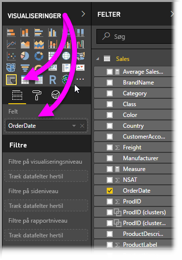
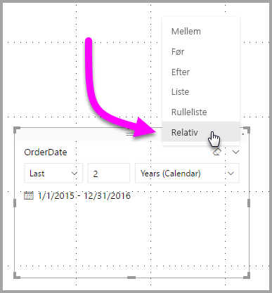
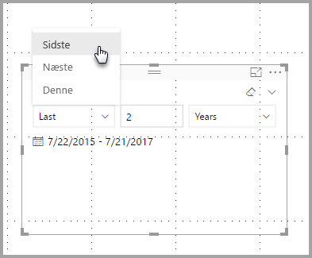
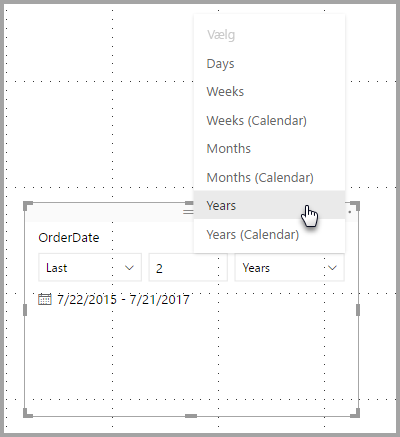
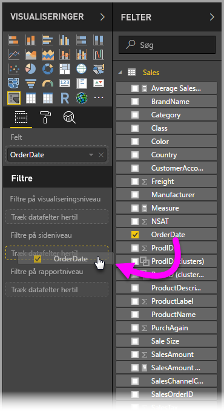
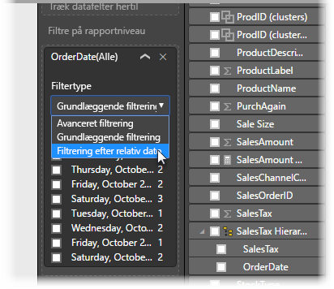
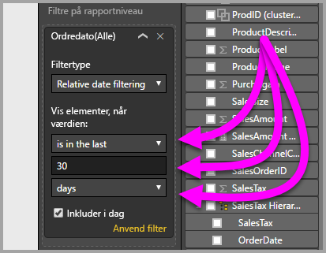

# Brug et relativt datoudsnit og -filter i Power BI Desktop
Med det **relative datoudsnit** eller det **relative datofilter** kan du anvende tidsbaserede filtre på en hvilken som helst datokolonne i datamodellen. Du kan f.eks. bruge det **relative datoudsnit** til kun at vise salgsdata, der er oprettet i løbet af de sidste 30 dage (eller måned eller kalendermåneder osv.). Og når du opdaterer dataene, anvender den relative tidsperiode automatisk den relevante relative datobegrænsning.

## Brug det relative datoområdeudsnit
Du kan bruge det relative datoudsnit på samme måde som alle andre udsnit. Du skal bare oprette et **udsnit**, der er synligt for din rapport, og derefter vælge en datoværdi for **Felt**-værdien. På følgende billede er feltet *OrderDate* markeret.

Hvis du vælger karaten i øverste højre hjørne af det **relative datoudsnit**, vises der en menu.

For det relative datoudsnit skal du vælge *Relativ*.

Du kan derefter vælge indstillingerne. Du har følgende valgmuligheder for den første rulleliste i det *relative datoudsnit*:

* Sidste
* Næste
* Denne

Disse valg vises på billedet nedenfor.

Den næste (midterste) indstilling i det *relative datoudsnit* gør det muligt at indtaste et tal for at definere det relative datoområde.

Den tredje indstilling giver dig mulighed for at vælge datomålingen. Du har følgende valgmuligheder:

* Dage
* Uger
* Uger (kalender)
* Måneder
* Måneder (kalender)
* År
* År (kalender)

Disse valg vises på billedet nedenfor.

Hvis du vælger *Måned* på denne liste og angiver 2 i den midterste indstilling, sker følgende: Hvis dags dato er 20. juli, viser de data, der er inkluderet i de visuals, som er begrænset af udsnittet, data for de to forrige måneder fra og med 20. maj og frem til 20. juli (dags dato).

Hvis du til sammenligning har valgt *Måneder (kalender)*, viser de begrænsede visuelle elementer data fra 1. maj til 30. juni (de to sidste hele kalendermåneder).

## Brug det relative datoområdefilter
Du kan også oprette et relativt datoområdefilter for din rapportside eller hele rapporten. Det kan du gøre ved blot at trække datofeltet til området **Filtre på sideniveau** eller **Filtre på rapporteringsniveau** i ruden **Felt** som vist på følgende billede.

Når du er der, kan du ændre det relative datoområde i forhold til den måde, som det **relative datoudsnit** er tilpasset. Vælg **Filtrering af relativ dato** på rullelisten **Filtertype**.

Når du har valgt **Filtrering af relativ dato**, du kan se tre sektioner, der skal redigeres, herunder et numerisk felt i midten, på samme måde som udsnittet.

Og det er det eneste, du skal gøre, når du bruger disse relative datobegrænsninger i dine rapporter.

## Begrænsninger og overvejelser
Følgende begrænsninger og overvejelser, der aktuelt gælder for det **relative datoområdeudsnit** og -filter.

* Datamodeller i **Power BI** indeholder ikke oplysninger om tidszone. Modeller kan gemme tider, men der er ingen angivelse af den tidszone, de er i.
* Udsnittet og filteret er altid baseret på tidspunktet i UTC-tid, så hvis du konfigurerer et filter i en rapport og sender det til en kollega i en anden tidszone, kan I begge to se de samme data. Du kan få vist data for et andet tidspunkt, end du forventer, hvis du ikke er i UTC-tidszonen.
* Data, der er registreret i en lokal tidszone, kan konverteres til UTC ved hjælp af **forespørgselseditoren**.

