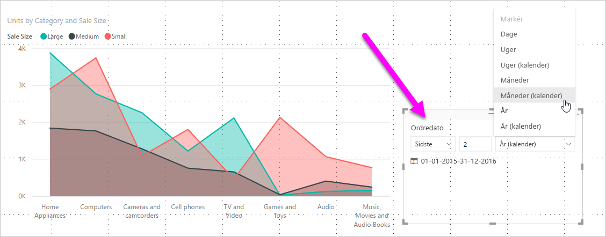
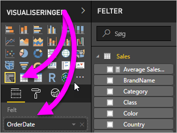
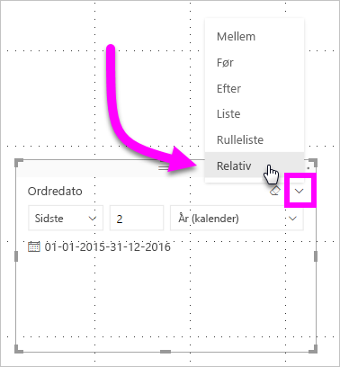
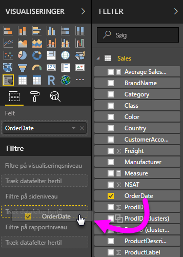
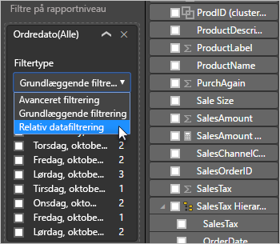
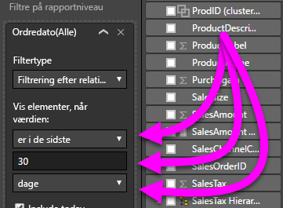

# Brug et relativt datoudsnit og -filter i Power BI Desktop

Med det **relative datoudsnit** eller det **relative datofilter** kan du anvende tidsbaserede filtre på en hvilken som helst datokolonne i datamodellen. Du kan f.eks. bruge det **relative datoudsnit** til kun at vise salgsdata, der er oprettet i løbet af de sidste 30 dage (eller måned eller kalendermåneder osv.). Når du opdaterer dataene, anvender den relative tidsperiode automatisk den relevante relative datobegrænsning.

## Brug udsnitsværktøjet til relative datoområder

Du kan bruge det relative datoudsnit på samme måde som alle andre udsnit. Opret en visualisering med et **udsnit** til din rapport, og vælg derefter en datoværdi for værdien **Felt**. På følgende billede har vi markeret feltet *Ordredato*.

Vælg udsnitsværktøjet på lærredet og derefter karaten i øverste højre hjørne af udsnitsvisualiseringen. Hvis visualiseringen indeholder data for datoer, vises indstillingen **Relativ** i menuen.

For det relative datoudsnit skal du vælge *Relativ*.

Du kan derefter vælge indstillingerne.

Du har følgende valgmuligheder for den første indstilling i det *relative datoudsnit*:

* Sidste

* Næste

* Denne

Den anden (midterste) indstilling i det *relative datoudsnit* gør det muligt at indtaste et tal for at definere det relative datoområde.

Den tredje indstilling giver dig mulighed for at vælge datomålingen. Du har følgende valgmuligheder:

* Dage

* Uger

* Uger (kalender)

* Måneder

* Måneder (kalender)

* År

* År (kalender)

Hvis du vælger **Måneder** på listen, og indtaster *2* i midterste indstilling, sker der følgende:

* Hvis dags dato er 20. juli,

* vises der data for de to foregående måneder i de data i visualiseringer, der er begrænset af udsnittet,

* fra og med d. 21. maj og frem til og med d. 20. juli (dags dato)

Hvis du til sammenligning har valgt *Måneder (kalender)* , viser de begrænsede visualiseringer data fra 1. maj til 30. juni (de to sidste hele kalendermåneder).

## Brug det relative datoområdefilter

Du kan også oprette et relativt datoområdefilter for din rapportside eller hele rapporten. Det kan du gøre ved at trække datofeltet til oversigten **Filtre på sideniveau** eller **Filtre på rapportniveau** i ruden **Felt**:

Når det er placeret der, kan du ændre det relative datoområde. Dette minder om den metode, du bruger til at tilpasse det **relative datoudsnit**. Vælg **Filtrering af relativ dato** på rullelisten **Filtertype**.

Når du har valgt **Filtrering af relativ dato**, kan du se tre sektioner, der skal ændres, herunder et numerisk felt i midten, ligesom i udsnitsværktøjet.

## Begrænsninger og overvejelser

Følgende begrænsninger og overvejelser, der aktuelt gælder for det **relative datoområdeudsnit** og -filter.

* Datamodeller i **Power BI** indeholder ikke oplysninger om tidszone. Modeller kan gemme tider, men der er ingen angivelse af den tidszone, de er i.

* Udsnittet og filteret er altid baseret på tidspunktet i UTC-tid. Hvis du konfigurerer et filter i en rapport og sender det til en kollega i en anden tidszone, ser I begge de samme data. Medmindre du befinder dig i UTC-tidszonen, skal du og din kollega tage højde for den tidsforskydning, der gælder for jer.

* Du kan konvertere data, der er hentet i en lokal tidszone, til UTC-tid ved hjælp af **forespørgselseditoren**.

## Næste trin

Få mere at vide om, hvordan du [bruger gruppering og gruppering i beholder i Power BI Desktop](../desktop-grouping-and-binning.md).
