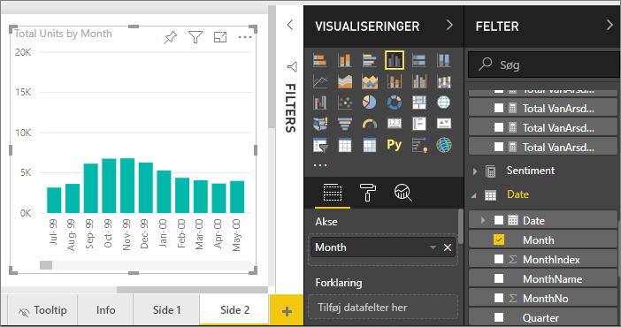
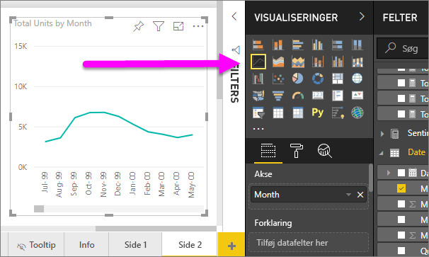
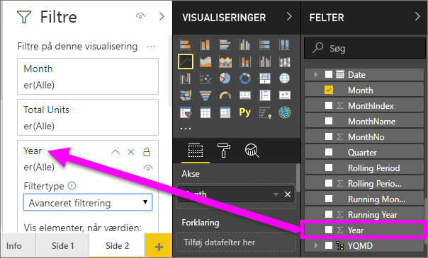
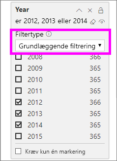
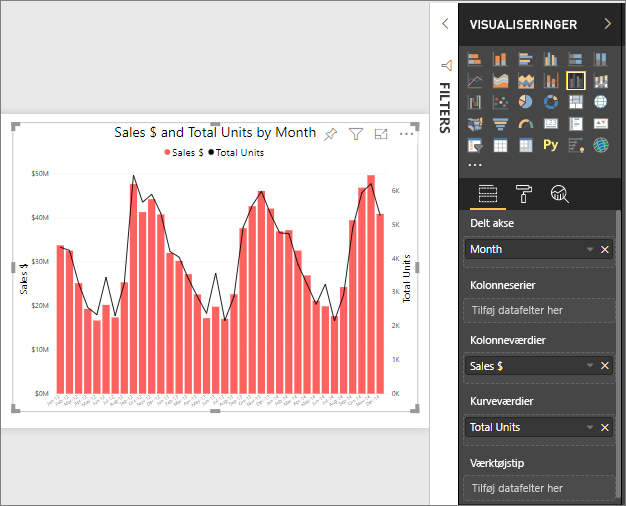

# Kurvediagrammer i Power BI
Et kurvediagram er en serie af datapunkter, der er repræsenteret af punktummer og forbundet med lige linjer. Et kurvediagram, der kan have en eller flere linjer. Kurvediagrammer har en X- og en Y-akse. 

## Opret et kurvediagram
Disse instruktioner Brug salg og Marketing Sample-app til at oprette et kurvediagram, der viser dette års salg efter kategori. Hvis du vil følge med, kan du få eksempelappen fra appsource.com.

1. Start på en tom rapportside. Hvis du bruger Power BI-tjenesten, skal du åbne rapporten i [Redigeringsvisning](../service-interact-with-a-report-in-editing-view.md).

2. Fra ruden Fields skal du vælge **SalesFact** \> **enheder i alt**, og vælg **dato** > **måned**.  Powerbi opretter et søjlediagram på dit rapportcanvas.

    

4. Konvertér til et kurvediagram ved at vælge skabelonen line chart i ruden visualiseringer. 

    
   

4. Filtrer din kurvediagram for at vise data i årevis 2012-2014. Hvis din filterruden er skjult, kan du udvide den nu. Fra ruden Fields skal du vælge **dato** \> **år** og træk den til ruden filtre. Slip det under overskriften **filtre på denne visual**. 
     
    

    Skift **avancerede filtre** til **grundlæggende filtre** , og vælg **2012**, **2013** og **2014**.

    

6. Du kan eventuelt [tilpasse størrelsen og farven på diagrammets tekst](power-bi-visualization-customize-title-background-and-legend.md). 

    

## Tilføj flere linjer i diagrammet
Kurvediagrammer kan have mange forskellige linjer. Og i nogle tilfælde kan værdierne på linjerne være så divergerende, at de ikke vise godt sammen. Lad os se på at tilføje ekstra linjer til vores aktuelle diagram, og Lær, hvordan du formaterer diagrammet, når de værdier, der er repræsenteret af linjerne, der er meget forskellige. 

### Tilføj flere linjer
I stedet for kigger på enheder i alt i alle områder, som en enkelt linje i diagrammet, Lad os Opdel ud af enheder i alt efter område. Tilføj flere linjer ved at trække **Geo** > **område** til brønden forklaring.

   

### Brug to Y-akser
Hvad nu, hvis du vil se nærmere på samlet salg og enheder i alt i det samme diagram? Salgstal er meget højere end enhed tal, så kurvediagrammet ubrugelige. Faktisk, vises den røde linje for enheder i alt skal være nul.

   

For at få vist yderst divergerende værdier i et diagram, kan du bruge et kombinationsdiagram. Du kan få mere at vide om kombinationsdiagrammer ved at læse [kombinationsdiagrammer i Power BI](power-bi-visualization-combo-chart.md). I eksemplet nedenfor, vi kan få vist salgs- og samlede enheder sammen på ét diagram ved at tilføje en anden Y-akse. 

   

## Overvejelser og fejlfinding
* Et kurvediagram, der kan ikke have to Y-akser.  Du skal bruge et kombinationsdiagram i stedet.
* Diagrammerne i ovenstående eksempler, var formateret til at Forøg skriftstørrelsen Skift skriftfarven for tilføje aksetitler, diagramtitel og forklaring af datacenteret, og start begge akser på nul og meget mere. Formateringsruden (ikonet med malerullen) har et uendelige tilkøb sæt af indstillinger for at gøre dine diagrammer se den måde, du ønsker. Der er den bedste måde at lære at åbne ruden formatering og udforske.

## Næste trin

[Visualiseringstyper i Power BI](power-bi-visualization-types-for-reports-and-q-and-a.md)

