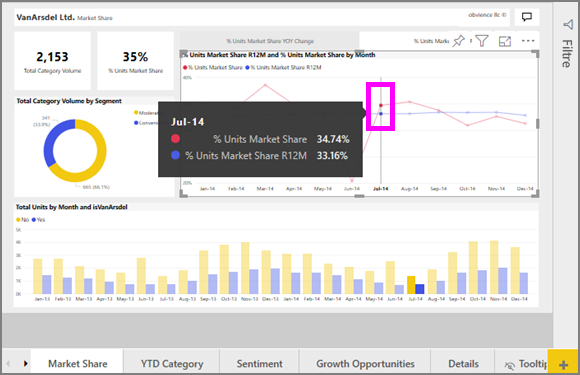

# Kurvediagrammer i Power BI
Et kurvediagram er en række datapunkter, der er repræsenteret af prikker og forbundet med lige linjer. Et kurvediagram kan have en eller flere linjer. Kurvediagrammer har en X- og en Y-akse. 

## Opret et kurvediagram
I denne vejledning bruges appen Sales and Marketing Sample til at oprette et kurvediagram, der viser dette års salg efter kategori. Hvis du vil følge med, skal du hente eksempelappen fra appsource.com.

1. Start på en tom rapportside. Hvis du bruger Power BI-tjenesten, skal du åbne rapporten i [redigeringsvisning](../service-interact-with-a-report-in-editing-view.md).

2. Fra ruden Felter skal du vælge **SalesFact** \> **Total units** og vælge **Date** > **Month**.  Power BI opretter et søjlediagram på dit rapportlærred.

    

4. Konvertér til et kurvediagram ved at vælge skabelonen for kurvediagrammer i ruden Visualiseringer. 

    
   

4. Filtrer dit kurvediagram, så det viser data for årene 2012-2014. Hvis filtreringsruden er skjult, skal du udvide den nu. I ruden Felter skal du vælge **Date**\>**Year** og trække det til filtreringsruden. Slip det under overskriften **Filters on this visual**. 
     
    

    Skift **Advanced filters** til **Basic filters**, og vælg **2012**, **2013** og **2014**.

    

6. Du kan eventuelt [tilpasse størrelsen og farven på diagrammets tekst](power-bi-visualization-customize-title-background-and-legend.md). 

    

## Tilføj flere kurver i diagrammet
Kurvediagrammer kan have mange forskellige kurver. Og i nogle tilfælde kan værdierne på kurverne være så divergerende, at det ikke er godt at vise dem sammen. Lad os se på, hvordan vi tilføjer ekstra kurver i vores nuværende diagram, og lær, hvordan du formaterer diagrammet, når de værdier, der er repræsenteret af kurverne, er meget forskellige. 

### Tilføj flere kurver
I stedet for at kigge på enheder i alt for alle områder som en enkelt kurve i diagrammet kan vi opdele enheder i alt efter område. Tilføj flere kurver ved at trække **Geo** > **Region** til området med forklaring.

   

### Brug to Y-akser
Hvad nu, hvis du vil se nærmere på det samlede salg og enheder i alt i det samme diagram? Salgstal er meget højere end antal enheder, så kurvediagrammet bliver ubrugeligt. Faktisk ser den røde kurve for enheder i alt ud til at være nul.

   

Hvis du vil have vist meget divergerende værdier i ét diagram, kan du bruge et kombinationsdiagram. Du kan få mere at vide om kombinationsdiagrammer ved at læse [Kombinationsdiagrammer i Power BI](power-bi-visualization-combo-chart.md). I eksemplet nedenfor kan vi få vist salg og enheder i alt sammen i ét diagram ved at tilføje endnu en Y-akse. 

   

## Fremhævning og krydsfiltrering
Du kan få mere at vide om brug af ruden Filters under [Føj et filter til en rapport](../power-bi-report-add-filter.md).

Hvis vi vælger et datapunkt i et kurvediagram, fører det til tværgående fremhævning og krydsfiltrering af andre visualiseringer på rapportsiden... og omvendt. Hvis du vil følge med, skal du åbne fanen **Markedsandel**.  

I et kurvediagram er et enkelt datapunkt skæringspunktet for et punkt på X- og Y-aksen. Når du vælger et datapunkt, tilføjer Power BI mærker, der angiver, hvilket punkt (for en enkelt kurve) eller hvilke punkter (hvis der er to eller flere kurver) der er kilden til den tværgående fremhævning og krydsfiltrering af de andre visualiseringer på rapportsiden. Hvis din visualisering er meget tæt, vælger Power BI det punkt, der er nærmest i forhold til, hvor du klikker på visualiseringen.

I dette eksempel har vi valgt et datapunkt, der omfatter: July 2014, %Units Market Share R12 på 33.16 og %Units Market Share på 34.74.

Bemærk, hvordan søjlediagrammet fremhæves på tværs, og hvordan måleren er krydsfiltreret.

Hvis du vil administrere, hvordan diagrammer krydsfremhæver og krydsfiltrerer hinanden, skal du se [Interaktioner mellem visualiseringer i en Power BI-rapport](../service-reports-visual-interactions.md)

## Overvejelser og fejlfinding
* Et kurvediagram kan ikke have to Y-akser.  Du skal i stedet bruge et kombinationsdiagram.
* I ovenstående eksempler blev diagrammerne formateret til at øge skriftstørrelsen, ændre skriftfarven, tilføje aksetitler, centrere diagramtitel og forklaring, starte begge akser på nul og meget mere. Formateringsruden (ikonet med malerrullen) indeholder et uendeligt antal indstillinger, du kan bruge til at få dine diagrammer til at se ud, som du ønsker det. Den bedste måde, du kan lære det på, er at åbne formateringsruden og udforske dem.

## Næste trin

[Visualiseringstyper i Power BI](power-bi-visualization-types-for-reports-and-q-and-a.md)

