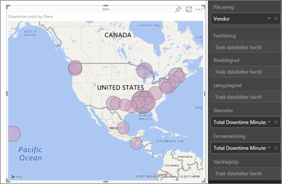
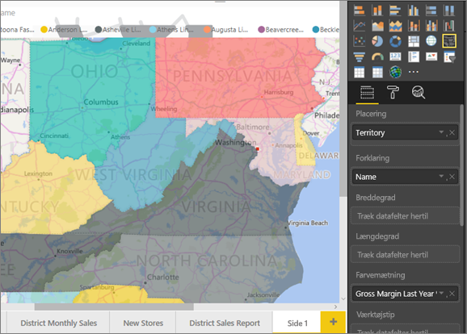
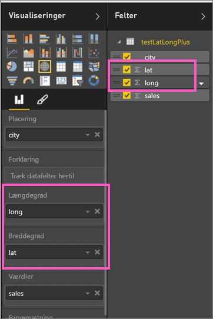
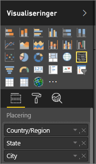

# Tip og tricks til Power BI-kortvisualiseringer
Power BI kan integreres med Bing Maps for at angive standardkortkoordinater (en proces, der kaldes geokodning), så du kan oprette kort. De bruger algoritmer til at identificere den korrekte placering, men nogle gange benyttes et kvalificeret gæt. Hvis Power BI forsøger, men ikke kan oprette kortvisualiseringen selv, bliver der gjort brug af Bing Kort. 

Du eller din administrator skal muligvis opdatere firewallen for at tillade adgang til URL-adresser, som Bing bruger til geokodning.  URL-adresserne er:
* https://dev.virtualearth.net/REST/V1/Locations
* https://platform.bing.com/geo/spatial/v1/public/Geodata
* https://www.bing.com/api/maps/mapcontrol

Hvis du vil øge sandsynligheden for en korrekt geokodning, kan du følge disse tip. De første par tip er praktiske, hvis du har adgang til selve datasættet. De næste tip er ting, du kan gøre i Power BI, hvis du ikke har adgang til datasættet. Og det sidste sæt er en liste over URL-adresser

## Hvad sendes der til Bing Maps?
Power BI-tjenesten og Power BI Desktop sender de geodata til Bing, der skal bruges til at oprette kortvisualiseringen. Dette kan omfatte dataene i felterne **Placering**, **Breddegrad** og **Længdegrad** samt geofelter under filtrene under **Rapporteringsniveau**, **Sideniveau** eller **Visualiseringsniveau**. Det er korttypen, som afgør, hvad der sendes. Hvis du vil vide mere, skal du læse om [beskyttelse af personlige oplysninger i Bing Maps](https://go.microsoft.com/fwlink/?LinkID=248686).

* Hvis der er angivet længdegrad og breddegrad for et kort (boblekort), sendes der ingen data til Bing. Ellers sendes data i de to buckets **Placering** (og Filter) til Bing.     
* Kartogrammer kræver et felt i bucket'en **Placering**, selvom længdegrad og breddegrad er angivet. Uanset hvilke data der er angivet i de tre buckets **Placering**, **Længdegrad** og **Breddegrad**, sendes de til Bing.
  
    I eksemplet herunder bruges feltet **Vendor** til geokodning, så alle leverandørdata sendes til Bing. Data fra felterne **Størrelse** og **Farvemætning** sendes ikke til Bing.
  
    
  
    I det andet eksempel herunder bruges feltet **Territory** til geokodning, så alle områdedata sendes til Bing. Data fra felterne **Forklaring** og **Farvemætning** sendes ikke til Bing.
  
    

## I datasættet: tip til at forbedre det underliggende datasæt
Hvis du har adgang til det datasæt, der bruges til at oprette kortvisualiseringen, er der nogle ting, du kan gøre, for at øge sandsynligheden for korrekt geokodning.

**1. Kategoriser geografiske felter i Power BI Desktop**

I Power BI Desktop kan du sikre, at felterne er korrekt geokodede ved at angive *Datakategori* for datafelterne. Vælg den ønskede tabel, gå til båndet **Avanceret**, og angiv **Datakategori** til **Adresse**, **By**, **Kontinent**, **Land/område**, **Amt**, **Postnummer**, **Stat** eller **Provins**. Bing bruger disse datakategorier til korrekt kodning af dataene. Du kan finde flere oplysninger under [Kategoriser data i Power BI Desktop](../desktop-data-categorization.md). Hvis du bruger en dynamisk forbindelse til SQL Server Analysis Services, skal du angive datakategoriseringen uden for Power BI ved hjælp af [SQL Server Data Tools (SSDT)](https://docs.microsoft.com/sql/ssdt/download-sql-server-data-tools-ssdt).

**2. Brug mere end én kolonne for placeringen.**     
 Nogle gange er det ikke tilstrækkeligt at indstille datakategorier, for at Bing kan skabe de rette resultater. Nogle betegnelser er tvetydige, fordi placeringen findes i flere lande eller områder. For eksempel findes der en by med navnet ***Southampton*** i både England, Pennsylvania og New York.

Power BI bruger Bings [ustrukturerede URL-skabelontjeneste](https://msdn.microsoft.com/library/ff701714.aspx) til at hente breddegrad- og længdegradkoordinater baseret på adresseværdierne for lande. Hvis dine data ikke indeholder tilstrækkelige placeringsdata, skal du tilføje disse kolonner og kategorisere dem.

 Hvis du for eksempel kun har kolonnen City, kan det være svært for Bing at finde den korrekte geokodning. Tilføj flere geokolonner for at gøre placeringen entydig.  Nogle gange kræver det, at du tilføjer en eller flere placeringskolonner i datasættet – i dette filælde stat/provins. Og glem ikke at kategorisere dataene korrekt (se nr. 1 herover).

Sørg for, at hvert felt kun har de specifikke oplysninger, der er knyttet til kategoriseringen.  Feltet for By skal for eksempel være **Southampton** og ikke **Southampton, New York**.  Felterne for Adresse skal være **1 Microsoft Way** og ikke **1 Microsoft Way, Redmond, WA**.

**3. Brug en specifik breddegrad og længdegrad**

Føj værdier for breddegrad og længdegrad til dit datasæt. Dette fjerner tvetydigheden og returnerer resultaterne hurtigere. Felterne Breddegrad og Længdegrad skal være i formatet *Decimaltal*. Det kan du angive i datamodellen.

<iframe width="560" height="315" src="https://www.youtube.com/embed/ajTPGNpthcg" frameborder="0" allowfullscreen></iframe>

**4. Brug kategorien Sted for kolonner med komplette placeringsoplysninger**

Selvom vi opfordrer dig til at bruge geografiske hierarkier i dine kort, så kan du angive datakategoriseringen til **Sted**, hvis du kun kan bruge en enkelt placeringskolonne med de fuldstændige geografiske oplysninger. Hvis dataene i din kolonne for eksempel indeholder fulde adresser som 1 Microsoft Way, Redmond Washington 98052, vil den generaliserede datakategori fungere bedst med Bing. 

## I Power BI: tip til at opnå bedre resultater, når der bruges kortvisualiseringer
**1. Brug felterne Breddegrad og Længdegrad (hvis de findes)**

Hvis du arbejder i Power BI, og dit datasæt indeholder felter for Breddegrad og Længdegrad, skal du bruge dem.  Power BI har særlige felter, der gør det nemt at angive utvetydige kortdata. Du skal blot trække feltet med breddegradsdata til området **Visualiseringer > Breddegrad**.  Og gøre det samme med dine længdegradsdata. Hvis du gør dette, skal du også udfylde feltet *Placering*, når du opretter dine visualiseringer. Ellers bliver dataene som standard aggregeret, så breddegrad og længdegrad bliver parret på statniveau og ikke på byniveau.

 

## Brug geografiske hierarkier, så du kan få vist detaljer på flere "niveauer" for placeringen
Hvis dit datasæt allerede indeholder forskellige niveauer af placeringsdata, kan du og dine kolleger bruge Power BI til at oprette *geografiske hierarkier*. Det kan du gøre ved at trække mere end ét felt til feltet **Placering**. Når felterne bruges sammen på denne måde, bliver de til et geografisk hierarki. I eksemplet nedenfor har jeg tilføjet geofelter for: land/område, stat og by. I Power BI kan du og dine kolleger vælge at få vist flere eller færre detaljer i det geografiske hierarki.

  

   

Når du bruger detailudledning med geografiske hierarkier, er det vigtigt at vide, hvordan knapperne virker, og hvad der sendes til Bing Maps. 

* Knappen længst til højre, som kaldes Analysetilstand , kan bruges til at vælge en kortplacering og gå længere ned i placeringen ét niveau ad gangen. Hvis du for eksempel aktiverer Analysér ned og klikker på North America, kommer du til næste niveau i hierarkiet, som er stater i Nordamerika. For geokodning sender Power BI kun data om lande og stater for Nordamerika til Bing Maps.  
* Til venstre er der 2 andre analyseindstillinger. Den første indstilling,  , går til det næste niveau i hierarkiet for alle placeringer på en gang. Hvis du for eksempel ser på lande og derefter bruger denne indstilling for at få til det næste niveau, som er stater, vil Power BI vise data om stater for alle lande. For geokodning sender Power BI data om stater (ikke om lande) til Bing Maps for alle placeringer. Denne indstilling er praktisk, hvis hvert niveau i hierarkiet ikke relaterer til det overliggende niveau. 
* Den anden indstilling,  , svarer til Analysér ned, men du behøver ikke at klikke på kortet.  Det udvides ned til det næste niveau i hierarkiet og husker konteksten for det aktuelle niveau. Hvis du for eksempel kigger på lande og vælger dette ikon, flytter du ned til næste niveau i hierarkiet, som er stater. For geokodning vil Power BI sende data for hver stat og det relaterede land til Bing Maps for at få en mere korrekt geokodning. På de fleste kort vil du enten bruge denne indstilling eller indstillingen Analysér ned længst til højre, så du kan sende flest mulige oplysninger til Bing for at få de mest præcise placeringsoplysninger. 

## Næste trin
[Detailudledning i en visualisering i Power BI](../consumer/end-user-drill.md)

[Power BI-visualiseringer](power-bi-report-visualizations.md)

Har du flere spørgsmål? [Prøv at spørge Power BI-community'et](http://community.powerbi.com/)

