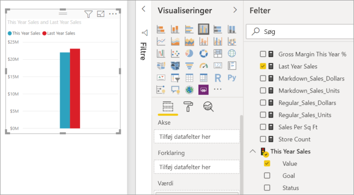
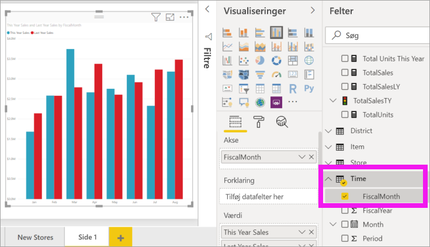
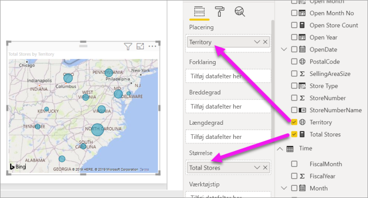
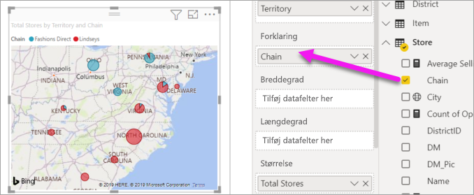

# Del 2, Føj visualiseringer til en rapport i Power BI

[!INCLUDE [power-bi-visuals-desktop-banner](../includes/power-bi-visuals-desktop-banner.md)]

I [Del 1](power-bi-report-add-visualizations-i.md) oprettede du en grundlæggende visualisering ved at markere afkrydsningsfelter ud for feltnavne.  I Del 2 lærer du, hvordan du bruger træk og slip samt benytter ruderne **Felter** og **Visualiseringer** til at oprette og redigere visualiseringer.

## Opret en ny visualisering
I dette selvstudium gennemgår vi vores datasæt for detailhandelanalyse og opretter nogle få vigtige visualiseringer.

## Forudsætninger

I dette selvstudium bruges [PBIX-filen med eksemplet på detailhandelsanalyse](https://download.microsoft.com/download/9/6/D/96DDC2FF-2568-491D-AAFA-AFDD6F763AE3/Retail%20Analysis%20Sample%20PBIX.pbix).

1. Vælg **Fil** > **Åbn** på menulinjen i øverste venstre afsnit af Power BI Desktop
   
2. Find din kopi af **PBIX-filen med eksemplet Detailhandelsanalyse**

1. Åbn **PBIX-filen med eksemplet Detailhandelsanalyse** i rapportvisning .

1. Markér  for at tilføje en ny side.

## Tilføj visualiseringer i rapporten

Opret en visualisering ved at vælge et felt i ruden **Felter**. Den type visualisering, der oprettes, afhænger af den valgte felttype. Power BI bruger datatypen til at afgøre, hvilken visualisering der skal bruges til at vise resultaterne. Du kan ændre visualiseringen ved at vælge et andet ikon i ruden Visualiseringer. Husk, at det ikke er alle visualiseringer, som kan vise dine data. Geografiske data vises f.eks. ikke særligt godt i et tragtformet diagram eller et kurvediagram. 

### Tilføj et områdediagram, som indeholder en oversigt over dette års salg sammenlignet med sidste år

1. I tabellen **Sales** skal du vælge **This Year Sales** > **Value** og **Last Year Sales**. Power BI opretter et søjlediagram.  Dette diagram er lidt interessant, og du vil gerne se mere. Hvordan ser salget ud pr. måned?  
   
   

2. I tabellen Tid skal du trække **Regnskabsmåned** ind i området **Akse**.  
   

3. [Skift visualiseringen](power-bi-report-change-visualization-type.md) til et områdediagram.  Der er mange visualiseringstyper at vælge imellem. Se [beskrivelser af hver, tip til bedste praksis og selvstudier](power-bi-visualization-types-for-reports-and-q-and-a.md) for at få hjælp til at vælge, hvilken type du vil bruge. Vælg ikonet for områdediagram i ruden Visualiseringer .

4. Sortér visualiseringen ved at vælge **Flere handlinger** (...) og vælge **Sortér efter** >  **Regnskabsmåned**.

5. [Tilpas størrelsen af visualiseringen](power-bi-visualization-move-and-resize.md) ved at vælge visualiseringen, tage fat i en af konturcirklerne og trække. Gør den bred nok, så rullepanelet fjernes, men lille nok, så der er plads nok til at tilføje endnu en visualisering.
   
   
6. [Gem rapporten](../service-report-save.md).

### Tilføj en kortvisualisering med salg efter placering

1. I tabellen **Store** skal du vælge **Område**. Træk **Total Stores** ind i området Størrelse. Power BI genkender, at Område er en placering, og opretter en visualisering med et kort.  
   

2. Tilføj en forklaring.  Hvis du vil se dataene efter butiksnavn, skal du trække **Butik** > **Kæde** til området Forklaring.  
   

## Næste trin
* Få mere at vide om [Visualiseringer i Power BI-rapporter](power-bi-report-visualizations.md).  
* Har du flere spørgsmål? [Prøv at spørge Power BI-community'et](https://community.powerbi.com/)

