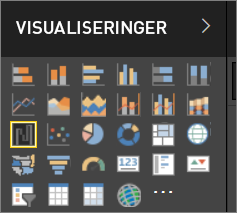

# Visualiseringer i Power BI-rapporter

Visualiseringer viser indsigter, der er blevet registreret i dataene. En rapport i Power BI har muligvis en enkelt side med én visualisering, eller den kan have sider fulde af visualiseringer. I Power BI-tjenesten kan visualiseringer [fastgøres fra rapporter til dashboards](../service-dashboard-pin-tile-from-report.md).

Det er vigtigt at skelne mellem rapporters *forfattere* og rapporters *forbrugere* Hvis du er personen, der opretter eller redigerer rapporten, så er du forfatter.  Forfattere har tilladelse til at redigere rapporten og dens underliggende datasæt. Det betyder, at du i Power BI Desktop kan åbne datasættet i Datavisning og oprette visualiseringer i Rapportvisning. Det betyder, at du i Power BI-tjenesten kan åbne datasæt eller rapporter i rapporteditoren i [Redigeringsvisning](../consumer/end-user-reading-view.md). Hvis en rapport eller et dashboard er blevet [delt med dig](../consumer/end-user-shared-with-me.md), så er du rapportens **forbruger**. Du kan få vist og interagere med rapporten og dens visualiseringer, men du kan ikke gemme ændringerne.

Der er mange forskellige typer visualiseringer, der fås direkte fra ruden VISUALISERINGER i Power BI.

Du kan desuden se mangle flere valgmuligheder ved at besøge [webstedet for Microsoft AppSource-community'et](https://appsource.microsoft.com), hvor du kan finde og [downloade](https://appsource.microsoft.com/marketplace/apps?page=1&product=power-bi-visuals) [brugerdefinerede visualiseringer](../developer/custom-visual-develop-tutorial.md) leveret af Microsoft og community'et.

<iframe width="560" height="315" src="https://www.youtube.com/embed/SYk_gWrtKvM?list=PL1N57mwBHtN0JFoKSR0n-tBkUJHeMP2cP" frameborder="0" allowfullscreen></iframe>

  Hvis du ikke har erfaring med Power BI, eller hvis du har brug for at opfriske din viden, kan du bruge linkene nedenfor til at lære det grundlæggende om Power BI-visualiseringer.  Alternativt kan du bruge indholdsfortegnelsen (til venstre for denne artikel) til at finde flere praktiske oplysninger.

## Tilføj en visualisering i Power BI

[Opret visualiseringer](power-bi-report-add-visualizations-i.md) på siderne i dine rapporter. Gennemse [listen over visualiseringer og vores selvstudier om visualiseringer.](power-bi-visualization-types-for-reports-and-q-and-a.md) 

## Upload en brugerdefineret visualisering, og brug den i Power BI

Tilføj en brugerdefineret visualisering, som du selv har oprettet, eller som du har fundet på [webstedet for Microsoft AppSource-community'et](https://appsource.microsoft.com/marketplace/apps?product=power-bi-visuals). Er du i det kreative hjørne? Dyk ned i kildekoden, og brug vores [udviklerværktøjer](../developer/custom-visual-develop-tutorial.md) til at oprette en ny visualiseringstype, og [del den med community'et](../developer/office-store.md). Hvis du vil have mere at vide om udvikling af brugerdefinerede visualiseringer, kan du se [Udvikling af en brugerdefineret visualisering i Power BI](../developer/custom-visual-develop-tutorial.md).

## Ret visualiseringstypen

Prøv at [vælge en anden type visualisering](power-bi-report-change-visualization-type.md) for at se, hvilken der fungerer bedst med dine data.

## Fastgør visualiseringen

Når du har fået tilpasset visualiseringen til det, du har brug for i Power BI-tjenesten, kan du [fastgøre den på et dashboard](../service-dashboard-pin-tile-from-report.md) som et felt. Hvis du ændrer visualiseringen, der bruges i rapporten, når du har fastgjort den, så ændres feltet på dashboardet ikke – et kurvediagram forbliver et kurvediagram, selvom du har ændret det til et kransediagram i rapporten.

## Næste trin

* [Visualiseringstyper i Power BI](power-bi-visualization-types-for-reports-and-q-and-a.md)
* [Brugerdefinerede visualiseringer](../power-bi-custom-visuals.md)