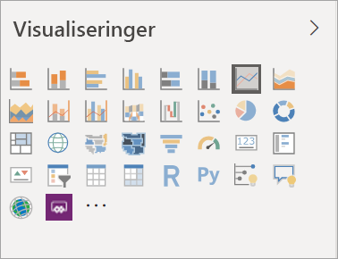
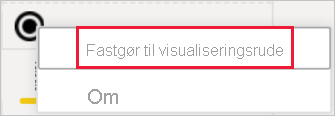
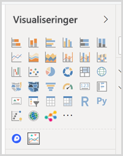
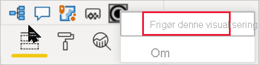

# Visualiseringer i Power BI-rapporter

[!INCLUDE[consumer-appliesto-yyyn](../includes/consumer-appliesto-yyyn.md)]    

Visualiseringer (kaldes også visuals) viser indsigt fra dine data. En rapport i Power BI har muligvis en enkelt side med én visual, eller den kan have sider fulde af visuals. I Power BI-tjenesten kan visualiseringer [fastgøres fra rapporter til dashboards](../create-reports/service-dashboard-pin-tile-from-report.md).

Det er vigtigt at skelne mellem rapporternes *designere* og *forbrugere*.  Hvis du er den person, der opretter eller redigerer rapporten, er du designer.  Designere har tilladelse til at redigere rapporten og dens underliggende datasæt. Det betyder, at du i Power BI Desktop kan åbne datasættet i Datavisning og oprette visuals i Rapportvisning. Det betyder, at du i Power BI-tjenesten kan åbne datasættet eller rapporten i rapporteditoren i [Redigeringsvisning](../consumer/end-user-reading-view.md). Hvis en rapport eller et dashboard er blevet [delt med dig](../consumer/end-user-shared-with-me.md), så er du rapportens *forbruger*. Du kan få vist og interagere med rapporten og dens visualiseringer, men du kan ikke foretage lige så mange ændringer, som en *designer* kan.

Der er mange forskellige typer visualiseringer, der er tilgængelige direkte fra ruden Visualiseringer i Power BI.

Flere Power BI-visualiseringer er tilgængelige fra [webstedet for Microsoft AppSource-community'et](https://appsource.microsoft.com). I AppSource kan du gennemse og [downloade](https://appsource.microsoft.com/marketplace/apps?page=1&product=power-bi-visuals) [Power BI-visuals](../developer/visuals/custom-visual-develop-tutorial.md), der leveres af Microsoft og community'et.

Hvis du ikke har erfaring med Power BI, eller hvis du har brug for at opfriske din viden, kan du bruge linkene nedenfor til at lære det grundlæggende om Power BI-visualiseringer.  Alternativt kan du bruge indholdsfortegnelsen (til venstre for denne artikel) til at finde flere praktiske oplysninger.

## Tilføj en visualisering i Power BI

[Opret visualiseringer](power-bi-report-add-visualizations-i.md) på siderne i dine rapporter. Gennemse [listen over visualiseringer og vores selvstudier om visualiseringer.](power-bi-visualization-types-for-reports-and-q-and-a.md) 

## Upload en visualisering fra en fil eller fra AppSource

Tilføj en visualisering, som du selv har oprettet, eller som du har fundet på [webstedet for Microsoft AppSource-community'et](https://appsource.microsoft.com/marketplace/apps?product=power-bi-visuals). Er du i det kreative hjørne? Dyk ned i kildekoden, og brug vores [udviklerværktøjer](../developer/visuals/custom-visual-develop-tutorial.md) til at oprette en ny visualiseringstype, og [del den med community'et](../developer/visuals/office-store.md). Hvis du vil have mere at vide om udvikling af Power BI-visualiseringer, kan du se [Udvikling af en visualisering i Power BI](../developer/visuals/custom-visual-develop-tutorial.md).

## Tilpas din visualiseringsrude

Du kan tilpasse visualiseringsruden ved at tilføje og fjerne Power BI-visualiseringer fra den. Hvis du har fjernet standardvisualiseringer fra visualiseringsruden, kan du gendanne ruden til standard og vende tilbage til alle standardvisualiseringer.

### Føj en visualisering til visualiseringsruden

Hvis du finder ud at, at du bruger den samme visualisering på tværs af mange rapporter, kan du føje visualiseringen til din visualiseringsrude. Tilføjelse af visualiseringer gælder for AppSource-visualiseringer, visualiseringer af organisationselementer og visualiseringer fra filer. Hvis du vil tilføje en visualisering, skal du højreklikke på den.

Når en visualisering er fastgjort, flyttes den til liveudgaven sammen med de andre standardvisualiseringer. Denne visualisering er nu knyttet til den konto, du er logget på. Det betyder, at alle nye rapporter, du skaber, automatisk vil have denne visualisering inkluderet, forudsat at du er logget på. Du behøver ikke længere at tilføje en bestemt visualisering, som du jævnligt bruger, til hver enkelt rapport.

### Fjern en visualisering fra visualiseringsruden

Hvis du stopper med at bruge en visualisering regelmæssigt, kan du højreklikke på den og fjerne den fra visualiseringsruden. Alle typer visualiseringer kan fjernes fra visualiseringsruden, herunder standard-, fil-, organisations- og AppSource-visualiseringer.

### Gendan visualiseringsruden

Gendannelsen af visualiseringsruden gælder kun for standardvisualiseringer. Visualiseringer, der er føjet til visualiseringsruden, påvirkes ikke, og de forbliver tilgængelige i visualiseringsruden. Hvis du vil fjerne AppSource eller visualiseringsfiler fra visualiseringsruden, skal du gøre det manuelt.

Hvis du vil gendanne visualiseringsruden til standard, skal du klikke på flere indstillinger og vælge **Gendan standardvisualiseringer**.

## Ret visualiseringstypen

Prøv at [vælge en anden type visualisering](power-bi-report-change-visualization-type.md) for at se, hvilken der fungerer bedst med dine data.

## Fastgør visualiseringen

Når du har fået tilpasset visualiseringen til det, du har brug for i Power BI-tjenesten, kan du [fastgøre den på et dashboard](../create-reports/service-dashboard-pin-tile-from-report.md) som et felt. Hvis du ændrer den visualisering, der bruges i rapporten, efter at du har fastgjort den, ændres feltet på dashboardet ikke. Hvis det var et kurvediagram, forbliver det et kurvediagram, selvom du har ændret det til et kransediagram i rapporten.

## Begrænsninger og overvejelser
- Afhængigt af datakilden og antallet af felter (målinger eller kolonner) kan indlæsningen af en visualisering muligvis gå langsomt.  Det anbefales at begrænse visualiseringer til 10-20 felter i alt – både af hensyn til læsbarheden og ydeevnen. 

- Den øvre grænse for visualiseringer er 100 felter (målinger eller kolonner). Hvis din visualisering ikke kan indlæses, kan du prøve at reducere antallet af felter.

## Næste trin

* [Visualiseringstyper i Power BI](power-bi-visualization-types-for-reports-and-q-and-a.md)
* [Power BI-visuals](../developer/visuals/power-bi-custom-visuals.md)
