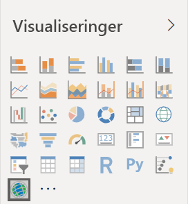
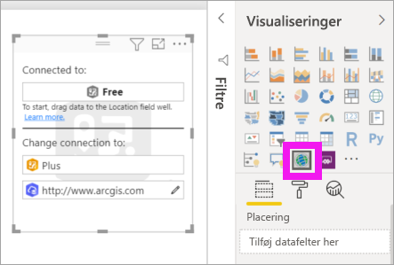
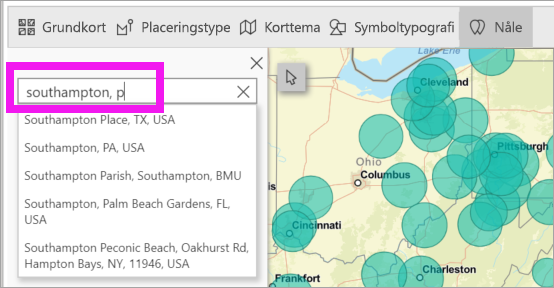
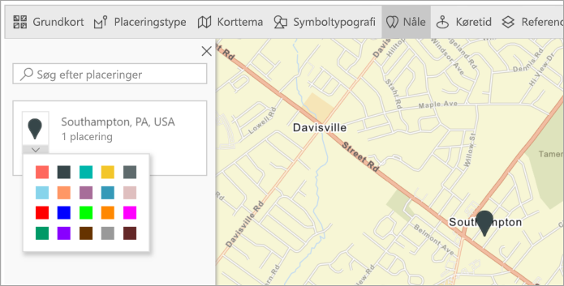
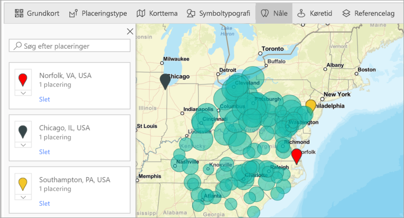
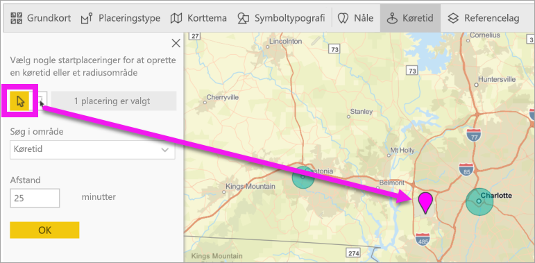
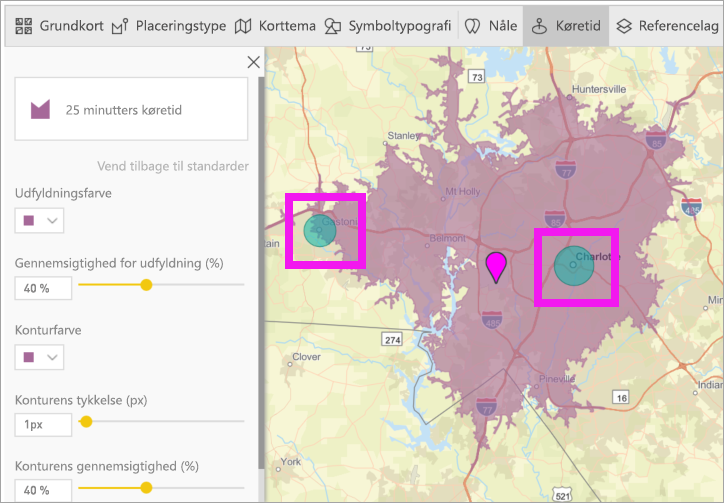
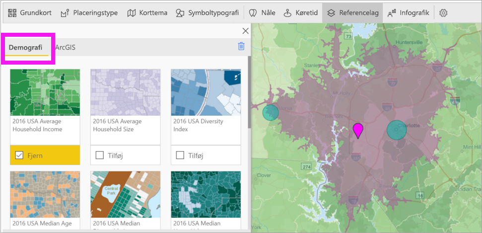
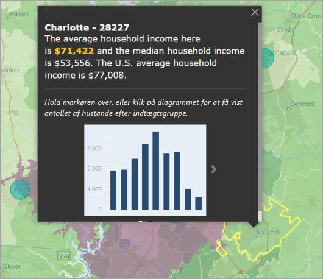

# Opret ArcGIS Maps i Power BI Desktop

[!INCLUDE [power-bi-visuals-desktop-banner](../includes/power-bi-visuals-desktop-banner.md)]

Dette selvstudium ses ud fra synspunktet for en person, der opretter et kort af typen ArcGIS Maps for Power BI. Når en *designer* deler et kort af typen ArcGIS Maps for Power BI med en kollega, kan denne kollega få vist og interagere med kortet, men ikke gemme nogen ændringer. Du kan finde flere oplysninger om visning af et ArcGIS-kort i [Interaktion med ArcGIS Maps for Power BI](power-bi-visualizations-arcgis.md).

Kombinationen af ArcGIS-kort og Power BI tager kort til et helt nyt niveau, som involverer mere end præsentation af punkter på et kort. Du kan vælge mellem grundlæggende kort, placeringstyper, temaer, symboltypografier og referencelag til at oprette fantastiske informative kortvisualiseringer. Kombinationen af autoritative datalag på et kort med rumlige analyser giver en bedre forståelse af dataene i visualiseringen.

 Selvom du ikke kan oprette et kort af typen ArcGIS Maps for Power BI på en mobilenhed, kan du godt få det vist og interagere med det. Se [Interaktion med ArcGIS-kort](power-bi-visualizations-arcgis.md).

> [!TIP]
> GIS står for Geographic Information Systems.

Nedenstående eksempel bruger et mørkegråt canvas til at vise det regionale salg som et termisk kort i forhold til et demografisk lag for medianen for den disponible indtægt i 2016. Som du vil se, hvis du læser videre, har du næsten ubegrænsede kortmuligheder, demografiske data og endnu mere overbevisende kortvisualiseringer, når du bruger ArcGIS Maps for Power BI, så du kan fortælle din historie på den bedst mulige måde.

> [!TIP]
> På [Esris side om ArcGIS Maps for Power BI](https://www.esri.com/powerbi) kan du se mange eksempler og læse anbefalinger. Se derefter Esris [side med introduktion til ArcGIS Maps for Power BI](https://doc.arcgis.com/en/maps-for-powerbi/get-started/about-maps-for-power-bi.htm).

## Brugerens samtykke
ArcGIS Maps for Power BI leveres af Esri (https://www.esri.com). Din brug af ArcGIS Maps for Power BI er omfattet af Esris vilkår og politik for beskyttelse af personlige oplysninger. Power BI-brugere, der gerne vil bruge ArcGIS-kort til visuelle elementer i Power BI, skal acceptere dialogboksen til samtykke.

**Ressourcer**

[Vilkår](https://go.microsoft.com/fwlink/?LinkID=826322)

[Politik for beskyttelse af personlige oplysninger](https://go.microsoft.com/fwlink/?LinkID=826323)

[Produktsiden med ArcGIS Maps for Power BI](https://www.esri.com/powerbi)

## Forudsætninger

I dette selvstudium bruges Power BI Desktop og PBIX-filen med [eksemplet på detailhandelsanalyse](https://download.microsoft.com/download/9/6/D/96DDC2FF-2568-491D-AAFA-AFDD6F763AE3/Retail%20Analysis%20Sample%20PBIX.pbix). ArcGIS Maps for Power BI kan også oprettes ved hjælp af Power BI-tjenesten. 

1. Vælg **Fil** \> **Åbn** i øverste venstre afsnit af menulinjen
   
2. Find **PBIX-filen med eksemplet Detailhandelsanalyse**, som er gemt på din lokale maskine.

1. Åbn **Retail Analysis Sample** i rapportvisningen .

1. Markér  for at tilføje en ny side.

   
## Opret en visualisering med et kort af typen ArcGIS Maps for Power BI

Se, hvordan Will opretter forskellige visualiseringer, og følg derefter trinnene nedenfor for at prøve det selv ved hjælp af [PBIX-filen med eksemplet på detailhandelsanalyse](../sample-datasets.md).
    

   > [!NOTE]
   > I denne video bruges en ældre version af Power BI Desktop.
   > 

> [!VIDEO https://www.youtube.com/embed/EKVvOZmxg9s]

1. Vælg ikonet for ArcGIS Maps for Power BI i ruden Visualiseringer.
   
        

2. I Power BI føjes der en tom skabelon til rapportlærredet. Til dette selvstudium bruger vi den gratis version.
   
   

3. Træk et datafelt fra ruden **Fields** (Felter) til filsættet **Location** (Placering) eller **Latitude** (Breddegrad) og/eller **Longitude** (Længdegrad). I dette eksempel bruger vi **Butik > By**.
   
   > [!NOTE]
   > ArcGIS Maps for Power BI registrerer automatisk, hvis de felter, som du har valgt, bedst kan ses som en figur eller et punkt på et kort. Du kan tilpasse standarden i indstillingerne (se nedenfor).
   > 
   > 
   
    

4. Fra feltet **Fields** (Felter) skal du trække en måling til filsættet **Size** (Størrelse) for at justere, hvordan dataene vises. I dette eksempel bruger vi **Salg > Sidste års salg**.
   
    

Du har oprettet dit første kort af typen ArcGIS Maps for Power BI. Nu kan du finpudse og formatere kortet ved hjælp af grundlæggende kort, placeringstyper, temaer og meget mere.

## Indstillinger og formatering for ArcGIS Maps for Power BI
Sådan får du adgang til formateringsfunktionerne i **ArcGIS Maps for Power BI**:

1. Få adgang til yderligere funktioner ved at vælge **Flere indstillinger** (...) i øverste højre hjørne af visualiseringen, og vælg derefter **Rediger**.
   
   
   
   Visualiseringen udvides, og de tilgængelige funktioner vises øverst. Der åbnes en opgaverude for hver funktion, når den er blevet valgt, med mere detaljerede indstillinger. 
   
   
   

> [!TIP]
> **Esri** leverer [omfattende dokumentation](https://go.microsoft.com/fwlink/?LinkID=828772) om funktionssættet i **ArcGIS Maps for Power BI**.

### Grundlæggende kort
Der findes fire grundlæggende kort: Dark Gray Canvas, Light Gray Canvas, OpenStreetMap og Streets.  *Gader* er ArcGIS' grundlæggende standardkort.

Hvis du vil anvende et grundlæggende kort, skal du vælge det i opgaveruden.

### Placeringstype
ArcGIS Maps for Power BI finder automatisk den bedste måde at vise data på et kort på. Den vælger fra punkter og grænser. Indstillingerne for placeringstype giver dig mulighed for at tilpasse disse valg.

**Boundaries** (Grænser) fungerer kun, hvis dine data indeholder geografiske standardværdier. ArcGIS Maps for Power BI finder automatisk ud af, hvilken figur der skal vises på kortet. Geografiske standardværdier omfatter lande, områder, postnumre osv. Men ligesom med geokodning kan Power BI muligvis ikke registrere, at et felt skal være en grænse som standard, eller det kan måske ikke finde en grænse for dine data.  

### Korttema
Der findes fire korttemaer. Power BI vælger automatisk enten temaet **Kun placering** eller **Størrelse** ud fra de felter, du har føjet til de to buckets **Placering** og **Størrelse**. Vores kort har som standard **Størrelse**, da vi føjede felter til begge buckets. Prøv de andre temaer, og vend tilbage til **Størrelse**, før du går videre til næste trin.  

<table>
<tr><th>Tema</th><th>Beskrivelse</th>
<tr>
<td>Kun placering</td>
<td>Indsætter datapunkter eller udfyldte grænser på kortet ud fra de felter, du føjede til bucket'en Placering.</td>
</tr>
<tr>
<td>Termisk kort</td>
<td>Indsætter intensiteten af dataene på kortet. Områder med højere aktivitet eller værdi er repræsenteret af stærkere og lysende farver. </td>
</tr>
<tr>
<td>Størrelse</td>
<td>Indsætter datapunkter på kortet ud fra de felter, du føjede til bucket'en Størrelse.</td>
</tr>
<tr>
<td>Clustering</td>
<td>Punkter inden for den angivne radius af klyngen grupperes i et enkelt symbol, der repræsenterer antallet af punkter i det pågældende område på kortet. </td>
</tr>
</table>

### Symboltypografi
Symboltypografier giver dig mulighed for at tilpasse, hvordan dataene vises på kortet. Symboltypografier er kontekstafhængige og baseret på den valgte placeringstype og det valgte korttema. I nedenstående eksempel vises korttypen, der er angivet til **Størrelse**, og flere justeringer af symboltypografien såsom gennemsigtighed, typografi og størrelse. 

### Nåle
Fremhæv datapunkter på kortet ved at tilføje nåle.  

1. Vælg fanen **Pins** (Nåle).
2. Skriv nøgleord (f.eks adresser, steder og interessepunkter) i søgefeltet, og vælg på rullelisten. Der vises et symbol på kortet, og kortet zoomer automatisk ind på placeringen. Søgeresultater gemmes som placeringskort i ruden Pins (Knappenåle). Du kan gemme op til 10 placeringskort.
   
   
3. Power BI føjer en knappenål til den pågældende placering, og du kan ændre farven på knappenålen.
   
   
4. Tilføj og slet knappenåle.
   
   

### Køretid
I ruden Drive time (Køretid) kan du vælge en placering og derefter angive, hvilken anden kortfunktion der er inden for en bestemt radius eller køretid. I eksemplet nedenfor vises en radius på 50 mil fra Washington D.C.  Følg nedenstående trin for at oprette dit eget lag af kørselstid. 
    

1. Vælg værktøjet til enkelt markering, og vælg en knappenål eller en boble. I dette eksempel har vi valgt en knappenål for Charlotte Douglas-lufthavnen

   
   
   > [!TIP]
   > Det er lettere at vælge en placering, hvis du zoomer ind på kortet. Du kan zoome ved hjælp af + ikonet eller rullefunktionen på musen.
   > 
   > 
2. Lad os sige, at du flyver til Charlotte Douglas-lufthavn med ophold et par dage og gerne vil vide, hvilke af dine kædebutikker der er inden for rimelig køreafstand. Skift området Søg til **Kørselstid** og Afstand til **25** minutter. Vælg OK.    
   
    

    

3. Der er to butikker inden for 25-minutters kørsel. Radiussen vises i lilla. Vælg et vilkårligt sted for at få vist detaljer om det. Du kan eventuelt formatere radiussen ved at ændre farve og rammekontur.
   
    

### Referencelag
#### Referencelag – demografi
ArcGIS Maps for Power BI indeholder en række demografiske lag, der hjælper med at kontekstualisere data fra Power BI.

1. Vælg fanen **Reference layer** (Referencelag), og vælg **Demographics** (Demografi).
2. Der er et afkrydsningsfelt ud for hvert lag, der er angivet. Markér afkrydsningsfeltet for at føje laget til kortet.  Vi har tilføjet den gennemsnitlige husstandsindkomst i dette eksempel. 
   
    
3. Hvert lag er også interaktivt. Hold over en boble for at se detaljerne. Klik på et skraveret område for at se detaljerne i form af diagrammer. Her har vi valgt postnummeret 28227, og vi kan få vist to diagrammer.
   
    

#### Referencelag – ArcGIS
ArcGIS Online giver virksomheder mulighed for at publicere offentlige webkort. Desuden leverer Esri et sæt overvågede webkort via Living Atlas. Under fanen ArcGIS kan du søge efter alle offentlige webkort eller Living Atlas-kort og føje dem til kortet som referencelag.

1. Vælg fanen **Reference layer** (Referencelag), og vælg **ArcGIS**.
2. Skriv søgeord, og vælg derefter et kortlag. I dette eksempel har vi valgt USA Congressional districts.
   
    
3. Hvis du vil have vist detaljerne, skal du vælge et skraveret område for at åbne *Vælg fra referencelag*: Brug markeringsværktøjet til referencelag til at vælge grænser eller objekter på referencelaget.

 

## Valg af datapunkter
ArcGIS Maps for Power BI tillader fem markeringstilstande, der hjælper dig med at vælge data præcist og hurtigt.

Skift markeringstilstanden ved at holde markøren over ikonet for det enkelte markeringsværktøj, som vist på nedenstående billede. Derved udvides den skjulte linje, så der vises yderligere værktøjer:

Hvert værktøj har en unik rolle, så du kan vælge dine data: 

 Vælg individuelle datapunkter.

 Der tegnes et rektangel på kortet, og de indeholdte datapunkter markeres.

 Tillader, at grænser eller polygoner i referencelag kan bruges til at vælge indeholdte datapunkter.

 Giver dig mulighed for at vælge data ved hjælp af et bufferlag.

 Giver dig mulighed for at vælge datapunkter, der ligner hinanden.

> [!NOTE]
> Du kan maksimalt vælge 250 datapunkter ad gangen.
> 
> 

 

## Få hjælp
**Esri** leverer [omfattende dokumentation](https://go.microsoft.com/fwlink/?LinkID=828772) om funktionssættet i **ArcGIS Maps for Power BI**.

Du kan stille spørgsmål, finde de seneste oplysninger, rapportere problemer og finde svar i Power BI [community'ets tråd om **ArcGIS Maps for Power BI**](https://go.microsoft.com/fwlink/?LinkID=828771).

Hvis du har et forslag til en forbedring, kan du sende den til [Power BI's ideliste](https://ideas.powerbi.com).

 

## Administration af brugen af ArcGIS Maps for Power BI i din organisation
Power BI giver designere, lejeradministratorer og it-administratorer mulighed for at administrere brugen af ArcGIS Maps for Power BI. Nedenfor kan du se de trin, som hver enkelt rolle kan udføre. 

### Muligheder for designere
I Power BI Desktop kan designere deaktivere ArcGIS Maps for Power BI under fanen Sikkerhed. Vælg **Fil** > **Indstillinger**, og vælg derefter **Indstillinger** > **Sikkerhed**. Når ArcGIS Maps er deaktiveret, indlæses den ikke som standard.

### Indstillinger for lejeradministrator
På PowerBI.com kan lejeradministratorer slå ArcGIS Maps for Power BI fra for alle brugere. Vælg **Indstillinger** > **Administrationsportal** > **Lejerindstillinger**. Når ArcGIS Maps for Power BI er deaktiveret, vises ikonet ikke længere i ruden med visualiseringer i Power BI.

### Indstillinger for IT-administrator
Power BI Desktop understøtter brug af **Gruppepolitik** til at deaktivere ArcGIS Maps for Power BI på tværs af de computere, der er udrullet i en organisation.

<table>
<tr><th>Attribut</th><th>Værdi</th>
</tr>
<tr>
<td>key</td>
<td>Software\Policies\Microsoft\Power BI Desktop&lt;/td&gt;
</tr>
<tr>
<td>valueName</td>
<td>EnableArcGISMaps</td>
</tr>
</table>

En værdi på 1 (decimal) aktiverer ArcGIS Maps for Power BI.

En værdi på 0 (decimal) deaktiverer ArcGIS Maps for Power BI.

## Overvejelser og begrænsninger
ArcGIS-kort til Power BI er tilgængeligt i følgende tjenester og programmer:

<table>
<tr><th>Tjeneste/app</th><th>Tilgængelighed</th></tr>
<tr>
<td>Power BI Desktop</td>
<td>Ja</td>
</tr>
<tr>
<td>Power BI-tjenesten (app.powerbi.com)</td>
<td>Ja</td>
</tr>
<tr>
<td>Power BI-mobilapps</td>
<td>Ja</td>
</tr>
<tr>
<td>Power BI publiceret til internettet</td>
<td>Nej</td>
</tr>
<tr>
<td>Power BI Embedded</td>
<td>Nej</td>
</tr>
<tr>
<td>Integration af Power BI-tjenesten (PowerBI.com)</td>
<td>Nej</td>
</tr>
</table>

I tjenester eller programmer, hvor ArcGIS Maps for Power BI ikke er tilgængelig, vises visualiseringen som en tom visualisering med Power BI-logoet.

Når adresser geokodes, er det kun de første 1500 adresser, der geokodes. Geokodning af stednavne eller lande er ikke underlagt grænsen på 1.500 adresser.

 

**Hvordan fungerer ArcGIS Maps til Power BI?**
ArcGIS Maps for Power BI leveres af Esri (https://www.esri.com). Din brug af ArcGIS Maps til Power BI er omfattet af Esris [vilkår](https://go.microsoft.com/fwlink/?LinkID=8263222) og [politik om beskyttelse af personlige oplysninger](https://go.microsoft.com/fwlink/?LinkID=826323). Power BI-brugere, der gerne vil bruge ArcGIS-kort til visuelle elementer i Power BI, skal acceptere i dialogboksen til samtykke (se under Brugersamtykke for at få flere oplysninger).  Brug af Esris ArcGIS Maps til Power BI er underlagt Esris Vilkår og Politik om beskyttelse af personlige oplysninger, der også er linket til i dialogboksen til samtykke. Hver enkelt bruger skal samtykke, før de kan bruge ArcGIS Maps til Power BI første gang. Når brugeren accepterer samtykket, sendes data, der er bundet til visualiseringen til Esris tjenester i hvert fald i forbindelse med geo-kodning. Det vil sige, at placeringsoplysninger transformeres til oplysninger om længdegrad og breddegrad, der kan vises på et kort. Du skal antage, at alle data, der er bundet til datavisualiseringen kan sendes til Esris tjenester. Esri leverer tjenester, såsom kort, afstandsanalyse, geo-kodning osv. ArcGIS Maps til Power BI-visualiseringen interagerer med disse tjenester vha. en SSL-forbindelse, der beskyttes af et certifikat, som leveres og vedligeholdes af Esri. Du kan få flere oplysninger om ArcGIS Maps til Power BI på Esris [produktside for ArcGIS Maps til Power BI](https://www.esri.com/powerbi).

Når en bruger tilmelder sig et Plus-abonnement, der tilbydes af Esri, via ArcGIS Maps for Power BI, indgår vedkommende i en direkte relation med Esri. Power BI sender ikke personlige oplysninger om brugeren til Esri. Brugeren logger på og angiver, at vedkommende har tillid til et AAD-program, der leveres af Esri, vha. sit eget AAS-id. På denne måde deler brugeren sine personlige oplysninger direkte med Esri. Når brugeren føjer Plus-indhold til en ArcGIS Maps til Power BI-visualisering, skal andre Power BI-brugere også have et Plus-abonnement fra Esri for at kunne se eller redigere det pågældende indhold. 

Hvis du har tekniske spørgsmål om, hvordan Esris ArcGIS Maps til Power BI fungerer, skal du kontakte Esri via deres supportwebsted.

**Hvilke data sendes til Esri?**
Du kan læse om, hvilke data der overføres til Esri, på deres [websted med dokumentation](https://doc.arcgis.com/en/maps-for-powerbi/get-started/data-transfer.htm).

**Er der omkostninger forbundet med brugen af ArcGIS Maps for Power BI?**

ArcGIS Maps for Power BI leveres af **Esri** uden yderligere omkostninger. Du skal acceptere brugeraftalen.  

**Jeg får vist en fejlmeddelelse i Power BI Desktop om, at min cache er fuld**

Dette er en fejl, der er ved at blive behandlet.  I mellemtiden skal du slette filer på denne placering for at rydde cachen: C:\Users\\AppData\Local\Microsoft\Power BI Desktop\CEF og derefter genstarte Power BI.

**Understøtter ArcGIS Maps for Power BI Esri Shapefiles?**

ArcGIS Maps for Power BI registrerer automatisk standardgrænser som lande/områder, stater/provinser og postnumre. Hvis du har brug for at angive dine egne figurer, kan du gøre det ved hjælp af [figurkort til Power BI Desktop](desktop-shape-map.md).

**Kan jeg få vist mine ArcGIS-kort offline?**

Nej, Power BI skal bruge en netværksforbindelse for at vise kortene.

**Kan jeg oprette forbindelse til min ArcGIS Online-konto fra Power BI?**

Ikke endnu. [Stem på denne ide](https://ideas.powerbi.com/forums/265200-power-bi-ideas/suggestions/9154765-arcgis-geodatabases), og vi sender dig en mail, når vi begynder at arbejde på denne funktion.  

## Næste trin
[Interaktion med ArcGIS-kort, som er blevet delt med dig](power-bi-visualizations-arcgis.md)

[Blogindlæg annoncerer tilgængeligheden af ArcGIS Maps for Power BI](https://powerbi.microsoft.com/blog/announcing-arcgis-maps-for-power-bi-by-esri-preview/)

Har du flere spørgsmål? [Prøv at spørge Power BI-community'et](https://community.powerbi.com/)

