# ArcGIS-kort i Power BI-tjenesten og Power BI Desktop fra Esri
Dette selvstudium er skrevet fra den person, der opretter et ArcGIS korts synspunkt. Når en opretter deler et ArcGIS-kort med en kollega, kan den pågældende kollega få vist og interagere med kortet, men ikke gemme ændringer. Du kan få mere at vide om visning af et ArcGIS-kort under [Interaktion med ArcGIS-kort](power-bi-visualizations-arcgis.md).

Kombinationen af ArcGIS-kort og Power BI tager kort til et helt nyt niveau, som involverer mere end præsentation af punkter på et kort. Du kan vælge mellem grundlæggende kort, placeringstyper, temaer, symboltypografier og referencelag til at oprette fantastiske informative kortvisualiseringer. Kombinationen af autoritative datalag på et kort med rumlige analyser giver en bedre forståelse af dataene i visualiseringen.

 Du kan ikke oprette et ArcGIS-kort på en mobilenhed, men du kan få det vist og interagere med det. Se [Interaktion med ArcGIS-kort](power-bi-visualizations-arcgis.md).

> [!TIP]
> GIS står for Geographic Information Systems.

Nedenstående eksempel bruger et mørkegråt canvas til at vise det regionale salg som et termisk kort i forhold til et demografisk lag for medianen for den disponible indtægt i 2016. Som du kan se, hvis du læser videre, tilbyder ArcGIS-kort næsten ubegrænsede kortmuligheder, demografiske data og endnu mere overbevisende kortvisualiseringer, så du kan fremvise dine data på den bedst mulige måde.

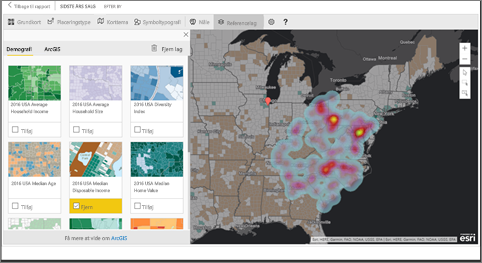

> [!TIP]
> Besøg [Esris side på Power BI](https://www.esri.com/powerbi) for at se de mange eksempler og læse anbefalinger. Og se derefter Esris [side med introduktion til ArcGIS Maps for Power BI](https://doc.arcgis.com/en/maps-for-powerbi/get-started/about-maps-for-power-bi.htm).

## Brugerens samtykke
ArcGIS Maps til Power BI leveres af Esri (www.esri.com). Din brug af ArcGIS Maps for Power BI er omfattet af Esris vilkår og politik for beskyttelse af personlige oplysninger. Power BI-brugere, der gerne vil bruge ArcGIS-kort til visuelle elementer i Power BI, skal acceptere dialogboksen til samtykke.

**Ressourcer**

[Vilkår](https://go.microsoft.com/fwlink/?LinkID=826322)

[Politik for beskyttelse af personlige oplysninger](https://go.microsoft.com/fwlink/?LinkID=826323)

[Produktsiden med ArcGIS Maps for Power BI](https://www.esri.com/powerbi)

 

## Aktivér ArcGIS-kort
ArcGIS-kort er i øjeblikket tilgængelige i Power BI-tjenesten, Power BI Desktop og Power BI – Mobil. Artiklen indeholder instruktioner til tjenesten og til Desktop.

### Aktivér ArcGIS-kortet ***i Power BI-tjenesten (app.powerbi.com)***
I dette selvstudium benyttes [eksemplet Retail Analysis](../sample-retail-analysis.md). Sådan aktiveres **ArcGIS Maps for Power BI**:

1. Vælg tandhjulsikonet i den øverste højre del af menulinjen, og åbn **Settings** (Indstillinger).
   
    
2. Markér afkrydsningsfeltet **ArcGIS Maps for Power BI** (ArcGIS-kort til Power BI). Du skal genstarte Power BI, når du har markeret indstillingen.
   
    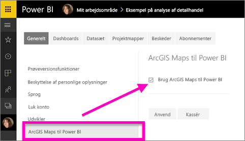
3. Åbn en rapport i [redigeringstilstand](../consumer/end-user-reading-view.md), og vælg ikonet for ArcGIS Maps for Power BI i ruden Visualiseringer.
   
    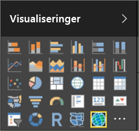
4. Power BI føjer en tom ArcGIS-kortskabelon til rapportcanvasset.
   
   

 

## Opret en ArcGIS-kortvisualisering
Se, hvordan Will opretter et par forskellige ArcGIS-kortvisualiseringer, og benyt derefter fremgangsmåden nedenfor til at prøve det selv ved hjælp af [eksemplet Retail Analysis](../sample-datasets.md).

<iframe width="560" height="315" src="https://www.youtube.com/embed/EKVvOZmxg9s" frameborder="0" allowfullscreen></iframe>

1. Træk et datafelt fra ruden **Fields** (Felter) til filsættet **Location** (Placering) eller **Latitude** (Breddegrad) og/eller **Longitude** (Længdegrad). I dette eksempel bruger vi **Store > City**.
   
   > [!NOTE]
   > ArcGIS Maps for Power BI registrerer automatisk, hvis de felter, som du har valgt, bedst kan ses som en figur eller et punkt på et kort. Du kan tilpasse standarden i indstillingerne (se nedenfor).
   > 
   > 
   
    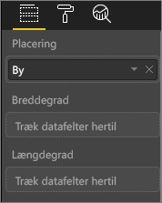
2. Konvertér visualiseringen til et ArcGIS-kort ved at vælge skabelonen i ruden Visualiseringer.
3. Fra feltet **Fields** (Felter) skal du trække en måling til filsættet **Size** (Størrelse) for at justere, hvordan dataene vises. I dette eksempel bruger vi **Sales > Last Year Sales**.
   
    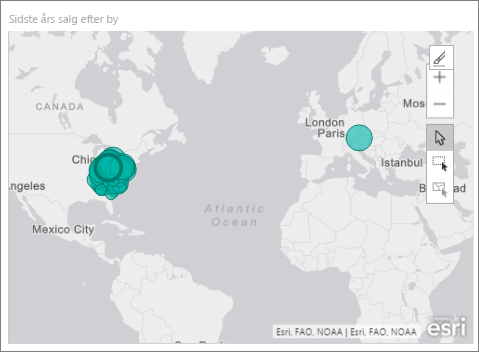

## Indstillinger og formatering for ArcGIS-kort
Sådan får du adgang til formateringsfunktionerne i **ArcGIS Maps for Power BI**:

1. Få adgang til yderligere funktioner ved at vælge de tre prikker i øverste højre hjørne af visualiseringen og vælge **Rediger**.
   
   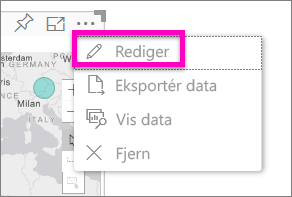
   
   De tilgængelige funktioner vises øverst i visualiseringen. Der åbnes en opgaverude for hver funktion, når den er blevet valgt, med mere detaljerede indstillinger. 
   
   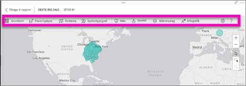
   
   > [!NOTE]
   > Du kan finde flere oplysninger om indstillingerne og funktionerne i den **detaljerede dokumentation** nedenfor.
   > 
   > 
2. Du vender tilbage til rapporten ved at vælge **Back to Report** (Tilbage til rapporten) i det øverste venstre hjørne af rapportcanvasset.

 

## Detaljeret dokumentation
**Esri** leverer [omfattende dokumentation](https://go.microsoft.com/fwlink/?LinkID=828772) om funktionssættet i **ArcGIS Maps for Power BI**.

## Oversigt over funktioner
### Grundlæggende kort
Der findes fire grundlæggende kort: Dark Gray Canvas, Light Gray Canvas, OpenStreetMap og Streets.  Streets er ArcGIS' grundlæggende standardkort.

Hvis du vil anvende et grundlæggende kort, skal du vælge det i opgaveruden.

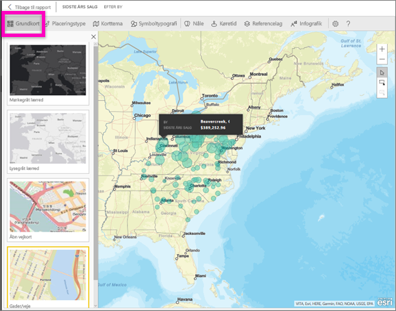

### Placeringstype
ArgGIS Maps for Power BI finder automatisk den bedste måde at vise data på et kort på. Den vælger fra Points (Punkter) eller Boundaries (Grænser). Indstillingerne for placeringstype giver dig mulighed for at tilpasse disse valg.

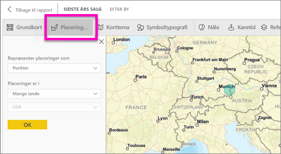

**Boundaries** (Grænser) fungerer kun, hvis dine data indeholder geografiske standardværdier. Esri finder automatisk ud af, hvilken figur der skal vises på kortet. Geografiske standardværdier omfatter lande, områder, postnumre osv. Men på samme måde som med geokodning registrerer Power BI muligvis ikke, om feltet skal være en grænse som standard, eller også indeholder tjenesten ikke en grænse for dine data.  

### Korttema
Der findes fire korttemaer. Temaerne Location Only (Kun placering) og Size (Størrelse) vælges automatisk på baggrund af de felter, du knyttede til filsættet **Size** (Størrelse) i ruden med Power BI-felter. Vi bruger i øjeblikket **Size** (Størrelse), så lad os ændre det til **Heat map** (Termisk kort).  

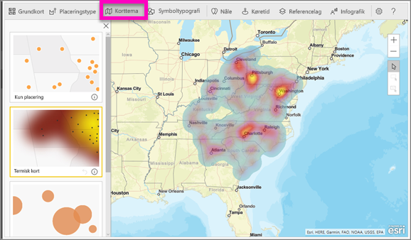

<table>
<tr><th>Tema</th><th>Beskrivelse</th>
<tr>
<td>Location Only (Kun placering)</td>
<td>Placerer datapunkter eller udfyldte grænser på kortet på baggrund af indstillingerne i Location Type (Placeringstype).</td>
</tr>
<tr>
<td>Heat Map (Termisk kort)</td>
<td>Viser en afbildning af intensiteten af data på kortet.</td>
</tr>
<tr>
<td>Size (Størrelse)</td>
<td>Placerer datapunkter på kortet, hvis størrelse afhænger af værdien i størrelsesdatasættet i ruden med felter.</td>
</tr>
<tr>
<td>Clustering</td>
<td>Placerer antallet af datapunkter i områder på kortet. </td>
</tr>
</table>

### Symboltypografi
Symboltypografier giver dig mulighed for at finjustere, hvordan data vises på kortet. Symboltypografier er kontekstafhængige og er baseret på den valgte placeringstype og det valgte korttema. Nedenstående eksempel viser placeringstypen, der er angivet til **Size** (Størrelse), og flere justeringer af gennemsigtighed, typografi og størrelse.

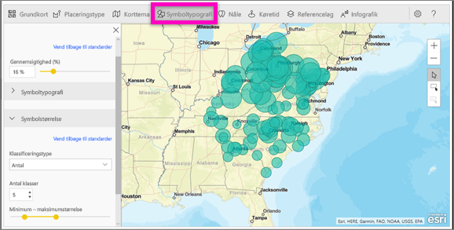

### Nåle
Fremhæv datapunkter på kortet ved at tilføje nåle.  

1. Vælg fanen **Pins** (Nåle).
2. Skriv nøgleord (f.eks adresser, steder og interessepunkter) i søgefeltet, og vælg på rullelisten. Der vises et symbol på kortet, og kortet zoomer automatisk ind på placeringen. Søgeresultater gemmes som placeringskort i ruden Pins (Knappenåle). Du kan gemme op til 10 placeringskort.
   
   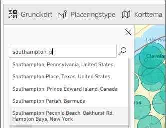
3. Power BI føjer en knappenål til den pågældende placering, og du kan ændre farven på knappenålen.
   
   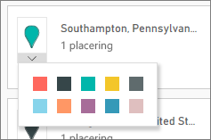
4. Tilføj og slet knappenåle.
   
   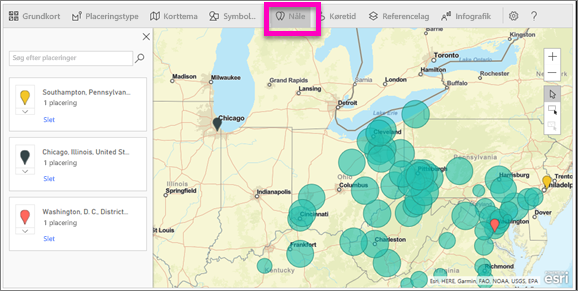

### Drive time (Køretid)
I ruden Drive time (Køretid) kan du vælge en placering og derefter angive, hvilken anden kortfunktion der er inden for en bestemt radius eller køretid.  
    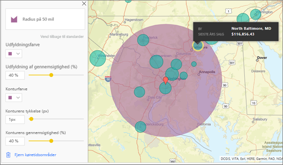

1. Vælg fanen **Drive time** (Køretid), og vælg værktøjet til valg af et eller flere elementer. Vælg knappenålen for Washington D.C.

   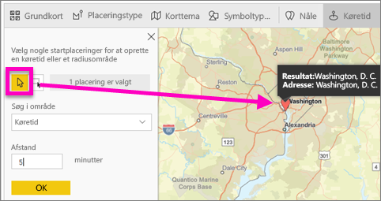
   
   > [!TIP]
   > Det er lettere at vælge en placering, hvis du zoomer ind på kortet (ved hjælp af +-ikonet).
   > 
   > 
2. Lad os sige, at du skal til Washington D.C. i et par dage og gerne vil finde ud af, hvilke butikker der ligger inden for en rimelig køreafstand. Angiv søgeområdet til **Radius** og Distance (Afstand) til **50** mil, og vælg OK.    
   
    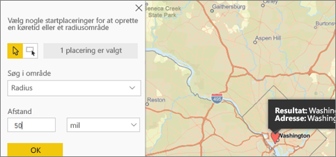
3. Radiussen vises i lilla. Vælg et vilkårligt sted for at få vist detaljer om det. Du kan eventuelt formatere radiussen ved at ændre farve og rammekontur.
   
    

### Referencelag
#### Referencelag – demografi
ArcGIS Maps for Power BI indeholder en række demografiske lag, der hjælper med at kontekstualisere data fra Power BI.

1. Vælg fanen **Reference layer** (Referencelag), og vælg **Demographics** (Demografi).
2. Der er et afkrydsningsfelt ud for hvert lag, der er angivet. Markér afkrydsningsfeltet for at føje laget til kortet.  Vi har tilføjet den gennemsnitlige husstandsindkomst i dette eksempel. 
   
    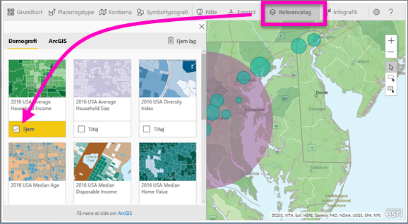
3. Hvert lag er også interaktivt. På samme måde som du kan pege på en boble for at få vist detaljer, kan du klikke på et skraveret område på kortet for at få vist detaljer. 
   
    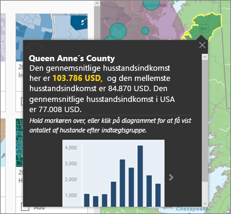

#### Referencelag – ArcGIS
ArcGIS Online giver virksomheder mulighed for at publicere offentlige webkort. Desuden leverer Esri et sæt overvågede webkort via Living Atlas. Under fanen ArcGIS kan du søge efter alle offentlige webkort eller Living Atlas-kort og føje dem til kortet som referencelag.

1. Vælg fanen **Reference layer** (Referencelag), og vælg **ArcGIS**.
2. Skriv søgeord, og vælg derefter et kortlag. I dette eksempel har vi valgt USA Congressional districts.
   
    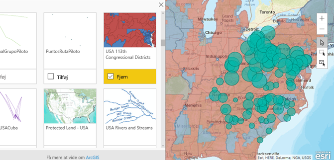
3. Hvis du vil have vist detaljerne, skal du vælge et skraveret område for at åbne *Vælg fra referencelag*: Brug markeringsværktøjet til referencelag til at vælge grænser eller objekter på referencelaget.

 

## Valg af datapunkter
ArcGIS Maps for Power BI har tre markeringstilstande.

Rediger markeringstilstanden ved at vælge:

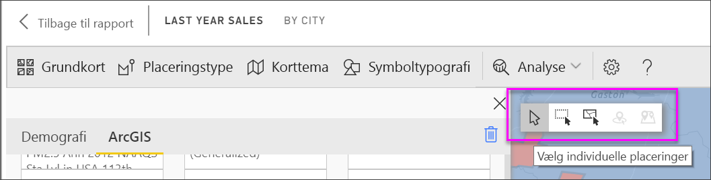

 Vælg individuelle datapunkter.

 Tegner et rektangel på kortet og markerer de indeholdte datapunkter.

 Muliggør, at grænser eller polygoner i referencelag kan bruges til at vælge indeholdte datapunkter.

> [!NOTE]
> Du kan maks. vælge 250 datapunkter ad gangen.
> 
> 

 

## Få hjælp
**Esri** leverer [omfattende dokumentation](https://go.microsoft.com/fwlink/?LinkID=828772) om funktionssættet i **ArcGIS Maps for Power BI**.

Du kan stille spørgsmål, finde de seneste oplysninger, rapportere problemer og finde svar i Power BI [community'ets tråd om **ArcGIS Maps for Power BI**](https://go.microsoft.com/fwlink/?LinkID=828771).

Hvis du har et forslag til en forbedring, kan du sende den til [Power BI's ideliste](https://ideas.powerbi.com).

 

## Administration af brugen af ArcGIS Maps for Power BI i din organisation
Power BI giver brugere, lejeradministratorer og IT-administratorer mulighed for at administrere, om ArcGIS Maps for Power BI skal bruges eller ej.

**Brugerindstillingerne** i Power BI Desktop – brugerne kan stoppe med at benytte ArcGIS Maps for Power BI ved at deaktivere funktionen under sikkerhedsfanen i **Options** (Indstillinger). Når ArcGIS Maps er deaktiveret, indlæses den ikke som standard.

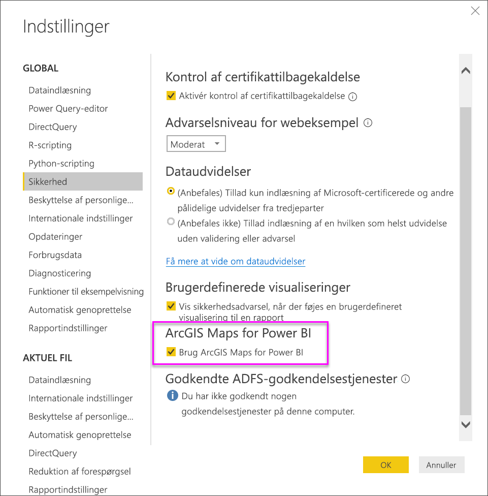

I Power BI-tjenesten kan brugerne stoppe med at bruge ArcGIS Maps for Power BI ved at deaktivere funktionen på fanen ArcGIS Maps for Power BI i User Settings (Brugerindstillinger). Når ArcGIS Maps er deaktiveret, indlæses den ikke som standard.

**Indstillinger for lejeradministratorer** I PowerBI.com kan lejeradministratorer forhindre, at alle lejerbruger benytter ArcGIS Maps for Power BI ved at deaktivere funktionen. Når det sker, vises ArcGIS Maps for Power BI-ikonet ikke længere i ruden med visualiseringer i Power BI.

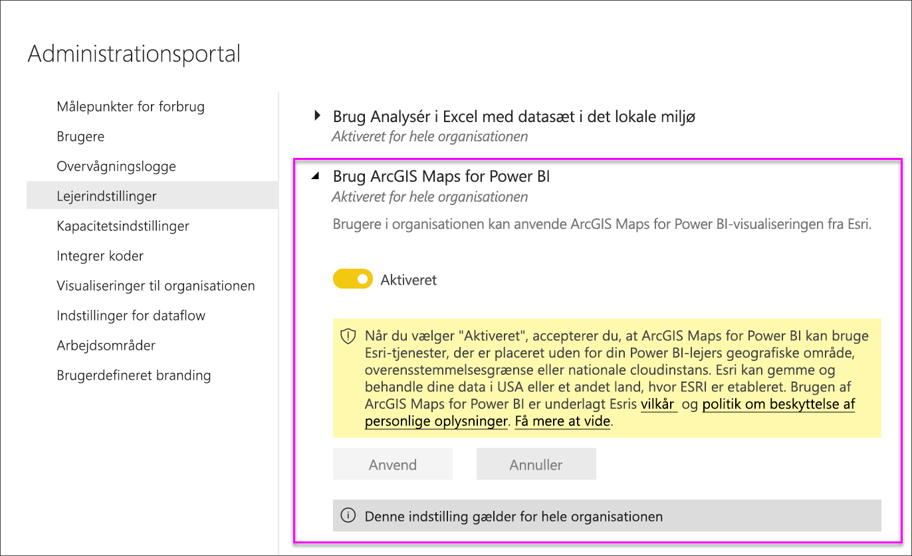

**Indstillinger for IT-administratorer** Power BI Desktop understøtter ved hjælp af **Gruppepolitik** deaktivering af ArcGIS Maps for Power BI på tværs af de computere, der er installeret i en organisation.

<table>
<tr><th>Attribut</th><th>Værdi</th>
</tr>
<tr>
<td>key</td>
<td>Software\Policies\Microsoft\Power BI Desktop&lt;/td&gt;
</tr>
<tr>
<td>valueName</td>
<td>EnableArcGISMaps</td>
</tr>
</table>

En værdi på 1 (decimal) aktiverer ArcGIS Maps for Power BI.

En værdi på 0 (decimal) deaktiverer ArcGIS Maps for Power BI.

## Overvejelser og begrænsninger
ArcGIS-kort til Power BI er tilgængeligt i følgende tjenester og programmer:

<table>
<tr><th>Tjeneste/app</th><th>Tilgængelighed</th></tr>
<tr>
<td>Power BI Desktop</td>
<td>Ja</td>
</tr>
<tr>
<td>Power BI-tjeneste (PowerBI.com)</td>
<td>Ja</td>
</tr>
<tr>
<td>Power BI-mobilapps</td>
<td>Ja</td>
</tr>
<tr>
<td>Power BI publiceret til internettet</td>
<td>Nej</td>
</tr>
<tr>
<td>Power BI Embedded</td>
<td>Nej</td>
</tr>
<tr>
<td>Integration af Power BI-tjenesten (PowerBI.com)</td>
<td>Nej</td>
</tr>
</table>

I tjenester eller programmer, hvor ArcGIS Maps for Power BI ikke er tilgængelig, vises visualiseringen som en tom visualisering med Power BI-logoet.

Når adresser geokodes, er det kun de første 1500 adresse, der geokodes. Geokodning af stednavne eller lande er ikke underlagt grænsen på 1500 adresser.

 

**Hvordan fungerer ArcGIS Maps til Power BI?**
ArcGIS Maps til Power BI leveres af Esri (www.esri.com). Din brug af ArcGIS Maps til Power BI er omfattet af Esris [vilkår](https://go.microsoft.com/fwlink/?LinkID=8263222) og [politik om beskyttelse af personlige oplysninger](https://go.microsoft.com/fwlink/?LinkID=826323). Power BI-brugere, der gerne vil bruge ArcGIS-kort til visuelle elementer i Power BI, skal acceptere i dialogboksen til samtykke (se under Brugersamtykke for at få flere oplysninger).  Brug af Esris ArcGIS Maps til Power BI er underlagt Esris Vilkår og Politik om beskyttelse af personlige oplysninger, der også er linket til i dialogboksen til samtykke. Hver enkelt bruger skal samtykke, før de kan bruge ArcGIS Maps til Power BI første gang. Når brugeren accepterer samtykket, sendes data, der er bundet til visualiseringen til Esris tjenester i hvert fald i forbindelse med geo-kodning. Det vil sige, at placeringsoplysninger transformeres til oplysninger om længdegrad og breddegrad, der kan vises på et kort. Du skal antage, at alle data, der er bundet til datavisualiseringen kan sendes til Esris tjenester. Esri leverer tjenester, såsom kort, afstandsanalyse, geo-kodning osv. ArcGIS Maps til Power BI-visualiseringen interagerer med disse tjenester vha. en SSL-forbindelse, der beskyttes af et certifikat, som leveres og vedligeholdes af Esri. Du kan få flere oplysninger om ArcGIS Maps til Power BI på Esris [produktside for ArcGIS Maps til Power BI](https://www.esri.com/powerbi).

Når en bruger tilmelder sig et Plus-abonnement, der tilbydes af Esri, via ArcGIS Maps til Power BI, indgår vedkommende i en direkte relation med Esri. Power BI sender ikke personlige oplysninger om brugeren til Esri. Brugeren logger på og angiver, at vedkommende har tillid til et AAD-program, der leveres af Esri, vha. sit eget AAS-id. På denne måde deler brugeren sine personlige oplysninger direkte med Esri. Når brugeren føjer Plus-indhold til en ArcGIS Maps til Power BI-visualisering, skal andre Power BI-brugere også have et Plus-abonnement fra Esri for at kunne se eller redigere det pågældende indhold. 

Hvis du har tekniske spørgsmål om, hvordan Esris ArcGIS Maps til Power BI fungerer, skal du kontakte Esri via deres supportwebsted.

**Er der omkostninger forbundet med brugen af ArcGIS Maps for Power BI?**

ArcGIS Maps for Power BI er tilgængelig for alle Power BI-brugere uden meromkostninger. Det er en komponent, der leveres af **Esri**, og din brug er underlagt **Esris** vilkår og beskyttelse af personlige oplysninger, som nævnt tidligere i denne artikel.

**Jeg får vist en fejlmeddelelse i Power BI Desktop om, at min cache er fuld**

Dette er en fejl, der er ved at blive behandlet.  I mellemtiden skal du slette filer på denne placering for at rydde cachen: C:\Users\\AppData\Local\Microsoft\Power BI Desktop\CEF og derefter genstarte Power BI.

**Understøtter ArcGIS Maps for Power BI Esri Shapefiles?**

ArcGIS Maps for Power BI registrerer automatisk standardgrænser som lande/områder, stater/provinser og postnumre. Hvis du vil angive dine egne figurer, kan du gøre det ved hjælp [figurkort til Power BI Desktop (prøveversion)](desktop-shape-map.md).

**Kan jeg få vist mine ArcGIS-kort offline?**

Nej, Power BI skal bruge en netværksforbindelse for at vise kortene.

**Kan jeg oprette forbindelse til min ArcGIS Online-konto fra Power BI?**

Ikke endnu. [Stem på denne ide](https://ideas.powerbi.com/forums/265200-power-bi-ideas/suggestions/9154765-arcgis-geodatabases), og vi sender dig en mail, når vi begynder at arbejde på denne funktion.  

## Næste trin
[Interaktion med ArcGIS-kort, som er blevet delt med dig](power-bi-visualizations-arcgis.md)

[Blogindlæg annoncerer tilgængeligheden af ArcGIS Maps for Power BI](https://powerbi.microsoft.com/blog/announcing-arcgis-maps-for-power-bi-by-esri-preview/)

Har du flere spørgsmål? [Prøv at spørge Power BI-community'et](http://community.powerbi.com/)

