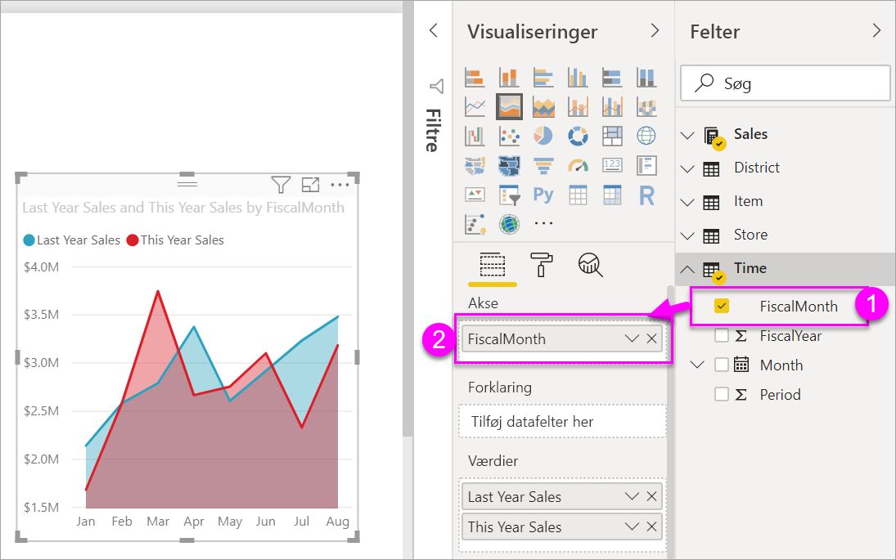
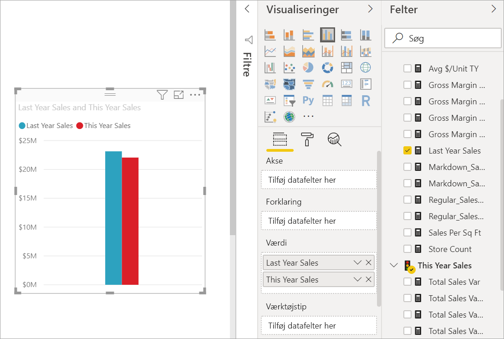
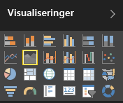

# Basisområdediagram
Basisområdediagrammet (lagdelt områdediagram) er baseret på kurvediagrammet. Området mellem akse og kurve er udfyldt med farver for at angive mængde. 

Områdediagrammer fremhæver omfanget af ændringer over tid og kan bruges til at fremhæve den samlede værdi på tværs af en udvikling. Data, som repræsenterer indtjening over tid, kan f.eks. afbildes i et områdediagram for at fremhæve den samlede indtjening.

## Brugsscenarier for et områdediagram
Basisområdediagrammer er et godt valg:

* Når du vil se og sammenligne mængdeudviklingen på tværs af tidsperioder. 
* Når du har enkelte perioder, der repræsenterer et sæt, som kan tælles fysisk.

### Forudsætninger
 - Power BI-tjeneste
 - Eksempel på analyse af detailhandel

Log på Power BI for at følge fremgangsmåden, og vælg **Hent Data \>Eksempler \> Eksempel på detailhandelsanalyse > Opret forbindelse**, og vælg **Gå til dashboard**. 

## Opret et basisområdediagram
 

1. Vælg feltet **Butikker i alt** fra dashboardet "Eksempel på detailhandelsanalyse" for at åbne rapporten "Eksempel på detailhandelsanalyse".
2. Vælg **Rediger rapport** for at åbne rapporten i redigeringsvisning.
3. Tilføj en ny rapport ved at vælge det gule plusikon (+) nederst i rapporten.
4. Opret et områdediagram, der viser dette års salg og sidste års salg pr. måned.
   
   a. I ruden FELTER skal du vælge **Salg \> Sidste års salg** og **Dette års salg > Værdi**.

   

   b.  Konvertér diagrammet til en grundlæggende områdediagram ved at vælge ikonet Områdediagram i ruden VISUALISERINGER.

   
   
   c.  Vælg **Tid \> Måned** for at føje det til **Akse**.   
   
   
   d.  Hvis du vil vise diagrammet pr. måned, skal du vælge ellipsemenuen (øverst til højre i visualiseringen) og vælge **Sortér efter måned**.

## Fremhævning og krydsfiltrering
Du kan få mere at vide om brug af ruden FILTRE under [Føj et filter til en rapport](../power-bi-report-add-filter.md).

For at fremhæve et bestemt område i diagrammet skal du markere dette område eller dets øverste kant.  Hvis der er andre visualiseringer på samme side, vil den i modsætning til andre visualiseringstyper ikke krydsfiltrere med de andre visualiseringer på rapportsiden, når et grundlæggende område markeres. Områdediagrammer kan dog krydsfiltreres af andre visualiseringer på rapportsiden. Hvis du vil vide mere, kan du se [Visuelle interaktioner i rapporter](../consumer/end-user-interactions.md)

## Overvejelser og fejlfinding   
* [Gør rapporten tilgængelig for personer med handicap](../desktop-accessibility.md)
* Basisområdediagrammer er ikke velegnede til sammenligning af værdier på grund af blokeringer på de lagdelte områder. Der bruges gennemsigtighed i Power BI til at angive overlapning af områder. Det virker dog bedst, hvis der kun er to eller tre forskellige områder. Hvis du vil sammenligne en udvikling med mere end tre mål, kan du prøve at bruge kurvediagrammer. Hvis du vil sammenligne en mængde med mere end tre mål, kan du prøve at bruge træstrukturdiagrammer.

## Næste trin
[Rapporter i Power BI](../consumer/end-user-reports.md)  
[Visualiseringer i Power BI-rapporter](power-bi-report-visualizations.md)  
[Power BI – grundlæggende begreber](../consumer/end-user-basic-concepts.md)  
Har du flere spørgsmål? [Prøv at spørge Power BI-community'et](http://community.powerbi.com/)

