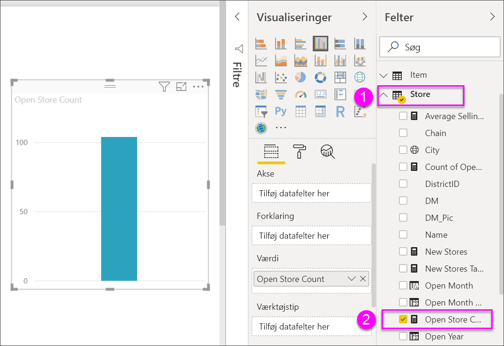
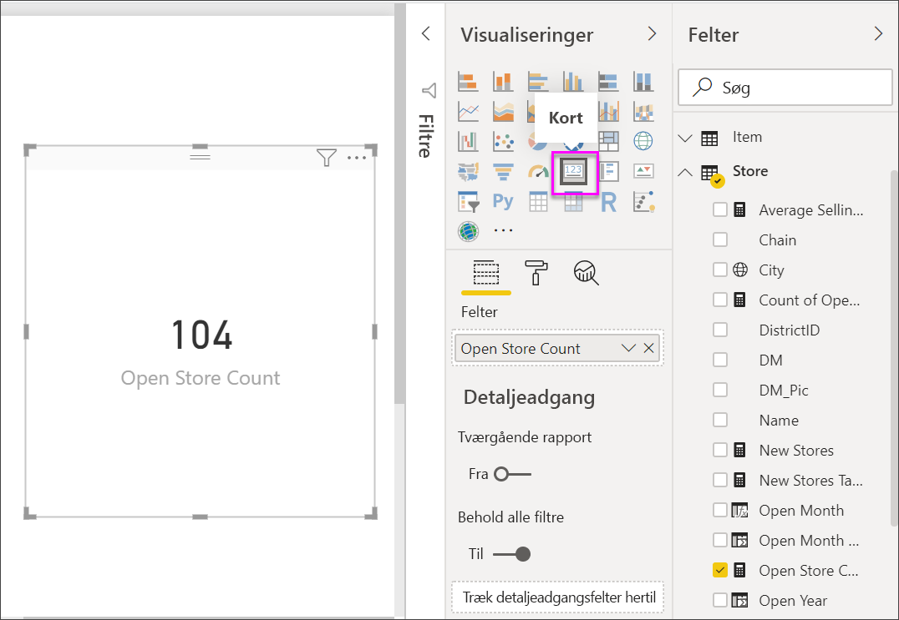
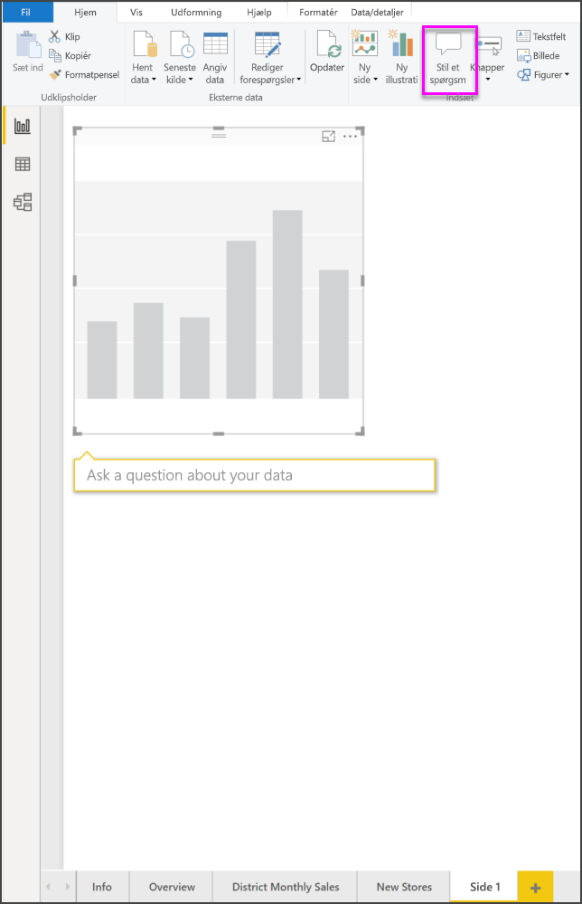
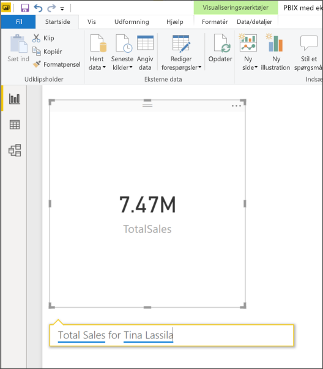
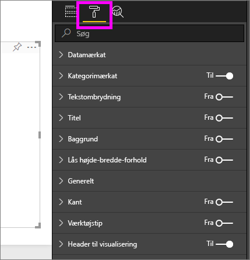
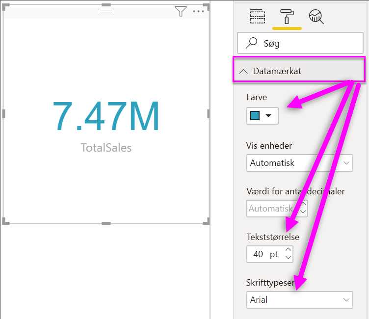
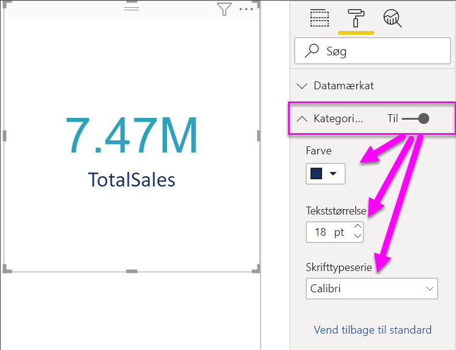
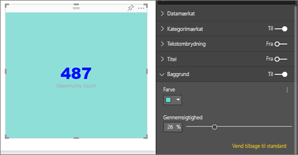

# Opret kortvisualiseringer

[!INCLUDE[consumer-appliesto-nyyn](../includes/consumer-appliesto-nyyn.md)]

[!INCLUDE [power-bi-visuals-desktop-banner](../includes/power-bi-visuals-desktop-banner.md)]

Nogle gange er et enkelt tal det vigtigste, du vil finde frem til på dit Power BI-dashboard eller i din Power BI-rapport som f.eks. salg i alt, markedsandel fra år til år eller salgsmuligheder i alt. Denne type visualisering kaldes et *kort*. Som med næsten alle de oprindelige Power BI-visualiseringer kan kort oprettes ved hjælp af rapporteditoren eller Spørgsmål og svar.

> [!NOTE]
> Når du deler din rapport med en Power BI-kollega, kræves det, at I begge har individuelle Power BI Pro-licenser, eller at rapporten er gemt i en Premium-kapacitet.

## Forudsætning

I dette selvstudium bruges [PBIX-filen med eksemplet Detailhandelsanalyse](https://download.microsoft.com/download/9/6/D/96DDC2FF-2568-491D-AAFA-AFDD6F763AE3/Retail%20Analysis%20Sample%20PBIX.pbix)

1. Vælg **Filer** \> **Åbn** i øverste venstre afsnit af menulinjen
   
2. Find din kopi af **PBIX-filen med eksemplet Detailhandelsanalyse**

1. Åbn **PBIX-filen med eksemplet Detailhandelsanalyse** i rapportvisning .

1. Markér  for at tilføje en ny side.

## Mulighed 1: Opret et kort ved hjælp af rapporteditoren

Den første metode, der kan bruges til at oprette et kort, er at bruge rapporteditoren i Power BI Desktop.

1. Start på en tom rapportside, og vælg feltet **Store** \> **Open store count**.

    Power BI opretter et søjlediagram med det ene tal.

   

2. Vælg kortikonet i ruden Visualiseringer.

   

Du har nu oprettet et kort ved hjælp af rapporteditoren. Nedenfor er den anden mulighed, der kan bruges til at oprette et kort ved hjælp af spørgsmålsfeltet i Spørgsmål og svar.

## Mulighed 2: Opret et kort fra feltet til spørgsmål i Spørgsmål og svar
Spørgsmålsfeltet i Spørgsmål og svar er en anden mulighed, du kan bruge, til at oprette et kort. Spørgsmålsfeltet i Spørgsmål og svar er tilgængeligt i Power BI Desktop-rapportvisning.

1. Start på en tom rapportside

1. Vælg ikonet **Stil et spørgsmål** øverst i vinduet. 

    Power BI opretter et kort og et felt til dit spørgsmål. 

   

2. Du kan f.eks. skrive "Samlet salg for Tina" i spørgsmålsfeltet.

    Feltet til spørgsmål kommer med forslag og tilpasninger og viser til sidst det samlede antal.  

   

   

Du har nu oprettet et kort ved hjælp af spørgsmålsfeltet i Spørgsmål og svar. Nedenfor kan du finde trin til at formaterer dit kort til dine specifikke behov.

## Formatér et kort
Du har mange muligheder for at ændre etiketter, tekst, farve og meget mere. Den bedste måde at få mere at vide på er ved at oprette et kort og derefter udforske formateringsruden. Her er nogle af de formateringsindstillinger, der er tilgængelige. 

Ruden Formatering er tilgængelig, når du interagerer med kortet i en rapport. 

1. Start med at vælge ikonet for malerrullen for at åbne ruden Formatering. 

    

2. Med kortet markeret skal du udvide **Datamærkat** og ændre farven, størrelsen og skrifttypefamilien. Hvis du havde tusindvis af butikker, kunne du bruge **Vis enheder** til at få vist antallet af butikker i tusinder samt styre decimalerne. For eksempel 125.8K i stedet for 125.832,00.

    

3.  Udvid **Kategorietiket**, og rediger farven og størrelsen.

    

4. Udvid **Baggrund**, og flyt skyderen til Til.  Nu kan du ændre baggrundsfarven og gennemsigtigheden.

    

5. Fortsæt med at udforske formateringsindstillingerne, indtil dit kort er præcis, som du vil det. 

## Overvejelser og fejlfinding
Hvis du ikke kan se feltet til spørgsmål, skal du kontakte system- eller lejeradministratoren.    

## Næste trin
[Kombinationsdiagrammer i Power BI](power-bi-visualization-combo-chart.md)

[Visualiseringstyper i Power BI](power-bi-visualization-types-for-reports-and-q-and-a.md)
