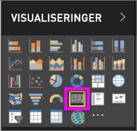
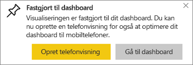
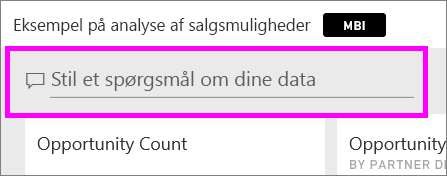
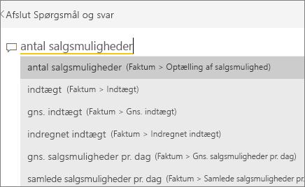
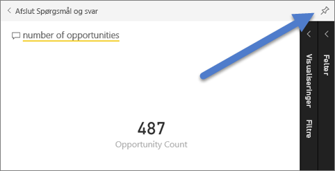
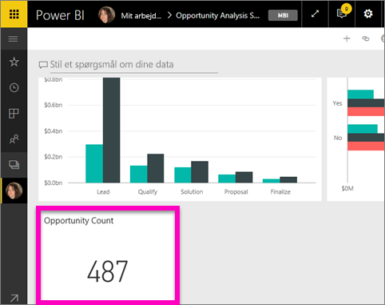
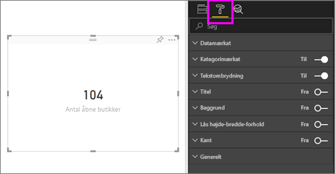
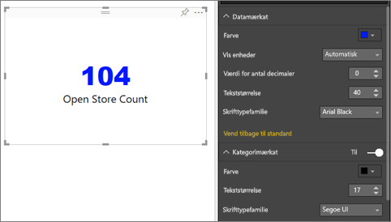
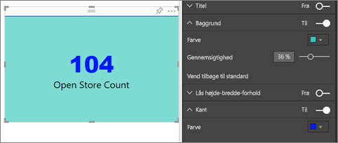

# Kortvisualiseringer
Nogle gange er et enkelt tal det vigtigste, du vil finde frem til på dit Power BI-dashboard eller i din Power BI-rapport som f.eks. salg i alt, markedsandel fra år til år eller salgsmuligheder i alt. Denne type visualisering kaldes et *kort*. Som med næsten alle de oprindelige Power BI-visualiseringer kan kort oprettes ved hjælp af rapporteditoren eller Spørgsmål og svar.

## Opret et kort ved hjælp af rapporteditoren
I denne vejledning bruges Retail Analysis Sample (Eksempel på detailhandelsanalyse). Du skal [downloade eksemplet](../sample-datasets.md) til Power BI-tjenesten (app.powerbi.com) eller Power BI Desktop, så du kan følge med.   

1. Start på en [tom rapportside](../power-bi-report-add-page.md), og vælg feltet **Store** \> **Open store count**. Hvis du bruger Power BI-tjenesten, skal du åbne rapporten i [Redigeringsvisning](../service-interact-with-a-report-in-editing-view.md).

    Power BI opretter et søjlediagram med det ene tal.

   
2. Vælg kortikonet i ruden Visualiseringer.

   
6. Hold markøren over et kort, og vælg ikonet med tegnestiften  for at føje visualiseringen til dashboardet.

   
7. Fastgør feltet til et eksisterende dashboard eller et nyt dashboard.

   * Eksisterende dashboard: Vælg navnet på dashboardet på rullelisten.
   * Nyt dashboard: Skriv navnet på det nye dashboard.
8. Vælg **Fastgør**.

   En meddelelse om fuldførelse (næsten helt oppe i højre hjørne) giver dig besked om, at visualiseringen er blevet føjet til dit dashboard som et felt.

   
9. Vælg **Gå til dashboard**. Der kan du [redigere og flytte](../service-dashboard-edit-tile.md) den fastgjorte visualisering.

## Opret et kort fra feltet til spørgsmål i Spørgsmål og svar
Feltet til spørgsmål er den nemmeste måde at oprette et kort på. Feltet til spørgsmål i Spørgsmål og svar er tilgængeligt i Power BI-tjenesten fra et dashboard eller en rapport og i desktop-rapportvisning. Nedenstående trin beskriver oprettelsen af et kort fra et dashboard i Power BI-tjenesten. Hvis du gerne vil oprette et kort ved hjælp af Spørgsmål og svar i Power BI Desktop, [skal du følge denne vejledning](https://powerbi.microsoft.com/en-us/blog/power-bi-desktop-december-feature-summary/#QandA) for at få prøveversionen af Spørgsmål og svar til Desktop-rapporter.

1. Opret et [dashboard](../service-dashboards.md), og [hent data](../service-get-data.md). I dette eksempel bruges [eksemplet Opportunity Analysis](../sample-opportunity-analysis.md).

1. Begynd at skrive dit spørgsmål i feltet til spørgsmål øverst i dashboardet. 

   

> [!TIP]
> Fra en rapport i Power BI-tjenesten skal du vælge **Stil et spørgsmål** på den øverste menulinje i redigeringsvisning. I en rapport i Power BI Desktop skal du finde en tom plads i en rapport og dobbeltklikke for at åbne et felt til spørgsmål.

3. Skriv f.eks. "number of opportunities" i feltet til spørgsmål.

   

   Feltet til spørgsmål kommer med forslag og tilpasninger og viser til sidst det samlede antal.  
4. Vælg ikonet med tegnestiften  i øverste højre hjørne for at føje kortet til dashboardet.

   
5. Fastgør kortet som et felt til et eksisterende dashboard eller et nyt dashboard.

   * Eksisterende dashboard: Vælg navnet på dashboardet på rullelisten. Du vil kun kunne vælge blandt de dashboards, der findes i det aktuelle arbejdsområde.
   * Nyt dashboard: Skriv navnet på det nye dashboard, og det vil blive føjet til dit aktuelle arbejdsområde.
6. Vælg **Fastgør**.

   En meddelelse om fuldførelse (næsten helt oppe i højre hjørne) giver dig besked om, at visualiseringen er blevet føjet til dit dashboard som et felt.  

   
7. Vælg **Gå til dashboard** for at se det nye felt. Der kan du [omdøbe, tilpasse størrelsen på, tilføje et hyperlink for og flytte feltet og meget mere](../service-dashboard-edit-tile.md) på dit dashboard.

   

## Overvejelser og fejlfinding
- Hvis du ikke kan se feltet til spørgsmål, skal du kontakte system- eller lejeradministratoren.    
- Hvis du bruger Desktop og dobbeltklikker på et tomt sted i en rapport, og Spørgsmål og svar ikke åbnes, kan det være nødvendigt at aktivere funktionen.  Vælg **Fil > Indstillinger > Indstillinger > Funktioner til eksempelvisning > Q&A**, og genstart Desktop.

## Formatér et kort
Du har mange muligheder for at ændre etiketter, tekst, farve og meget mere. Den bedste måde at få mere at vide på er ved at oprette et kort og derefter udforske formateringsruden. Her er nogle af de formateringsindstillinger, der er tilgængelige. 

1. Start med at åbne formateringsruden ved at vælge ikonet med malerrullen. 

    
2. Udvid **Dataetiket**, og rediger farven, størrelsen og skrifttypefamilien. Hvis du havde tusindvis af butikker, kunne du bruge **Vis enheder** til at få vist antallet af butikker i tusinder samt styre decimalerne. For eksempel 125.8K i stedet for 125.832,00.

3.  Udvid **Kategorietiket**, og rediger farven og størrelsen.

    

4. Udvid **Baggrund**, og flyt skyderen til Til.  Nu kan du ændre baggrundsfarven og gennemsigtigheden.

    

5. Fortsæt med at udforske formateringsindstillingerne, indtil dit kort er præcis, som du vil det. 

    

## Næste trin
[Kombinationsdiagrammer i Power BI](power-bi-visualization-combo-chart.md)

[Visualiseringstyper i Power BI](power-bi-visualization-types-for-reports-and-q-and-a.md)
