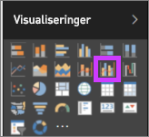
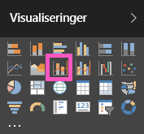

# Kombinationsdiagram i Power BI

I Power BI er et kombinationsdiagram en enkelt visualisering, der kombinerer et kurvediagram og et søjlediagram. Ved at kombinere disse to diagrammer kan du hurtigere sammenligne dine data.

Kombinationsdiagrammer kan have en eller to Y-akser.

## Hvornår er et kombinationsdiagram nyttigt?

Kombinationsdiagrammer er et fantastisk valg i følgende tilfælde:

* Når du har et kurvediagram og et søjlediagram med den samme X-akse.

* Til at sammenligne flere målinger med forskellige værdiområder.

* Til at illustrere sammenhængen mellem to målinger i én visualisering.

* Til at kontrollere, om en måling opfylder målet, der er defineret af en anden måling.

* Til at spare plads på lærredet.

## Forudsætninger

Kombinationsdiagrammer er tilgængelige i Power BI-tjenesten og i Power BI Desktop. Dette selvstudium bruger Power BI-tjenesten til at oprette et kombinationsdiagram. Sørg for, at du har brugeroplysninger til at logge på Power BI.

Se, hvordan Will opretter et kombinationsdiagram ved hjælp af salgs- og marketingeksemplet.

<iframe width="560" height="315" src="https://www.youtube.com/embed/lnv66cTZ5ho?list=PL1N57mwBHtN0JFoKSR0n-tBkUJHeMP2cP" frameborder="0" allowfullscreen></iframe>  

## Opret et grundlæggende kombinationsdiagram med én akse

Du kan følge med ved at åbne Power BI-tjenesten og oprette forbindelse til **Retail Analysis Sample**. Log på Power BI-tjenesten for at oprette dit eget kombinationsdiagram, og vælg **Hent data** > **Eksempler** > **Retail Analysis Sample** > **Opret forbindelse**. Dashboardet **Retail Analysis Sample** vises.

1. Vælg feltet **Total Stores** fra dashboardet "Retail Analysis Sample" for at åbne rapporten **Store Sales Overview**.

1. Vælg **Rediger rapport** for at åbne rapporten i redigeringsvisning.

1. Nederst på siden skal du vælge **+** for at tilføje en ny rapportside.

1. Opret et søjlediagram, der viser dette års salg og bruttoavance pr. måned.

    1. I ruden Fields skal du vælge **Sales**\> **This Year Sales** > **Value**.

    1. Træk **Sales** \> **Gross Margin This Year** til beholderen **Value**.

    1. Vælg **Time**\>**FiscalMonth** for at føje det til beholderen **Axis**.

        

1. Vælg ellipsen i øverste højre hjørne af visualiseringen, og vælg **Sortér efter > FiscalMonth**. Hvis du vil ændre sorteringsrækkefølgen, skal du vælge ellipsen igen og vælge enten **Sortér stigende** eller **Sortér faldende**.

1. Konvertér søjlediagrammet til et kombinationsdiagram. Der er to kombinationsdiagrammer: **Kurvediagram og stablet søjlediagram** og **Kurvediagram og grupperet søjlediagram**. Vælg søjlediagrammet, og vælg derefter **Line and clustered column chart** fra fanen **Visualizations**.

    

1. Fra ruden **Felter** kan du derefter trække **Sales** > **Last Year Sales** til området **Line Values**.

    

    Dit kombinationsdiagram bør ligne dette:

    

## Opret et kombinationsdiagram med to akser

I denne opgave skal vi sammenligne bruttomargen og salg.

1. Opret et nyt kurvediagram, der sporer **Gross Margin Last Year %** efter **Month**. Vælg ellipsen for at sortere den efter **måned** og **stigende**.

    

     I januar var BM% på 35 %, den steg til 45 % i april, faldt i juli og steg igen i august. Kan vi se et tilsvarende mønster for salget i dette og sidste år?

1. Tilføj **This Year Sales** > **Value** og **Last Year Sales** i kurvediagrammet. Skalaen for **Gross Margin Last Year %** er meget mindre end skalaen for **Sales**. Det er svært at sammenligne.

    

1. Hvis du vil gøre det nemmere at læse og fortolke en visual, skal du konvertere kurvediagrammet til et Kurve- og stablet søjlediagram.

    

1. Træk **Gross Margin Last Year %** fra **Kolonneværdier** til **Kurveværdier**. 

    

    Power BI opretter to akser, så tjenesten kan skalere datasættene forskelligt. Den venstre akse måler salg i dollar, og den højre akse måler procentdel. Og vi kan se svaret på vores spørgsmål: Ja, vi kan se et lignende mønster.

## Føj titler til akserne

1. Vælg malerrulleikonet  for at åbne formateringsruden.

1. Udvid indstillingerne for **Y-axis** ved at vælge den nedadvendte pil.

1. For **Y-akse (søjle)** skal du vælge disse indstillinger:

    | Indstilling | Værdi |
    | ------- | ----- |
    | Placering | Vælg **Venstre**. |
    | Vis enheder | Vælg **Millioner**. |
    | Titel | Flyt skyderen til **Til**. |
    | Typografi | Vælg **Vis kun titel**. |
    | Vis sekundær | Flyt skyderen til **Til**.  Dette viser indstillingerne for formatering af kurvediagramdelen af kombinationsdiagrammet. |

1. For **Y-akse (linje)** skal du vælge disse indstillinger:

    | Indstilling | Værdi |
    | ------- | ----- |
    | Placering | Vælg **Højre**. |
    | Titel | Flyt skyderen til **Til**. |
    | Typografi | Vælg **Vis kun titel**. |

    Dit kombinationsdiagram viser nu to akser, som begge har en titel.

    

1. Du har mulighed for at ændre tekstens skrifttype, størrelse og farve og tilpasse andre formateringsindstillinger for at gøre det nemmere at se og læse diagrammet.

Nu kan du f.eks.:

* [Tilføje kombinationsdiagrammet som et dashboardfelt](../service-dashboard-tiles.md).

* [Gem rapporten](../service-report-save.md).

* [Gør rapporten tilgængelig for personer med handicap](../desktop-accessibility.md).

## Tværgående fremhævning og krydsfiltrering

Fremhævning af en søjle eller kurve i kombinationsdiagrammet fører til tværgående fremhævning og krydsfiltrering af andre visualiseringer på rapportsiden. Hvis du vil ændre denne standardfunktionsmåde, skal du bruge [visuelle interaktioner](../service-reports-visual-interactions.md).

## Næste trin

[Kransediagrammer i Power BI](power-bi-visualization-doughnut-charts.md)

[Visualiseringstyper i Power BI](power-bi-visualization-types-for-reports-and-q-and-a.md)