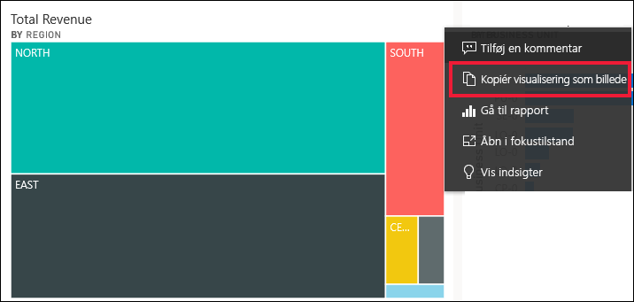
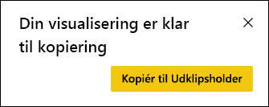
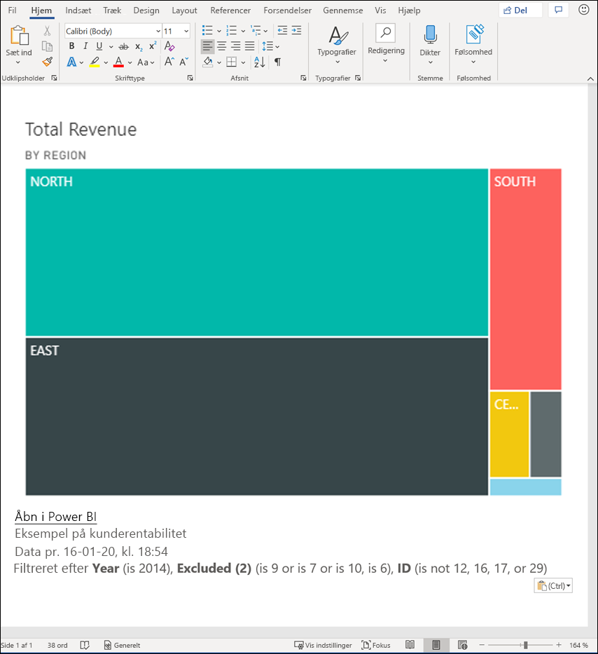
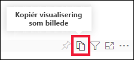
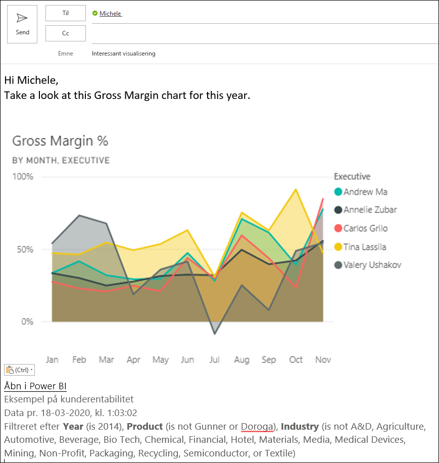
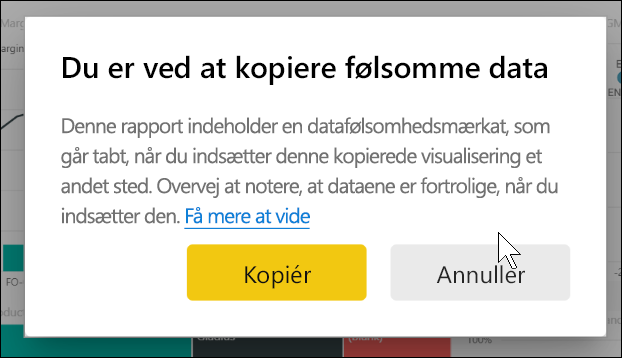
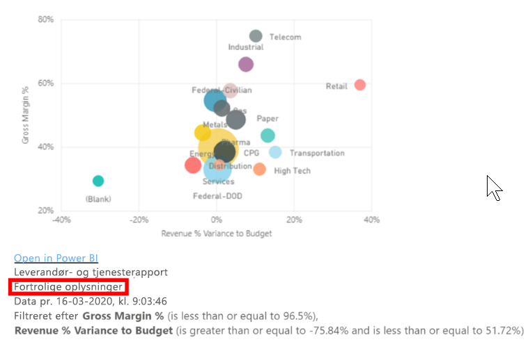
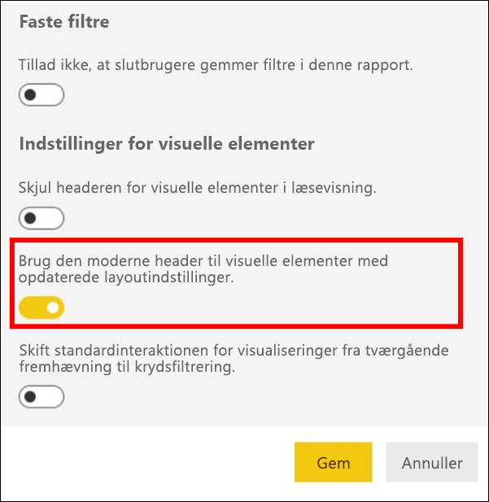
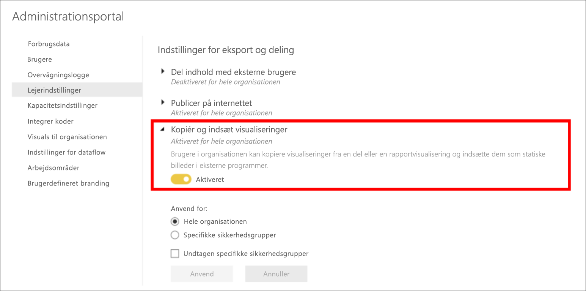
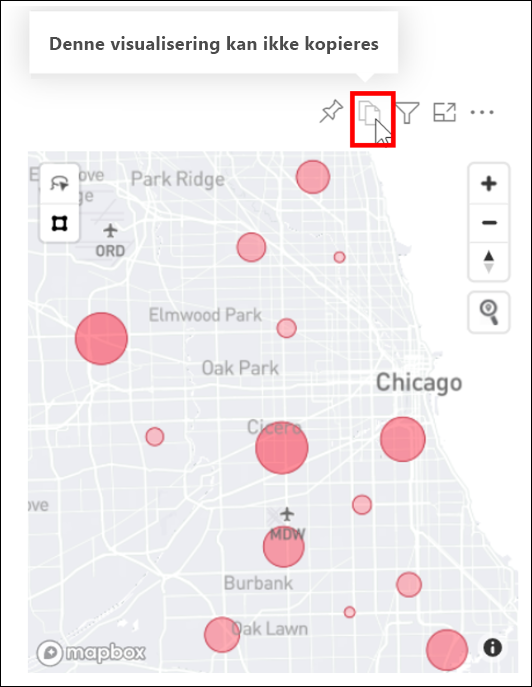

# Kopiér og indsæt en rapportvisualisering

[!INCLUDE[consumer-appliesto-yyyn](../includes/consumer-appliesto-yyyn.md)]

I denne artikel beskrives to forskellige måder at kopiere og indsætte en visualisering på. 
* Kopiér en visualisering i en rapport, og indsæt den på en anden rapportside (kræver redigeringstilladelser til rapporten)

* Kopiér et billede af en visualisering fra Power BI til Udklipsholder, og indsæt det i andre programmer

## Kopiér og indsæt i den samme rapport
Visualiseringer i Power BI-rapporter kan kopieres fra én side i rapporten til den samme side eller en anden side i den samme rapport. 

Kopiering og indsættelse af en visualisering kræver redigeringsrettigheder til rapporten. I Power BI-tjenesten betyder det, at rapporten skal åbnes i [Redigeringsvisning](../consumer/end-user-reading-view.md). 

Visualiseringer på *dashboards* kan ikke kopieres og indsættes i Power BI-rapporter eller andre dashboards.

1. Åbn en rapport, der har mindst én visualisering.  

2. Marker visualiseringen, og brug **Ctrl+C** for at kopiere og **Ctrl+V** for at indsætte.      

   

## Kopiér en visualisering som et billede til Udklipsholder

Har du nogensinde ønsket at dele et billede fra en Power BI-rapport eller et dashboard? Du kan nu kopiere visualiseringen og indsætte den i et hvilket som helst andet program, der understøtter indsættelse. 

Når du kopierer et statisk billede af en visualisering, får du en kopi af visualiseringen sammen med metadataene. Dette omfatter:
* et link, der fører tilbage til Power BI-rapporten eller -dashboardet
* titlen på rapporten eller dashboardet
* bemærk, om billedet indeholder fortrolige oplysninger
* tidsstempel for seneste opdatering
* filtre anvendt på visualiseringen

### Kopiér fra et dashboardfelt

1. Naviger til det dashboard, du vil kopiere fra.

2. I øverste højre hjørne i visualiseringen skal du vælge **Flere indstillinger (...)** og vælge **Kopiér visualisering som billede**. 

    

3. Når dialogboksen **Din visualisering er klar til kopiering** vises, skal du vælge **Kopiér til Udklipsholder**.

    

4. Når din visualisering er klar, skal du indsætte den i et andet program ved hjælp af **Ctrl + V** eller højreklikke på > Indsæt. På skærmbilledet nedenfor har vi indsat visualiseringen i Microsoft Word. 

    

### Kopiér fra en visualisering i en rapport 

1. Naviger til den rapport, du vil kopiere fra.

2. I øverste højre hjørne i visualiseringen skal du vælge ikonet for **Kopiér visualisering som billede**. 

    

3. Når dialogboksen **Din visualisering er klar til kopiering** vises, skal du vælge **Kopiér til Udklipsholder**.

    

4. Når din visualisering er klar, skal du indsætte den i et andet program ved hjælp af **Ctrl + V** eller højreklikke på > Indsæt. På skærmbilledet nedenfor har vi indsat visualiseringen i en mail.

    

5. Hvis der er anvendt en følsomhedsmærkat for dataene i rapporten, får du vist en advarsel, når du vælger ikonet for kopiering.  

    

    Og der føjes en følsomhedsmærkat til metadataene under den indsatte visualisering. 

    

### Administrer brugen af kopiering af en visualisering som et billede
Hvis du ejer indholdet eller er administrator af lejeren, kan du styre, om en visualisering kan kopieres som et billede fra en rapport eller et dashboard.

#### Deaktiver kopiering som et billede for en bestemt visualisering
Hvis du ikke ønsker, at brugerne skal kunne kopiere en bestemt visualisering, kan du fjerne ikonet for kopiering fra den pågældende visualisering.
1. Vælg ikonet med malerrullen for at åbne fanen Formatering. 

1. Åbn kortet **Formatering af visualisering**.
1. Rul ned til **Overskrift i visualisering**, udvid kortet, og slå **ikonet Kopiér** fra.

    

1. Hvis du ikke kan finde indstillingen **Overskrift i visualisering**, skal du slå indstillingen for moderne overskrift i visualisering til under **Rapportindstillinger**. 

    

1. Gem ændringerne. Del igen, og genudgiv efter behov.

#### Deaktiver kopiering som et billede for en brugergruppe

Hvis du ejer indholdet eller er administrator af lejeren, kan du styre, hvem der kan kopiere visualiseringer. Denne indstilling deaktiverer *kopiering af visualisering som et billede* for alt indhold, som brugeren har adgang til i Power BI-lejeren.
  
1. Naviger til Administrationsportalen.

1. Under **Lejerindstillinger** skal du vælge **Eksport- og delingsindstillinger**. 

    

1. Deaktiver **Kopiér og indsæt visualiseringer** for dine valgte brugergrupper. 

1. Gem ændringerne. Nu kan de angivne grupper ikke bruge **Kopiér visualisering som billede** i hele Power BI. 
  

## Overvejelser og fejlfinding

   

Spørgsmål: Hvorfor er ikonet Kopiér deaktiveret på en visualisering?    
Svar: Vi understøtter i øjeblikket oprindelige Power BI-visualiseringer og certificerede visualiseringer. Der er begrænset understøttelse af bestemte visualiseringer, herunder: 
- ESRI og andre kortvisualiseringer 
- Python-visualiseringer 
- R-visualiseringer 
- PowerApps 
- Brugerdefinerede visualiseringer, der ikke er certificerede. Få mere at vide om [hvordan du certificerer din brugerdefinerede visualisering](../developer/visuals/power-bi-custom-visuals-certified.md) for at få din brugerdefinerede visualisering understøttet. 

Spørgsmål: Hvorfor indsættes min visualisering ikke korrekt?    
Svar: Der er begrænsninger for kopiering af visualiseringer som et billede, herunder: 
- For brugerdefinerede visualiseringer 
    - Visualiseringer med anvendte temaer og farver 
    - Feltskalering, når der indsættes 
    - Brugerdefinerede visualiseringer med animationer 
- Kopieringsbegrænsninger 
    - Et dashboardfelt, der er fastgjort for nylig, kan ikke kopieres 
    - Brugere kan ikke omdirigeres til indhold med Odata-filtre og specifikke tilstande, f.eks. personlige bogmærker 
- Det er muligvis ikke alt, som blev kopieret fra visualiseringen, der gengives i programmer med begrænset understøttelse af indsættelse af HTML-formateret indhold fra Udklipsholder 

## Næste trin
Få mere at vide om [Visualiseringer i Power BI-rapporter](power-bi-report-visualizations.md)

Har du flere spørgsmål? [Prøv at spørge Power BI-community'et](https://community.powerbi.com/)

