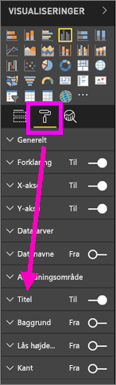
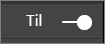
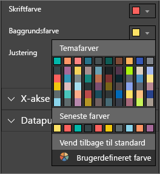
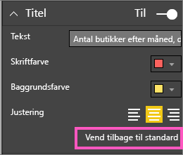
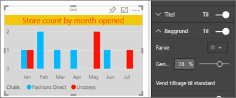
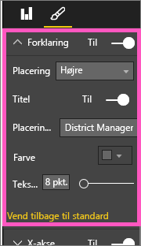
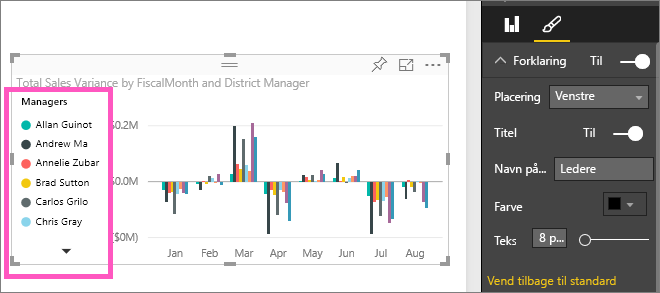

# Tilpas visualiseringernes titler, forklaringer og baggrunde

I dette selvstudium lærer du, hvordan du kan tilpasse dine visualiseringer, på flere måder. Du har mange muligheder for at tilpasse dine visualiseringer. Den bedste måde, du kan lære om dem alle på, er at udforske ruden **Format** (vælg malerrulleikonet). I denne artikel kan du se, hvordan du tilpasser en visualiserings titel, forklaring og baggrund.

Du kan ikke tilpasse alle visualiseringer. Se den [komplette liste](#visualization-types-that-you-can-customize) over visualiseringer for at få flere oplysninger.

Spol til 4:50 i videoen for at få en demonstration af, hvordan du kan tilpasse visualiseringer:

<iframe width="560" height="315" src="https://www.youtube.com/embed/IkJda4O7oGs" frameborder="0" allowfullscreen></iframe>

Nu skal du følge instruktionerne nedenfor for selv at prøve det med dine egne data.

## Forudsætninger

- Power BI-tjenesten eller Power BI Desktop

- Rapporten Retail Analysis Sample

## Tilpas titler på visualiseringer i rapporter

Hvis du vil følge med, skal du logge på [Power BI-tjenesten](https://app.powerbi.com) og åbne rapporten [Retail Analysis Sample](../sample-datasets.md) i visningen [Rediger rapport](../service-interact-with-a-report-in-editing-view.md).

> [!NOTE]
> Når du fastgør en visualisering på et dashboard, bliver den til et dashboardfelt. Du kan også tilpasse selve felterne med [nye titler og undertitler, links og tilpasning af størrelsen](../service-dashboard-edit-tile.md).

1. Gå til siden **New Stores** i rapporten **Retail Analysis Sample**.

1. Vælg det grupperede søjlediagram **Open Store Count by Open Month and Chain**.

1. I ruden **Visualiseringer** skal du vælge ikonet med malerrullen for at få vist formateringsindstillingerne.

1. Vælg **Titel** for at udvide den sektion.

   

1. Flyt skyderen **Titel** til **Til**.

   

1. Hvis du vil ændre titlen, skal du skrive **Store count by month opened** i feltet *Titeltekst*.

1. Ret **Skriftfarve** til orange og **Baggrundsfarve** til gul.

    1. Vælg rullelisten, og vælg en farve fra **Temafarver**, **Seneste farver** eller **Brugerdefineret farve**.

        

    1. Vælg rullelisten for at lukke farvevinduet.

       Gem de ændringer, du har foretaget.

       Hvis du skulle få brug for at gendanne alle ændringerne, kan du vende tilbage til de oprindelige farver ved at vælge **Vend tilbage til standard** i farvevinduet.

1. Øg tekststørrelsen til **12 pt**.

1. Den sidste tilpasning, du skal foretage af diagramtitlen, er at justere placeringen, så den står midt i visualiseringen.

    

På dette tidspunkt i selvstudiet ser titlen på dit grupperede søjlediagram nogenlunde sådan ud:

Gem de ændringer, du har foretaget, og gå til næste sektion.

Hvis du vil genindlæse alle ændringerne, skal du vælge **Vend tilbage til standard** nederst i tilpasningsruden **Titel**.

## Tilpas baggrunden i en visualisering

Udvid indstillingerne under **Baggrund** i det samme grupperede søjlediagram.

1. Flyt skyderen **Baggrund** til **Til**.

1. Vælg rullelisten, og vælg en grå farve.

1. Ret **Gennemsigtighed** til **74 %** .

På dette tidspunkt i selvstudiet ser baggrunden på dit grupperede søjlediagram nogenlunde sådan ud:

Gem de ændringer, du har foretaget, og gå til næste sektion.

Hvis du vil genindlæse alle ændringerne, skal du vælge **Vend tilbage til standard** nederst i tilpasningsruden **Baggrund**.

## Tilpas forklaringer i en visualisering

1. Åbn rapportsiden **Overview**, og vælg diagrammet **Total Sales Variance by FiscalMonth and District Manager**.

1. Under fanen **Visualiseringer** skal du vælge malerrulleikonet for at åbne ruden Formatering.

1. Udvid indstillingerne under **Forklaring**:

      

1. Flyt skyderen **Forklaring** til **Til**.

1. Flyt forklaringen til venstre side af visualiseringen.

1. Føj en titel til forklaringen ved at slå **Titel** **Til**.

1. Skriv *Managers* i feltet **Navn på forklaring**.

På dette tidspunkt i selvstudiet ser forklaringen på dit grupperede søjlediagram nogenlunde sådan ud:

Gem de ændringer, du har foretaget, og gå til næste sektion.

Hvis du vil genindlæse alle ændringerne, skal du vælge **Vend tilbage til standard** nederst i tilpasningsruden **Forklaring**.

## Visualiseringstyper, du kan tilpasse

Her er en liste over de visualiseringer og tilpasningsindstillinger, der er tilgængelige for de enkelte:

| Visualisering | Titel | Baggrund | Forklaring |
|:--- |:--- |:--- |:--- |
| Område | ja | ja |ja |
| Liggende søjle | ja | ja |ja |
| Kort | ja | ja |i/t |
| Kort med flere rækker | ja | ja | i/t |
| Kolonne | ja | ja | ja |
| Kombinationsdiagram | ja | ja | ja |
| Krans | ja | ja | ja |
| Kartogram | ja | ja | ja |
| Tragt | ja | ja | i/t |
| Måler | ja | ja | i/t |
| KPI | ja | ja | i/t |
| Linje | ja | ja | ja |
| Kort | ja | ja | ja |
| Matrix | ja | ja | i/t |
| Cirkel | ja | ja | ja |
| Punktdiagram | ja | ja | ja |
| Udsnit | ja | ja | i/t |
| Tabel | ja | ja | i/t |
| Tekstfelt | nej | ja | i/t |
| Treemap | ja | ja | ja |
| Vandfaldsdiagram | ja | ja | ja |

## Næste trin

- [Tilpas egenskaberne for X- og Y-aksen](power-bi-visualization-customize-x-axis-and-y-axis.md)

- [Introduktion til farveformatering og akseegenskaber](service-getting-started-with-color-formatting-and-axis-properties.md)

- [Grundlæggende begreber for forbrugere af Power BI-tjenesten](../consumer/end-user-basic-concepts.md)

Har du flere spørgsmål? [Prøv at spørge Power BI-community'et](http://community.powerbi.com/)
