# Tilpas egenskaberne for x- og y-aksen

[!INCLUDE [power-bi-visuals-desktop-banner](../includes/power-bi-visuals-desktop-banner.md)]

I dette selvstudium lærer du, hvordan du kan tilpasse X- og Y-aksen for dine visualiseringer på mange forskellige måder. Ikke alle visualiseringer har akser. Cirkeldiagrammer har f.eks. ikke akser. Og indstillinger for tilpasning varierer fra visualisering til visualisering. Der er for mange indstillinger til, at de kan dækkes i en enkelt artikel, så vi vil kigge på nogle af de tilpasninger, der oftest bruges. Samtidig lærer du at bruge fanen **Formatér** for visualiseringer på dit rapportcanvas i Power BI.  

Se, hvordan Amanda tilpasser sine X- og Y-akser. Hun viser også de forskellige måder, sammenkædning kan styres på, når der bruges detailudledning og færre detaljer.

> [!NOTE]
> I denne video bruges en ældre version af Power BI.

<iframe width="560" height="315" src="https://www.youtube.com/embed/9DeAKM4SNJM" frameborder="0" allowfullscreen></iframe>

## Forudsætninger

- Power BI Desktop

- [Eksempel på detailhandelsanalyse](https://download.microsoft.com/download/9/6/D/96DDC2FF-2568-491D-AAFA-AFDD6F763AE3/Retail%20Analysis%20Sample%20PBIX.pbix)

## Tilføj en ny visualisering

Før du kan tilpasse din visualisering, skal du oprette den.

1. Åbn Eksempel på detailhandelsanalyse i Power BI Desktop.  

2. Vælg det gule plusikon nederst for at tilføje en ny side. 

    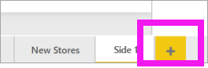

1. Vælg ikonet for stablet søjlediagram i ruden **Visualiseringer**. Derved føjes der en tom skabelon til dit rapportcanvas.

    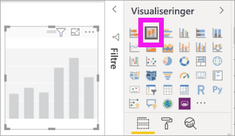

1. Hvis du vil angive værdierne på X-aksen, skal du gå til ruden **Felter** og vælge **Time** > **FiscalMonth**.

1. Hvis du vil angive værdier for Y-aksen, skal du gå til ruden **Felter** og vælge **Sales** > **Last Year Sales** og **Sales** > **This Year Sales** > **Value**.

    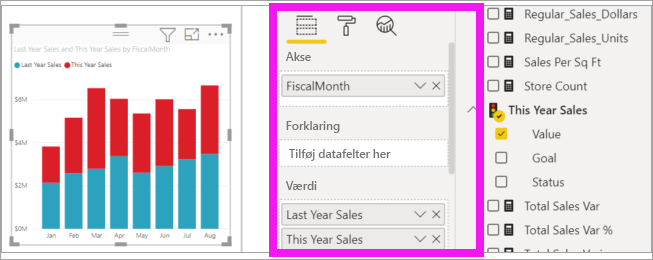

    Du kan nu tilpasse X-aksen. Power BI giver dig næsten ubegrænsede muligheder for at formatere din visualisering. 

## Tilpas X-aksen
Der er mange funktioner, som kan tilpasses for X-aksen. Du kan tilføje og redigere datanavne og titel på X-aksen. I forbindelse med kategorier kan du ændre bredden, størrelsen og udfyldningen af søjler, kolonner, linjer og områder. Og i forbindelse med værdier kan du ændre visningsenheder, decimaler og gitterlinjer. I følgende eksempel vises tilpasning af et søjlediagram. Lad os tilføje nogle få tilpasninger, så du kan få mere at vide om dine muligheder, og derefter kan du selv udforske resten.

### Tilpas navne på X-aksen
Navnene på X-aksen vises under kolonnerne i diagrammet. Lige nu er de så lysegrå, små og svære at læse. Lad os ændre dette.

1. I ruden **Visualiseringer** skal du vælge **Formatér** (malerrulleikonet  ) for at få vist indstillinger for tilpasning.

2. Udvid indstillingerne under X-aksen.

   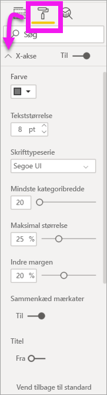

3. Flyt skyderen for **X-aksen** til **Til**.

    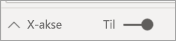

    Nogle af årsagerne til, at du vil angive X-aksen til **Fra**, kan være, at visualiseringen er selvforklarende uden navne, eller hvis du har en rapportside, der er overfyldt, og du har brug for mere plads for at få vist flere data.

4. Formatér tekstfarven, tekststørrelsen og skrifttypen:

    - **Farve**: Vælg sort

    - **Tekststørrelse**: Skriv *14*

    - **Skrifttypefamilie**: Vælg **Arial Black**

    - **Indre margen**: Indtast *40 %*

        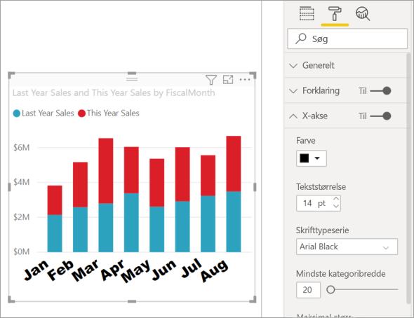
    
5. Du bryder dig måske ikke om den måde, teksten til X-aksen vises på diagonalt. Du har flere muligheder. 
    - Skift tekststørrelsen til noget, der er mindre end 14.
    - Gør visualiseringen større. 
    - Vis færre kolonner, og tilføj et rullepanel ved at øge **Mindste kategoribredde**. 
    
    Her har vi valgt den anden indstilling og taget en af tilpasningslinjerne for at gøre visualiseringen bredere. Der er nu plads til 14 pkt. tekst, uden at det er nødvendigt at vise teksten skævt eller med et rullepanel. 

   

### Tilpas titlen på X-aksen
Når titlen på X-aksen er **slået til**, vises titlen på X-aksen under navnene på X-aksen. 

1. Start med at slå titlen for X-aksen **til**.  

    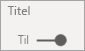

    Det første, du bemærker, er, at din visualisering nu har en standardtitel på X-aksen.  I dette tilfælde er det **FiscalMonth**.

   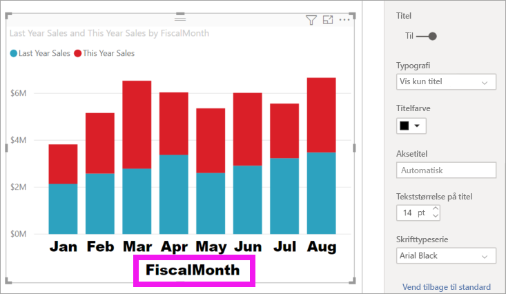

1. Formatér tekstfarven, tekststørrelsen og skrifttypen:

    - **Titelfarve**: Vælg orange

    - **Aksetitel**: Skriv *Fiscal Month* (med et mellemrum)

    - **Tekststørrelse på titel**: Indtast *18*

    Når du er færdig med tilpasningerne, ser dit stablede søjlediagram nogenlunde sådan ud:

    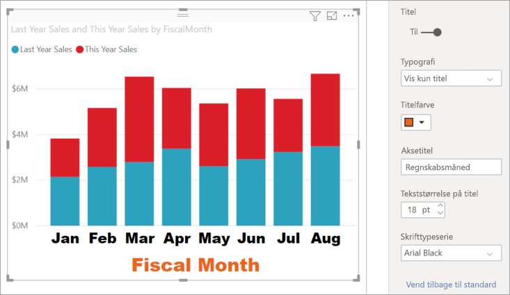

1. Gem de ændringer, du har foretaget, og gå til næste sektion. Hvis du vil genindlæse alle ændringerne, skal du vælge **Vend tilbage til standard** nederst i tilpasningsruden **X-akse**. Derefter skal du tilpasse Y-aksen.

## Tilpas Y-aksen
Der er mange funktioner, som kan tilpasses for Y-aksen. Du kan tilføje og redigere datanavne, titlen på X-aksen og gitterlinjer. I forbindelse med værdier kan du ændre visningsenheder, decimaler, startpunkter og slutpunkter. Og i forbindelse med kategorier kan du ændre bredden, størrelsen og udfyldningen af søjler, kolonner, linjer og områder. 

I følgende eksempel fortsætter vi med at tilpasse et søjlediagram. Lad os foretage et par ændringer, så du kan få mere at vide om dine muligheder, og derefter kan du selv udforske resten.

### Tilpas navne på Y-aksen
Navnene på Y-aksen vises som standard til venstre. Lige nu er de så lysegrå, små og svære at læse. Lad os ændre dette.

1. Udvid indstillingerne under Y-akse.

   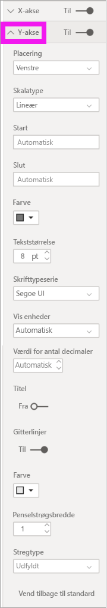

1. Flyt skyderen for **Y-aksen** til **Til**.  

    

    Du kan for eksempel vælge at slå Y-aksen fra, hvis du vil frigøre mere plads til data.

1. Formatér tekstfarven, tekststørrelsen og skrifttypen:

    - **Farve**: Vælg sort

    - **Tekststørrelse**: Indtast *10*

    - **Visningsenheder**: Vælg **Millioner**

    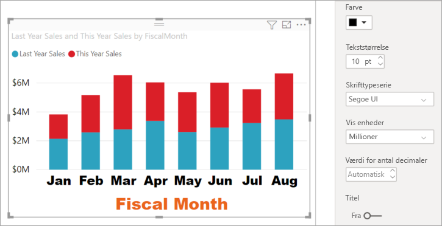

### Tilpas titlen på Y-aksen
Når titlen på Y-aksen er **slået til**, vises titlen på Y-aksen ud for navnene på Y-aksen. Denne visualisering bliver ikke bedre, hvis du viser titlen på Y-aksen, så lad **Titel** være slået **Fra**. Senere i dette selvstudium føjer vi titler på Y-aksen til et visuelt element med to akser. 

### Tilpas gitterlinjerne
Lad os få gitterlinjerne til at skille sig mere ud ved at ændre farven og øge penselstrøgsbredden:

- **Farve**: Vælg orange

- **Penselstrøgsbredde**: Skriv *2*

Efter alle disse tilpasninger bør dit kolonnediagram se ud som følgende:

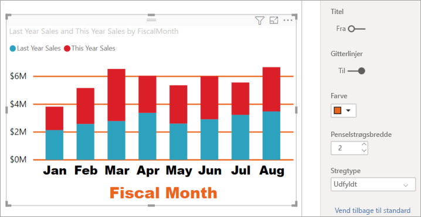

## Tilpas visualiseringer med to Y-akser

I nogle visualiseringer kan du med fordel bruge to Y-akser. Kombinationsdiagrammer er et godt eksempel. Før vi kan formatere to Y-akser, opretter vi et kombinationsdiagram, der sammenligner tendenser for salg og bruttoavance.  

### Opret et diagram med to Y-akser

1. Vælg søjlediagrammet, og skift det til et *kurvediagram og stablet søjlediagram*. Denne type visuals understøtter en enkelt kurvediagramværdi og flere værdier for kolonner, der kan stables. 

    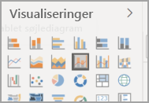
   

2. Træk **Sales** > **Gross Margin Last Year %** fra ruden Felter til beholderen **Line Values**.

    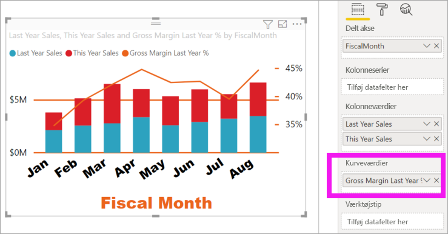

    
3. Omformater visualiseringen for at fjerne de skæve navne på X-aksen. 

   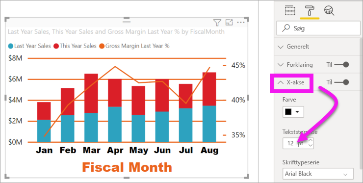

   Power BI opretter to Y-akser, så værdierne kan skaleres forskelligt. Den venstre akse måler salg i dollar, og den højre akse måler bruttoavanceprocent.

### Formatér den anden Y-akse
Fordi vi startede med en visualisering med én formateret Y-akse, har Power BI oprettet den anden Y-akse med de samme indstillinger. Men det kan vi ændre. 

1. I ruden **Visualiseringer** skal du vælge ikonet med malerrullen for at få vist formateringsindstillingerne.

1. Udvid indstillingerne under Y-akse.

1. Rul ned, indtil du finder indstillingen **Vis sekundær**. Kontrollér, at den er slået **Til**. Vores sekundære Y-akse repræsenterer kurvediagrammet.

   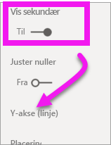

1. (Valgfrit) Tilpas skriftfarve, størrelse og visningsenheder for de to akser. Hvis du ændrer **Placering** for en af de to akser i søjlediagrammet eller aksen i kurvediagrammet, skifter de to akser side.

### Føj titler til begge akser

Når en visualisering er avanceret, hjælper det at tilføje aksetitler.  Titler hjælper dine kolleger med at forstå, hvad det er, din visualisering viser.

1. Slå **Titel** **Til** for **Y-akse (søjlediagram)** og **Y-akse (kurvediagram)** .

1. Angiv **Typografi** til **Vis kun titel** for begge.

   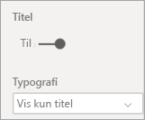

1. Dit kombinationsdiagram viser nu to akser, som begge har en titel.

   

1. Formatér titlerne. I dette eksempel har vi forkortet en af titlerne og reduceret skriftstørrelsen for begge. 
    - Skriftstørrelse: **9**
    - Forkortet **aksetitel** for den første Y-akse (søjlediagrammet): Sidste års salg og dette års salg

    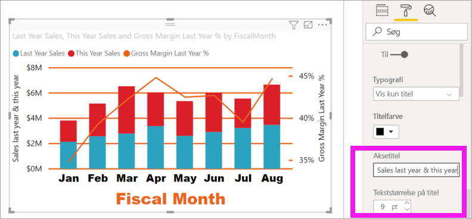

Du kan finde flere oplysninger under [Tip og tricks til farveformatering i Power BI](service-tips-and-tricks-for-color-formatting.md) og [Tilpas visualiseringernes titler, forklaringer og baggrunde](power-bi-visualization-customize-title-background-and-legend.md). Og søg efter nye opdateringer til formatering af titler, der kommer snart. 

## Næste trin

- [Visualiseringer i Power BI-rapporter](power-bi-report-visualizations.md)

Har du flere spørgsmål? [Prøv at spørge Power BI-community'et](https://community.powerbi.com/)
