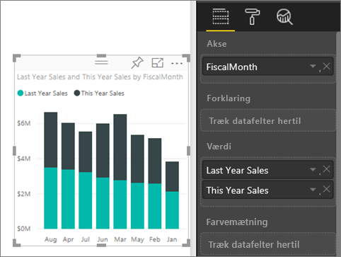
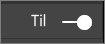
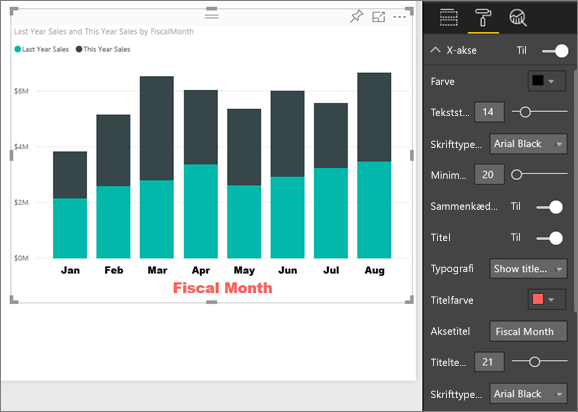
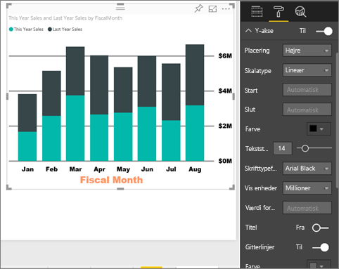
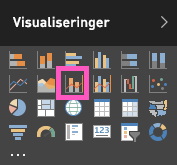
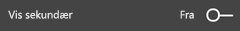
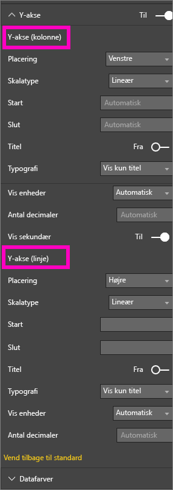
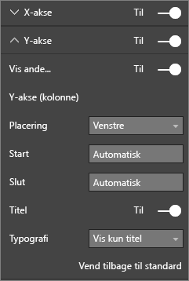

# Tilpas egenskaberne for x- og y-aksen
I dette selvstudium lærer du mange forskellige måder til at tilpasse X- og Y-aksen for dine visualiseringer. Det er ikke alle visualiseringer, der har akser, eller som kan tilpasses. Et cirkeldiagram har for eksempel ikke akser. Indstillingerne for tilpasning kan desuden variere mellem visualiseringerne. Samtidig er der for mange indstillinger til, at de kan beskrives i én artikel. Jeg vil derfor se nærmere på nogle af de aksetilpasninger, der oftest bruges. Så får du samtidig erfaring med at bruge fanen Format for visualiseringer på dit rapportcanvas i Power BI.  

> [!NOTE]
> Oplysningerne på denne side er relevante for både Power BI-tjenesten og Power BI Desktop. Disse tilpasninger, som vises, når du vælger fanen **Format** (ikonet med malerullen ), findes også i Power BI Desktop.  
>
>

Se Amanda tilpasse sine X- og Y-akser og vise de forskellige måder, hvorpå du kan styre sammenkædning på forskellige detaljeniveauer. Følg derefter de trinvise instruktioner under videoen for selv at afprøve Retail Analysis-eksemplet.

<iframe width="560" height="315" src="https://www.youtube.com/embed/9DeAKM4SNJM" frameborder="0" allowfullscreen></iframe>

## Tilpas X-aksen i en visualisering i en rapport
## Opret en visualisering med et stablet diagram
Log på Power BI-tjenesten, og åbn rapporten **Retail Analysis Sample** i [redigeringsvisning](../service-interact-with-a-report-in-editing-view.md). Hvis du vil følge med, skal du [oprette forbindelse til Retail Analysis-eksemplet](../sample-datasets.md).

1. Opret et nyt søjlediagram, der viser værdien af årets og sidste års omsætning efter regnskabsmåned.
2. Konvertér diagrammet til et stablet søjlediagram.

    

## Tilpas X-aksen
1. I ruden Visualiseringer og Filtre skal du vælge **Format** (ikonet med malerullen ) for at vise indstillinger for tilpasning.
2. Udvid indstillingerne under X-akse.

   
3. Du kan slå X-aksen til eller fra ved at vælge skyderen ud for X-akse. Lad den stå på **Til**.  Du kan for eksempel vælge at slå X-aksen fra, hvis du vil have mere plads til data.

    
4. Formatér tekstfarven, tekststørrelsen og skrifttypen. I dette eksempel har jeg angivet **Farve** til sort, **Tekststørrelse** til 14 og **Skrifttype** til Arial Black.  
5. Slå Titel under X-akse **Til**, og vis navnet på X-aksen – i dette tilfælde hedder den **FiscalMonth**.  
6. Formatér tekstfarven, tekststørrelsen og skrifttypen.  I dette eksempel har jeg indstillet **Titelfarve** til orange, ændret **Aksetitel** til **Fiscal Month** og **Titeltekststørrelse** til 21.
7. Hvis du vil sortere efter FiscalMonth, skal du vælge de tre prikker (...) i øverste højre hjørne af diagrammet og vælge **Sortér efter FiscalMonth**.

    Efter alle disse tilpasninger bør dit kolonnediagram se ud som følgende:

     

Hvis du vil gendanne alle de tilpasninger af X-aksen, du har foretaget indtil videre, skal du vælge **Vend tilbage til standard** nederst i ruden med indstillinger for **X-aksen**.

## Tilpas X-aksen
1. Udvid indstillingerne under Y-akse.

   

2. Du kan slå Y-aksen til eller fra ved at vælge skyderen ud for Y-akse. Lad den stå på **Til**.  Du kan for eksempel vælge at slå Y-aksen fra, hvis du vil frigøre mere plads til data.
   
    
3. Ret **Placering** under Y-akse til Højre.
4. Formatér tekstfarven, tekststørrelsen og skrifttypen. I dette eksempel har jeg angivet **Farve** til sort, **Tekststørrelse** til 14 og **Skrifttype** til Arial Black.  
5. Lad **Vis enheder** stå som Millioner og **Værdi for antal decimaler** til nul.
6. I denne visualisering giver det ikke nogen forbedring at vise titlen på Y-aksen, så lad **Titel** være slået Fra.  
7. Lad os få gitterlinjerne til at skille sig mere ud ved at ændre **Farve** til mørkegrå og øge **Penselstrøgsbredde** til 2.

    Efter alle disse tilpasninger bør dit kolonnediagram se ud som følgende:

     

## Tilpas visualiseringer med to Y-akser
Start med at oprette et kombinationsdiagram, der viser, hvordan antallet af butikker påvirker salget.  Dette er det samme diagram, som blev oprettet i [Selvstudium med kombinationsdiagram](power-bi-visualization-combo-chart.md). Derefter skal du formatere de to Y-akser.

### Opret et diagram med to Y-akser
1. Opret et nyt kurvediagram, der sporer **Sales > Gross Margin last year %** efter **Time > FiscalMonth**.
2. Sortér visualiseringen efter måned ved at vælge de tre prikker (...) og vælge **Sortér efter måned**

    

> [NOTE]: For help sorting by month, see [sorting by other criteria](../power-bi-report-change-sort.md#other)
> 1. For januar var GM% på 35 %, steg til 45 % i april, faldt i juli og steg igen i august. Kan vi se et tilsvarende mønster for salget i dette og sidste år?
> 2. Tilføj **This Year Sales > Value** og **Last Year Sales** i kurvediagrammet. Skalaen for **GM% Last Year** (den blå streg, der kører langs gitterlinjen 0M %) er meget mindre end skalaen for **Sales**, hvilket gør det svært at sammenligne. Og procentsatserne på Y-aksen er vist ikke så meget værd.      

   
5. Hvis du vil gøre det nemmere at læse og fortolke visualiseringen, skal du konvertere kurvediagrammet til et Kurvediagram og stablet søjlediagram.

   

6. Træk **Gross Margin Last Year %** fra **Kolonneværdier** til **Kurveværdier**. Nu har vi et stablet søjlediagram, som vi oprettede tidligere, ***plus*** et kurvediagram.  (Du kan evt. bruge de ting, du lærte tidligere, for at formatere skriftfarven og skriftstørrelsen for aksen.)
   

   Der oprettes to akser i Power BI, og datasættene kan derfor skaleres forskelligt. Det kan ses ved, at den venstre akse måles i dollar, mens den højre akse måles i procent.

   

### Formatér den sekundære Y-akse
1. I ruden **Visualiseringer** skal du vælge ikonet med malerullen for at få vist formateringsindstillingerne.
2. Udvid indstillingerne for Y-aksen ved at vælge den nedadvendte pil.
3. Rul gennem listen, indtil du finder indstillingerne for **Vis sekundær**. Ret **Vis sekundær** fra **Fra** til **Til**.

   

   
4. (Valgfrit) Tilpas de to akser. Hvis du ændrer **Placering** for en af de to akser i søjlediagrammet eller aksen i kurvediagrammet, skifter de to akser side.

   

### Føj titler til begge akser
Når en visualisering er så kompleks som denne, hjælper det at tilføje aksetitler.  Titler hjælper dine kolleger med at forstå, hvad det er, din visualisering viser.

1. Slå **Titel** **Til** for **Y-akse (søjlediagram)** og **Y-akse (kurvediagram)**.
2. Angiv **Stil** til **Vis kun titel**.

   
3. I kombinationsdiagrammet vises der nu to akser, som begge har en titel.

   

Du kan finde flere oplysninger under [Tips og tricks til farveformatering, navne og akseegenskaber](service-tips-and-tricks-for-color-formatting.md).

## Overvejelser og fejlfinding
Hvis X-aksen er kategoriseret som en datotype af rapportejeren, vil indstillingen **Type** blive vist, og du kan vælge mellem Fortløbende eller Efter kategori.

## Næste trin
Få mere at vide om [Visualiseringer i Power BI-rapporter](power-bi-report-visualizations.md)

[Tilpas ](power-bi-visualization-customize-title-background-and-legend.md)[titler, baggrunde og forklaringer](power-bi-visualization-customize-title-background-and-legend.md)

[Tilpas farver og akseegenskaber](service-getting-started-with-color-formatting-and-axis-properties.md)

[Power BI – Grundlæggende begreber](../service-basic-concepts.md)

Har du flere spørgsmål? [Prøv at spørge Power BI-community'et](http://community.powerbi.com/)
