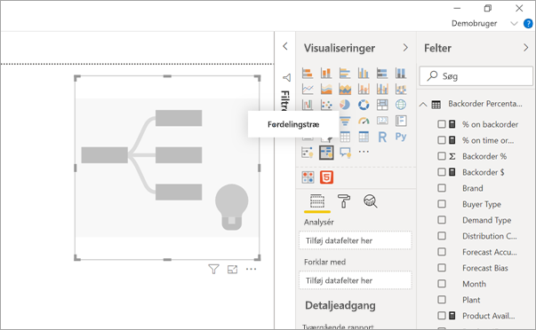
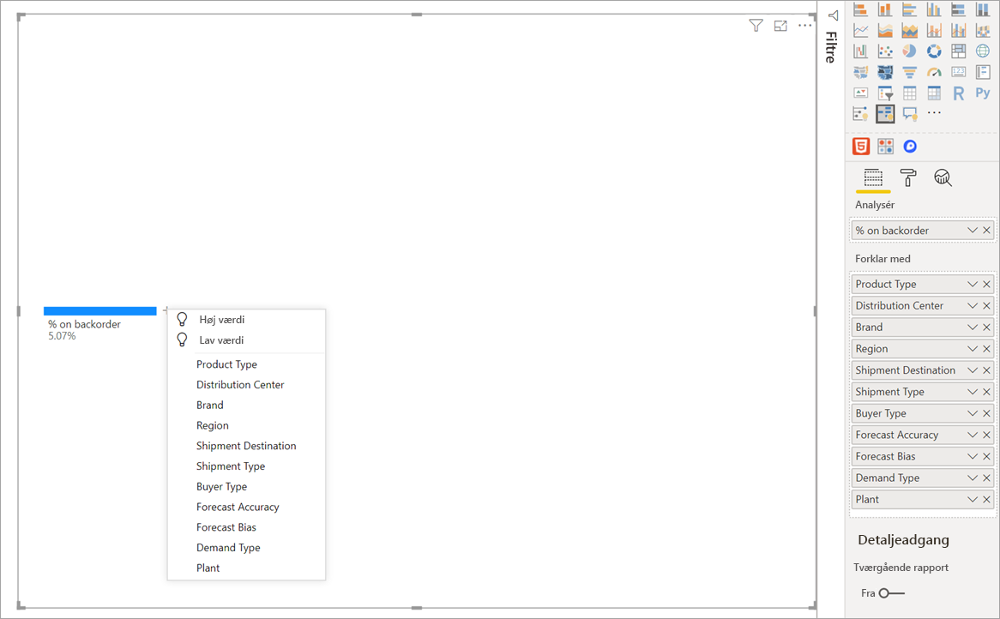
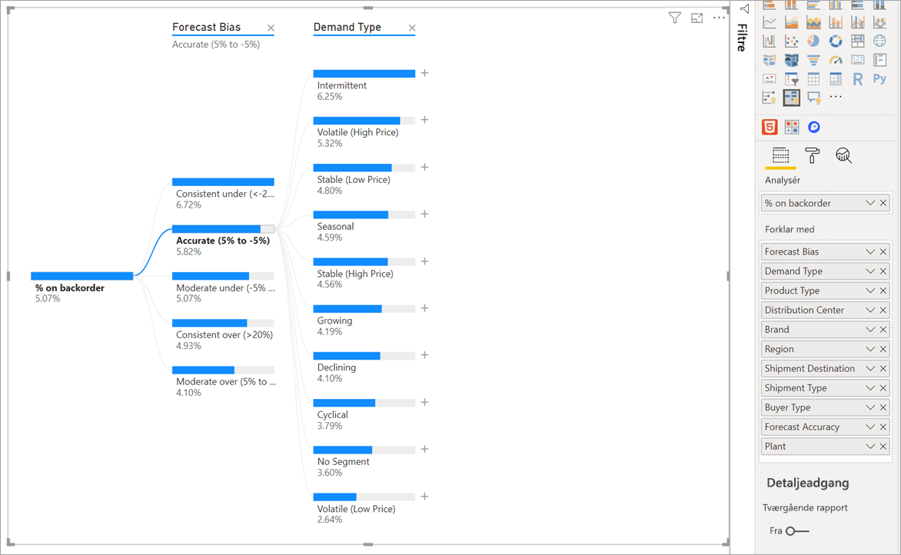
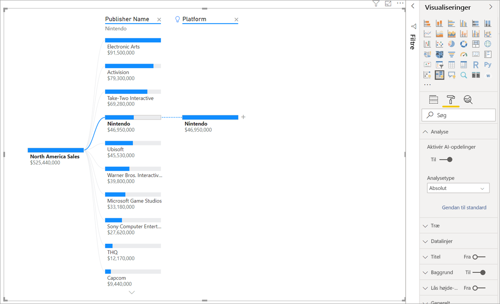
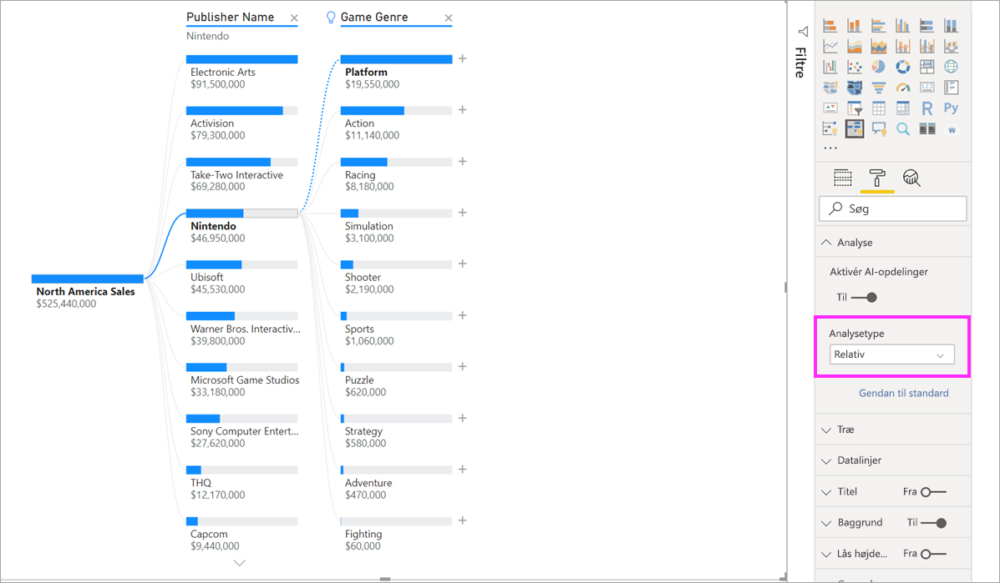
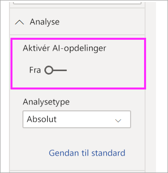

# Opret og få vist fordelingstrævisualiseringer i Power BI

[!INCLUDE[consumer-appliesto-nyyn](../includes/consumer-appliesto-nyyn.md)]

[!INCLUDE [power-bi-visuals-desktop-banner](../includes/power-bi-visuals-desktop-banner.md)]

Fordelingstrævisual'et i Power BI giver dig mulighed for at visualisere data på tværs af flere dimensioner. Den samler automatisk data og giver dig mulighed for at foretage detailudledning i dine dimensioner i vilkårlig rækkefølge. Det er også en AI-visualisering (kunstig intelligens), så du kan bede den om at finde den næste dimension, så du kan foretage detailudledning på baggrund af bestemte kriterier. Det gør det til et værdifuldt værktøj til ad hoc-udforskning og udførelse af rodårsags analyser.

I dette selvstudium bruges der to eksempler:

- Et scenario for forsyningskæden, der analyserer hvor stor en procentdel af produkterne, en virksomhed har i restlager (ikke på lager).  
- Et salgsscenarie, der analyserer salg af videospil i efter mange faktorer, f. eks. spilgenre og udgiver.

Du kan finde den pbix, der er anvendt i forsyningskædescenariet her: [Eksempel på forsyningskæde.pbix](
https://github.com/microsoft/powerbi-desktop-samples/blob/master/Sample%20Reports/Supply%20Chain%20Sample.pbix).

> [!NOTE]
> Når du deler din rapport med en Power BI-kollega, kræves det, at I begge har individuelle Power BI Pro-licenser, eller at rapporten er gemt i en Premium-kapacitet.    

## Kom i gang
Vælg ikonet for fordelingstræet i ruden Visualiseringer.

Visualiseringen kræver to typer input:

 - **Analysér** – den metrikværdi, du vil analysere. Det skal være en måling eller en aggregering.  
 - **Forklar efter** – en eller flere dimensioner, hvor du gerne vil foretage detailudledning.

Når du trækker din måling til feltbrønd, viser de visuelle opdateringer den aggregerede måling. I eksemplet nedenfor visualiserer vi, hvor mange % af produkterne der gennemsnitligt er i restordre (5,07%).

Næste trin er af hente en eller flere dimensioner, hvor du vil foretage detailudledning. Føj disse felter til bucket'en **Forklar efter**. Bemærk, at der vises et plustegn ud for rodnoden. Hvis du vælger knappen +, kan du vælge, hvilket felt du vil foretage detailudledning i (du kan foretage detailudledning i felterne i en hvilken som helst rækkefølge).

Hvis du vælger **Forventningsbias** udvides træet, og målingerne analyseres efter værdierne i kolonnen. Denne proces kan gentages ved at vælge en anden node, hvor der skal foretages detailudledning.

Når du vælger en node fra det sidste niveau, filtreres dataene i tværgående retning. Når du vælger en node fra et tidligere niveau, ændres stien.

Ved interaktion med andre visuals filtreres fordelingstræet i tværgående retning. Det kan betyde af nodernes rækkefølge på de enkelte niveauer ændres.
I eksemplet nedenfor har vi filtreret træet i tværgående retning efter Ubisoft. Stien opdateres, og Xbox-salget flyttes fra første til anden placering og overhales af PlayStation. 

Hvis vi derefter filtrerer træet i tværgående retning efter Nintendo, er Xbox Sales tomt, da der ikke er udviklet Nintendo-spil til Xbox. Xbox filtreres ud af visningen sammen med den efterfølgende sti.

Selvom stien forsvinder, forbliver de eksisterende niveauer (i dette tilfælde Spilgenre) fastgjort i træet. Hvis du vælger noden Nintendo, udvides træet derfor automatisk til Spilgenre.

## AI-opdelinger

Du kan bruge "AI-opdelinger" til at finde ud af, hvor du efterfølgende skal kigge i dataene. Disse opdelinger vises øverst på listen og er markeret med en elpære. Opdelingerne er der for at hjælpe dig med automatisk at finde høje og lave værdier i dataene.

Analysen kan fungere på to måder, afhængigt af dine indstillinger. Standardfunktionsmåden er følgende:

 - **Højeste værdi**: Tager alle tilgængelige felter i betragtning og bestemmer, hvilke data der skal foretages detailudledning i for at få den højeste værdi af den måling, der analyseres.  
 - **Laveste værdi**: Tager alle tilgængelige felter i betragtning og bestemmer, hvilke data der skal foretages detailudledning i for at få den laveste værdi af den måling, der analyseres.  

Hvis du vælger **Højeste værdi** i eksemplet med restordrer, resulterer det i følgende:

Der vises en elpære ud for **Produkttype**, der angiver, at dette var en 'AI-opdeling'. Træet indeholder også en punkteret linje, der anbefaler noden **Patient Monitoring**, da det resulterer i den højeste værdi for restordrer (9,2 %). 

Peg på elpæren for at se et værktøjstip. I dette eksempel er værktøjstippet "restordre-% er højest, når Produkttype er Patientovervågning".

Du kan konfigurere visual'et for at finde **relative** AI-opdelinger i modsætning til **absolutte** opdelinger. 

I relativ tilstand søges der efter høje værdier, der skiller sig ud (sammenlignet med de øvrige data i kolonnen). Lad os tage et kig på et eksempel, der illustrerer dette:

I skærmbilledet ovenfor kigger vi på Nordamerikas salg af videospil. Vi opdeler først træet ved **Udgivernavn** og foretager derefter en detailudledning i Nintendo. Hvis du vælger **Højeste værdi** resulterer det i en udvidelse af **Platform er Nintendo**. Da Nintendo (udgiveren) kun udvikler til Nintendo-konsoller, findes der kun én værdi som ikke overraskende er den højeste værdi.

En mere interessant opdeling ville dog være at se på, hvilken høj værdi, der adskiller sig fra andre værdier i den samme kolonne. Hvis vi ændrer analysetypen fra **Absolut** til **Relative**, får vi følgende resultat for Nintendo: 

Denne gang er den anbefalede værdi **Platform i Spilgenre**.  Platformen giver ikke en højere absolut værdi end Nintendo (19.950.000 USD vs. 46.950.000 USD). Det er dog en værdi, der skiller sig ud.

Det vil mere præcist sige, at da der er 10 spilgenreværdier, er den forventede værdi for platformen 4,6 mio. USD, hvis de skulle deles ligeligt. Da platformen har en værdi på næsten 20 mio. USD, er det et interessant resultat, da det er fire gange højere end det forventede resultat.

Beregningen er som følger:

Nordamerikas salg for Platform/Abs(gns(Nordamerikas salg for Spilgenre))  
vs.  
Nordamerikas salg for Nintendo/Abs(gns(Nordamerikas salg for Platform))  

Hvilket kan oversættes til:

19.550.000/(19.550.000 + 11.140.000 +... + 470.000 + 60.000/10) = 4,25x  
vs.  
46.950.000/(46.950.000/1) = 1x  

Hvis du foretrækker ikke at bruge nogen AI-opdelinger i træet, har du også mulighed for at slå dem fra under indstillingerne for **Analyseformatering**:  

## Træinteraktioner med AI-opdelinger

Du kan have flere på hinanden følgende AI-niveauer. Du kan også blande forskellige typer AI-niveauer (gå fra Højeste værdi til Laveste værdi og tilbage til Højeste værdi):

Hvis du vælger en anden node i træet, genberegnes AI-opdelingerne fra bunden. I eksemplet nedenfor er den valgte node ændret på niveauet **Forventningsbias**. De efterfølgende niveauer ændres for at give de korrekte højeste og laveste værdier

AI-niveauer genberegnes også, når du filtrerer fordelingstræet efter et andet visual. I eksemplet nedenfor ses det, at restordre-% er højest for fabrik #0477.

Men hvis vi vælger **april** i det liggende søjlediagram, er de største ændringer af **Produkttype Avanceret kirurgisk**. I dette tilfælde er det ikke kun noderne, der blev genbestilt, men der blev valgt en helt anden kolonne. 

Hvis du vil have AI-niveauer til at fungere som ikke-AI-niveauer, skal du vælge elpæren for at gendanne standardfunktionsmåden. 

Mens flere AI-niveauer kan sammenkædes, kan et ikke-AI-niveau ikke følge efter et AI-niveau. Hvis der foretages en manuel opdeling efter en AI-opdeling, forsvinder elpæren fra AI-niveauet, og niveauet omdannes til et normalt niveau. 

## Låsning

En indholdsopretter kan låse niveauer for rapportforbrugere. Når et niveau er låst, kan det ikke fjernes eller ændres. En forbruger kan udforske forskellige stier på det låste niveau, men kan ikke ændre selve niveauet. Som opretter kan du pege på eksisterende niveauer for at se låseikonet. Du kan låse så mange niveauer, du vil, men du kan ikke have ulåste niveauer før låste niveauer.

I eksemplet nedenfor er de to første niveauer låst. Det betyder, at brugerne kan ændre niveau 3 og 4 og endda tilføje nye niveauer bagefter. De første to niveauer kan imidlertid ikke ændres:

## Kendte begrænsninger

Det maksimale antal niveauer for træet er 50. Det maksimale antal datapunkter, der kan visualiseres på én gang i træet, er 5000. Vi afkorter niveauer, så de viser de øverste n. De øverste n pr. niveau er angivet til 10. 

Fordelingstræet understøttes ikke i følgende scenarier:  
-   Analysis Services i det lokale miljø

AI-opdelinger understøttes ikke i følgende scenarier:  
-   Azure Analysis Services
-   Power BI-rapportserver
-   Udgiv på internettet
-   Komplekse målinger og målinger fra udvidelsesskemaer i 'Analysér'

Andre begrænsninger:
- Understøttelse i Spørgsmål og svar

## Næste trin

[Kransediagram i Power BI](power-bi-visualization-doughnut-charts.md)

[Visualiseringer i Power BI](power-bi-report-visualizations.md)

