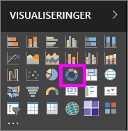
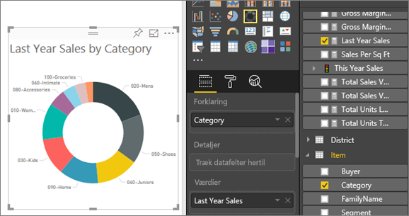

# Kransediagrammer i Power BI
Et kransediagram ligner meget et cirkeldiagram og viser relationen mellem dele af en helhed. Den eneste forskel er, at centreret i det er tomt og giver plads til en etiket eller et ikon.

## Opret et kransediagram
I denne vejledning benyttes eksemplet Retail Analysis Sample (Eksempel på detailhandelsanalyse)til at oprette et kransediagram, der viser dette års salg efter kategori. Du skal [downloade eksemplet](../sample-datasets.md) til Power BI-tjenesten (app.powerbi.com) eller Power BI Desktop, så du kan følge med.

1. Start på en [tom rapportside](../power-bi-report-add-page.md), og vælg feltet **SalesStage** \> **Sales Stage**. Hvis du bruger Power BI-tjenesten, skal du åbne rapporten i [Redigeringsvisning](../service-interact-with-a-report-in-editing-view.md).

2. I ruden Felter skal du vælge **Sales** \> **Last Year Sales**.  
   
3. Vælg ikonet for kransediagram  i ruden Visualiseringer for at konvertere dit liggende søjlediagram til et kransediagram. Hvis **Last Year Sales** ikke findes i området **Værdier**, skal du trække det derhen.
     
   

4. Vælg **Element** \> **Kategori** for at føje det til området **Forklaring**. 
     
    

5. Du kan eventuelt [tilpasse størrelsen og farven på diagrammets tekst](power-bi-visualization-customize-title-background-and-legend.md). 

## Overvejelser og fejlfinding
* Summen af kransediagrammets værdier skal give 100 %.
* Er der for mange kategorier, er det svært at læse og fortolke diagrammet.
* Kransediagrammer er bedst egnet til at sammenligne en bestemt del med helheden og ikke sammenligne de enkelte dele med hinanden. 

## Næste trin
[Rapporter i Power BI](../consumer/end-user-reports.md)

[Visualiseringstyper i Power BI](power-bi-visualization-types-for-reports-and-q-and-a.md)

[Visualiseringer i Power BI-rapporter](power-bi-report-visualizations.md)

[Power BI – grundlæggende begreber](../consumer/end-user-basic-concepts.md)

Har du flere spørgsmål? [Prøv at spørge Power BI-community'et](http://community.powerbi.com/)

