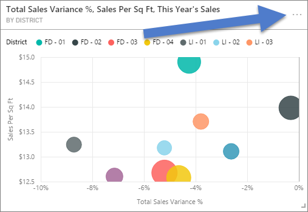
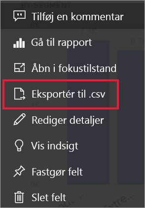
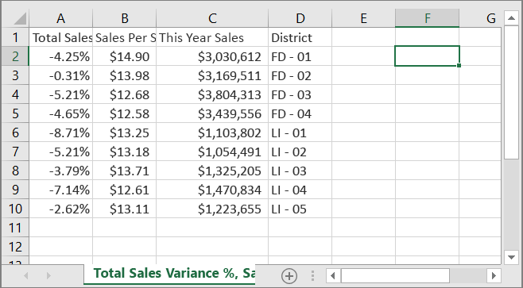
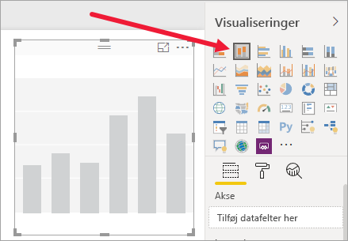
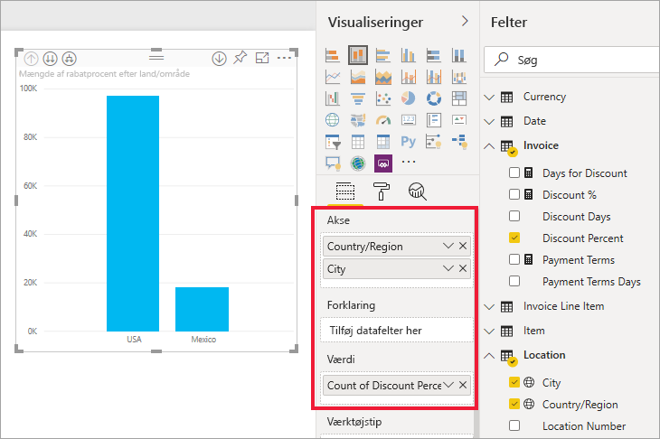
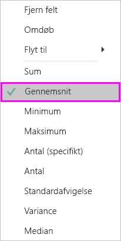
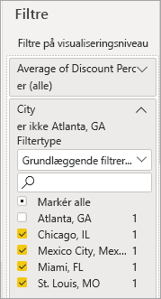
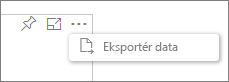
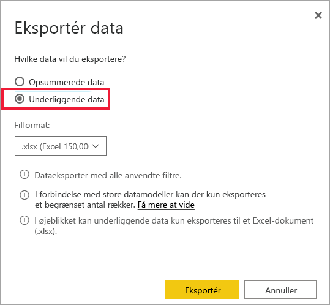
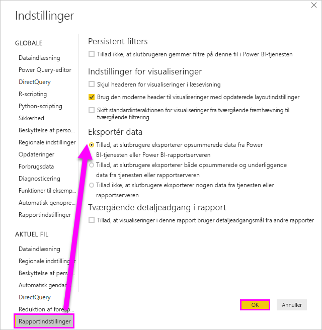

# Eksportér de data, der blev brugt til at oprette en visualisering

> [!IMPORTANT]
> Ikke alle data kan ses eller eksporteres af alle brugere. Der er sikkerhedsforanstaltninger, som rapportdesignere og administratorer bruger, når de bygger dashboards og rapporter. Nogle data er begrænsede, skjulte eller fortrolige, og de kan ikke ses eller eksporteres uden særlige tilladelser. 

## Hvem kan eksportere data

Hvis du har tilladelser til dataene, kan du se og eksportere de data, Power BI bruger til at oprette en visualisering. Data er ofte fortrolige eller begrænset til specifikke brugere. I disse tilfælde kan du ikke se eller eksportere disse data. Du kan finde flere oplysninger i afsnittet **Begrænsninger og overvejelser** i slutningen af dette dokument. 

## Visning og eksport af data

Hvis du gerne vil have vist de data, der bruges til at oprette en visualisering, [kan du få vist de pågældende data i Power BI](service-reports-show-data.md). Du kan også eksportere disse data til Excel som en *.xlsx*- eller *.csv*-fil. Indstillingen for eksport af data kræver en Pro- eller Premium-licens samt redigeringstilladelser til datasættet og rapporten. Hvis du har adgang til dashboardet eller rapporten, men dataene er klassificeret som *yderst fortrolige*, kan du ikke eksportere dataene med Power BI.

Se med, når Will eksporterer dataene fra en af visualiseringerne i hans rapport, gemmer dem som en *.xlsx*-fil og åbner dem i Excel. Følg derefter den trinvise vejledning under videoen for at prøve det selv. Bemærk, at i denne video bruges en ældre version af Power BI.

<iframe width="560" height="315" src="https://www.youtube.com/embed/KjheMTGjDXw" frameborder="0" allowfullscreen></iframe>

## Eksportér data fra et Power BI-dashboard

1. Vælg Flere indstillinger (...) i øverste højre hjørne af visualiseringen.

    

1. Vælg indstillingen **Eksportér til csv**.

    

1. Power BI eksporterer dataene til en *.csv*-fil. Hvis du har filtreret visualiseringen, filtreres .csv-eksporten også. 

1. Via browseren bliver du bedt om at gemme filen.  Når du har gemt *.csv-filen*, kan du åbne den i Excel.

    

## Eksportér data fra en rapport

Hvis du vil følge med, skal du åbne [eksempelrapporten med en indkøbsanalyse](../create-reports/sample-procurement.md) i Power BI-tjenesten i redigeringsvisning. Tilføj en ny tom rapportside. Følg derefter nedenstående trin for at tilføje en samling, et hierarki og et filter på visualiseringsniveau.

### Opret et stablet søjlediagram

1. Opret et nyt **stablet søjlediagram**.

    

1. I ruden **Felter** skal du vælge **Placering > By**, **Faktura > Land/område** og **Faktura > Rabatprocent**.  Du skal muligvis flytte **Rabatprocent** til området **Værdi**.

    

1. Skift aggregering for **Rabatprocent** fra **Antal** til **Gennemsnit**. I området **Værdi** skal du vælge pilen til højre for **Rabatprocent** (der kan f.eks. stå **Antal rabatprocenter**) og vælge **Gennemsnit**.

    

1. Føj et filter til **By**, vælg alle byer, og fjern derefter **Atlanta**.

    

   
1. Foretag detailudledning et niveau nedad i hierarkiet. Aktivér detailudledning, og analysér ned til niveauet **By**. 

    

Vi er nu klar til at prøve begge muligheder for eksport af data.

### Eksportér ***opsummerede*** data
Vælg indstillingen for **Opsummerede data**, hvis du vil eksportere dataene til det, du ser i visualiseringen.  Denne type eksport viser kun de data, (kolonner og målinger), der bruges til at oprette visualiseringen.  Hvis visualiseringen har en aggregering, skal du eksportere aggregerede data. Hvis du f.eks. har et søjlediagram med fire søjler, vises der fire rækker med Excel-data. Opsummerede data er tilgængelige i Power BI-tjenesten som *.xlsx* og *.csv* og i Power BI Desktop som .csv.

1. Vælg ellipsen i øverste højre hjørne af visualiseringen. Vælg **Eksportér data**.

    

    I Power BI-tjenesten har du to muligheder, da din visualisering har en samling (du har ændret **Antal** til *gennemsnitligt*):

    - **Opsummerede data**

    - **Underliggende data**

    Hvis du vil have hjælp til at forstå sammenlægninger, kan du se under [Aggregater i Power BI](../create-reports/service-aggregates.md).

    > [!NOTE]
    > I Power BI Desktop har du kun muligheden for at eksportere opsummerede data som en .csv-fil. 
    
    
1. Fra **Eksportér data** skal du vælge **Opsummerede data**, enten vælge *.xlsx* eller *.csv* og derefter vælge **Eksportér**. Dataene eksporteres i Power BI.

    

1. Når du vælger **Eksportér**, bliver du i browseren bedt om at gemme filen. Når du har gemt den, skal du åbne filen i Excel.

    

    I dette eksempel vises én total for hver by i Excel-eksporten. Da vi har filtreret Atlanta fra, er denne by ikke inkluderet i resultaterne. I den første række i regnearket vises de filtre, der blev brugt under udtrækningen af data.
    
    - Alle de data, der bruges af hierarkiet, eksporteres, og ikke blot de data, der bruges til det aktuelle detaljeniveau for visualiseringen. Vi har f.eks. analyseret ned til byniveauet, men vores eksport omfatter også landedata.  

    - Vores eksporterede data er samlet. Vi får en total, én række, for hver by.

    - Eftersom du har anvendt filtre på visualiseringen, vil de eksporterede data være filtreret. Bemærk, at den første række viser **Anvendte filtre: By er ikke Atlanta, GA**. 

### Eksportér ***underliggende*** data

Vælg denne indstilling, hvis du vil se dataene i visualiseringen ***og*** yderligere data fra datasættet (se mere i diagrammet nedenfor). Hvis visualiseringen har en aggregering, fjernes det, hvis du vælger **Underliggende data**. I dette eksempel vises der kun én række for hver enkelt By-række i Excel-eksporten samt rabatprocenten for den pågældende post. Power BI flader dataene ud, de samles ikke.  

Når du vælger **Eksportér**, eksporterer Power BI dataene til en *.xlsx*-fil, og i browseren bliver du bedt om at gemme filen. Når du har gemt den, skal du åbne filen i Excel.

1. Vælg ellipsen i øverste højre hjørne af visualiseringen. Vælg **Eksportér data**.

    

    I Power BI-tjenesten har du to muligheder, da din visualisering har en samling (du har ændret **Antal** til **gennemsnitligt**):

    - **Opsummerede data**

    - **Underliggende data**

    Hvis du vil have hjælp til at forstå sammenlægninger, kan du se under [Aggregater i Power BI](../create-reports/service-aggregates.md).

    > [!NOTE]
    > I Power BI Desktop har du kun muligheden for at eksportere opsummerede data. 
    
    
1. Fra **Eksportér data** skal du vælge **Underliggende data** og derefter vælge **Eksportér**. Dataene eksporteres i Power BI.

    

1. Når du vælger **Eksportér**, bliver du i browseren bedt om at gemme filen. Når du har gemt den, skal du åbne filen i Excel.

    
    
    - Dette skærmbillede viser kun en lille del af Excel-filen. Den har mere end 100.000 rækker.  
    
    - Alle de data, der bruges af hierarkiet, eksporteres, og ikke blot de data, der bruges til det aktuelle detaljeniveau for visualiseringen. Vi har f.eks. analyseret ned til byniveauet, men vores eksport omfatter også landedata.  

    - Eftersom du har anvendt filtre på visualiseringen, vil de eksporterede data være filtreret. Bemærk, at den første række viser **Anvendte filtre: By er ikke Atlanta, GA**. 

## Beskyttelse af fortrolige data

Dit datasæt kan have indhold, der ikke skal kunne ses af alle brugere. Hvis du ikke er forsigtig, kan eksport af underliggende data give brugerne mulighed for at se alle de detaljerede data for visualiseringen – alle kolonner og alle rækker i dataene. 

Der er flere strategier, som Power BI-administratorer og -designere bør bruge til at beskytte fortrolige data. 

- Designere [beslutter, hvilke *eksportindstillinger*](#set-the-export-options) der er tilgængelige for brugerne.  

- Power BI-administratorer kan slå dataeksport fra for deres organisation. 

- Ejere af datasæt kan angive sikkerhed på rækkeniveau (RLS). RLS vil begrænse adgangen til skrivebeskyttede brugere. Men hvis du har konfigureret en apps arbejdsområde og givet medlemmerne redigeringstilladelse, anvendes RLS-rollerne ikke på dem. Du kan finde flere oplysninger i [Sikkerhed på rækkeniveau](../admin/service-admin-rls.md).

- Rapportdesignere kan skjule kolonner, så de ikke vises på listen **Felter**. Du kan finde flere oplysninger under [Egenskaber for datasæt](../developer/automation/api-dataset-properties.md)

- Power BI-administratorer kan tilføje [følsomhedsmærkater](../admin/service-security-data-protection-overview.md) til dashboards, rapporter, datasæt og dataflows. De kan derefter gennemtvinge beskyttelsesindstillinger, f.eks. kryptering eller vandmærker, når dataene eksporteres. 

- Power BI-administratorer kan bruge [Microsoft Cloud App Security](../admin/service-security-data-protection-overview.md) til at overvåge brugeradgang og -aktivitet, udføre risikoanalyse i realtid og angive mærkatspecifikke kontrolelementer. Organisationer kan f.eks. bruge Microsoft Cloud App Security til at konfigurere en politik, der forhindrer brugere i at downloade følsomme data fra Power BI til enheder, der ikke administreres. 

## Eksporter oplysninger om underliggende data

Det kan variere, hvad du ser, når du vælger **Underliggende data**. Du skal eventuelt have hjælp af administratoren eller it-afdelingen for at forstå disse oplysninger. 

>

| Visualiseringen indeholder | Hvad eksporten viser  |
|---------------- | ---------------------------|
| Aggregeringer | den *første* aggregering og ikke-skjulte data fra hele tabellen for denne aggregering |
| Aggregeringer | relaterede data – hvis der i visualiseringen bruges data fra andre datatabeller, som er *relaterede* til den datatabel, der indeholder aggregeringen (så længe relationen er \*:1 eller 1:1) |
| Målinger* | alle målinger i visualiseringen *og* alle målinger fra en hvilken som helst datatabel med en måling, der bruges i visualiseringen |
| Målinger* | alle ikke-skjulte data fra tabeller, der indeholder målingen (så længe relationen er \*:1 eller 1:1) |
| Målinger* | alle data fra alle tabeller, der er relateret til tabel(ler) med målingerne via en kæde af \*:1 af 1:1) |
| Kun målinger | alle ikke-skjulte kolonner fra alle relaterede tabeller (for at udvide målingen) |
| Kun målinger | opsummerede data for duplikerede rækker for modelmålinger |

\* I Power BI Desktop eller -tjenesten vises en *måling* på listen **Felter** med et lommeregnerikon, der , i rapportvisning. Målinger kan oprettes i Power BI Desktop.

### Angiv eksportindstillingerne

Designere af Power BI-rapporter styrer, hvilke typer eksportindstillinger af data der er tilgængelige for deres forbrugere. Valgmulighederne er:

- Tillad, at slutbrugere eksporterer opsummerede data fra Power BI-tjenesten eller Power BI-rapportserveren

- Tillad, at slutbrugere eksporterer både akkumulerede og underliggende data fra tjenesten eller rapportserveren

- Tillad ikke, at slutbrugere eksporterer data fra tjenesten eller rapportserveren

    > [!IMPORTANT]
    > Vi anbefaler, at rapportdesignere går tilbage til tidligere rapporter og manuelt nulstiller eksportindstillingen efter behov.

Sådan angiver du disse indstillinger:

1. Start i Power BI Desktop.

1. I øverste venstre hjørne skal du vælge **Filer** > **Indstillinger** > **Indstillinger**.

1. Under **AKTUEL FIL** skal du vælge **Rapportindstillinger**.

    

1. Vælg din indstilling i sektionen **Eksportér data**.

Du kan også opdatere denne indstilling i Power BI-tjenesten.

Vigtigt! Hvis der er konflikt mellem indstillingerne på Power BI-administratorportalen og rapportindstillingerne for eksport af data, overskriver administratorindstillingerne indstillingerne for eksport af data.

## Begrænsninger og overvejelser
Disse begrænsninger og overvejelser gælder for Power BI Desktop og Power BI-tjenesten, herunder Power BI Pro og Premium.

- Hvis du vil eksportere dataene fra en visualisering, skal du have [tilladelse til at oprette for det underliggende datasæt](https://docs.microsoft.com/power-bi/service-datasets-build-permissions).

-  Det maksimale antal rækker, som **Power BI Desktop** og **Power BI-tjenesten** kan eksportere fra en **rapport for importtilstand** til en *.csv-fil* er 30.000.

- Det maksimale antal rækker, som programmerne kan eksportere fra en **rapport for importtilstand** til en *.xlsx-fil* er 150.000.

- Eksport ved hjælp af *underliggende data* fungerer ikke, hvis:

  - Versionen er ældre end 2016.

  - Tabellerne i modellen ikke har en entydig nøgle.
    
  -  En administrator eller rapportdesigner har deaktiveret denne funktion.

- Eksport ved hjælp af *underliggende data* fungerer ikke, hvis du aktiverer indstillingen *Vis elementer uden data* for den visualisering, som Power BI eksporterer.

- Når du bruger DirectQuery, kan Power BI maks. eksportere 16 MB dekomprimerede data. Det kan være et utilsigtet resultat, hvis du eksporterer mindre end det maksimale antal rækker på 150.000. Dette er sandsynligt, hvis:

    - Der er for mange kolonner. Prøv at reducere antallet af kolonner og eksportere igen.

    - Der er data, som er vanskelige at komprimere.

    - Der er andre faktorer, som medfører, at filstørrelsen øges, og antallet af rækker, som Power BI kan eksportere, reduceres.

- Hvis visualiseringen bruger data fra mere end én datatabel, og der ikke findes nogen relation for disse tabeller i datamodellen, eksporterer Power BI kun data for den første tabel.

- Power BI-visuals og R-visuals understøttes ikke i øjeblikket.

- I Power BI kan du omdøbe et felt (en kolonne) ved at dobbeltklikke på feltet og skrive et nyt navn. Power BI henviser til det nye navn som et *alias*. Det er muligt at have dublerede feltnavne i en Power BI-rapport, men det understøttes ikke i Excel. Hvis Power BI eksporterer dataene til Excel, gendannes feltaliasserne derfor til de oprindelige feltnavne (kolonnenavne).  

- Hvis der er Unicode-tegn i *.csv*-filen, vises teksten muligvis ikke korrekt i Excel. Valutasymboler og fremmedord er eksempler på Unicode-tegn. Du kan åbne filen i Notesblok, hvor Unicode vises korrekt. Hvis du vil åbne filen i Excel, er løsningen at importere *.csv*-filen. Sådan importerer du filen til Excel:

  1. Åbn Excel.

  1. Gå til fanen **Data**.
  
  1. Vælg **Hent eksterne data** > **Fra tekst**.
  
  1. Gå til den lokale mappe, hvor filen er gemt, og vælg *.csv*-filen.

- Når du eksporterer til *.csv*, kan du "escape" nogle tegn med en foranstillet **'** .

- Power BI-administratorer kan deaktivere dataeksporten.

Har du flere spørgsmål? [Prøv at spørge Power BI-community'et](https://community.powerbi.com/)
