# Opret og brug udfyldte kort (choropleth-kort) i Power BI

[!INCLUDE [power-bi-visuals-desktop-banner](../includes/power-bi-visuals-desktop-banner.md)]

Et udfyldt kort bruger skygger eller toner eller mønstre til at vise, hvordan en værdi varierer i forhold på tværs af et geografisk område eller en region.  Fremvis hurtigt disse relative forskelle med skygger, der går fra lys (mindre-hyppige/lavere) til mørk (mere-hyppige/mere).    

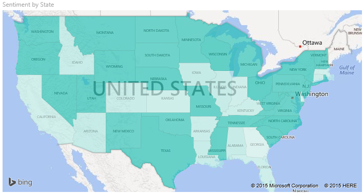

## Hvad sendes til Bing
Power BI integreres med Bing for at angive standardkortkoordinaterne (en proces, der kaldes geokodning). Når du opretter en kortvisualisering i Power BI-tjenesten eller Power BI Desktop, sendes dataene i feltbeholderne **Location**, **Latitude** og **Longitude** ( der bruges til at oprette den pågældende visualisering) til Bing.

Du eller din administrator skal muligvis opdatere firewallen for at tillade adgang til URL-adresser, som Bing bruger til geokodning.  URL-adresserne er:
- https://dev.virtualearth.net/REST/V1/Locations    
- https://platform.bing.com/geo/spatial/v1/public/Geodata    
- https://www.bing.com/api/maps/mapcontrol

Du kan finde flere oplysninger om de data, der sendes til Bing, og få tip til at få større succes med geokodning under [Tip og råd til kortvisualiseringer](power-bi-map-tips-and-tricks.md).

## Hvornår er det smart at bruge udfyldte kort?
Udfyldte kort er et godt valg:

* Til at vise kvantitative oplysninger på et kort.
* Til at vise rumlige mønstre og relationer.
* Når dine data er standardiserede.
* Når du arbejder med socioøkonomiske data.
* Når definerede områder er vigtige.
* For at få et overblik over distributionen på tværs af geografiske placeringer.

### Forudsætninger
I dette selvstudium bruges [PBIX-filen med eksemplet til Salg og marketing](https://download.microsoft.com/download/9/7/6/9767913A-29DB-40CF-8944-9AC2BC940C53/Sales%20and%20Marketing%20Sample%20PBIX.pbix).
1. Vælg **Fil** > **Åbn** i øverste venstre sektion på menulinjen
   
2. Find din kopi af **PBIX-filen med eksemplet til Salg og marketing**

1. Åbn **PBIX-filen med eksemplet til Salg og marketing** i rapportvisning .

1. Markér  for at tilføje en ny side.

## Opret et grundlæggende udfyldt kort
I denne video opretter Kim et grundlæggende kort og konverterer det til et udfyldt kort.
   > [!NOTE]
   > I denne video bruges en ældre version af Power BI Desktop.
   > 
   > 

[VIDEO https://www.youtube.com/embed/ajTPGNpthcg ]

### Opret et kartogram
1. Fra ruden Felter skal du vælge feltet **Geo** \> **State**.    

   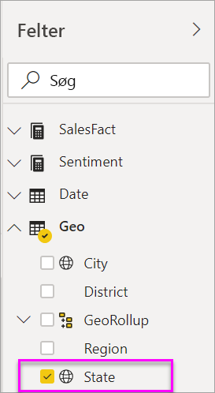
2. [Konvertér diagrammet](power-bi-report-change-visualization-type.md) til et udfyldt kort. Bemærk, at **State** nu befinder sig i beholderen **Location**. Bing Maps bruger feltet i beholderen **Location** til at oprette kortet.  Der er mange forskellige muligheder for gyldige placeringer: lande, stater, kommuner, byer, postnumre osv. Bing Maps levere udfyldte kortfigurer for placeringer over hele verden. Uden en gyldig post i beholderen Location kan Power BI ikke oprette det udfyldte kort.  

   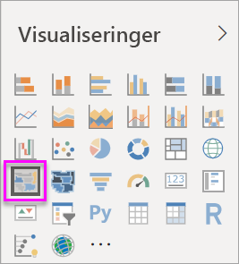
3. Filtrer kortet, så du kun ser det kontinentale USA.

   a.  Til venstre i ruden Visualiseringer skal du finde ruden **Filtre**. Udvid ruden, hvis den er minimeret.

   b.  Hold markøren over **State**, og klik på pilen for at udvide.  
   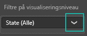

   c.  Markér afkrydsningsfeltet ud for **All**, og fjern markeringen ud for **AK**.

   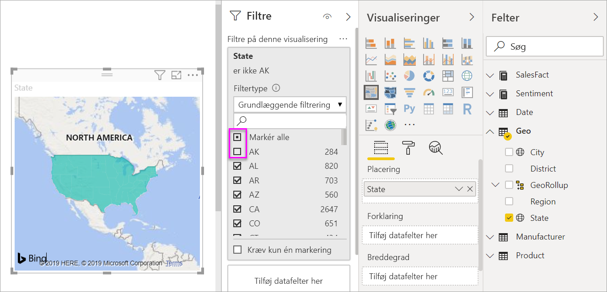
4. Vælg ikonet med malerrullen for at åbne ruden Formatering, og vælg **Datafarver**.

    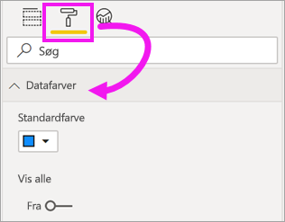

5. Klik på de tre lodrette prikker, og vælg **Betinget formatering**.

    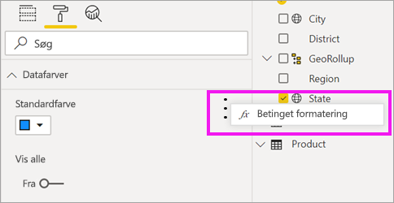

6. Brug skærmen **Standardfarve - Datafarver** til at bestemme, hvordan dit kartogram skyggelægges. De indstillinger, der er tilgængelige for dig, omfatter, hvilket felt skyggen skal baseres på, og hvordan skyggen skal anvendes. I dette eksempel bruger vi feltet **SalesFact** > **Synspunkt** og angiver den laveste værdi for synspunkt som orange og den højeste værdi som blå. Værdier, der ligger mellem den maksimale og den minimale, er nuancer af orange og blå. På illustration nederst på skærmen vises det farveområde, der bruges. 

    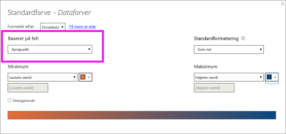

7. Kartogrammet har grønne og røde skygger, hvor rød repræsenterer de lavere tillidstal, og grøn repræsenterer den højere, mere positive tillid.  For at få vist yderligere detaljer skal du trække et felt til brønden Værktøjstip.  Her har vi tilføjet **SalesFact** > **Synspunktforskydning**. Når du fremhæver staten Idaho (ID), ses det, at synspunktforskydningen er lav – 6.
   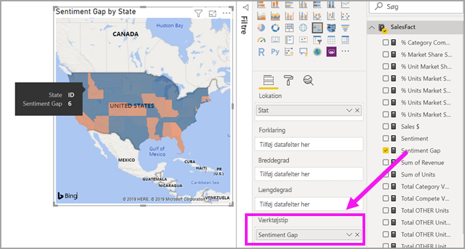

10. [Gem rapporten](../service-report-save.md).

I Power BI kan du i høj grad selv styre udseendet af dit kartogram. Leg lidt med disse datafarvekontrolelementer, indtil du får det ønskede udseende. 

## Fremhævning og krydsfiltrering
Du kan få mere at vide om brug af ruden Filters under [Føj et filter til en rapport](../power-bi-report-add-filter.md).

Hvis du fremhæver en placering på et kartogram, krydsfiltreres de andre visualiseringer på rapportsiden... og omvendt.

1. For at følge med skal du først gemme denne rapport ved at vælge **Filer > Gem**. 

2. Kopiér kartogrammet ved hjælp af Ctrl + C.

3. Nederst på rapportcanvasset skal du vælge fanen **Synspunkt** for at åbne rapportsiden Synspunkt.

    

4. Flyt og tilpas størrelsen på visualiseringerne på siden for at få mere plads, indsæt derefter kartogrammet med Ctrl + V fra den tidligere rapport. (Se følgende billeder)

   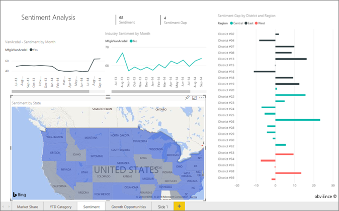

5. Vælg en stat på det udfyldte kort.  Dette krydsfremhæver og krydsfiltrerer de andre visualiseringer på siden. Hvis du f.eks. vælger **Texas**, krydsfiltreres kortene og det liggende søjlediagram fremhæves. Derudaf kan du se, at synspunktet er 75, og at Texas ligger i det centrale distrikt nr. 23.   
   
2. Vælg et datapunkt i kurvediagrammet VanArsdel – tillid efter måned. Derved filtreres kartogrammet for at vise tillidsdata for VanArsdel og ikke deres konkurrenter.  
   

## Overvejelser og fejlfinding
Kortdata kan være tvetydige.  Der er f.eks. en by, der hedder Paris i Frankrig, men der er også en by, der hedder Paris i Texas. Dine geografiske data gemmes sikkert i separate kolonner – en kolonne til bynavne, en kolonne til statsnavne osv. – så Bing kan muligvis ikke regne ud, hvilket Paris du mener. Hvis dit datasæt allerede indeholder data om breddegrad og længdegrad, har Power BI særlige felter, der kan hjælpe med at gøre kortdataene entydige. Træk det felt, der indeholder dine data om breddegrad til området Visualizations \> Latitude.  Og gør det samme med dine længdegradsdata.    

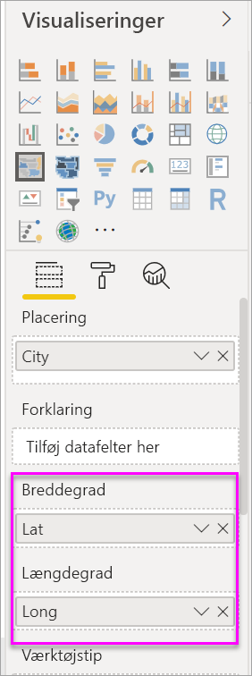

Hvis du har rettigheder til at redigere datasættet i Power BI Desktop, kan du se denne video for at få hjælp til at korrigere tvetydighed på kortet.

[VIDEO https://www.youtube.com/embed/Co2z9b-s_yM ]

Hvis du ikke har adgang til data om breddegrad og længdegrad, men du har redigeringsadgang til datasættet, [skal du følge disse instruktioner for at opdatere datasættet](https://support.office.com/article/Maps-in-Power-View-8A9B2AF3-A055-4131-A327-85CC835271F7).

Du kan få hjælp til kortvisualiseringer under [Tip og råd til kortvisualiseringer](../power-bi-map-tips-and-tricks.md).

## De næste trin

[Figurkort](desktop-shape-map.md)

[Visualiseringstyper i Power BI](power-bi-visualization-types-for-reports-and-q-and-a.md)