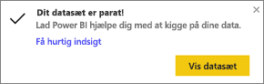
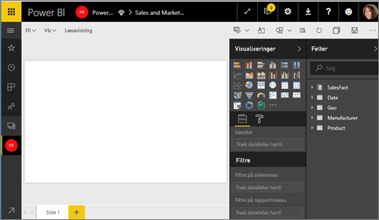
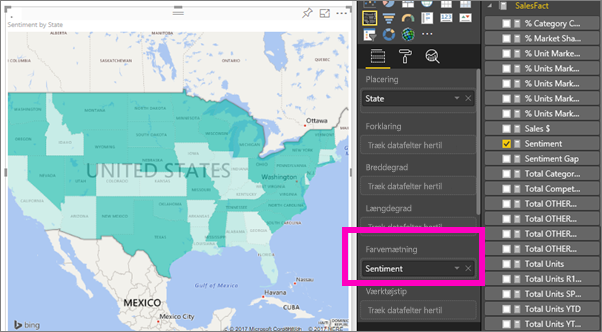
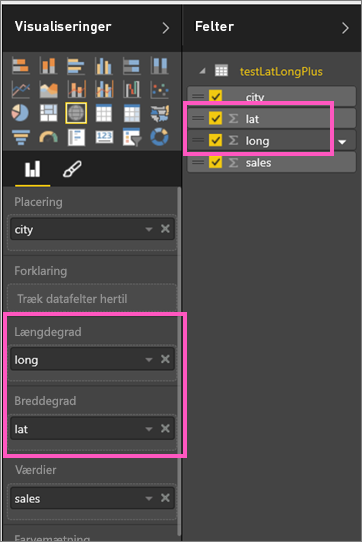

# Udfyldte kort (Choropleths) i Power BI
Et udfyldt kort bruger skygger eller toner eller mønstre til at vise, hvordan en værdi varierer i forhold på tværs af et geografisk område eller en region.  Fremvis hurtigt disse relative forskelle med skygger, der går fra lys (mindre-hyppige/lavere) til mørk (mere-hyppige/mere).    

## Hvad sendes til Bing
Power BI integreres med Bing for at angive standardkortkoordinaterne (en proces, der kaldes geokodning). Når du opretter en kortvisualisering i Power BI-tjenesten eller Power BI Desktop, sendes dataene i feltbeholderne **Location**, **Latitude** og **Longitude** ( der bruges til at oprette den pågældende visualisering) til Bing.

Du eller din administrator skal muligvis opdatere firewallen for at tillade adgang til URL-adresser, som Bing bruger til geokodning.  URL-adresserne er:
    * https://dev.virtualearth.net/REST/V1/Locations
    * https://platform.bing.com/geo/spatial/v1/public/Geodata
    * https://www.bing.com/api/maps/mapcontrol

Du kan finde flere oplysninger om de data, der sendes til Bing, og få tip til at få større succes med geokodning under [Tip og råd til kortvisualiseringer](power-bi-map-tips-and-tricks.md).

## Hvornår er det smart at bruge udfyldte kort?
Udfyldte kort er et godt valg:

* Til at vise kvantitative oplysninger på et kort.
* Til at vise rumlige mønstre og relationer.
* Når dine data er standardiserede.
* Når du arbejder med socioøkonomiske data.
* Når definerede områder er vigtige.
* For at få et overblik over distributionen på tværs af geografiske placeringer.

### Forudsætninger
- Power BI-tjenesten eller Power BI Desktop
- Eksempel på salg og marketing

Hvis du vil følge med, bruges Power BI-tjenesten i dette selvstudium, ikke Power BI Desktop.

## Opret et grundlæggende udfyldt kort
I denne video opretter Kim et grundlæggende kort og konverterer det til et udfyldt kort.

<iframe width="560" height="315" src="https://www.youtube.com/embed/ajTPGNpthcg" frameborder="0" allowfullscreen></iframe>

1. Hvis du vil oprette dit eget udfyldte kort, kan du [downloade salgs- og marketingeksemplet](../sample-datasets.md) ved at logge på Power BI og vælge **Hent data \> Eksempler \> Salg og marketing \> Tilslut**.
2. Når meddelelsen om, at processen lykkedes, vises, skal du vælge **Vis datasæt**.

   
3. Power BI åbner et tomt rapportlærred i [Redigeringsvisning](../service-interact-with-a-report-in-editing-view.md).

    
4. Fra ruden Fields skal du vælge feltet **Geo** \> **State**.    

   
5. [Konvertér diagrammet](power-bi-report-change-visualization-type.md) til et udfyldt kort. Bemærk, at **State** nu befinder sig i beholderen **Location**. Bing Maps bruger feltet i beholderen **Location** til at oprette kortet.  Der er mange forskellige muligheder for gyldige placeringer: lande, stater, kommuner, byer, postnumre osv. Bing Maps levere udfyldte kortfigurer for placeringer over hele verden. Uden en gyldig post i beholderen Location kan Power BI ikke oprette det udfyldte kort.  

   
6. Filtrer kortet, så du kun ser det kontinentale USA.

   a.  Nederst i ruden Visualizations skal du finde området **Filters**.

   b.  Hold markøren over **State**, og klik på pilen Udvid  
   

   c.  Markér afkrydsningsfeltet ud for **All**, og fjern markeringen ud for **AK**.

   
7. Vælg **SalesFact** \> **Sentiment** for at føje det til beholderen **Color saturation**. Feltet i beholderen **Color saturation** styrer skyggerne på kortet.  
   
8. Det udfyldte kort har grønne skygger, hvor lysegrøn repræsenterer de lavere tillidstal og mørkegrøn repræsenterer den højere, mere positive tillid.  Jeg har her fremhævet staten Wyoming (WY), og vi kan se, at tilliden (sentiment) er rigtig god, 74.  
   
9. [Gem rapporten](../service-report-save.md).

## Fremhævning og krydsfiltrering
Du kan få mere at vide om brug af ruden Filters under [Føj et filter til en rapport](../power-bi-report-add-filter.md).

Fremhævning af en placering på et udfyldt kort krydsfiltrerer de andre visualiseringer på rapportsiden ... og omvendt.

For at følge med kan du kopiere og indsætte dit udfyldte kort på siden **Sentiment** i *Sales and Marketing*-rapporten.

1. Vælg en stat på det udfyldte kort.  Dette fremhæver de andre visualiseringer på siden. Hvis du f.eks. vælger **Texas**, kan du se, at Tillid (sentiment) er 74, at Texas ligger i det centrale distrikt \#23, og at det meste af salgsmængden stammer fra segmenterne Redigering og styring.   
   
2. På kurvediagrammet kan du skifte mellem **Nej** og **Ja**. Dette filtrerer det udfyldte kort for at vise Tillid for VanArsdel og VanArsdels konkurrenter.  
   

## Overvejelser og fejlfinding
Kortdata kan være tvetydige.  Der er f.eks. en by, der hedder Paris i Frankrig, men der er også en by, der hedder Paris i Texas. Dine geografiske data gemmes sikkert i separate kolonner – en kolonne til bynavne, en kolonne til statsnavne osv. – så Bing kan muligvis ikke regne ud, hvilket Paris du mener. Hvis dit datasæt allerede indeholder data om breddegrad og længdegrad, har Power BI særlige felter, der kan hjælpe med at gøre kortdataene entydige. Træk det felt, der indeholder dine data om breddegrad til området Visualizations \> Latitude.  Og gør det samme med dine længdegradsdata.  

Hvis du har rettigheder til at redigere datasættet i Power BI Desktop, kan du se denne video for at få hjælp til at korrigere tvetydighed på kortet.

<iframe width="560" height="315" src="https://www.youtube.com/embed/Co2z9b-s_yM" frameborder="0" allowfullscreen></iframe>

Hvis du ikke har adgang til data om breddegrad og længdegrad, [kan du følge disse instrukser for at opdatere datasættet](https://support.office.com/article/Maps-in-Power-View-8A9B2AF3-A055-4131-A327-85CC835271F7).

Du kan få hjælp til kortvisualiseringer under [Tip og råd til kortvisualiseringer](power-bi-map-tips-and-tricks.md).

## Næste trin
[Tilføj det udfyldte kort som et dashboardfelt (fastgør visual)](../service-dashboard-tiles.md)    
 [Føj en visualisering til en rapport](power-bi-report-add-visualizations-i.md)  
 [Visualiseringstyper i Power BI](power-bi-visualization-types-for-reports-and-q-and-a.md)    
 [Skift den visualiseringstype, der anvendes](power-bi-report-change-visualization-type.md)      
Har du flere spørgsmål? [Prøv at spørge Power BI-community'et](http://community.powerbi.com/)
