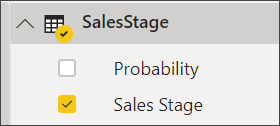
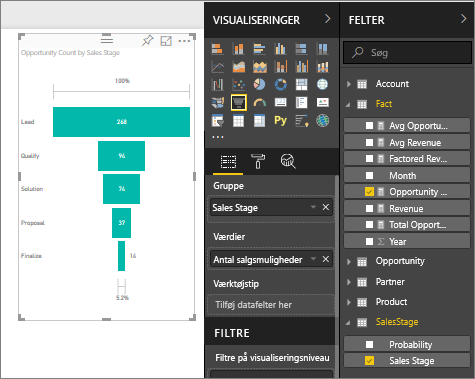

# Opret og brug tragtformede diagrammer

[!INCLUDE[consumer-appliesto-nyyn](../includes/consumer-appliesto-nyyn.md)]

[!INCLUDE [power-bi-visuals-desktop-banner](../includes/power-bi-visuals-desktop-banner.md)]

Et tragtformet diagram hjælper dig med at visualisere en lineær proces, der har fortløbende forbundne faser. F.eks. et tragtformet salgsdiagram, der sporer kunder gennem forskellige faser: Potentielt kundeemne \> Kvalificeret kundeemne \> Kundeemne \> Kontrakt \> Luk.  I korte træk afspejler tragtens form tilstanden af den proces, du holder øje med.

De enkelte faser i tragten repræsenterer en procentdel af det samlede antal. Så i de fleste tilfælde vil et tragtformet diagram være formet som en tragt – hvor det første trin er det største, og hvor hvert efterfølgende trin bliver mindre end det foregående.  En pæreformet tragt er også nyttig – det kan bruges til at identificere et problem i processen.  Det første trin i fasen, "indgangsfasen", er dog typisk det største.

> [!NOTE]
> Når du deler din rapport med en Power BI-kollega, kræves det, at I begge har individuelle Power BI Pro-licenser, eller at rapporten er gemt i en Premium-kapacitet.    

## Hvornår skal man bruge et tragtformet diagram?
Tragtformede diagrammer er et fantastisk valg i følgende tilfælde:

* Når dataene er fortløbende og dækker over mindst fire faser.
* Når antallet af "elementer" i den første fase forventes at være større end antallet i den sidste fase.
* Til at beregne potentiale (omsætning/salg/handler/osv.) efter fase.
* Til at beregne og holde øje med gennemførelsesfrekvens og fastholdelsesrate.
* Til at vise flaskehalse i en lineær proces.
* Til at holde øje med arbejdsprocessen i forbindelse med indkøbskurv.
* Til at holde øje med statussen på og succesen af reklame-/marketingkampagner vha. klikfrekvensen.

## Sådan arbejder du med tragtformede diagrammer
Tragtformede diagrammer:

* kan sorteres.
* understøtter multipla.
* kan fremhæves og krydsfiltreres af andre visualiseringer på samme rapportside.
* kan bruges til at fremhæve og krydsfiltrere andre visualiseringer på samme rapportside.
   > [!NOTE]
   > I denne video kan du se, hvordan Will opretter et tragtformet diagram ved hjælp af eksemplet Salg og marketing. Følg derefter trinnene under videoen for at prøve det selv ved hjælp af PBIX-filen med eksemplet Analyse af salgsmuligheder
   > 
   > 
## Forudsætning

I dette selvstudium bruges [PBIX-filen med eksemplet Analyse af salgsmuligheder](https://download.microsoft.com/download/9/1/5/915ABCFA-7125-4D85-A7BD-05645BD95BD8/Opportunity%20Analysis%20Sample%20PBIX.pbix
).

1. Vælg **Fil** > **Åbn** i øverste venstre afsnit af menulinjen
   
2. Find din kopi af **PBIX-filen med eksemplet Analyse af salgsmuligheder**

1. Åbn **PBIX-filen med eksemplet Analyse af salgsmuligheder** i rapportvisning .

1. Markér  for at tilføje en ny side.

## Opret et tragtformet basisdiagram
I denne video kan du se, hvordan Will opretter et tragtformet diagram ved hjælp af eksemplet Salg og marketing.

<iframe width="560" height="315" src="https://www.youtube.com/embed/qKRZPBnaUXM" frameborder="0" allow="autoplay; encrypted-media" allowfullscreen></iframe>

Nu kan du oprette dit eget tragtformede diagram, der viser antallet af salgsmuligheder i hvert salgstrin.

1. Start på en tom rapportside, og vælg feltet **SalesStage** \> **Sales Stage**.
   
    

1. Vælg tragtikonet  for at konvertere søjlediagrammet til et tragtformet diagram.

2. I ruden **Felter** skal du vælge **Fact** \> **Opportunity Count**.
   
    
4. Når du holder over en søjle, vises en masse oplysninger.
   
   * Navnet på fasen
   * Antallet af salgsmuligheder, der i øjeblikket findes i denne fase
   * Samlet gennemførelsesfrekvens (% af kundeemner) 
   * Fase-til-fase (også kendt som nedgangsfrekvens), som % af den forrige fase (i dette tilfælde Forslagsfase/Løsningsfase)
     
     

6. [Gem rapporten](../create-reports/service-report-save.md).

## Fremhævning og krydsfiltrering
Du kan få mere at vide om brug af ruden Filters under [Føj et filter til en rapport](../create-reports/power-bi-report-add-filter.md).

Fremhævning af en søjle i et tragtformet diagram krydsfiltrerer andre visualiseringer på rapportsiden ... og omvendt. For at kunne følge med skal du føje nogle flere visualiseringer til den rapportside, der indeholder det tragtformede diagram.

1. Vælg søjlen **Proposal** i det tragtformede diagram. Dette krydsfremhæver de andre visualiseringer på siden. Du kan bruge Ctrl til at vælge flere objekter.
   
   
2. Under [Interaktion med visualiseringer i Power BI](../create-reports/service-reports-visual-interactions.md) kan du se, hvordan du angiver indstillinger for krydsfremhævning og krydsfiltrering af visualiseringer.

## Næste trin

[Målere i Power BI](power-bi-visualization-radial-gauge-charts.md)

[Visualiseringstyper i Power BI](power-bi-visualization-types-for-reports-and-q-and-a.md)

