# Opret visualiseringer af nøglefaktorer

[!INCLUDE [power-bi-visuals-desktop-banner](../includes/power-bi-visuals-desktop-banner.md)]

Visualiseringen af nøglefaktorer hjælper dig med at forstå de faktorer, som ligger bag en metrikværdi, du er interesseret i. Den analyserer dine data, rangerer de faktorer, der betyder noget, og viser dem som nøglefaktorer. Lad os antage, at du vil finde ud af, hvad der påvirker medarbejderomsætningen. En faktor kan være varigheden af ansættelseskontrakten og en anden kan være medarbejderens alder. 
 
## Hvornår er det en fordel at bruge nøglefaktorer? 
Det er en fordel at bruge visualiseringen af nøglefaktorer, hvis du vil: 
- Se, hvilke faktorer der påvirker den metrikværdi, der analyseres.
- Sammenligne den relative vigtighed af disse faktorer. Har ansættelseskontrakter med en kortere ansættelsesperiode en større betydning for medarbejderudskiftningen end ansættelseskontrakter med en længere ansættelsesperiode? 

## Funktioner i visualiseringen af nøglefaktorer

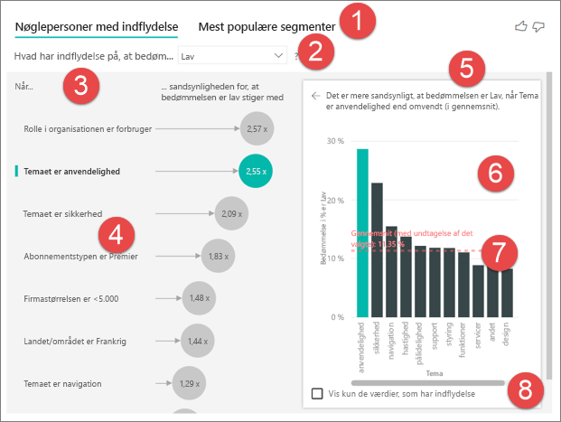

1. **Faner**: Vælg en fane for at skifte mellem visninger. **Nøglefaktorer** viser dig de største bidragydere til den valgte metrikværdi. **Øverste segmenter** viser dig de øverste segmenter, der bidrager til den valgte metrikværdi. Et *segment* består af en kombination af værdier. Ét segment kan f.eks. være de forbrugere, som har været kunder i mindst tyve år, og som bor i det vestlige område. 

2. **Rulleliste**: Værdien af den metrikværdi, der undersøges. I dette eksempel kigger vi på metrikværdien **Bedømmelse**. Den valgte værdi er **Lav**.

3. **Tilpasning**: Hjælper dig med at fortolke visualiseringen i venstre rude.

4. **Venstre rude**: Ruden til venstre indeholder én visualisering. I dette tilfælde vises en liste over de vigtigste nøglefaktorer i venstre rude.

5. **Tilpasning**: Hjælper os med at fortolke visualiseringen i højre rude.

6. **Højre rude**: Ruden til højre indeholder én visualisering. I dette tilfælde viser søjlediagrammet alle værdierne for nøglefaktoren **Tema**, som er valgt i venstre rude. Den specifikke værdi for **anvendelighed** i venstre rude vises med grønt. Alle de andre værdier for **Tema** vises med sort.

7. **Gennemsnitslinje**: Gennemsnittet beregnes for alle de andre mulige værdier for **Tema**, undtagen **anvendelighed** (som er den valgte nøglefaktor). Så beregningen anvendes på alle sorte værdier. Dette fortæller dig, hvilken procentdel af de andre **temaer** der havde en lav bedømmelse. I dette tilfælde havde 11,35 % en lav bedømmelse (vises med den stiplede linje).

8. **Afkrydsningsfelt**: Filtrerer det visuelle element i ruden til højre, så der kun vises værdier, der er nøglefaktorer for dette felt. I dette eksempel filtreres visualiseringen til anvendelighed, sikkerhed og navigation.

## Analysér en metrikværdi, der er kategorisk
 
Se denne video for at få mere at vide om, hvordan du opretter en visualisering for nøglefaktorer med en kategorisk metrikværdi. Derefter skal du følge disse trin for at oprette en. 

   > [!NOTE]
   > I denne video bruges en ældre version af Power BI Desktop.
   > 
   > 
<iframe width="560" height="315" src="https://www.youtube.com/embed/fDb5zZ3xmxU" frameborder="0" allow="accelerometer; autoplay; encrypted-media; gyroscope; picture-in-picture" allowfullscreen></iframe>

Din produktchef vil gerne finde ud af, hvilke faktorer der får kunderne til at give vores cloudtjeneste dårlige anmeldelser. Åbn [PBIX-filen Customer Feedback](https://github.com/microsoft/powerbi-desktop-samples/tree/master/Monthly%20Desktop%20Blog%20Samples/2019/customerfeedback.pbix) i Power BI Desktop for at følge med. Du kan også downloade [Excel-filen Customer Feedback til Power BI-tjenesten eller Power BI Desktop](https://github.com/microsoft/powerbi-desktop-samples/tree/master/Monthly%20Desktop%20Blog%20Samples/2019/customerfeedback.xlsx). Vælg et af linkene, og vælg derefter **Download** på den GitHub-side, der åbnes.

> [!NOTE]
> Kundefeedbackdatasættet er baseret på [Moro et al., 2014] S. Moro, P. Cortez og P. Rita. "A Data-Driven Approach to Predict the Success of Bank Telemarketing". *Decision Support Systems*, Elsevier, 62:22-31, juni 2014. 

1. Åbn rapporten, og vælg ikonet for **nøglefaktorer**. 

    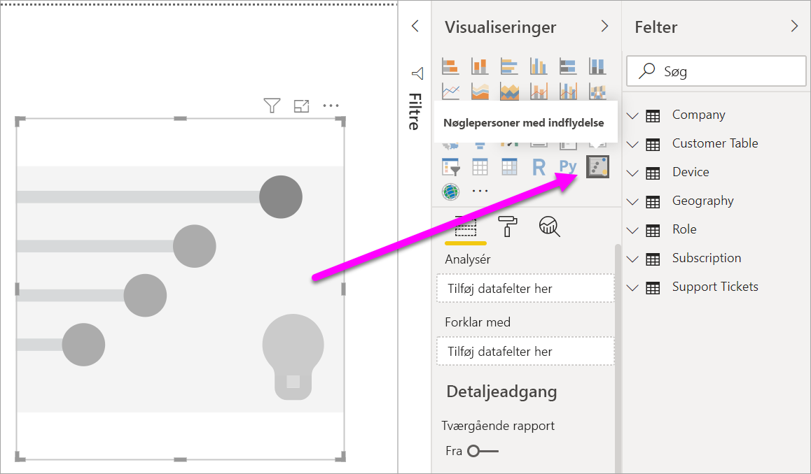

2. Flyt den metrikværdi, som du vil undersøge, til feltet **Analysér**. Hvis du vil have vist, hvad der får kundernes bedømmelse af tjenesten til at være lav, skal du vælge **Kundetabel** > **Bedømmelse**.

3. Flyt de felter, som du mener kunne påvirke **bedømmelsen**, til feltet **Forklar med**. Du kan flytte lige så mange felter, som du vil. I dette tilfælde skal du starte med:
    - Land-område 
    - Rolle i organisationen 
    - Abonnementstype 
    - Firmastørrelse 
    - Tema
    
4. Sørg for, at feltet **Udvid efter** er tomt. Dette felt bruges kun til analyse af en måling eller et opsummeret felt. 

5. Vælg **Lav** på rullelisten **Hvad påvirker bedømmelsen til at være** for at fokusere på de negative bedømmelser.  

    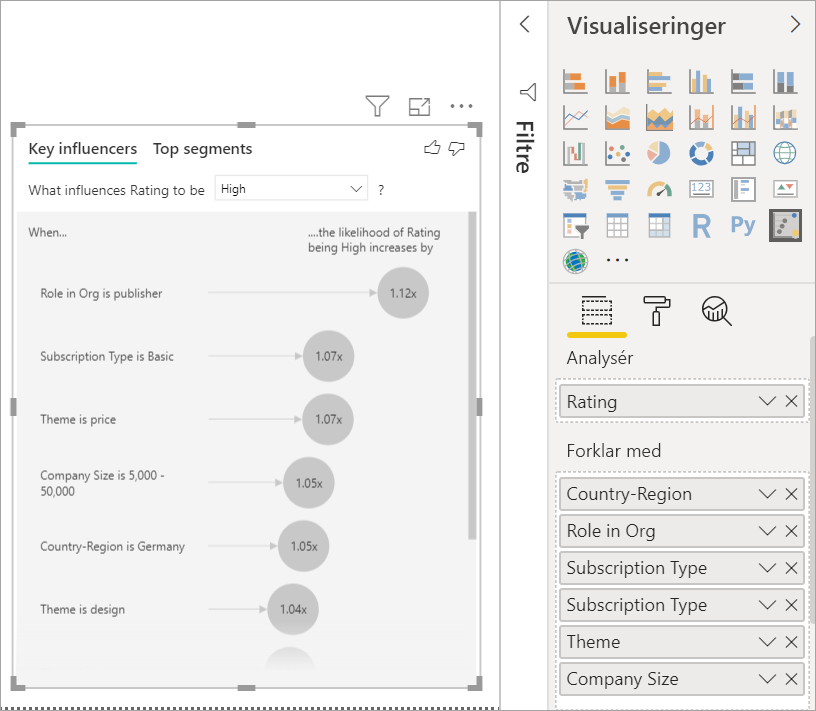

Analysen kører på tabelniveau for det felt, der analyseres. I dette tilfælde er det metrikværdien **Bedømmelse**. Denne metrikværdi er defineret på kundeniveau. Hver enkelt kunde har givet enten en høj score eller en lav score. Alle de forklarende faktorer skal defineres på kundeniveau, for at visualiseringen kan gøre brug af dem. 

I eksemplet ovenfor har alle de forklarende faktorer enten en én til en- eller en mange til én-relation med metrikværdien. I dette tilfælde har hver kunde tildelt et enkelt tema til deres bedømmelse. På samme måde kan kunder komme fra ét land, have én type medlemskab og én rolle i deres organisation. De forklarende faktorer er derfor allerede attributter for en kunde, og der er ikke behov for transformeringer. Visualiseringen kan gøre øjeblikkelig brug af dem. 

Senere i selvstudiet ser vi på mere komplekse eksempler med én til mange-relationer. I disse tilfælde skal kolonnerne først samles ned til kundeniveauet, før du kan køre analysen. 

De målinger og aggregeringer, der bruges som forklarende faktorer, bedømmes også på tabelniveau af metrikværdien **Analysér**. Der vises nogle eksempler senere i denne artikel. 

## Fortolkning af kategoriske nøglefaktorer 
Lad os se nærmere på nøglefaktorerne for lave bedømmelser. 

### Den største enkeltfaktor, der påvirker sandsynligheden for en lav bedømmelse

Kunden i dette eksempel har tre roller: forbruger, administrator og udgiver. Det er forbrugerne, som er den største faktor, der bidrager til en lav bedømmelse. 

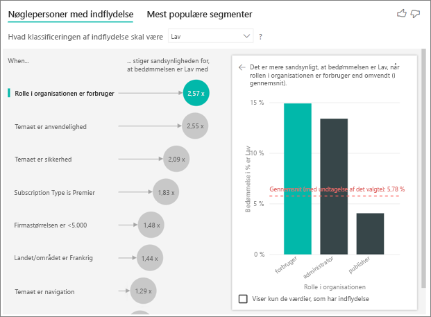

Mere nøjagtigt er der 2,57 gange større sandsynlighed for, at forbrugerne giver din tjeneste en negativ score. Diagrammet over nøglefaktorer angiver **Rolle i organisationen er forbruger** først på listen til venstre. Når du vælger **Rolle i organisationen er forbruger**, viser Power BI flere detaljer i ruden til højre. Den komparative effekt for hver rolle for sandsynligheden for en lav bedømmelse vises.
  
- 14,93 % af forbrugerne giver en lav score. 
- I gennemsnit giver alle andre roller en lav score 5,78 % af gangene.
- Forbrugere er 2,57 gange mere tilbøjelige til at give en lav score sammenlignet med alle andre roller. Du kan se dette ved at opdele den grønne søjle med den røde stiplede linje. 

### Den næststørste enkeltfaktor, der påvirker sandsynligheden for en lav bedømmelse

Visualiseringen af nøglefaktorerne sammenligner og rangordner faktorer fra mange forskellige variabler. Den næststørste nøglefaktor har intet med **Rolle i organisationen** at gøre. Vælg den næststørste nøglefaktor på listen, som er **Tema er anvendelighed**. 

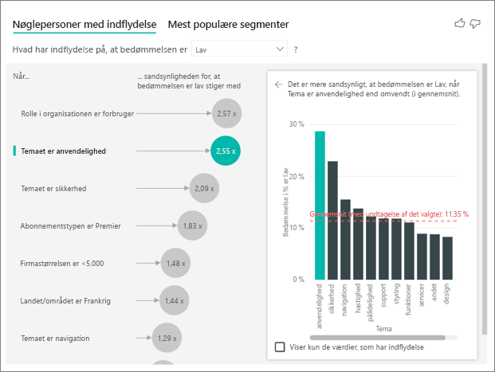

Den næstvigtigste nøglefaktor er forbundet med temaet for kundens bedømmelse. Der var 2,55 gange større sandsynlighed for, at de kunder, der kommenterede på produktets anvendelighed, gav en lav score i forhold til de kunder, som kommenterede på andre temaer, f.eks. driftssikkerhed, design eller hastighed. 

Gennemsnittet, som er angivet af en rød stiplet linje, ændrede sig fra 5,78 % til 11,34 % fra den ene visualisering til den anden. Gennemsnittet er dynamisk, fordi det er baseret på gennemsnittet af alle de andre værdier. For den første nøglefaktor blev kunderollen udeladt af gennemsnittet. For den anden nøglefaktor blev temaet anvendelighed udeladt. 
 
Markér afkrydsningsfeltet **Vis kun de værdier, der er nøglefaktorer** for at filtrere udelukkende ved hjælp af de vigtige værdier. I dette tilfælde er det de roller, der giver en lav score. 12 temaer er reduceret til de fire, som Power BI har identificeret som de temaer, der ligger til grund for den lave bedømmelse. 

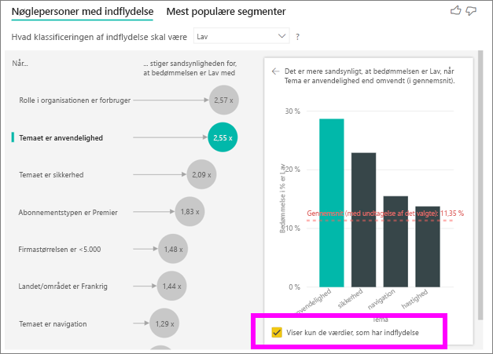

## Interager med andre visualiseringer 
 
Hver gang du vælger et udsnit, et filter eller andre visualiseringer på canvasset, kører visualiseringen af nøglefaktorerne analysen på de nye dele af dataene. Du kan f.eks. flytte **Firmastørrelse** til rapporten og bruge det som et udsnit. Du kan bruge det for at se, om nøglefaktorerne for dine virksomhedskunder er anderledes end befolkningen som helhed. En virksomhed af enterprisetypen har flere end 50.000 medarbejdere.
 
Hvis du vælger **>50,000**, køres analysen igen, og du kan se, at nøglefaktorerne har ændret sig. For store virksomhedskunder har den vigtigste nøglefaktor for lave bedømmelser et tema, der relaterer til sikkerhed. Det kan være, at det skal undersøges nærmere for at se, om der er bestemte sikkerhedsfunktioner, som dine store kunder er utilfredse med. 

## Fortolkning af fortløbende nøglefaktorer 
 
Indtil videre har du set, hvordan visualiseringen bruges til at se på, hvordan de forskellige kategorifelter påvirker lave bedømmelser. Det er også muligt at have fortløbende faktorer, f.eks alder, højde og pris i feltet **Forklar med**. Lad os se, hvad der sker, hvis vi trækker **Brugsperiode** fra tabellen Kunde til **Forklar med**. Brugsperiode viser, hvor længe en kunde har brugt tjenesten. 
 
Efterhånden som brugsperioden stiger, stiger sandsynligheden for en lavere bedømmelse også. Denne tendens antyder, at længerevarende kunder er mere tilbøjelig til at give en negativ score. Denne indsigt er interessant, og én, som du måske vil følge op på senere. 
 
Visualiseringen fortæller os, at hver gang brugsperioden stiger med 13,44 måneder, stiger sandsynligheden for en lav bedømmelse med 1,23 gange. I dette tilfælde skildrer de 13,44 måneder standardafvigelsen for brugsperiode. Så den indsigt, du får, ser på, hvordan en forøgelse af brugsperioden med en standardmængde, som er standardafvigelsen for brugsperioden, påvirker sandsynligheden for en lav bedømmelse. 
 
Punktdiagrammet i ruden til højre viser den gennemsnitlige procentdel af lave bedømmelser for hver brugsperiodeværdi. Den fremhæver hældningen med en tendenslinje.

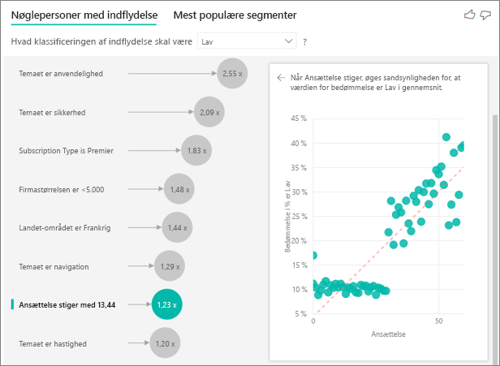

## Kasserede fortløbende nøglefaktorer

I nogle tilfælde kan du opleve, at dine fortløbende faktorer automatisk blev konverteret til kategorier. Det skyldes, at vi har indset, at relationen mellem variablerne ikke er lineær, så vi kan ikke beskrive relationen som blot værende forøget eller formindsket (som vi gjorde i eksemplet ovenfor).

Vi kører korrelationstest for at bestemme, hvor lineær faktoren er med hensyn til målet. Hvis målet er fortløbende, kører vi Pearson-korrelationen, og hvis målet er en kategori, kører vi Point Biserial-korrelationstest. Hvis vi registrerer, at relationen ikke er tilstrækkelig lineær, foretager vi overvåget kassering og genererer maksimalt 5 beholdere. For at finde ud af, hvilke beholdere der giver mest mening, bruger vi en metode med overvåget kassering, hvor der kigges på relationen mellem den forklarende faktor og det mål, der analyseres.

## Fortolkning af målinger og aggregeringer som nøglefaktorer 
 
Du kan bruge målinger og aggregeringer som forklarende faktorer i din analyse. Det kan f.eks. være, at du gerne vil se, hvilken indflydelse antallet af supportanmodninger fra kunden eller den gennemsnitlige varighed, som en supportanmodning er åben, påvirker scoren. 
 
I dette tilfælde skal vi se, om antallet af supportanmodninger fra en kunde har indflydelse på den score, kunden giver. Hent **id'et for supportanmodningen** fra tabellen Supportanmodning. Eftersom en kunde kan have flere supportanmodninger, skal du samle id'et på kundeniveau. Denne samling er vigtig, da analysen kører på kundeniveau, så alle drivere skal være defineret på dette niveau. 
 
Lad os se på antallet af id'er. Hver kunderække har et antal supportanmodninger, der er knyttet til rækken. I dette tilfælde kan vi se, at når antallet af supportanmodninger stiger, vil sandsynligheden for en lav bedømmelse stige med 5,51 gange. I visualiseringen i højre side vises det gennemsnitlige antal supportanmodninger for forskellige **bedømmelsesværdier**, som er evalueret på kundeniveau. 

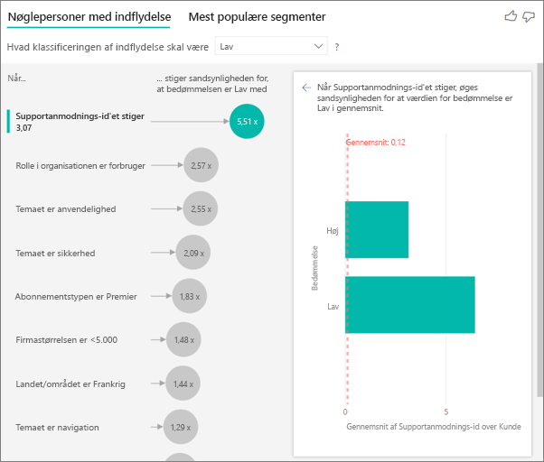

## Fortolkning af resultaterne: Mest populære segmenter 
 
Du kan bruge fanen **Nøglefaktorer** til at vurdere hver faktor individuelt. Du kan også bruge fanen **Øverste segmenter** til at se, hvordan en kombination af faktorer påvirker den metrikværdi, som du analyserer. 
 
I de øverste segmenter vises der en oversigt over alle de segmenter, der er blevet registreret af Power BI. Følgende eksempel viser, at der blev fundet seks segmenter. Disse segmenter er rangeret efter procentdelen af lave bedømmelser i segmentet. Segment 1 har f.eks. 74,3 % lave kundebedømmelser. Jo højere boblen er, jo højere er andelen af lave bedømmelser. Størrelsen på boblerne repræsenterer, hvor mange kunder der er i segmentet. 

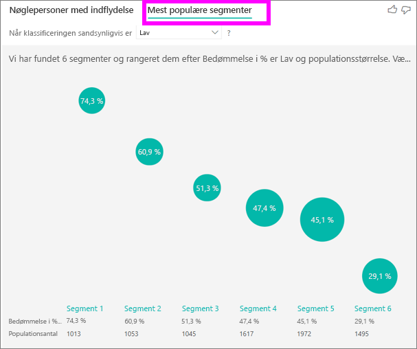

Når du vælger en boble, får du vist flere detaljer for segmentet. Hvis du f.eks. vælger Segment 1, kan du se, at det består af relativt etablerede kunder. De har været kunder i mere end 29 måneder og har mere end fire supportanmodninger. De er ikke udgivere, så de er enten forbrugere eller administratorer. 
 
I denne gruppe gav 74,3 % af kunderne en lav bedømmelse. Den gennemsnitlige kunde gav en lav bedømmelse 11,7 % af gangene, så dette segment har en væsentligt større andel af lave bedømmelser. Hele 63 procentpoint højere. Segment 1 indeholder også ca. 2,2 % af dataene, så det repræsenterer en adresserbar del af stikprøven. 

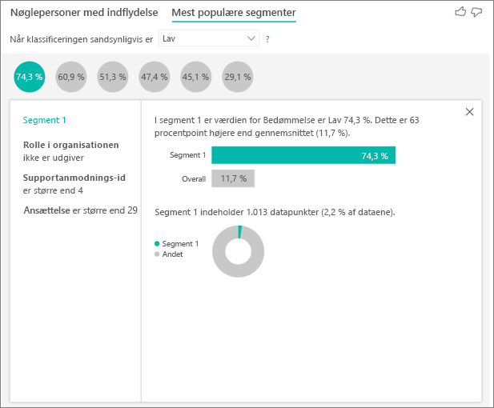

## Tilføjelse af optællinger

Nogle gange kan en nøglefaktor have stor indflydelse, men repræsentere meget få af dataene. **Temaet** er **anvendelighed** er f.eks. den andenstørste nøglefaktor for lave bedømmelser. Der kan dog muligvis kun have været en håndfuld kunder, der har klaget over anvendelighed. Optællinger kan hjælpe dig med at prioritere, hvilke nøglefaktorer du vil fokusere på.

Du kan slå optællinger til via **analysekortet** i formateringsruden.

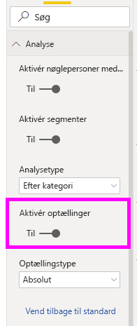

Når optællinger er aktiveret, kan du se en ring rundt om hver nøglefaktors boble, som repræsenterer den omtrentlige procentdel af data, som den pågældende nøglefaktor indeholder. Jo mere af boblen cirklen når rundt om, desto flere data indeholder nøglefaktoren. Vi kan se, at **temaet** er **anvendelighed** indeholder en meget lille del af dataene.

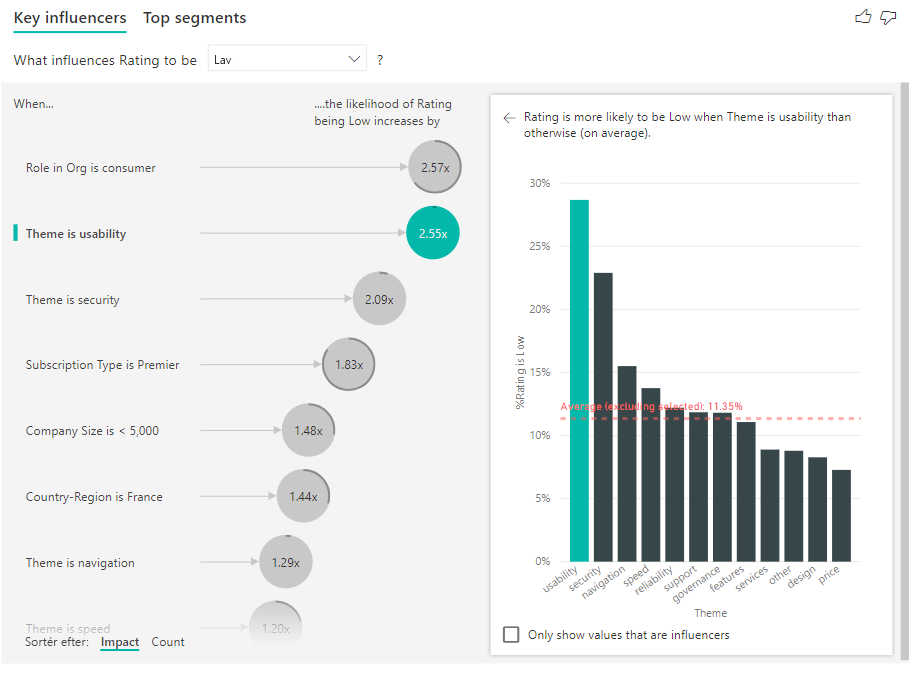

Du kan også bruge Sortér efter i nederste venstre hjørne af visualiseringen til at sortere boblerne efter optælling først i stedet for indvirkning. **Abonnementstypen** er **Premier** er den største nøglefaktor på baggrund af optælling.

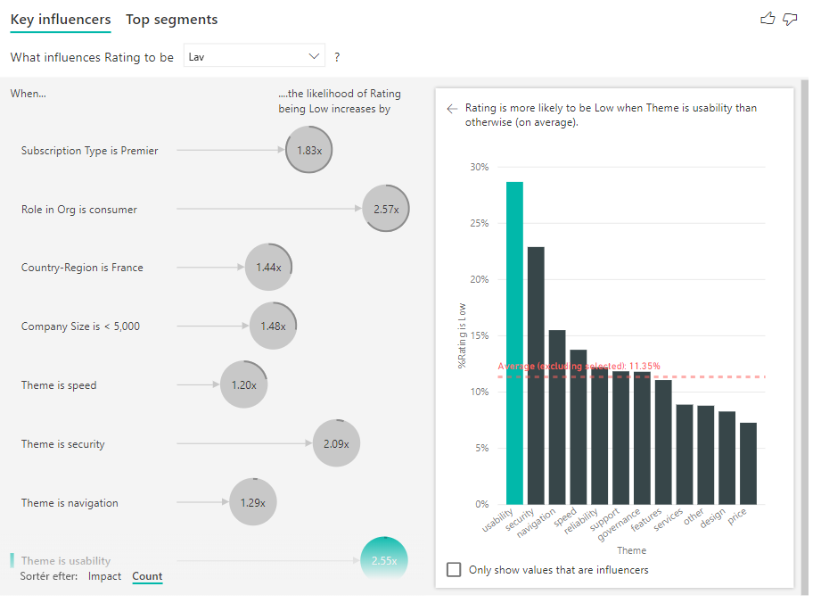

Hvis der er en hel ring omkring cirklen, betyder det, at nøglefaktoren indeholder 100 % af dataene. Du kan ændre optællingstypen, så den er relativ i forhold til den største nøglefaktor, ved at bruge rullemenuen **Optællingstype** i **Analysekortet** i formateringsruden. Nu repræsenteres nøglefaktoren med det største antal data af en hel ring, og alle andre optællinger er relative i forhold til den.

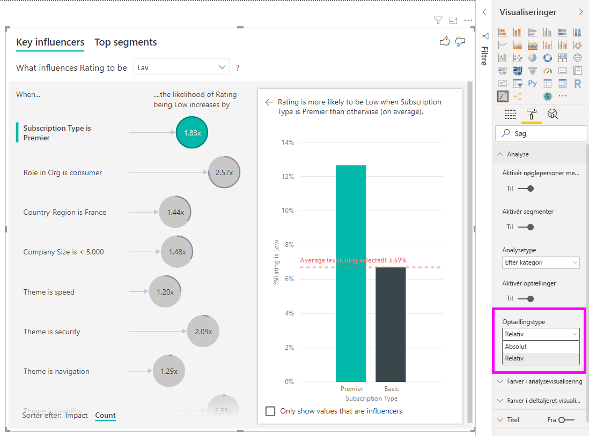

## Analysér en metrikværdi, der er numerisk

Hvis du flytter et ikke-opsummeret numerisk felt til feltet **Analysér**, kan du selv vælge, hvordan du vil håndtere dette scenarie. Du kan ændre funktionsmåden for visualiseringen ved at åbne **ruden Formatering** og skifte mellem **Kategorisk analysetype** og **Fortløbende analysetype**.

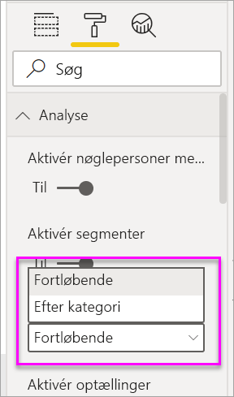

En **kategorisk analysetype** fungerer som beskrevet ovenfor. Hvis du f.eks. kiggede på undersøgelsesscores fra 1 til 10, kunne du spørge "Hvad får undersøgelsesscores til at være 1?".

En **fortløbende analysetype** ændrer spørgsmålet til et forløbende spørgsmål. I ovenstående eksempel ville vores nye spørgsmål være "Hvad får undersøgelsesscores til at stige/falde?".

Denne skelnen er meget nyttig, når du har mange entydige værdier i det felt, du analyserer. I nedenstående eksempel kigger vi på huspriser. Det giver ikke mening at spørge "Hvad får husprisen til at være 156.214?", da det er meget specifikt, og vi sandsynligvis ikke har tilstrækkelige data til at udlede et mønster.

Vi kunne i stedet spørge "Hvad får husprisen til at stige?", som giver os mulighed for at behandle huspriser som et interval i stedet for entydige værdier.

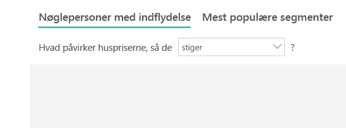

## Fortolkning af resultaterne: Nøglepersoner med indflydelse 

I dette scenarie ser vi på "Hvad får husprisen til at stige". Vi kigger på en række forklarende faktorer, der kan påvirke en huspris som **Year Built** (det år, huset blev bygget), **KitchenQual** (køkkenets kvalitet) og **YearRemodAdd** (det år, huset blev renoveret). 

I nedenstående eksempel kigger vi på vores vigtigste nøglefaktor, som er en køkkenkvalitet, der er Excellent. Resultaterne er meget lig dem, vi fik, da vi analyserede kategoriske målinger, med nogle få vigtige forskelle:

- I søjlediagrammet til højre ses gennemsnittene i stedet for procenterne. Det viser os derfor, hvad den gennemsnitlige huspris er for et hus med et fremragende køkken (grøn søjle) sammenlignet med den gennemsnitlige huspris for et hus uden et fremragende køkken (stiplede linje)
- Tallet i boblen er stadig forskellen mellem den røde stiplede linje og den grønne søjle, men det er angivet som et tal ($158.490) i stedet for en sandsynlighed (1,93 x). Huse med fremragende køkkener er derfor næsten $160.000 dyrere end huse uden fremragende køkkener i gennemsnit.

I nedenstående eksempel ser vi på, hvordan en fortløbende faktor (det år huset blev renoveret) påvirker husprisen. Forskellene i forhold til, hvordan vi analyserer fortløbende nøglefaktorer for kategoriske målepunkter, er som følger:

-   Punktdiagrammet i ruden til højre viser den gennemsnitlige huspris for hver distinkte værdi for det år, huset blev renoveret. 
-   Værdien i boblen viser, hvor meget den gennemsnitlige huspris stiger (i dette tilfælde $2.870), når det år, huset blev renoveret også stiger efter standardafvigelsen (i dette tilfælde 20 år)

Til sidst ser vi på det gennemsnitlige år, et hus blev bygget. Analysen her er som følger:

-   Punktdiagrammet i ruden til højre viser den gennemsnitlige huspris for hver eneste værdi i tabellen
-   Værdien i boblen viser, hvor meget den gennemsnitlige huspris stiger (i dette tilfælde $1.350), når det gennemsnitlige år stiger efter standardafvigelsen (i dette tilfælde 30 år)

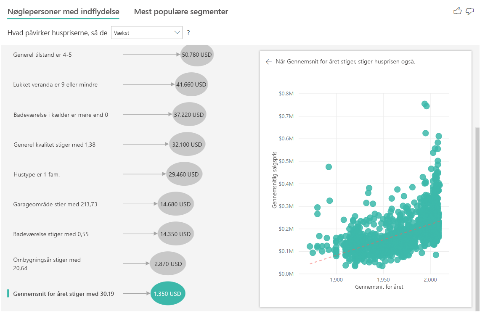

## Fortolkning af resultaterne: De øverste segmenter

De øverste segmenter for numeriske mål viser de grupper, hvor huspriserne i gennemsnit er højere end i det overordnede datasæt. Nedenfor kan vi f.eks. se, at **Segment 1** består af huse, hvor **GarageCars** (antallet af biler, der kan være i garagen) er større end 2 og **RoofStyle** er moderne. Huse med disse karakteristika har en gennemsnitlig pris på $355.000 sammenlignet med det samlede gennemsnit i dataene, som er $180.000.

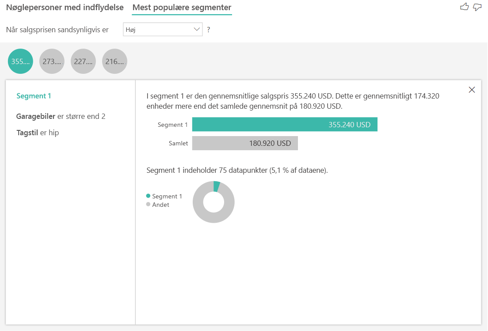

## Analysér en metrikværdi, der er en måling eller en opsummeret kolonne

I forbindelse med en måling eller en opsummeret kolonne er analysen som standard den **løbende analysetype** som beskrevet [ovenfor](https://docs.microsoft.com/power-bi/visuals/power-bi-visualization-influencers#analyze-a-metric-that-is-numeric). Dette kan ikke ændres. Den største forskel mellem at analysere en måling/opsummeret kolonne og en ikke-opsummeret numerisk kolonne er det niveau, som analysen kører på.

Hvis der er tale om ikke-opsummerede kolonner, kører analysen altid på tabelniveau. I huspriseksemplet ovenfor analyserede vi metrikværdien **Huspris** for at se, hvad der får en huspris til at stige/falde. Analysen kører automatisk på tabelniveau. Vores tabel har et entydigt id for hvert hus, hvorfor analysen kører på husniveau.

I forbindelse med kolonner med målinger og opsummerede kolonner ved vi ikke umiddelbart, hvilket niveau de skal analyseres på. Hvis **Huspris** blev opsummeret som et **gennemsnit**, blev vi nødt til at overveje, hvilket niveau vi ville have denne gennemsnitlige huspris analyseret på. Er det den gennemsnitlige huspris i kvarteret? Eller måske på regionalt niveau?

Målinger og opsummerede kolonner analyseres automatisk på niveauet for de felter af typen **Forklar med**, der bruges. Forestil dig, at vi har tre felter i **Forklar med**, som vi er interesseret i: **Køkkenkvalitet**, **Bygningstype** og **Aircondition**. Den **Gennemsnitlige huspris** ville blive beregnet for hver unikke kombination af disse tre felter. Det er ofte nyttigt at skifte til en tabelvisning for at se, hvordan de data, der evalueres, ser ud.

Denne analyse er meget opsummeret, og det vil derfor være svært for regressionsmodellen at finde eventuelle mønstre i dataene, som modellen kan lære af. Vi bør køre analysen på et mere detaljeret niveau for at opnå bedre resultater. Hvis vi ville analysere husprisen på husniveau, skulle vi føje feltet **Id** til analysen. Ikke desto mindre vil vi ikke have, at hus-id'et bliver betragtet som en nøglefaktor. Det er ikke nyttigt at vide, at i takt med at et hus-id stiger, stiger prisen på et hus også. Det er her, feltet **Udvid efter** er virkelig praktisk. Du kan bruge **Forklar med** til at tilføje de felter, du vil bruge til angivelse af niveauet for analysen uden at kigge efter nye nøglefaktorer.

Se, hvordan visualiseringen ser ud, når vi føjer et **Id** til**Forklar med**. Når du har defineret det niveau, som din måling skal evalueres på, fortolkes nøglefaktorer på præcis samme måde som [ikke-opsummerede numeriske kolonner](https://docs.microsoft.com/power-bi/visuals/power-bi-visualization-influencers#analyze-a-metric-that-is-numeric).

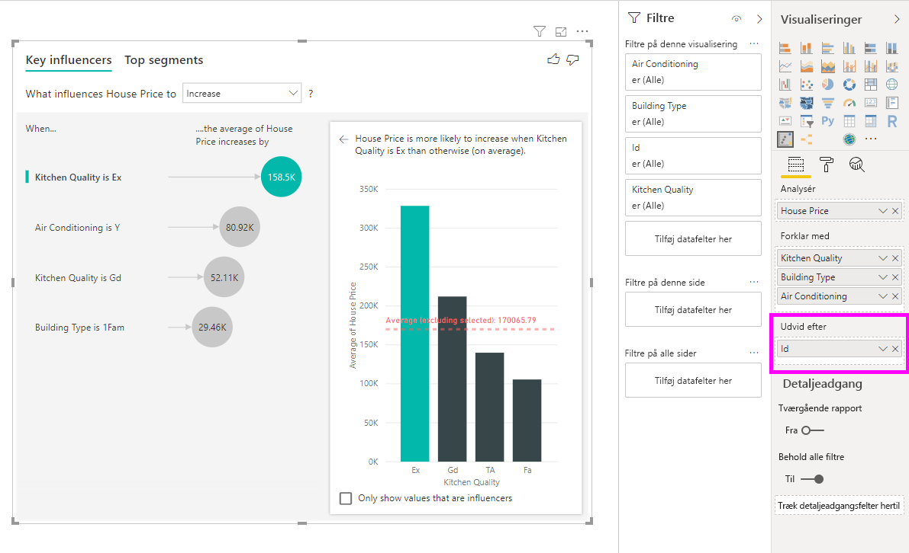

Hvis du vil vide mere om, hvordan du kan analysere målinger med visualiseringen af nøglefaktorer, skal du se følgende selvstudium.

<iframe width="1167" height="631" src="https://www.youtube.com/embed/2X1cW8oPtc8" frameborder="0" allow="accelerometer; autoplay; encrypted-media; gyroscope; picture-in-picture" allowfullscreen></iframe>

## Overvejelser og fejlfinding 
 
**Hvilke begrænsninger er der for visualiseringen?** 
 
Der er nogle begrænsninger for visualiseringen af nøglefaktorerne:

- DirectQuery understøttes ikke
- Direkte forbindelse til Azure Analysis Services og SQL Server Analysis Services understøttes ikke
- Publicering til internettet understøttes ikke
- .NET Framework 4.6 eller nyere kræves

**Jeg får vist en fejl om, at der ikke blev fundet nogen nøglefaktorer eller segmenter. Hvorfor sker det?** 

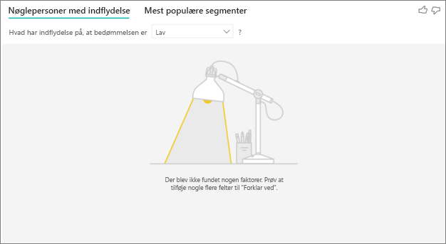

Denne fejl opstår, når du har medtaget felter i **Forklar ved**, men der ikke blev fundet nogen nøglefaktorer. 
- Du inkluderede den metrikværdi, du analyserede, i både **Analysér** og **Forklar ved**. Fjern den fra **Forklar ved**. 
- Dine forklarende felter indeholder for mange kategorier med få observationer. Denne situation gør det svært for visualiseringen at bestemme, hvilke faktorer der er nøglefaktorer. Det er svært at generalisere på baggrund af nogle få observationer. Hvis du analyserer et numerisk felt, kan det være en god ide at skifte fra **Kategorisk analyse** til **Fortløbende analyse** i **ruden Formatering** på kortet **Analyse**.
- Dine forklarende faktorer har et tilstrækkeligt antal observationer til at foretage generaliseringer, men visualiseringen fandt ikke nogen meningsfulde korrelationer.
 
**Jeg får vist en fejl om, at den metrikværdi, jeg analyserer, ikke har tilstrækkeligt mange data til at kunne analyseres. Hvorfor sker det?** 

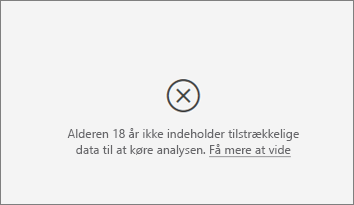

Visualiseringen fungerer ved at kigge på mønstre i dataene for én gruppe sammenlignet med andre grupper. Det kunne f.eks. være kunder, som gav lave bedømmelser, sammenlignet med de kunder, som gav høje bedømmelser. Hvis dataene i din model kun har meget få observationer, er det svært at finde mønstre. Hvis visualiseringen ikke har nok data til at finde betydningsfulde nøglefaktorer, vil den indikere, at der kræves flere data for at kunne analysere dem. 

Vi anbefaler, at du har mindst 100 observationer for den valgte tilstand. I dette tilfælde er tilstanden de kunder, der ikke længere er kunder. Du skal også bruge mindst 10 observationer for de tilstande, du bruger til sammenligning. I dette tilfælde er tilstanden de kunder, der stadig er kunder.

Hvis du analyserer et numerisk felt, kan det være en god ide at skifte fra **Kategorisk analyse** til **Fortløbende analyse** i **ruden Formatering** på kortet **Analyse**.

**Jeg får vist en fejl om, at når 'Analyse' ikke opsummeres, kører analysen altid på rækkeniveau i den overordnede tabel. Det er ikke tilladt at ændre dette niveau via feltet Udvid efter. Hvorfor sker det?**

Når du analyserer en numerisk eller kategorisk kolonne, kører analysen altid på tabelniveau. Hvis du f.eks. analyserer huspriser, og din tabel indeholder en id-kolonne, så kører analysen automatisk på hus-id-niveau. 

Når du analyserer en måling eller en opsummeret kolonne, skal du eksplicit angive, hvilket niveau analysen skal køre på. Du kan bruge **Udvid med** for at ændre analysens niveau for målinger og opsummerede kolonner uden at tilføje nye nøglefaktorer. Hvis **Huspris** var defineret som en måling, kunne du føje hus-id-kolonnen til **Udvid med** for at ændre analysens niveau.

**Jeg får vist en fejl om, at et felt i *Forklar ved* ikke er entydigt relateret til den tabel, der indeholder den metrikværdi, jeg analyserer. Hvorfor sker det?**
 
Analysen kører på tabelniveau for det felt, der analyseres. Hvis du f.eks. analyserer kundefeedback for din tjeneste, kan det være en tabel, der fortæller dig, om en kunde har givet en høj eller lav bedømmelse. I dette tilfælde kører din analyse på kundetabelniveau. 

Hvis du har en relateret tabel, der er defineret på et mere detaljeret niveau end den tabel, der indeholder dine metrikværdier, kan du få vist denne fejl. Her er et eksempel: 
 
- Du analyserer det, der medfører, at kunderne giver din tjeneste en lav bedømmelse.
- Du vil gerne vide, om den enhed, som kunderne bruger din tjeneste på, har indflydelse på deres bedømmelse.
- En kunde kan bruge tjenesten på flere forskellige måder.
- I eksemplet nedenfor bruger kunde 10000000 både en browser og en tablet til at interagere med tjenesten.

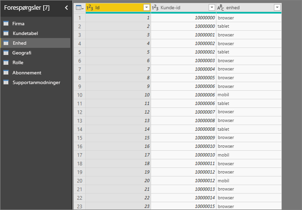

Hvis du prøver at bruge kolonnen for enheder som en forklarende faktor, får du vist følgende fejl: 

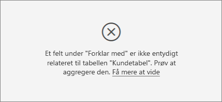

Denne fejlmeddelelse vises, fordi enheden ikke er defineret på kundeniveauet. En kunde kan bruge tjenesten på flere forskellige enheder. Hvis visualiseringen skal kunne finde mønstre, skal enheden være en attribut for kunden. Der er flere løsninger, der afhænger af din forståelse af virksomheden: 
 
- Du kan ændre opsummeringen af de enheder, der skal tælles. Du kan f.eks. bruge antal, hvis antallet af enheder kan påvirke den score, som en kunde giver. 
- Du kan oprette en pivot for enhedskolonnen for at se, om den anvendte type enhed har betydning for kundens bedømmelse.
 
I dette eksempel er dataene blevet pivoteret til at oprette nye kolonner for browser, mobil og tablet. Sørg for at slette og genoprette dine relationer i modelvisningen, efter dataene er blevet pivoteret. Du kan nu bruge disse specifikke enheder i **Forklar ved**. Alle enheder viser sig at være nøglefaktorer, mens browseren har den største betydning for kundens bedømmelse.

De kunder, der ikke bruger tjenesten via en browser, vil være 3,79 gange mere tilbøjelige til at give en lav score end de kunder, der bruger tjenesten via en browser. Længere nede på listen er det modsatte tilfældet for mobiltelefoner. De kunder, der bruger mobilappen, vil med større sandsynlighed give end lavere score end dem, der ikke bruger mobilappen. 

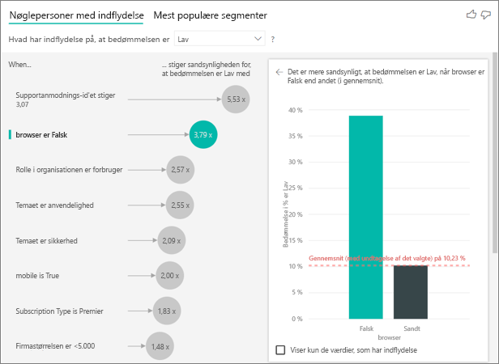

**Jeg får vist en advarsel om, at målingerne ikke var inkluderet i min analyse. Hvorfor sker det?** 

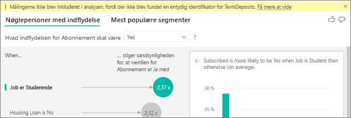

Analysen kører på tabelniveau for det felt, der analyseres. Hvis du analyserer kundeafgangen, har du muligvis en tabel, hvor du kan se, om kunden stadig er kunde eller ej. I dette tilfælde kører din analyse på kundetabelniveau.
 
Målinger og aggregeringer analyseres som standard på tabelniveau. Hvis vi havde en måling for det gennemsnitlige månedlige forbrug, ville den blive analyseret på kundetabelniveau. 

Hvis kundetabellen ikke har et entydigt id, kan du ikke evaluere målingen, og den ignoreres af analysen. Kontrollér, at tabellen med din metrikværdi har et entydigt id, for at undgå denne situation. I dette tilfælde er det kundetabellen, og det entydige id er kunde-id. Det er også meget nemt at tilføje en indekskolonne ved at bruge Power-forespørgsel.
 
**Jeg får vist en advarsel om, at den metrikværdi, jeg analyserer, har mere end 10 entydige værdier, og at dette antal kan påvirke kvaliteten af min analyse. Hvorfor sker det?** 

AI-visualiseringen kan analysere kategorifelter og numeriske felter. Hvis der er tale om kategorifelter, kan et eksempel f.eks. være Kundeafgang er Ja eller Nej, og Kundetilfredshed er Høj, Mellem eller Lav. Hvis du øger antallet af kategorier, der skal analyseres, betyder det, at der er færre observationer pr. kategori. Denne situation gør det sværere for visualiseringen at finde mønstre i dataene. 

Når du analyserer numeriske felter, har du et valg mellem at behandle de numeriske felter som tekst, og i dette tilfælde vil du køre den samme analyse, som du gør for kategoriske data (**Kategorisk analyse**). Hvis du har en masse entydige værdier, anbefaler vi, at du ændrer analysen til **Fortløbende analyse**, da det betyder, at vi kan udlede mønstre, fra når tal øges eller reduceres, i stedet for at behandle dem som entydige værdier. Du kan skifte fra **Kategorisk analyse** til **Fortløbende analyse** i **ruden Formatering** på kortet **Analyse**.

Hvis du vil finde stærkere nøglefaktorer, anbefales det, at du grupperer ensartede værdier til en enkelt gruppering. Hvis du f.eks. har en metrikværdi for pris, vil du sandsynligvis opnå bedre resultater, hvis du grupperer ensartede priser i kategorierne Høj, Mellem og Lav i stedet for at benytte individuelle prispunkter. 

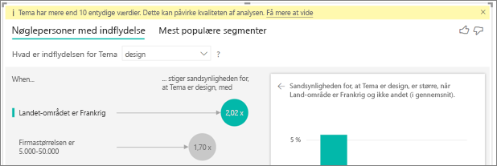

**Mine data indeholder faktorer, hvor det ser ud til, at de burde være nøglefaktorer, men ikke er det. Hvordan kan det ske?**

I eksemplet nedenfor ligger de kunder, der er forbrugere, til grund for lave bedømmelser, og 14,93 % af bedømmelserne er lave. Administratorrollen har også en stor del lave bedømmelser (13,42 %), men den betragtes ikke som en nøglefaktor. 

Årsagen til dette er, at visualiseringen også tager antallet af datapunkter i betragtning, når den finder nøglefaktorer. Følgende eksempel har mere end 29.000 forbrugere og 10 gange færre administratorer, omkring 2.900. Kun 390 af dem gav en lav bedømmelse. Visualiseringen har ikke tilstrækkeligt med data til at bestemme, om den har fundet et faktisk mønster for administratorernes bedømmelser, eller om det blot er tilfældigheder. 

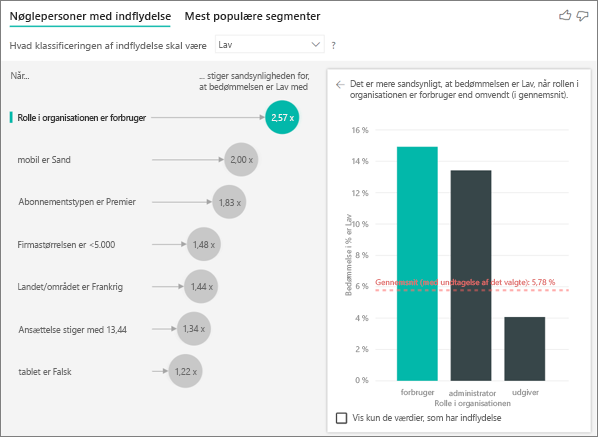

**Hvad er grænserne for datapunkter for nøglefaktorer?**
Vi kører analysen på et eksempel på 10.000 datapunkter. Boblerne på den ene side viser alle de nøglefaktorer, der blev fundet. Søjlediagrammerne og punktdiagrammerne på den anden side overholder strategierne for stikprøvetagning for disse kernevisualiseringer.

**Sådan beregner du nøglefaktorer for kategoriske analyser**

AI-visualiseringen bruger [ML.NET](https://dotnet.microsoft.com/apps/machinelearning-ai/ml-dotnet) til at køre en logistisk regression i kulisserne for at beregne nøglefaktorerne. En logistisk regression er en statistisk model, der sammenligner forskellige grupper med hinanden. 

Hvis du vil se på, hvad der styrer de lave bedømmelser, vil den logistiske regression se på, hvordan de kunder, der gav en lav bedømmelse, adskiller sig fra dem, der gav en høj bedømmelse. Hvis du har flere kategorier, f.eks høj, neutral og lav score, skal du se på, hvordan de kunder, som gav en lav bedømmelse, adskiller sig fra de kunder, der ikke gav en lav bedømmelse. Hvordan adskiller de kunder, der gav en lav score, sig fra de kunder, der gav en høj bedømmelse eller en neutral bedømmelse i dette tilfælde? 
 
Logistisk regression søger efter mønstre i dataene og leder efter, hvordan de kunder, som gav en lav bedømmelse, adskiller sig fra de kunder, der gav en høj bedømmelse. Den kan f.eks. finde frem til, at de kunder, som har flere supportanmodninger, giver en større andel af lave bedømmelser end dem, som har få eller ingen supportanmodninger.
 
Den logistiske regression tager også antallet af datapunkter i betragtning. Hvis eksempelvis de kunder, som har en administratorrolle, giver forholdsvis flere negative scores, men der kun er tale om få administratorer, anses denne faktor ikke for at have nogen indflydelse. Denne bestemmelse foretages, fordi der ikke er nok datapunkter til at udlede et mønster. En statistisk test (Wald-test) bruges til at bestemme, om en faktor betragtes som en nøglefaktor. Visualiseringen bruger en p-værdi på 0,05 til at bestemme tærsklen. 

**Sådan beregner du nøglefaktorer for numeriske analyser**

AI-visualiseringen bruger [ML.NET](https://dotnet.microsoft.com/apps/machinelearning-ai/ml-dotnet) til at køre en lineær regression i kulisserne for at beregne nøglefaktorerne. En lineær regression er en statistisk model, der viser, hvordan resultatet af det felt, du analyserer, ændres baseret på dine forklarende faktorer.

Hvis vi f.eks. analyserer huspriser, vil en lineær regression se på, hvordan et fremragende køkken påvirker husprisen. Har huse med fremragende køkkener generelt lavere eller højere huspriser sammenlignet med huse uden fremragende køkkener?

Den lineære regression tager også antallet af datapunkter i betragtning. Hvis huse med tennisbaner er dyrere, men vi kun har få huse med en tennisbane, anses denne faktor ikke for at have nogen indflydelse. Denne bestemmelse foretages, fordi der ikke er nok datapunkter til at udlede et mønster. En statistisk test (Wald-test) bruges til at bestemme, om en faktor betragtes som en nøglefaktor. Visualiseringen bruger en p-værdi på 0,05 til at bestemme tærsklen. 

**Hvordan beregnes segmenter?**

AI-visualiseringen bruger [ML.NET](https://dotnet.microsoft.com/apps/machinelearning-ai/ml-dotnet) til at køre et beslutningstræ i kulisserne for at finde interessante undergrupper. Målet med beslutningstræet er at finde frem til en undergruppe af datapunkter, der er relativt høj inden for de metrikværdier, vi er interesseret i. Det kunne være kunder med lave bedømmelser eller huse med høje priser.

Beslutningstræet tager hver forklarende faktor og forsøger at finde frem til, hvilken faktor der giver den bedste *opdeling*. Hvad hvis du f.eks. filtrerer dataene, så de kun inkluderer store virksomhedskunder, vil det adskille de kunder, som gav en høj frem for en lav bedømmelse? Eller måske er det bedre at filtrere dataene, så de kun inkluderer de kunder, som har skrevet kommentarer om sikkerheden? 

Når beslutningstræet har foretaget en opdeling, tager det undergruppen af data og beslutter den andenbedste opdeling af disse data. I dette tilfælde er undergruppen de kunder, der skrev en kommentar om sikkerheden. Efter hver opdeling tager det også antallet af datapunkter for denne gruppe i betragtning for at sikre, at det er en repræsentativ gruppe, som det kan udlede et mønster ud fra, eller om det blot er en afvigelse i dataene og derfor ikke et rigtigt segment. Der anvendes en anden statistisk test for at kontrollere den statistiske signifikans af opdelingsbetingelsen, som har en p-værdi på 0,05. 

Når beslutningstræet er færdigt, tager det alle opdelingerne, f.eks. kommentarer om sikkerhed og store virksomheder, og opretter Power BI-filtre. Denne kombination af filtre vises som et segment i visualiseringen. 
 
**Hvorfor bliver nogle faktorer nøglefaktorer/stopper med at være nøglefaktorer, når jeg trækker flere felter til *Forklar ved*?**

Visualiseringen evaluerer alle forklarende faktorer samlet. En faktor kan være en nøglefaktor i sig selv, men når den sammenlignes med andre faktorer, er den det muligvis ikke alligevel. Forestil dig, at du vil analysere dig frem til, hvad der medfører en høj pris og bruge antal værelser og husets størrelse som forklarende faktorer:

- Ekstra værelser kan i sig selv være styrende for en højere pris.
- Hvis vi medtager husets størrelse i analysen, ser vi også på, hvad der sker i forhold til antal værelser, hvis størrelsen på huset er konstant.
- Hvis størrelsen på huset ligger fast på 1.500 kvadratfod, er det usandsynligt, at en konstant stigning i antallet af værelser får husprisen til at stige væsentligt. 
- Værelser er muligvis ikke en lige så vigtig faktor, som de var, før husets størrelse blevet taget i betragtning. 

## Næste trin
- [Kombinationsdiagrammer i Power BI](power-bi-visualization-combo-chart.md)
- [Visualiseringstyper i Power BI](power-bi-visualization-types-for-reports-and-q-and-a.md)
